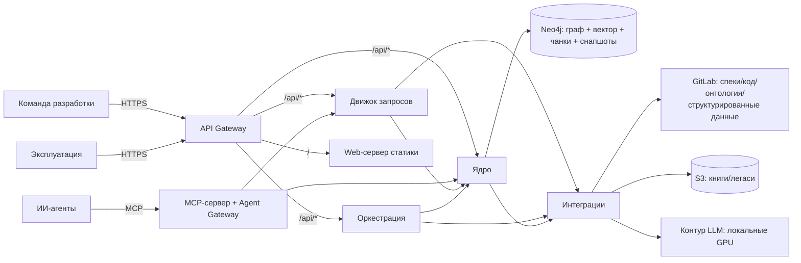

# Архитектура GraphRAG — краткий обзор (контекст для ИИ-агентов)

> **Статус:** этап видения (Фаза 0). Кодовой базы нет (`src/` — только README); архитектура описывает **целевое состояние** (`target`/`to be`). Источники истины: `specs/c4/*` (C4-диаграммы), `specs/adr/*` (11 принятых ADR), `specs/vision.md` (канон функций F1–F4), `specs/glossary.md` (единый язык). После появления кода диаграммы актуализируются до `as-is` (код — источник истины).

## Что это за система

**GraphRAG** — корпоративная система знаний на базе ontology-grounded GraphRAG: evidence-based context layer / context compiler для ИИ-агентов автоматизации разработки (AI Factory, Hand-off). Продукт **отвечает, а не выдаёт документы**: каждый ответ проверяем — со ссылками на артефакты и происхождением (grounding, provenance).

- **F1** — генерация проверяемых ответов команде со ссылками на источники.
- **F2** — индексация источников знаний (GitLab: спеки, код, онтологии, структурированные данные; книги/легаси из внешнего S3).
- **F3** — оптимизация контекста: анализ влияния изменений, компиляция контекста (JSON) под задачу.
- **F4** — доставка ответов и контекста ИИ-агентам через MCP.

Границы: не источник правды (истина — репозиторий спек и код), не чат-бот, не поисковая строка; Confluence исключён; fine-tuning и real-time обновление графа — вне MVP.

## Ключевые решения (кратко)

| Решение | Суть |
|---|---|
| Язык | **Go** — единый язык серверной кодовой базы (без Rust/Python); нативный CPU-код (Leiden, HNSW, токенизатор) — через CGo при измеримом критерии. Фронтенд — **TypeScript** (тонкий SPA на Vue 3 + Vite, вне серверной кодовой базы; стилизация — Tailwind CSS v4, `ADR-DES.UI.tailwind-css-adoption`) |
| Тип GraphRAG | Гибридная ontology-grounded композиция: LightRAG (ядро retrieval, dual-level, инкрементальность) + KAG-принципы (mutual indexing, grounding) + PathRAG (компактный контекст, без map-reduce) + PPR (ассоциативные запросы без LLM) + RAPTOR/StructRAG (PDF) + community summaries (C0–C1) |
| Хранилище | Neo4j (self-hosted, Community Edition): граф + чанки (текст) + нативный векторный индекс (HNSW) + версионные снапшоты в одном движке; отдельный инстанс на проект + отдельный инстанс глобального слоя; хранилище за интерфейсом |
| Обновление | Инкрементальное обновление + версионные снапшоты + атомарная публикация: путь чтения обслуживает только опубликованную версию; write/read пути разделены |
| Источники | GitLab (webhook + сверка) — спеки (`markdown`), код, онтология (`.ttl`), структурированные данные (`JSON`/`YAML`); внешнее S3 (события бакета + периодическая сверка) — книги/легаси (`PDF`, глобальный слой, отдельный граф) |
| Вход для людей | API Gateway (единая HTTP-точка): OIDC-токен корпоративного SSO **Keycloak**, read-only, без RBAC; статика SPA — отдельный Go-статик-сервер за гейтвеем |
| Вход для агентов | MCP-сервер с **Agent Gateway** (auth, политики, квоты, бюджет) и слоем планирования (interactive/workflow/background); приоритет пользователей над агентами |
| Развёртывание MVP | Docker Compose (однохостовой контур); C4-контейнер ≠ Docker-контейнер |

## Контейнеры (C4, уровень 2) — 10 штук

| Контейнер | Тип | Функция | Назначение |
|---|---|---|---|
| Ядро | Go-сервис | F3 | Граф знаний, ArtifactGraph, онтологический слой, компилятор контекста |
| Оркестрация пайплайнов индексации | Go-воркер | F2 | GitLab/S3 sync и ingest, извлечение (RAPTOR/StructRAG), очередь задач, инкрементальное обновление, сборка и атомарная публикация версий, community summaries |
| Движок запросов | Go-сервис | F1 | Retrieval (dual-level, PathRAG, PPR), генерация, grounding/provenance, сверка «результат ↔ источник» |
| MCP-сервер | Go-сервис | F4 | Инструменты `answer`/`compile_context`, Agent Gateway, слой планирования, фильтрация утечек, аудит |
| API Gateway | Go-сервис | сквозное | Единый HTTP-вход для людей: authN (OIDC), TLS, маршрутизация, rate limiting, квоты, аудит |
| Web-сервер (статика) | Go, статическая раздача | сквозное | SPA-ассеты: hashed + immutable-кэш, `index.html` no-cache, SPA-fallback, сжатие |
| Веб-интерфейс (UI) | SPA в браузере (TS/Vue 3) | F1, F3 | Вопросы/ответы, статусы индексации, метрики, отчёты о влиянии; тонкий клиент без бизнес-логики |
| Интеграции | Go (+CGo) | сквозное | GitLab/S3/LLM-клиенты; CPU-компоненты (Leiden, HNSW, токенизатор) |
| Мониторинг и аудит | Go-сервис | сквозное | Логи, метрики, события безопасности (`SecurityEventEmitted`), панели аудита |
| Хранилище графа и векторов | Neo4j CE | F1–F3 | Граф, чанки (текст + координаты), векторный индекс, индексы артефактов, версионные снапшоты |

## Каналы доступа и потоки

- Люди: SPA в браузере → **API Gateway** → внутренние сервисы (статика — через Web-сервер за гейтвеем).
- Агенты: **MCP-сервер** (`answer`, `compile_context`) → Agent Gateway (политики, квоты, бюджет, планирование) → Движок запросов / Ядро. Агенты **не ходят напрямую** во внутренние сервисы.
- F2 (индексация) через MCP **не исполняется** — она детерминированная, приходит из GitLab/S3.

## Правила границ (что можно / нельзя)

- ✅ Серверная кодовая база — Go; интерфейс с внешним миром — API Gateway (HTTP) и MCP-сервер (MCP); хранилище — за интерфейсом; каждый ответ — с grounding и provenance.
- ❌ Никаких прямых внешних HTTP-доступов к Движку запросов / Ядру / Оркестрации; никакого Python/Rust в кодовой базе; никакого map-reduce на запрос; никакого LLM на ассоциативном retrieval (PPR); никакого ручного ввода документов (только GitLab MR / S3); никакой записи через API/UI/MCP (read-only); «полусобранная» версия индекса никогда не публикуется.

## Ключевые принципы

1. **Ответы проверяемы** (grounding, provenance, версия индекса) — продукт отвечает, а не выдаёт документы.
2. **Write/read пути разделены** — индексация (offline, LLM-тяжёлая) не влияет на интерактивные запросы (online).
3. **Инкрементальность** — пересчитывается только затронутый подграф; публикация версии атомарна.
4. **Минимизация токенов и LLM-вызовов** — сквозное требование (PathRAG, PPR, онтологический слой) для локального контура.
5. **Данные не покидают периметр** — LLM — локальные GPU/open-weight; утечки фильтруются, обращения аудируются (точность RAG ≥ 70% — порог).
6. **Заменяемость компонентов** — контрактные тесты и бенчмарки на эталонных кейсах (K1, K4, K5, K17) до реализации; внутренние контракты не становятся внешними.
7. **«Агент готовит — человек подтверждает и отвечает»** — ИИ-сгенерированный код/артефакты проходят ревью человека.

## Анти-паттерны

- ❌ Монолит «всё в одном Go-процессе» — смешение индексации и запросов деградирует отзывчивость (отклонено ADR-DES.INFRA.container-composition).
- ❌ Сервис на каждый метод GraphRAG (микросервисы PathRAG/PPR/…) — методы заменяемы внутри Движка запросов/Оркестрации.
- ❌ Прямой доступ агентов к Query API без Agent Gateway — нет изоляции, квот и бюджета.
- ❌ Своя авторизация/свои пароли вместо корпоративного SSO; RBAC в MVP — не нужен.
- ❌ Чанки «только координаты» (текст из источника по запросу) — путь чтения обязан быть локальным и самодостаточным.
- ❌ Облачные графовые БД/облачный LLM — данные не покидают периметр.

## Связанные артефакты

- C4: [`specs/c4/context.md`](../specs/c4/context.md) (уровень 1), [`specs/c4/container.md`](../specs/c4/container.md) (уровень 2), [`specs/c4/README.md`](../specs/c4/README.md) (индекс, плановые уровни 3–4)
- ADR: [`specs/adr/README.md`](../specs/adr/README.md) — реестр 11 принятых ADR и правила оформления
- Канон: [`specs/vision.md`](../specs/vision.md) (F1–F4, MVP, roadmap, границы), [`specs/glossary.md`](../specs/glossary.md) (единый язык)
- Правила: [`.ai-factory/RULES.md`](RULES.md), исследование: [`.ai-factory/RESEARCH.md`](RESEARCH.md)

## Правила изменения

- Изменение принятого ADR — через новый ADR со статусом «ЗАМЕНЕНО» (не правкой).
- Протоколы между контейнерами — фиксируются ADR уровня `IMPL`.
- Появление кода → актуализация C4 до `as-is`; расхождения с ADR — через новый ADR.
