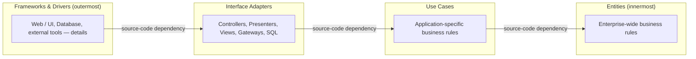

# Clean Architecture Reference

> Source: Robert C. Martin, «The Clean Architecture» — blog.cleancoder.com/uncle-bob/2012/08/13/the-clean-architecture.html (via web.archive.org); Robert C. Martin, «Screaming Architecture» — blog.cleancoder.com/uncle-bob/2011/09/30/Screaming-Architecture.html (via web.archive.org)
> Created: 2026-08-30
> Updated: 2026-08-30

## Overview

Clean Architecture (Robert C. Martin, «Uncle Bob») is a set of architectural principles for separating software into layers so that business rules stay independent of frameworks, UI, database, and external agencies. It consolidates a range of earlier ideas that share the same objective — separation of concerns achieved by dividing software into layers: Hexagonal Architecture (a.k.a. Ports and Adapters) by Alistair Cockburn, Onion Architecture by Jeffrey Palermo, Screaming Architecture by Martin, DCI by James Coplien and Trygve Reenskaug, and BCE by Ivar Jacobson («Object Oriented Software Engineering: A Use-Case Driven Approach»).

The architecture is pictured as concentric circles: the further in you go, the higher-level the software becomes. Outer circles are mechanisms; inner circles are policies. One overriding rule makes the whole thing work — The Dependency Rule: source code dependencies can only point inwards. Systems built this way are independent of frameworks, testable, independent of UI, independent of the database, and independent of any external agency — business rules simply don't know anything about the outside world.

A complementary principle from «Screaming Architecture»: an architecture should be about the use cases of the system, not about the frameworks it uses. The top-level structure should «scream» what the system does (a health-care system, an accounting system), not what framework it runs on (Rails, Spring/Hibernate, ASP). Frameworks are tools to be used, not architectures to be conformed to.

## Core Concepts

### The Dependency Rule

The overriding rule of the architecture. Source code dependencies can only point inwards: nothing in an inner circle can know anything at all about something in an outer circle. In particular, the name of anything declared in an outer circle — functions, classes, variables, any named software entity — must not be mentioned by code in an inner circle.

- Data formats used in an outer circle must not be used by an inner circle, especially formats generated by a framework in an outer circle
- Nothing in an outer circle should be allowed to impact the inner circles
- Violating the rule (even «just a little») means the architecture is broken and the separation of concerns is lost

### Levels of Abstraction

The circles are schematic, not a fixed structure: «Only Four Circles? No, the circles are schematic. You may find that you need more than just these four. There's no rule that says you must always have just these four.» What always applies is the Dependency Rule and the gradient of abstraction:

- As you move inwards, the level of abstraction increases
- The outermost circle is low-level concrete detail
- The innermost circle is the most general and highest-level policy

### Entities

Entities encapsulate enterprise-wide business rules — the most general and high-level rules in the system.

- Can be an object with methods, or a set of data structures and functions — it doesn't matter, so long as the entities could be used by many different applications in the enterprise
- In a single application, entities are the business objects of the application
- They are the least likely to change when something external changes: not affected by page navigation, security, or any operational change to a particular application

### Use Cases

The software in this layer contains application-specific business rules. It encapsulates and implements all of the use cases of the system.

- Use cases orchestrate the flow of data to and from the entities and direct entities to use their enterprise-wide business rules to achieve the goals of the use case
- Changes in this layer do not affect entities; this layer is isolated from the database, UI, and common frameworks
- Changes to the operation of the application (i.e., the details of a use case) will affect the software in this layer

### Interface Adapters

A set of adapters that convert data from the format most convenient for the use cases and entities to the format most convenient for some external agency such as the Database or the Web.

- Wholly contains the MVC architecture of a GUI: Presenters, Views, and Controllers belong here
- Models are likely just data structures passed from controllers to use cases, and then back from use cases to presenters and views
- Data is converted between the form convenient for entities/use cases and the form convenient for whatever persistence framework is used
- No code inward of this circle should know anything at all about the database; if the database is SQL, all SQL is restricted to this layer (in particular, to the database-related parts of it)
- Also contains any other adapter needed to convert data from an external form (e.g., an external service) to the internal form used by use cases and entities

### Frameworks and Drivers

The outermost layer, generally composed of frameworks and tools such as the Database and the Web Framework.

- Usually contains little code beyond glue code that communicates to the next circle inwards
- This is where all the details go: «The Web is a detail. The database is a detail. We keep these things on the outside where they can do little harm.»
- Frameworks are tools, not ways of life: look at each framework skeptically — «yes, it might help, but at what cost», and decide how to protect the system from it

### Crossing Boundaries (Dependency Inversion)

Flow of control starts in the controller, moves through the use case, and ends up executing in the presenter — while every source code dependency points inwards toward the use cases. This apparent contradiction is resolved with the Dependency Inversion Principle: arrange interfaces and inheritance such that source code dependencies oppose the flow of control at just the right points across the boundary.

Canonical example: the use case needs to call the presenter, but the call must not be direct (that would violate the Dependency Rule — no name in an outer circle can be mentioned by an inner circle). So the use case calls an interface (a Use Case Output Port) declared in the inner circle, and the presenter in the outer circle implements it. Dynamic polymorphism is used to create source code dependencies that oppose the flow of control, so the Dependency Rule holds no matter which direction control flows. The same technique crosses all boundaries.

### What Data Crosses Boundaries

Data crossing boundaries is typically simple data structures — basic structs, simple DTOs, arguments in function calls, a hashmap, or a plain object. The important thing: isolated, simple data structures are passed across the boundaries, in the form that is most convenient for the inner circle.

- Never pass Entities or database rows across a boundary
- A RowStructure returned by a database framework must not be passed inwards — that would force an inner circle to know something about an outer circle and violate the Dependency Rule

### Testability

If the architecture is centered on use cases and frameworks are kept at arm's length, all use cases can be unit-tested without any of the frameworks in place:

- No web server running to run the tests; no database connected to run the tests
- Business objects are plain objects with no dependencies on frameworks, databases, or other complications
- Use case objects coordinate the business objects; all of them together are testable in-situ, without the complications of frameworks

### Screaming Architecture (Use-Case Centricity)

Architectures are structures that support the use cases of the system (Ivar Jacobson's use-case-driven approach). Just as the plans for a house or a library «scream» what the building is for, the top-level directory structure and the highest-level packages of an application should scream what the system does.

- Architectures should not be supplied by frameworks; if your architecture is based on frameworks, it cannot be based on your use cases
- A good architecture allows decisions about frameworks, databases, web servers, and other tools to be deferred and delayed — and makes it easy to change your mind about those decisions later
- The Web is a delivery mechanism, not an architecture; delivery over the web is a detail that should be deferred and should not dominate the system structure
- A system should be deliverable as a console app, a web app, a thick client, or a web service without undue complication or change to the fundamental architecture

## Usage Patterns

### Layer Responsibilities

| Layer | Holds | Knows about | Typical contents |
|-------|-------|-------------|------------------|
| Entities (innermost) | Enterprise-wide business rules | Nothing external | Business objects, enterprise-wide rules |
| Use Cases | Application-specific business rules | Entities only | Use case orchestration, input/output ports |
| Interface Adapters | Data conversion between forms | Use cases and entities | Controllers, Presenters, Views, Gateways, MVC, all SQL, external-service adapters |
| Frameworks & Drivers (outermost) | Details and glue code | The next circle inwards | Web framework, database driver, device drivers |

### Boundary-Crossing Mechanics

When an inner circle must reach an outer circle, invert the dependency instead of referencing the outer name directly:

1. Define an interface in the inner circle (e.g., a Use Case Output Port) — the inner circle depends only on this interface
2. Have the outer circle (e.g., the presenter) implement the interface
3. Wire the implementation to the use case at the composition root / runtime (dynamic polymorphism)

The flow of control runs outward (controller → use case → presenter), while source code dependencies run inward — this is exactly what the Dependency Rule requires.

### Deferring Technology Decisions

Because business rules do not reference any framework or delivery mechanism, technology choices (web framework, database, message broker, UI) can be postponed until late in the project and changed later with minimum fuss:

- Design the structure around use cases first
- Treat delivery (web/console/thick client/service) as an outer detail
- When an external part becomes obsolete (database, web framework), replace that element without touching the inner circles

### Testing the Use Cases Without Frameworks

- Keep business objects free of framework/database dependencies (plain objects)
- Keep use cases coordinated by dedicated use case objects
- Unit-test use cases directly, without a running web server or a connected database

### Illustrative Structure (derived from the article's concentric-circle description)

## Best Practices

1. **Enforce the Dependency Rule as the non-negotiable invariant.** All source code dependencies point inwards; inner circles never mention names from outer circles (functions, classes, variables, data formats).
2. **Pass simple data structures across boundaries**, always in the form most convenient for the inner circle. Never pass entities or framework-specific row structures inwards.
3. **Put all SQL and persistence knowledge in the Interface Adapters layer** — nothing inward knows the database exists.
4. **Use the Dependency Inversion Principle to cross boundaries**: declare output ports (interfaces) in the inner circle, implement them in the outer circle, wire at runtime.
5. **Make the architecture scream the use cases**: structure top-level packages/directories around the system's use cases, not around the framework (no «controllers/» or «models/» at the top level if the system is not a Rails app).
6. **Keep frameworks at arm's length**: use them as tools, treat them skeptically («at what cost»), and know how to protect the use-case emphasis from them.
7. **Defer technology decisions** (web framework, database, delivery mechanism) as long as possible; a good architecture makes them cheap to change later.
8. **Test use cases in-situ**: business objects as plain objects, use case objects coordinating them, no web server and no database required for unit tests.

## Common Pitfalls

- **Outer names leaking inward**: an inner circle mentioning the name of a class, function, or type declared in an outer circle — including configuration keys, annotations, and framework base classes. This is the Dependency Rule violation in its purest form.
- **Passing framework data structures across boundaries**: e.g., passing a database RowStructure or an ORM entity into the use-case layer. The data must be converted in the Interface Adapters layer first.
- **Letting the framework take over the architecture**: organizing the top-level structure around the framework (Rails/Spring/ASP-style), so the architecture screams the framework instead of the use cases. An architecture based on frameworks cannot be based on use cases.
- **Treating the web as the architecture**: letting the fact that the system is delivered over the web dictate the system structure. The web is a delivery mechanism and a detail.
- **Burning technology decisions early**: committing to the database or web framework before the use-case structure exists, which couples business rules to the choice and makes it costly to change.
- **Putting SQL or framework logic inside use cases or entities**: any knowledge of the database (or UI, or external services) inside the inner circles destroys independence and testability.
- **Hardwiring the use case to the presenter**: a direct call from a use case to a presenter violates the Dependency Rule; use an output port interface instead.

## Version Notes

- «The Clean Architecture» — Robert C. Martin, blog.cleancoder.com, 2012-08-13 (canonical article; defines the four circles, the Dependency Rule, boundary crossing, and data crossing)
- «Screaming Architecture» — Robert C. Martin, blog.cleancoder.com, 2011-09-30 (architecture should be centered on use cases; frameworks are tools, not architectures; the web is a delivery mechanism)
- The topic is expanded in the book «Clean Architecture: A Craftsman's Guide to Software Structure and Design» (Robert C. Martin, 2017), which covers SOLID, component principles, and policy vs. level in detail; the two blog posts above remain the primary statement of the core principles
- The circles are schematic — the four canonical layers are not mandatory in number; the Dependency Rule and the inward gradient of abstraction always apply
