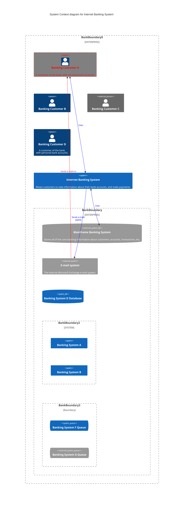
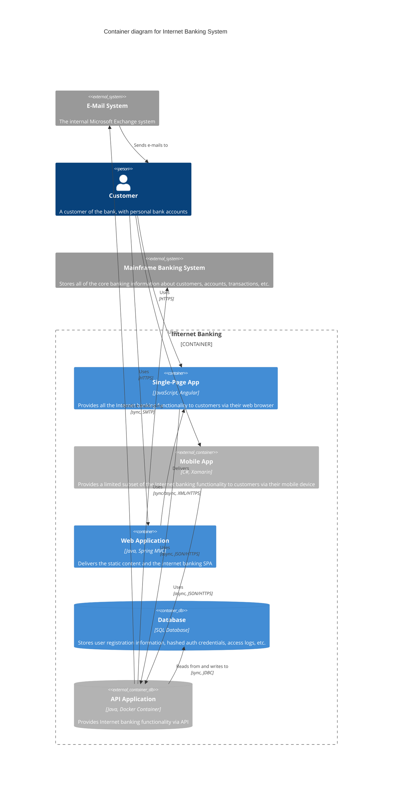
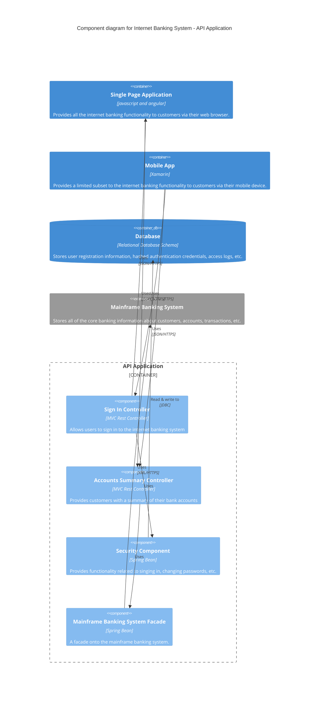
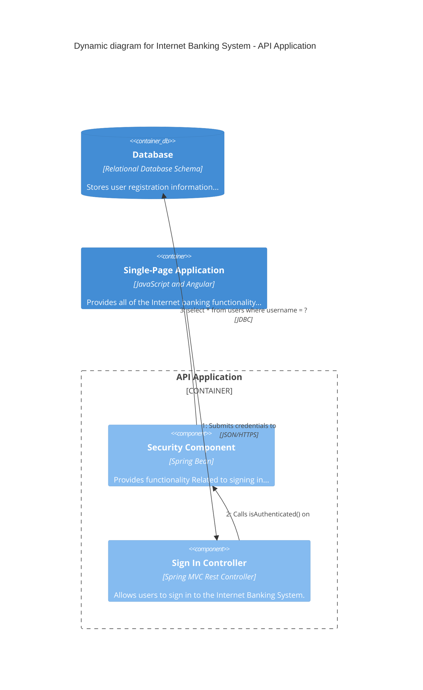
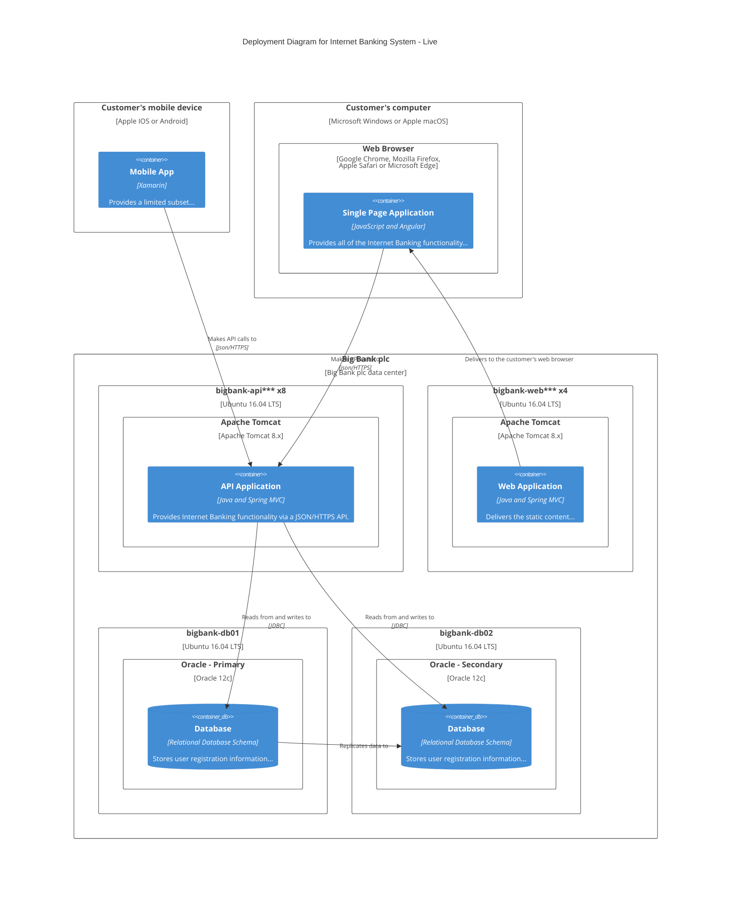

# Mermaid C4 Diagrams Reference

> Source: https://mermaid.js.org/syntax/c4.html, https://mermaid.js.org/config/schema-docs/config-defs-c4-diagram-config.html
> Created: 2026-08-22
> Updated: 2026-08-22

## Overview

Mermaid's C4 diagram syntax is compatible with C4-PlantUML and supports 5 diagram types for visualizing software architecture at different abstraction levels. This is an **experimental** diagram type — the syntax and properties can change in future releases. The layout is not fully automated; shape positions are adjusted by changing statement order.

C4 diagrams use a **fixed style** (CSS colors are fixed, not theme-dependent). Style updates are written at the end of the diagram via `UpdateElementStyle` and `UpdateRelStyle`.

## Supported Diagram Types

| Type | Declaration | Purpose |
|------|-------------|---------|
| System Context | `C4Context` | High-level view: system boundaries, personas, external systems |
| Container | `C4Container` | Containers (apps, databases, queues) within the system boundary |
| Component | `C4Component` | Components inside a container |
| Dynamic | `C4Dynamic` | Sequenced interactions with numbered relationship steps |
| Deployment | `C4Deployment` | Physical deployment: nodes, devices, infrastructure |

## Core Elements

### Person

| Syntax | Description |
|--------|-------------|
| `Person(alias, label, ?descr, ?sprite, ?tags, $link)` | Internal person/actor |
| `Person_Ext(alias, label, ?descr, ?sprite, ?tags, $link)` | External person/actor |

### Software System

| Syntax | Description |
|--------|-------------|
| `System(alias, label, ?descr, ?sprite, ?tags, $link)` | Internal system |
| `System_Ext(alias, label, ?descr, ?sprite, ?tags, $link)` | External system |
| `SystemDb(alias, label, ?descr, ?sprite, ?tags, $link)` | System with database icon |
| `SystemDb_Ext(alias, label, ?descr, ?sprite, ?tags, $link)` | External system with database icon |
| `SystemQueue(alias, label, ?descr, ?sprite, ?tags, $link)` | System with queue icon |
| `SystemQueue_Ext(alias, label, ?descr, ?sprite, ?tags, $link)` | External system with queue icon |

### Container

| Syntax | Description |
|--------|-------------|
| `Container(alias, label, ?techn, ?descr, ?sprite, ?tags, $link)` | Internal container (includes technology) |
| `Container_Ext(alias, label, ?techn, ?descr, ?sprite, ?tags, $link)` | External container |
| `ContainerDb(alias, label, ?techn, ?descr, ?sprite, ?tags, $link)` | Container with database icon |
| `ContainerDb_Ext(alias, label, ?techn, ?descr, ?sprite, ?tags, $link)` | External container with database icon |
| `ContainerQueue(alias, label, ?techn, ?descr, ?sprite, ?tags, $link)` | Container with queue icon |
| `ContainerQueue_Ext(alias, label, ?techn, ?descr, ?sprite, ?tags, $link)` | External container with queue icon |

### Component

| Syntax | Description |
|--------|-------------|
| `Component(alias, label, ?techn, ?descr, ?sprite, ?tags, $link)` | Internal component |
| `Component_Ext(alias, label, ?techn, ?descr, ?sprite, ?tags, $link)` | External component |
| `ComponentDb(alias, label, ?techn, ?descr, ?sprite, ?tags, $link)` | Component with database icon |
| `ComponentDb_Ext(alias, label, ?techn, ?descr, ?sprite, ?tags, $link)` | External component with database icon |
| `ComponentQueue(alias, label, ?techn, ?descr, ?sprite, ?tags, $link)` | Component with queue icon |
| `ComponentQueue_Ext(alias, label, ?techn, ?descr, ?sprite, ?tags, $link)` | External component with queue icon |

### Deployment Nodes

| Syntax | Description |
|--------|-------------|
| `Deployment_Node(alias, label, ?type, ?descr, ?sprite, ?tags, $link)` | Deployment node |
| `Node(alias, label, ?type, ?descr, ?sprite, ?tags, $link)` | Short name for Deployment_Node |
| `Node_L(alias, label, ?type, ?descr, ?sprite, ?tags, $link)` | Left-aligned Node |
| `Node_R(alias, label, ?type, ?descr, ?sprite, ?tags, $link)` | Right-aligned Node |

### Boundaries

| Syntax | Description |
|--------|-------------|
| `Boundary(alias, label, ?type, ?tags, $link)` | Generic boundary |
| `Enterprise_Boundary(alias, label, ?tags, $link)` | Enterprise boundary |
| `System_Boundary(alias, label, ?tags, $link)` | System boundary |
| `Container_Boundary(alias, label, ?tags, $link)` | Container boundary |

### Relationships

| Syntax | Description |
|--------|-------------|
| `Rel(from, to, label, ?techn, ?descr, ?sprite, ?tags, $link)` | Unidirectional relationship |
| `BiRel(from, to, label)` | Bidirectional relationship |
| `Rel_U / Rel_Up` | Relationship oriented upward |
| `Rel_D / Rel_Down` | Relationship oriented downward |
| `Rel_L / Rel_Left` | Relationship oriented leftward |
| `Rel_R / Rel_Right` | Relationship oriented rightward |
| `Rel_Back` | Backward relationship |
| `RelIndex(index, from, to, label, ?tags, $link)` | Dynamic diagram relationship (index parameter is ignored — sequence determined by statement order) |

## Styling

### UpdateElementStyle

`UpdateElementStyle(elementName, ?bgColor, ?fontColor, ?borderColor, ?shadowing, ?shape, ?sprite, ?techn, ?legendText, ?legendSprite)`

Updates the default style for an element class. Does **not** create a legend entry.

### UpdateRelStyle

`UpdateRelStyle(from, to, ?textColor, ?lineColor, ?offsetX, ?offsetY)`

Updates relationship colors and text-label offsets from the original position. Two additional parameters (`offsetX`, `offsetY`) beyond C4-PlantUML.

### UpdateLayoutConfig

`UpdateLayoutConfig(?c4ShapeInRow, ?c4BoundaryInRow)`

Adjusts the number of shapes per row (default: 4) and boundaries per row (default: 2).

### Named Parameters

Parameters starting with `?` can be assigned in two ways:
1. **Positional**: in parameter order
2. **Named**: using `$` prefix (e.g., `$offsetX="-40"`, `$lineColor="blue"`)

Example:
```
UpdateRelStyle(customerA, bankA, "red", "blue", "-40", "60")
UpdateRelStyle(customerA, bankA, $offsetX="-40", $offsetY="60", $lineColor="blue", $textColor="red")
```

## Element Text Wrapping

By default, element text stays on one line and the element sizes itself to the longest line. To enable wrapping:

```yaml
---
config:
  wrap: true
  c4:
    width: 216
---
```

Set the root `wrap` config value to `true` and the `c4.width` config value to control the element width.

## Configuration (C4DiagramConfig)

The C4 diagram config object extends the Base Diagram Config. Schema: `https://mermaid.js.org/schemas/config.schema.json#/$defs/C4DiagramConfig`

### Layout and Dimensions

| Property | Type | Default | Description |
|----------|------|---------|-------------|
| `diagramMarginX` | integer >= 0 | `50` | Margin to right and left |
| `diagramMarginY` | integer >= 0 | `10` | Margin above and below |
| `c4ShapeMargin` | integer >= 0 | `50` | Margin between shapes |
| `c4ShapePadding` | integer >= 0 | `20` | Padding between shapes |
| `width` | integer >= 0 | `216` | Width of person boxes |
| `height` | integer >= 0 | `60` | Height of person boxes |
| `boxMargin` | integer >= 0 | `10` | Margin around boxes |
| `c4ShapeInRow` | integer >= 0 | `4` | Shapes per row |
| `nextLinePaddingX` | number | `0` | Next line padding (optional) |
| `c4BoundaryInRow` | integer >= 0 | `2` | Boundaries per row |
| `wrap` | boolean | `true` | Auto-wrap state (optional) |
| `wrapPadding` | number | `10` | Auto-wrap side padding (optional) |

### Font Settings (optional)

Each element category has `FontSize`, `FontFamily`, and `FontWeight` properties plus an optional `Font` function:

| Shape Type | FontSize default | FontFamily default | FontWeight default |
|------------|-----------------|-------------------|-------------------|
| Person | `14` | `"Open Sans", sans-serif` | `normal` |
| External Person | `14` | `"Open Sans", sans-serif` | `normal` |
| System | `14` | `"Open Sans", sans-serif` | `normal` |
| External System | `14` | `"Open Sans", sans-serif` | `normal` |
| System DB | `14` | `"Open Sans", sans-serif` | `normal` |
| External System DB | `14` | `"Open Sans", sans-serif` | `normal` |
| System Queue | `14` | `"Open Sans", sans-serif` | `normal` |
| External System Queue | `14` | `"Open Sans", sans-serif` | `normal` |
| Boundary | `14` | `"Open Sans", sans-serif` | `normal` |
| Message | `12` | `"Open Sans", sans-serif` | `normal` |
| Container | `14` | `"Open Sans", sans-serif` | `normal` |
| External Container | `14` | `"Open Sans", sans-serif` | `normal` |
| Container DB | `14` | `"Open Sans", sans-serif` | `normal` |
| External Container DB | `14` | `"Open Sans", sans-serif` | `normal` |
| Container Queue | `14` | `"Open Sans", sans-serif` | `normal` |
| External Container Queue | `14` | `"Open Sans", sans-serif` | `normal` |
| Component | `14` | `"Open Sans", sans-serif` | `normal` |
| External Component | `14` | `"Open Sans", sans-serif` | `normal` |
| Component DB | `14` | `"Open Sans", sans-serif` | `normal` |
| External Component DB | `14` | `"Open Sans", sans-serif` | `normal` |
| Component Queue | `14` | `"Open Sans", sans-serif` | `normal` |
| External Component Queue | `14` | `"Open Sans", sans-serif` | `normal` |

### Color Settings (optional strings)

Default colors for each shape category:

| Category | `_bg_color` default | `_border_color` default |
|----------|--------------------|------------------------|
| Person | `#08427B` | `#073B6F` |
| External Person | `#686868` | `#8A8A8A` |
| System | `#1168BD` | `#3C7FC0` |
| System DB | `#1168BD` | `#3C7FC0` |
| System Queue | `#1168BD` | `#3C7FC0` |
| External System | `#999999` | `#8A8A8A` |
| External System DB | `#999999` | `#8A8A8A` |
| External System Queue | `#999999` | `#8A8A8A` |
| Container | `#438DD5` | `#3C7FC0` |
| Container DB | `#438DD5` | `#3C7FC0` |
| Container Queue | `#438DD5` | `#3C7FC0` |
| External Container | `#B3B3B3` | `#A6A6A6` |
| External Container DB | `#B3B3B3` | `#A6A6A6` |
| External Container Queue | `#B3B3B3` | `#A6A6A6` |
| Component | `#85BBF0` | `#78A8D8` |
| Component DB | `#85BBF0` | `#78A8D8` |
| Component Queue | `#85BBF0` | `#78A8D8` |
| External Component | `#CCCCCC` | `#BFBFBF` |
| External Component DB | `#CCCCCC` | `#BFBFBF` |
| External Component Queue | `#CCCCCC` | `#BFBFBF` |

## Usage Patterns

### System Context Diagram (C4Context)



### Container Diagram (C4Container)



### Component Diagram (C4Component)



### Dynamic Diagram (C4Dynamic)



### Deployment Diagram (C4Deployment)



## Unsupported Features

Layout statements are **not supported** (layout is semi-automatic, driven by statement order):
- `Lay_U` / `Lay_Up`
- `Lay_D` / `Lay_Down`
- `Lay_L` / `Lay_Left`
- `Lay_R` / `Lay_Right`

Other unsupported features (no short-term plans):
- `sprite` (icon sprites)
- `tags` (tagged elements)
- `link` (clickable elements)
- `Legend` (auto-generated legends)
- `AddElementTag` / `AddRelTag` (custom tag styles)
- `RoundedBoxShape()`, `EightSidedShape()` (shape utilities)
- `DashedLine()`, `DottedLine()`, `BoldLine()` (line style utilities)

## Best Practices

1. **Use named parameters** (`$offsetX`, `$lineColor`) for readability over positional parameters.
2. **Place `UpdateElementStyle` and `UpdateRelStyle` calls at the end** of the diagram, after all element and relationship declarations.
3. **Adjust shape positioning** by changing statement order, not layout commands. The layout engine places shapes row-by-row based on `c4ShapeInRow` and `c4BoundaryInRow`.
4. **Use `UpdateLayoutConfig`** to adjust row density at the end of the diagram.
5. **Limit description text** to fit within the default element width of 216px, or enable `wrap: true` with a custom `c4.width`.
6. **Use `<br/>` HTML tags** in labels/descriptions for manual line breaks when wrapping is not enabled.
7. **Use `System_Ext` suffix** for external systems and `_Ext` variants for external containers/components to get the correct gray styling automatically.

## Common Pitfalls

- **Style order matters**: `UpdateElementStyle` and `UpdateRelStyle` must come **after** the elements/relationships they reference.
- **Layout is not automated**: The position of shapes depends on declaration order. Moving a statement changes the visual layout.
- **C4 diagrams have fixed colors**: Theming (dark/light mode) does not affect C4 diagram styles. Use `UpdateElementStyle` to customize.
- **`UpdateRelStyle` offsets are relative to the original position**: The `offsetX` and `offsetY` shift the text label, not the relationship line.
- **`RelIndex` ignores its index parameter**: Sequence numbering follows statement order, not the provided index value.
- **CSS color customization is limited**: Unlike other Mermaid diagram types, C4 colors must be set via `UpdateElementStyle` or config properties (`_bg_color`, `_border_color`).

## Version Notes

- **Status**: Experimental (syntax and properties may change in future releases).
- **Mermaid version**: 11.17.0 (current release as of documentation reference).
- **Compatibility**: Syntax is designed to be compatible with C4-PlantUML syntax.