# Mermaid Sequence Diagrams Reference

> Source: https://mermaid.js.org/syntax/sequenceDiagram.html, https://raw.githubusercontent.com/mermaid-js/mermaid/develop/packages/mermaid/src/docs/syntax/sequenceDiagram.md
> Created: 2026-08-26
> Updated: 2026-08-26

## Overview

Mermaid sequence diagrams describe interactions between participants over time. They are useful for documenting API calls, service orchestration, business workflows, asynchronous signals, retries, exceptions, and alternative paths.

A sequence diagram starts with `sequenceDiagram`. Participants can be declared explicitly or inferred from messages. Explicit declarations are preferred when participant order, aliases, actor shapes, grouping, or links matter.

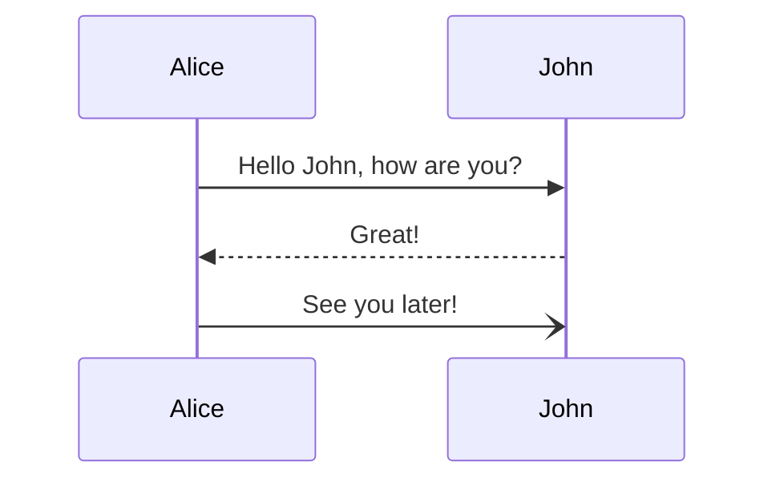
```mermaid
sequenceDiagram
    Alice->>John: Hello John, how are you?
    John-->>Alice: Great!
    Alice-)John: See you later!
```

## Core Concepts

**Participant**: A lifeline in the diagram. Participants may be inferred from message usage or declared with `participant <id>`.

**Actor**: A participant rendered with an actor/person symbol. Declared with `actor <id>`.

**Alias**: A display label for a participant. Use `participant A as Alice` or JSON configuration with an `alias` field. If both inline alias and external `as` alias are present, the external `as` alias takes precedence.

**Message**: An interaction between two participants. Basic syntax: `[Actor][Arrow][Actor]:Message text`.

**Activation**: A highlighted execution period on a participant lifeline. Use `activate` / `deactivate` or arrow suffixes `+` and `-`.

**Combined fragment**: A control block around messages, such as `loop`, `alt`, `opt`, `par`, `critical`, `break`, or `rect`.

**Actor menu**: A popup menu with external links attached to a participant via `link` or `links` statements.

## API / Interface

### Diagram declaration

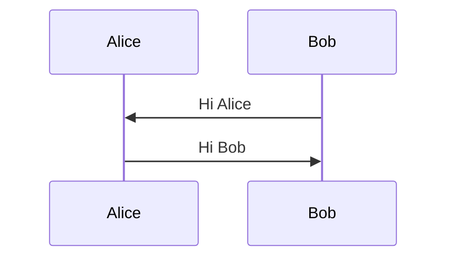
```mermaid
sequenceDiagram
    participant Alice
    participant Bob
    Bob->>Alice: Hi Alice
    Alice->>Bob: Hi Bob
```

### Participant and actor declarations

| Syntax | Purpose |
|--------|---------|
| `participant Alice` | Rectangle participant |
| `actor Alice` | Actor/person participant |
| `participant A as Alice` | Participant with external alias |
| `actor A as Alice` | Actor with external alias |
| `participant API@{ "type": "boundary" }` | Participant with stereotype shape |
| `participant API@{ "type": "boundary", "alias": "Public API" }` | Participant with inline alias |

Supported JSON-style participant `type` values from the official examples:

| Type | Meaning |
|------|---------|
| `boundary` | Boundary symbol |
| `control` | Control symbol |
| `entity` | Entity symbol |
| `database` | Database symbol |
| `collections` | Collections symbol |
| `queue` | Queue symbol |

Example with stereotypes and aliases:

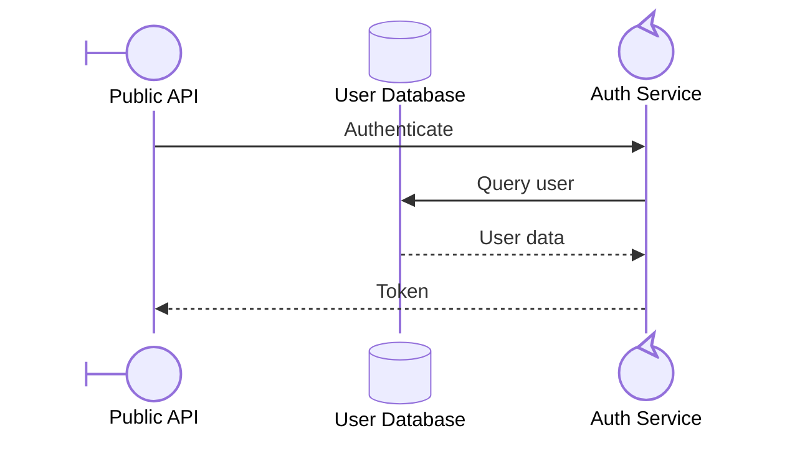
```mermaid
sequenceDiagram
    participant API@{ "type": "boundary" } as Public API
    actor DB@{ "type": "database" } as User Database
    participant Svc@{ "type": "control" } as Auth Service
    API->>Svc: Authenticate
    Svc->>DB: Query user
    DB-->>Svc: User data
    Svc-->>API: Token
```

### Message arrows

| Type | Description |
|------|-------------|
| `->` | Solid line without arrow |
| `-->` | Dotted line without arrow |
| `->>` | Solid line with arrowhead |
| `-->>` | Dotted line with arrowhead |
| `<<->>` | Solid line with bidirectional arrowheads (v11.0.0+) |
| `<<-->>` | Dotted line with bidirectional arrowheads (v11.0.0+) |
| `-x` | Solid line with a cross at the end |
| `--x` | Dotted line with a cross at the end |
| `-)` | Solid line with an open arrow at the end (async) |
| `--)` | Dotted line with an open arrow at the end (async) |

Half-arrows are supported in v11.12.3+ for more expressive diagrams. Both solid and dotted variants are available by increasing the number of dashes (`-` to `--`).

| Type | Description |
|------|-------------|
| `-|\\` | Solid line with top half arrowhead |
| `--|\\` | Dotted line with top half arrowhead |
| `-|/` | Solid line with bottom half arrowhead |
| `--|/` | Dotted line with bottom half arrowhead |
| `/|-` | Solid line with reverse top half arrowhead |
| `/|--` | Dotted line with reverse top half arrowhead |
| `\\-` | Solid line with reverse bottom half arrowhead / reverse bottom stick half arrowhead |
| `\\--` | Dotted line with reverse bottom half arrowhead / reverse bottom stick half arrowhead |
| `-\\` | Solid line with top stick half arrowhead |
| `--\\` | Dotted line with top stick half arrowhead |
| `-//` | Solid line with bottom stick half arrowhead |
| `--//` | Dotted line with bottom stick half arrowhead |
| `//-` | Solid line with reverse top stick half arrowhead |
| `//--` | Dotted line with reverse top stick half arrowhead |

### Central connections (v11.12.3+)

Append `()` to arrow syntax to connect to a central lifeline point instead of directly actor-to-actor.

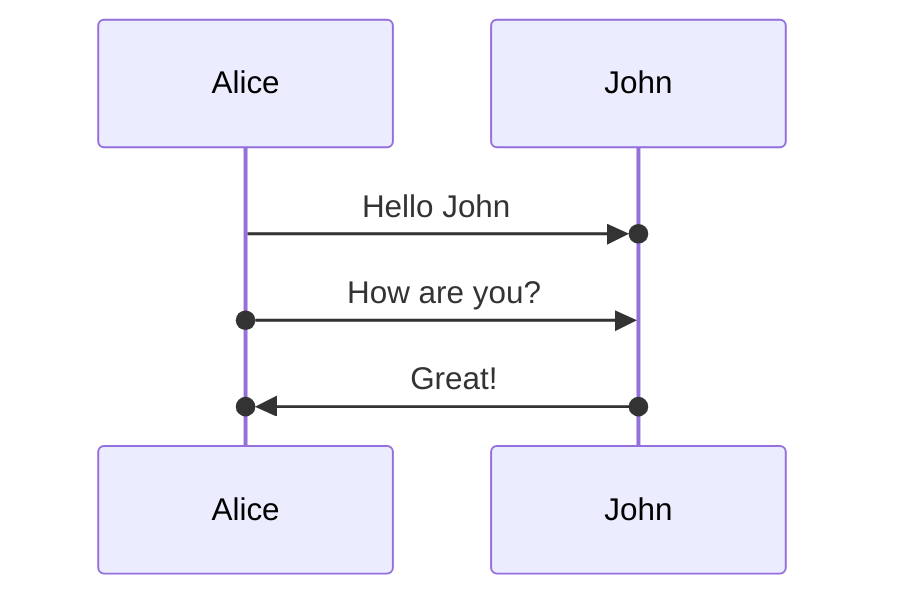
```mermaid
sequenceDiagram
    participant Alice
    participant John
    Alice->>()John: Hello John
    Alice()->>John: How are you?
    John()->>()Alice: Great!
```

### Create and destroy actors (v10.3.0+)

Add `create` or `destroy` before the message. The sender or recipient can be destroyed, but only the recipient can be created.

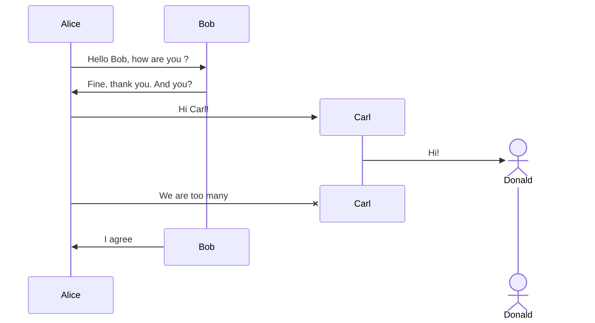
```mermaid
sequenceDiagram
    Alice->>Bob: Hello Bob, how are you ?
    Bob->>Alice: Fine, thank you. And you?
    create participant Carl
    Alice->>Carl: Hi Carl!
    create actor D as Donald
    Carl->>D: Hi!
    destroy Carl
    Alice-xCarl: We are too many
    destroy Bob
    Bob->>Alice: I agree
```

If a persistent error says `The destroyed participant participant-name does not have an associated destroying message after its declaration` and correct diagram code still fails, the Mermaid documentation recommends updating Mermaid to v10.7.0+.

## Usage Patterns

### Activation and nested calls

Use explicit activation declarations:

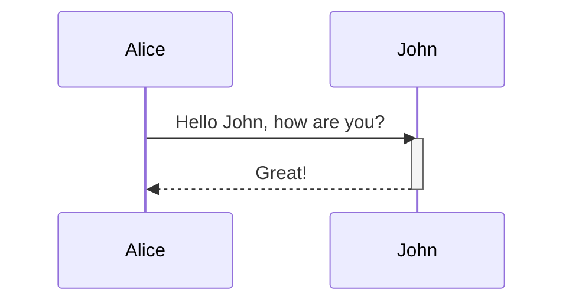
```mermaid
sequenceDiagram
    Alice->>John: Hello John, how are you?
    activate John
    John-->>Alice: Great!
    deactivate John
```

Or use `+` / `-` suffixes on message arrows:

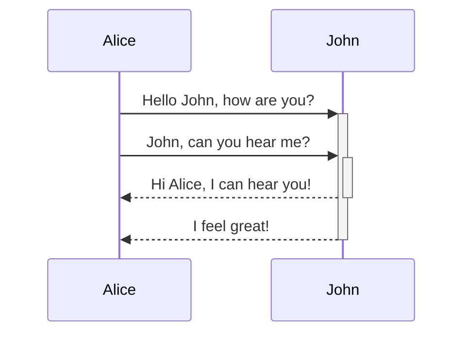
```mermaid
sequenceDiagram
    Alice->>+John: Hello John, how are you?
    Alice->>+John: John, can you hear me?
    John-->>-Alice: Hi Alice, I can hear you!
    John-->>-Alice: I feel great!
```

### Notes

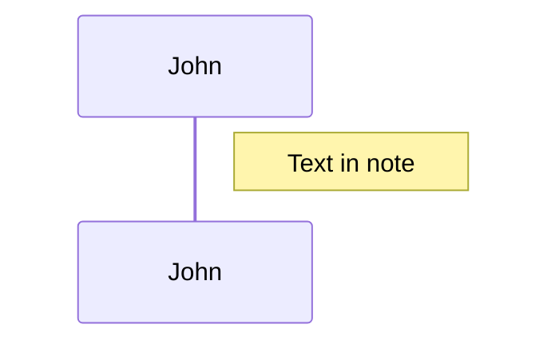
```mermaid
sequenceDiagram
    participant John
    Note right of John: Text in note
```

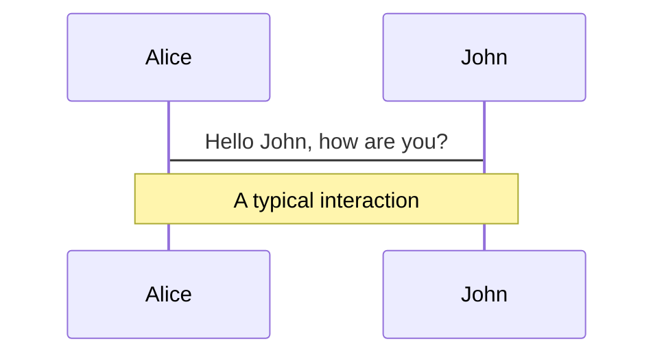
```mermaid
sequenceDiagram
    Alice->John: Hello John, how are you?
    Note over Alice,John: A typical interaction
```

Line breaks in notes and messages use `<br/>`. Line breaks in actor names require aliases.

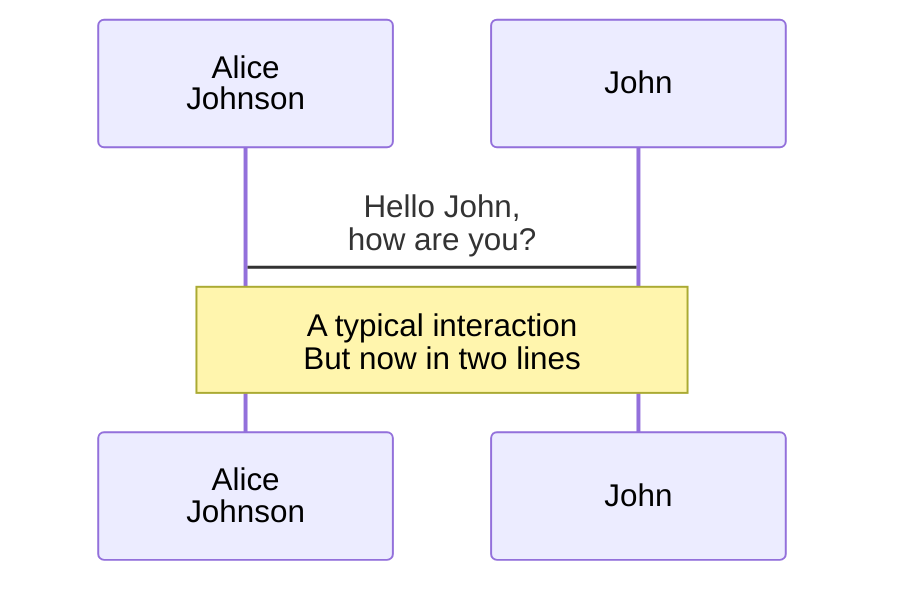
```mermaid
sequenceDiagram
    participant Alice as Alice<br/>Johnson
    Alice->John: Hello John,<br/>how are you?
    Note over Alice,John: A typical interaction<br/>But now in two lines
```

### Loop

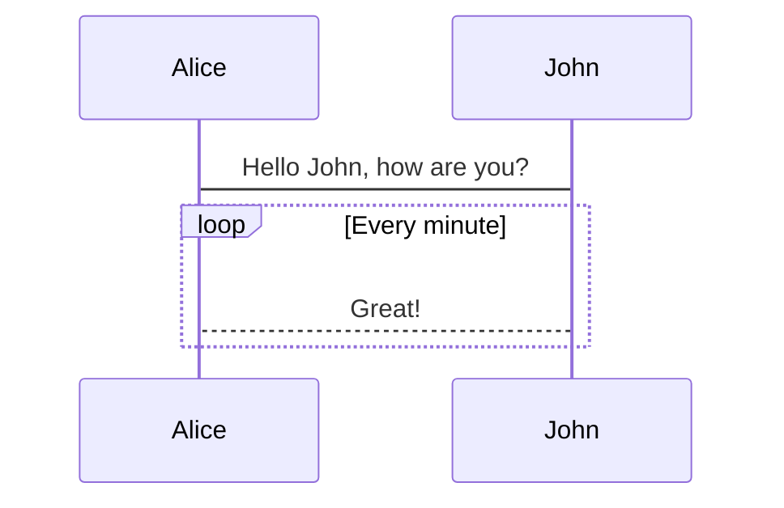
```mermaid
sequenceDiagram
    Alice->John: Hello John, how are you?
    loop Every minute
        John-->Alice: Great!
    end
```

### Alternative and optional paths

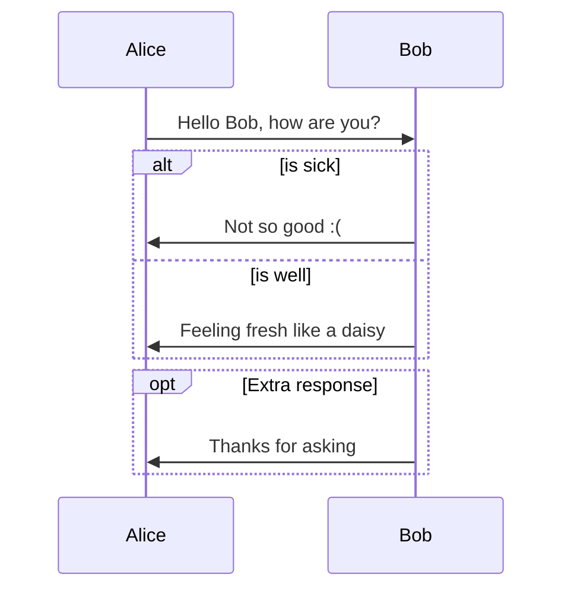
```mermaid
sequenceDiagram
    Alice->>Bob: Hello Bob, how are you?
    alt is sick
        Bob->>Alice: Not so good :(
    else is well
        Bob->>Alice: Feeling fresh like a daisy
    end
    opt Extra response
        Bob->>Alice: Thanks for asking
    end
```

### Parallel execution

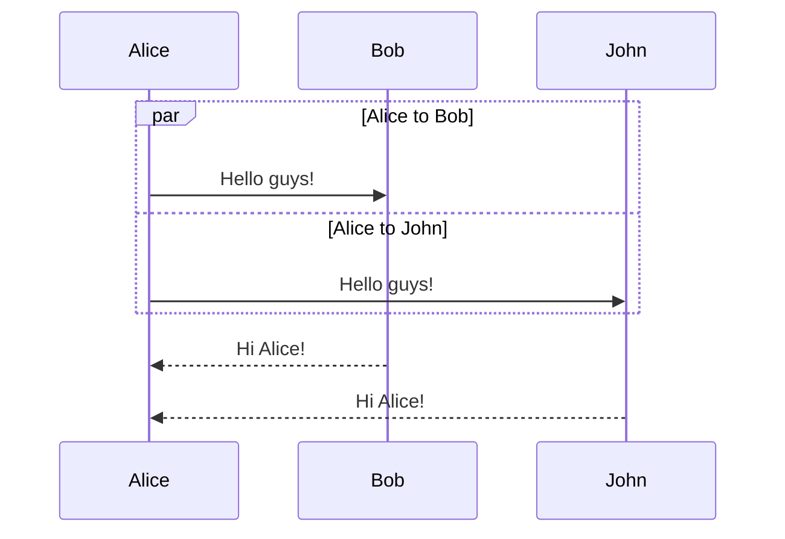
```mermaid
sequenceDiagram
    par Alice to Bob
        Alice->>Bob: Hello guys!
    and Alice to John
        Alice->>John: Hello guys!
    end
    Bob-->>Alice: Hi Alice!
    John-->>Alice: Hi Alice!
```

Nested `par` blocks are supported.

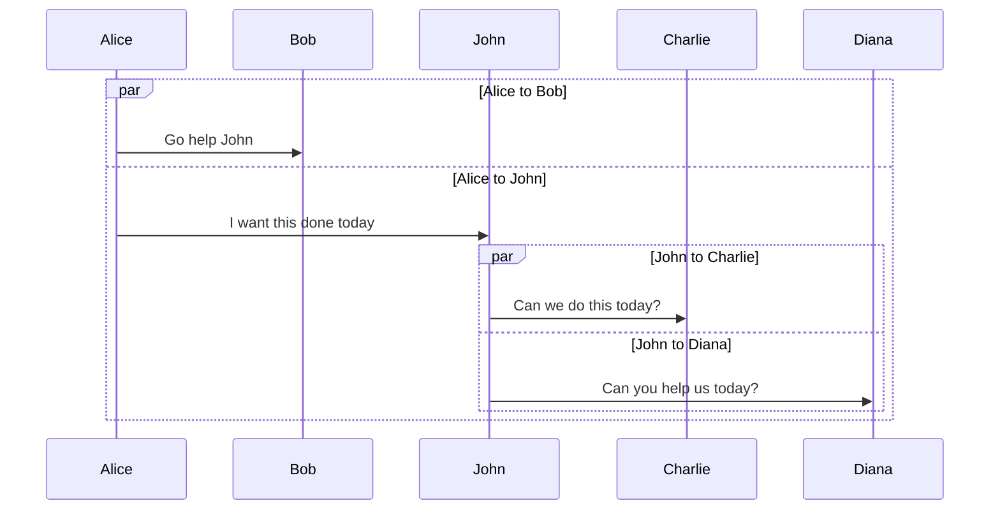
```mermaid
sequenceDiagram
    par Alice to Bob
        Alice->>Bob: Go help John
    and Alice to John
        Alice->>John: I want this done today
        par John to Charlie
            John->>Charlie: Can we do this today?
        and John to Diana
            John->>Diana: Can you help us today?
        end
    end
```

### Critical region

Use `critical` for mandatory actions and `option` branches for exceptional circumstances.

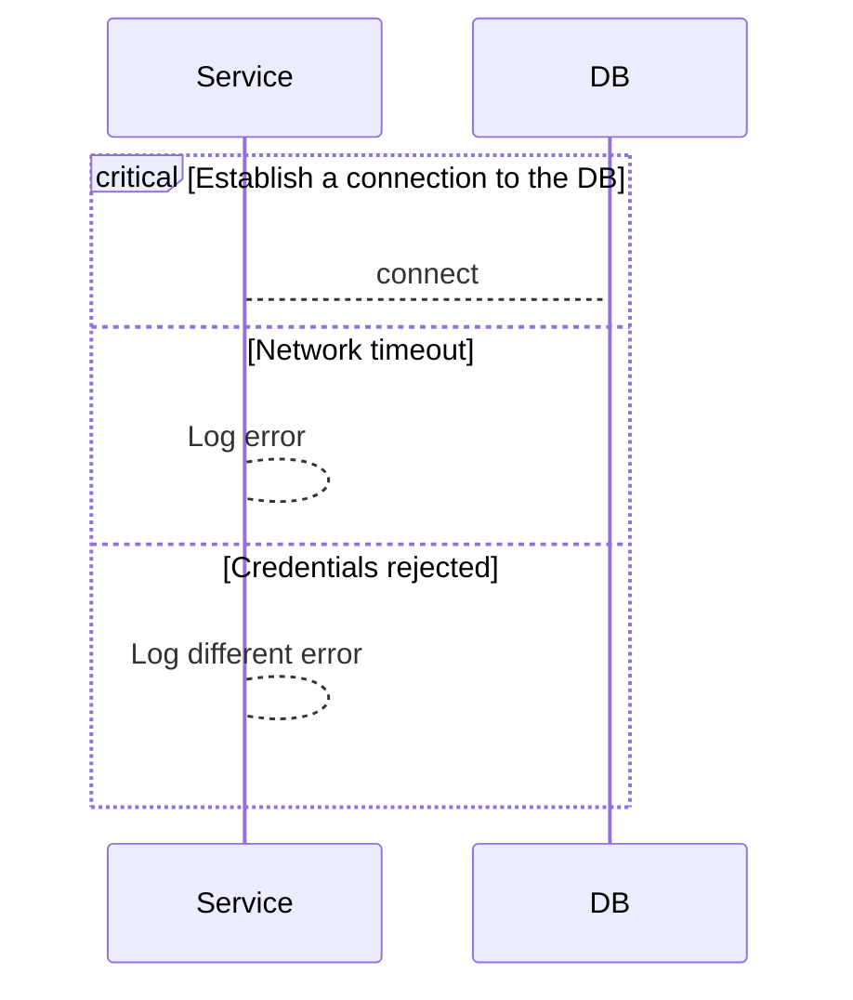
```mermaid
sequenceDiagram
    critical Establish a connection to the DB
        Service-->DB: connect
    option Network timeout
        Service-->Service: Log error
    option Credentials rejected
        Service-->Service: Log different error
    end
```

A `critical` block may also have no `option` blocks.

### Break / exception flow

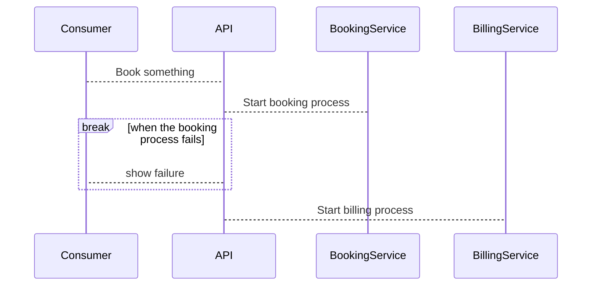
```mermaid
sequenceDiagram
    Consumer-->API: Book something
    API-->BookingService: Start booking process
    break when the booking process fails
        API-->Consumer: show failure
    end
    API-->BillingService: Start billing process
```

### Background highlighting

Use `rect COLOR` with `rgb(...)` or `rgba(...)` colors.

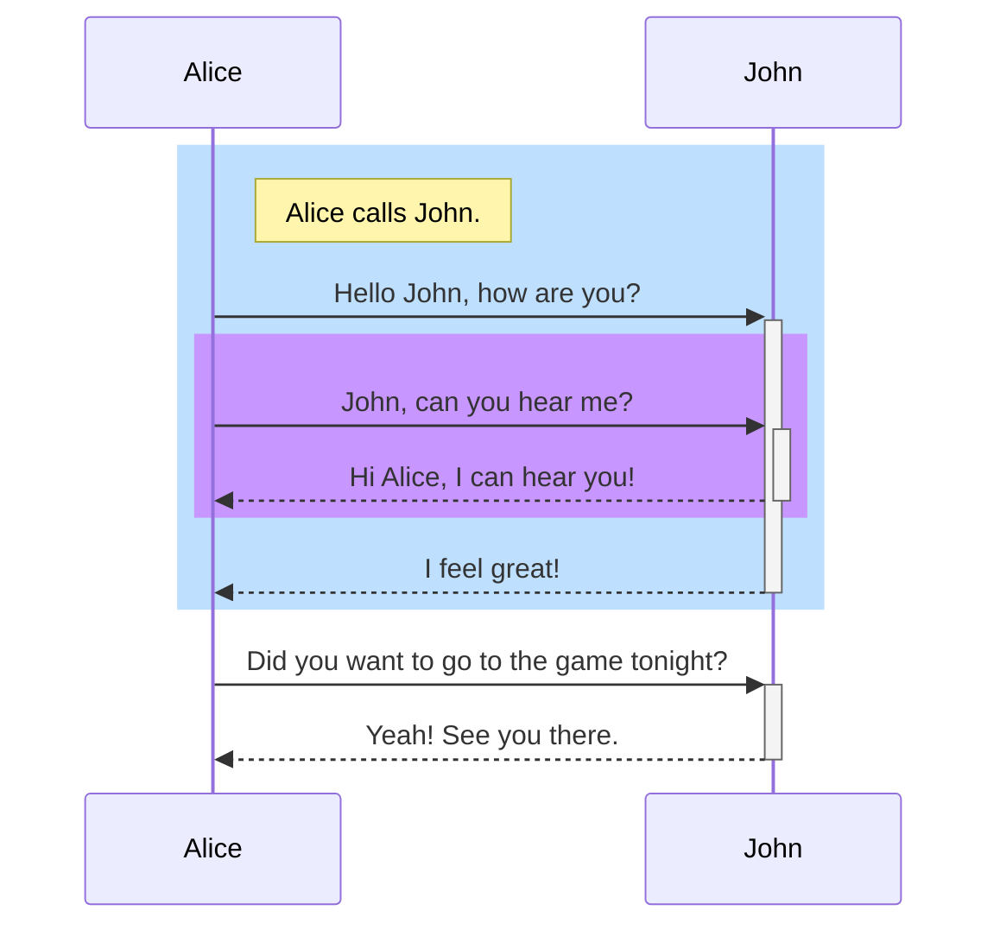
```mermaid
sequenceDiagram
    participant Alice
    participant John

    rect rgb(191, 223, 255)
    note right of Alice: Alice calls John.
    Alice->>+John: Hello John, how are you?
    rect rgb(200, 150, 255)
    Alice->>+John: John, can you hear me?
    John-->>-Alice: Hi Alice, I can hear you!
    end
    John-->>-Alice: I feel great!
    end
    Alice ->>+ John: Did you want to go to the game tonight?
    John -->>- Alice: Yeah! See you there.
```

### Grouping participants with box

Actors can be grouped in vertical boxes. If a color is provided, it must appear before the optional description.

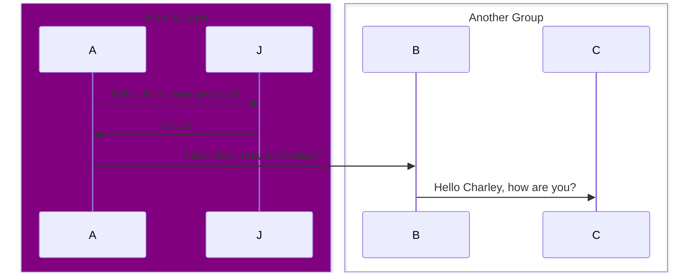
```mermaid
sequenceDiagram
    box Purple Alice & John
    participant A
    participant J
    end
    box Another Group
    participant B
    participant C
    end
    A->>J: Hello John, how are you?
    J->>A: Great!
    A->>B: Hello Bob, how is Charley?
    B->>C: Hello Charley, how are you?
```

Supported box color forms shown in the docs:

```text
box Aqua Group Description
... actors ...
end
box Group without description
... actors ...
end
box rgb(33,66,99)
... actors ...
end
box rgba(33,66,99,0.5)
... actors ...
end
box hsl(10, 40%, 90%)
... actors ...
end
box hsla(10, 40%, 90%, 0.5)
... actors ...
end
box transparent Aqua
... actors ...
end
```

### Comments

Comments must be on their own line and start with `%%`.

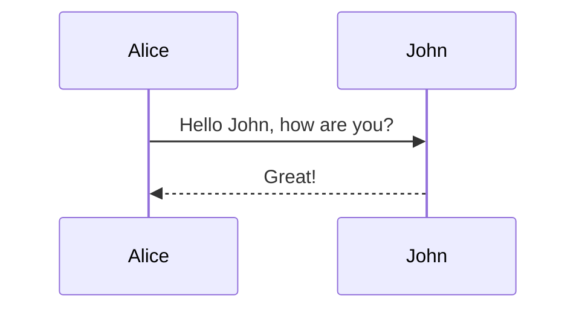
```mermaid
sequenceDiagram
    Alice->>John: Hello John, how are you?
    %% this is a comment
    John-->>Alice: Great!
```

### Escaping characters

Entity codes can escape characters in message text. Numbers are base 10, so `#` can be encoded as `#35;`. HTML character names are also supported. Because semicolons can separate Mermaid statements, use `#59;` to include a semicolon in message text.

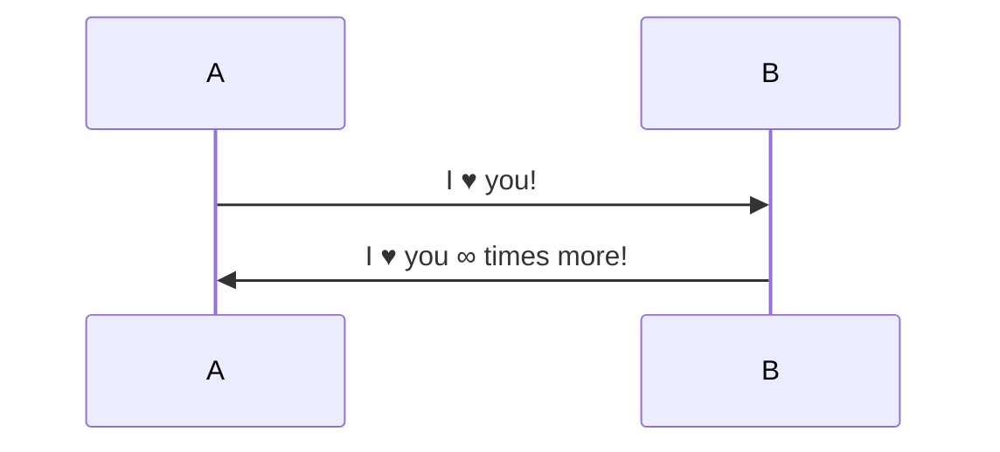
```mermaid
sequenceDiagram
    A->>B: I #9829; you!
    B->>A: I #9829; you #infin; times more!
```

### Automatic sequence numbers

Use `autonumber` inside the diagram or initialize Mermaid with `sequence.showSequenceNumbers`.

```mermaid
sequenceDiagram
    autonumber
    Alice->>John: Hello John, how are you?
    loop HealthCheck
        John->>John: Fight against hypochondria
    end
    Note right of John: Rational thoughts!
    John-->>Alice: Great!
    John->>Bob: How about you?
    Bob-->>John: Jolly good!
```

Since v11.15.0, a starting value and increment can be provided. Both may include decimals up to the hundredths place.

```text
autonumber <start> <increment>
```

### Actor menus

Attach external links to participants using one `link` line per item:

```mermaid
sequenceDiagram
    participant Alice
    participant John
    link Alice: Dashboard @ https://dashboard.contoso.com/alice
    link Alice: Wiki @ https://wiki.contoso.com/alice
    link John: Dashboard @ https://dashboard.contoso.com/john
    link John: Wiki @ https://wiki.contoso.com/john
    Alice->>John: Hello John, how are you?
    John-->>Alice: Great!
    Alice-)John: See you later!
```

Or use JSON formatting with `links`:

```mermaid
sequenceDiagram
    participant Alice
    participant John
    links Alice: {"Dashboard": "https://dashboard.contoso.com/alice", "Wiki": "https://wiki.contoso.com/alice"}
    links John: {"Dashboard": "https://dashboard.contoso.com/john", "Wiki": "https://wiki.contoso.com/john"}
    Alice->>John: Hello John, how are you?
    John-->>Alice: Great!
    Alice-)John: See you later!
```

## Configuration

Sequence diagrams can be configured through `mermaid.sequenceConfig`, Mermaid initialization, or Mermaid CLI configuration files.

```javascript
mermaid.sequenceConfig = {
  diagramMarginX: 50,
  diagramMarginY: 10,
  boxTextMargin: 5,
  noteMargin: 10,
  messageMargin: 35,
  mirrorActors: true,
};
```

```html
<script>
  mermaid.initialize({ sequence: { showSequenceNumbers: true } });
</script>
```

| Parameter | Description | Default value |
|-----------|-------------|---------------|
| `mirrorActors` | Turns on/off rendering actors below the diagram as well as above it | `false` |
| `bottomMarginAdj` | Adjusts how far down the graph ended; useful when wide border styles cause clipping | `1` |
| `actorFontSize` | Sets actor description font size | `14` |
| `actorFontFamily` | Sets actor description font family | `"Open Sans", sans-serif` |
| `actorFontWeight` | Sets actor description font weight | `"Open Sans", sans-serif` |
| `noteFontSize` | Sets actor-attached note font size | `14` |
| `noteFontFamily` | Sets actor-attached note font family | `"trebuchet ms", verdana, arial` |
| `noteFontWeight` | Sets actor-attached note font weight | `"trebuchet ms", verdana, arial` |
| `noteAlign` | Sets note text alignment | `center` |
| `messageFontSize` | Sets actor-to-actor message font size | `16` |
| `messageFontFamily` | Sets actor-to-actor message font family | `"trebuchet ms", verdana, arial` |
| `messageFontWeight` | Sets actor-to-actor message font weight | `"trebuchet ms", verdana, arial` |

### CSS classes used by sequence diagrams

| Class | Description |
|-------|-------------|
| `actor` | Styles for the actor box |
| `actor-top` | Styles for the actor figure/box at the top |
| `actor-bottom` | Styles for the actor figure/box at the bottom |
| `text.actor` | Styles for text of all actors |
| `text.actor-box` | Styles for actor box text |
| `text.actor-man` | Styles for actor figure text |
| `actor-line` | Vertical actor lifeline |
| `messageLine0` | Solid message line |
| `messageLine1` | Dotted message line |
| `messageText` | Text on message arrows |
| `labelBox` | Label box to the left in a loop |
| `labelText` | Label text for loops |
| `loopText` | Text in the loop box |
| `loopLine` | Lines in the loop box |
| `note` | Note box |
| `noteText` | Text in note boxes |

## Best Practices

1. Declare participants explicitly when participant order matters; implicit participants render in first-appearance order.
2. Use short stable IDs (`API`, `DB`, `Svc`) and aliases for readable labels, especially when labels contain spaces or line breaks.
3. Prefer `->>` for synchronous calls, `-->>` for returns/responses, `-)` or `--)` for asynchronous messages, and `-x` / `--x` for terminating or failed interactions.
4. Use `activate` / `deactivate` or `+` / `-` arrows to show ownership of processing time when call nesting matters.
5. Use `alt` / `else` for mutually exclusive branches and `opt` for optional behavior without an else branch.
6. Use `break` for exception/stop flows and `critical` for actions that must happen with explicit contingency options.
7. Use `par` only when actions are truly concurrent; otherwise keep the main path linear for readability.
8. Use `rect rgba(...)` sparingly to highlight important phases without obscuring the message flow.
9. Keep labels concise; use `Note` for context that would make message labels too long.
10. If links are useful in rendered documentation, attach dashboards, repositories, or runbooks with `link` / `links`.

## Common Pitfalls

| Pitfall | How to avoid it |
|---------|-----------------|
| Using `end` as a bare node/participant word | Wrap it with parentheses, quotes, or brackets: `(end)`, `"end"`, `[end]`, `{end}` |
| Relying on implicit participant order | Declare participants explicitly at the top |
| Hex colors in `box` | Avoid `#ff0000`; `#` is interpreted as comment syntax. Use named colors, `rgb(...)`, `rgba(...)`, `hsl(...)`, or `hsla(...)` |
| Wrong `box` syntax | Put color before description: `box Aqua Group Description` |
| Destroy directive without matching destroying message | Put `destroy <participant>` immediately before the destroying message; update Mermaid to v10.7.0+ if a fixed diagram still errors globally |
| Expecting inline alias to override `as` alias | External `as` alias takes precedence |
| Semicolon in message text breaks parsing | Escape it as `#59;` |
| Multi-line actor labels without aliases | Use alias syntax, e.g. `participant A as Alice<br/>Johnson` |

## Version Notes

| Version | Feature / note |
|---------|----------------|
| v10.3.0+ | Actor/participant creation and destruction by messages |
| v10.7.0+ | Recommended fix for persistent actor/participant creation/deletion parser errors |
| v11.0.0+ | Bidirectional arrowheads `<<->>` and `<<-->>` |
| v11.12.3+ | Half-arrow types and central lifeline connections with `()` |
| v11.15.0+ | `autonumber <start> <increment>` with decimals up to hundredths |
