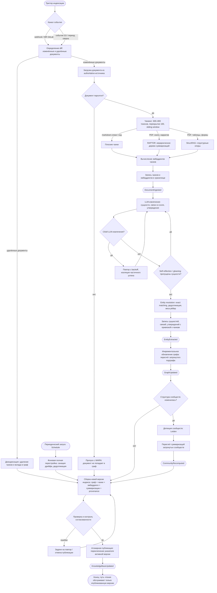

# Code — Пайплайн индексации (F2)

Описание поведения (уровень 4 C4) пайплайна индексации — автомата состояний контейнера «Оркестрация пайплайнов индексации» (`F2. Индексация источников знаний`, `specs/vision.md` §2.2). Показывает жизненный цикл обработки изменений корпуса: от события изменения источника (GitLab / внешнее хранилище документов) до атомарной публикации новой версии индекса. Каскад доменных событий: `DocumentIngested → EntityExtracted → GraphUpdated → CommunityRecomputed → KnowledgeBaseUpdated`.

> **Статус:** проект на этапе видения (Фаза 0), `src/` не содержит реализации. Диаграмма описывает **целевое состояние (`to be`/target)** и строится по референсам GraphRAG ([`.ai-factory/references/graphrag/`](../../.ai-factory/references/graphrag/INDEX.md)) и принятым ADR. Актуализируется до `as is` по фактическому коду после появления реализации в `src/`.

## Блок-схема алгоритма

## Контекст — что моделируется

- **Автомат пайплайна индексации** — жизненный цикл обработки изменений корпуса в контейнере «Оркестрация пайплайнов индексации» (F2). Начальное состояние — событие изменения источника (MR/webhook GitLab, событие бакета S3, периодическая diff-сверка); конечное — `KnowledgeBaseUpdated` (атомарная публикация версии, путь чтения переключён).
- **Модель «инкрементальное обновление + версионные снапшоты + атомарная публикация»** — путь записи принимает события и пересчитывает только затронутые части; путь чтения обслуживает запросы только из последнего опубликованного снапшота (`ADR-IMPL.DATA.incremental-update-snapshot-publish`, ПРИНЯТО).
- **Гибридная композиция GraphRAG** — ядро алгоритма: LightRAG (dual-level retrieval + инкрементальность), KAG-принципы (mutual indexing, grounding), RAPTOR/StructRAG для PDF, community summaries для глобальных запросов (`ADR-DES.API.hybrid-graphrag-composition`, ПРИНЯТО). Полный map-reduce Microsoft GraphRAG на каждый запрос запрещён.
- **Границы** — пайплайн описывает только путь записи (F2); retrieval и генерация ответов (F1) — в `code-query-behavior.md`; онтологический слой и контур LLM — механизмы внутри пайплайна, а не отдельные контейнеры.
- **Внешние системы — чёрные ящики**: GitLab (эталонный источник), внешнее хранилище документов (S3), контур LLM (локальные GPU). Показываются только контракты: Git API / MR / webhook, S3 API / события / сверка, Local.

## Жизненный цикл пайплайна

| Событие | Триггер | Производитель | Действие системы | Следующее состояние |
|---|---|---|---|---|
| `DocumentIngested` | Новый/изменённый документ: MR GitLab, событие/сверка S3 | Оркестрация (ингestion) | Загрузка, чанкинг, эмбеддинги, запись чанков в хранилище | `EntityExtracted` |
| `EntityExtracted` | Обработка чанка | Оркестрация (извлечение, контур LLM) | Извлечение сущностей, связей, утверждений с привязкой к чанку | `GraphUpdated` |
| `GraphUpdated` | Применение результата извлечения к графу | Ядро (граф знаний) | Инкрементальный пересчёт затронутого подграфа | `CommunityRecomputed` (при изменении структуры сообществ) |
| `CommunityRecomputed` | Изменение графа затрагивает сообщества | Ядро (сообщества) | Leiden-детекция, пересчёт суммаризаций затронутых сообществ | сборка версии индекса |
| `KnowledgeBaseUpdated` | Сборка версии завершена и валидна | Оркестрация (сборка/публикация) | Атомарная публикация: переключение указателя активной версии | путь чтения обслуживает новую версию |

**Альтернативные потоки (референс: `UC-knowledge.sync.gitlab-index`):**

- **A1. Потерянный webhook** — периодическая diff-сверка; повторная обработка идемпотентна (ключ — `(sourceRef, revision)`).
- **A2. Сбой LLM-извлечения** — повтор с backoff; частичный успех изолируется (успешные документы фиксируются, сбойные — в очередь на повтор).
- **A3. Непарсящийся документ** — пропуск с WARN, документ не попадает в граф.

## Стадии алгоритма

### 1. Триггеры и определение изменений

- Изменения корпуса приходят только через authoritative-источники: GitLab (MR merged / push, webhook) и внешнее хранилище документов (S3: события бакета + периодическая diff-сверка как fallback) (`ADR-IMPL.INTEGRATION.s3-document-store`). Прямого ручного ввода нет.
- Оркестрация определяет набор изменённых и удалённых документов (diff по API источника); повторная обработка идемпотентна.

### 2. Загрузка и чанкинг

- Документы разбиваются на чанки фиксированного размера: **600–800 токенов с перекрытием 100 токенов + sliding window** для длинных документов (референс: [01-principles.md](../../.ai-factory/references/graphrag/01-principles.md) §3.1, [05-design-guide.md](../../.ai-factory/references/graphrag/05-design-guide.md) §3.3, [07-implementation-methodology.md](../../.ai-factory/references/graphrag/07-implementation-methodology.md) §1.1).
- Размер чанка — проектное решение с trade-off: длиннее = дешевле (меньше LLM-вызовов), но хуже recall на информации в начале чанка; в foundational paper — 600 токенов / 100 перекрытие.
- **PDF-контур** (книги, легаси, глобальный слой): книги и нарратив — RAPTOR (рекурсивная суммаризация в иерархическое дерево); таблицы, формы, отчёты — StructRAG (динамическая структуризация в «структурные опоры») (`ADR-DES.API.hybrid-graphrag-composition`; [03-algorithms.md](../../.ai-factory/references/graphrag/03-algorithms.md) §5, §10).

### 3. Эмбеддинги

- Для каждого чанка вычисляется векторное представление; чанки и эмбеддинги записываются в хранилище (Neo4j: узлы `Chunk` + нативный векторный индекс HNSW) — «текст в индексе», путь чтения самодостаточен (`ADR-IMPL.DATA.graph-storage`).
- Чанк — производные данные индекса (не источник правды): текст + координаты (`source_uri`, `source_version`, offset/token range), `content_hash`, версия индекса; пересобирается из источника при изменении.

### 4. LLM-извлечение фактов

- Контур LLM извлекает из каждого чанка: **сущности** (имя, тип, описание), **отношения** (source, target, описание, **числовой score силы**), **утверждения (claims)** — с привязкой к чанку (mutual indexing, KAG).
- Промпты настраиваются под домен через few-shot exemplars; типы сущностей берутся из онтологического слоя (модель предметной области); структурированный парсинг — через tuple/record/completion делимитеры ([07-implementation-methodology.md](../../.ai-factory/references/graphrag/07-implementation-methodology.md) §3.1).
- Это форма *абстрактивной суммаризации*: отношения и утверждения могут не быть явно указаны в тексте.

### 5. Self-reflection / gleaning

- Для компенсации снижения recall на больших чанках: извлечённые сущности подаются обратно LLM, модель просят оценить полноту — **logit bias = 100** для принудительного yes/no; при ответе «пропущены» выполняется prompt-продолжение и повторное извлечение до заданного максимума итераций ([07-implementation-methodology.md](../../.ai-factory/references/graphrag/07-implementation-methodology.md) §2, [01-principles.md](../../.ai-factory/references/graphrag/01-principles.md) §3.2).
- Снижает стоимость индексации (позволяет большие чанки без потери качества) — критично для локальных GPU.
- Сбой LLM: повтор с backoff, изоляция частичного успеха (A2).

### 6. Entity resolution и построение графа

- Экземпляры сущностей становятся узлами, отношения — рёбрами; **дубликаты агрегируются** (количество повторений отношения становится весом ребра).
- Базовый метод резолвинга — **exact string matching**; мягкие методы и дедупликация — при необходимости (шум в графе → двухэтапная фильтрация, [05-design-guide.md](../../.ai-factory/references/graphrag/05-design-guide.md) §5).
- GraphRAG устойчив к дубликатам: они обычно кластеризуются вместе при детекции сообществ.
- Онтологический слой участвует в резолвинге терминов (доменный сервис `TermResolver`); автоматическое построение онтологии из корпуса — Фаза 3.

### 7. Инкрементальное обновление графа

- Применение результата извлечения пересчитывает **только затронутый подграф**: связанные чанки, сущности, связи, записи индекса и локальные суммаризации (LightRAG incremental update, [03-algorithms.md](../../.ai-factory/references/graphrag/03-algorithms.md) §2; `ADR-IMPL.DATA.incremental-update-snapshot-publish`).
- Граница транзакционности — агрегат `GraphUpdate`: каждое изменение имеет источник (provenance); переключение состояния атомарно.
- Глобальные суммаризации и дальние части графа пересчитываются только при необходимости.

### 8. Сообщества и суммаризации

- **Детекция сообществ — Leiden** (иерархически; каждый уровень — MECE-разбиение) ([01-principles.md](../../.ai-factory/references/graphrag/01-principles.md) §3.4; [05-design-guide.md](../../.ai-factory/references/graphrag/05-design-guide.md) §2.2).
- Пересчёт запускается **только при изменении структуры сообществ** (не на каждое изменение графа).
- **Суммаризация сообществ**: листовые сообщества — элементы приоритизируются по combined node degree и добавляются в контекстное окно до лимита токенов; верхние уровни — суммаризации подсообществ. Проект использует уровни **C0–C1** (глобальные запросы, онбординг) (`ADR-DES.API.hybrid-graphrag-composition`).
- Отчёт сообщества — **JSON**: title, summary, impact severity rating (0–10), detailed findings; **grounding rules** — атрибуция каждого утверждения к source record IDs, не более 5 ID на ссылку ([07-implementation-methodology.md](../../.ai-factory/references/graphrag/07-implementation-methodology.md) §3.2, §4).

### 9. Деиндексация удалённых

- Удалённые документы деиндексируются: чанки и их вклад в граф (сущности, связи, утверждения) удаляются из хранилища; удаление учитывается при сборке версии.

### 10. Сборка версии и атомарная публикация

- Индекс, граф, слой эмбеддингов, суммаризации и provenance получают **версионную метку**; новая версия собирается и валидируется «рядом» со старой (`ADR-IMPL.DATA.incremental-update-snapshot-publish`, `ADR-IMPL.DATA.graph-storage`).
- **Публикация атомарна**: активная версия переключается одним шагом (указатель версии в одной транзакции); частично собранное состояние никогда не становится активным.
- **Проверка и контроль согласованности** перед публикацией; при ошибках — задачи на повтор, публикация отменяется.
- Выполняющиеся запросы продолжают работать на старой версии; возможен откат к предыдущей опубликованной версии без перестройки (`REQ-NFR-data.maintainability.versioned-provenance`).
- Целевые значения актуальности: **медиана ≤ 5 мин, p90 ≤ 15 мин** от изменения источника до публикации; доля ответов на актуальных версиях ≥ 95% (`REQ-NFR-data.performance.index-freshness`).

### 11. Периодическая полная перестройка

- Фоновая операция (не горячий путь): санация накопленных дрейфов, дедупликация, переоценка связей; на пользовательский SLA не влияет ([05-design-guide.md](../../.ai-factory/references/graphrag/05-design-guide.md) §2.4 — рекомендация: инкрементальное обновление + периодическая полная перестройка).

## Режимы инкрементального обновления

| Режим | Когда | Что пересчитывается | Триггер | Статус |
|---|---|---|---|---|
| **Инкрементальный (точечный)** | Изменение одного/нескольких документов | Затронутые чанки, сущности, связи, локальные суммаризации; при изменении структуры — сообщества | webhook/MR, событие S3, diff-сверка | MVP |
| **Полная перестройка** | Периодически, фоновая санация | Весь индекс: граф, чанки, эмбеддинги, суммаризации, provenance | Schedule | MVP |
| **Real-time обновление (Graphiti)** | Непрерывное обновление графа для динамических сценариев | Граф в реальном времени | — | Фаза 3, вне MVP (vision §2.6, §2.7 п.11) |

## Ключевые параметры

| Параметр | Значение (целевое) | Обоснование / референс |
|---|---|---|
| Размер чанка | 600–800 токенов | [05-design-guide.md](../../.ai-factory/references/graphrag/05-design-guide.md) §3.3 |
| Перекрытие чанков | 100 токенов | [01-principles.md](../../.ai-factory/references/graphrag/01-principles.md) §3.1 |
| Контекстное окно суммаризаций | 8k токенов (эмпирически оптимально; «lost in the middle») | [07-implementation-methodology.md](../../.ai-factory/references/graphrag/07-implementation-methodology.md) §1.2 |
| Уровни сообществ | C0–C1 (проект); C0 — ~2.3–2.6% токенов от полного корпуса | [07-implementation-methodology.md](../../.ai-factory/references/graphrag/07-implementation-methodology.md) §1.3 |
| Gleaning | logit bias = 100, до max итераций | [07-implementation-methodology.md](../../.ai-factory/references/graphrag/07-implementation-methodology.md) §2 |
| Актуальность индекса | медиана ≤ 5 мин, p90 ≤ 15 мин | `REQ-NFR-data.performance.index-freshness` |
| Эталонная стоимость индексации | ~281 мин на 1M токенов (CPU) — мотивация инкрементальности | [07-implementation-methodology.md](../../.ai-factory/references/graphrag/07-implementation-methodology.md) §6 |

## Компоненты (целевые)

Пайплайн исполняется контейнером «Оркестрация пайплайнов индексации» (F2) во взаимодействии с Ядром, Интеграциями и Хранилищем (`container.md`). Планируемые компоненты (документы уровня 3 — плановая работа):

| Стадия | Компонент (целевой) | Контейнер |
|---|---|---|
| Триггеры, diff, загрузка | GitLab sync/ingest, S3 ingest | Оркестрация пайплайнов индексации |
| Чанкинг, эмбеддинги, извлечение | Извлечение (RAPTOR/StructRAG для PDF), очередь задач | Оркестрация пайплайнов индексации |
| Инкрементальное обновление графа, сообщества | Граф знаний, пересчёт сообществ и суммаризаций | Ядро |
| Сборка и публикация версии | Сборка и атомарная публикация версии индекса | Оркестрация пайплайнов индексации |
| Клиенты источников, LLM, CPU (Leiden) | GitLab-клиент, S3-клиент, LLM-клиент, CPU-компоненты | Интеграции |
| Хранение | Граф, чанки, векторный индекс, снапшоты (Neo4j CE) | Хранилище графа и векторов |

## Соответствие референсам

| Стадия алгоритма | Референс |
|---|---|
| Чанкинг, размер/перекрытие | [01-principles.md](../../.ai-factory/references/graphrag/01-principles.md) §3.1 · [05-design-guide.md](../../.ai-factory/references/graphrag/05-design-guide.md) §3.3 · [07-implementation-methodology.md](../../.ai-factory/references/graphrag/07-implementation-methodology.md) §1.1 |
| LLM-извлечение (сущности, связи, claims, промпты) | [01-principles.md](../../.ai-factory/references/graphrag/01-principles.md) §3.2 · [07-implementation-methodology.md](../../.ai-factory/references/graphrag/07-implementation-methodology.md) §3.1 |
| Self-reflection / gleaning | [01-principles.md](../../.ai-factory/references/graphrag/01-principles.md) §3.2 · [07-implementation-methodology.md](../../.ai-factory/references/graphrag/07-implementation-methodology.md) §2 |
| Построение графа, entity resolution | [01-principles.md](../../.ai-factory/references/graphrag/01-principles.md) §3.3 · [03-algorithms.md](../../.ai-factory/references/graphrag/03-algorithms.md) §1 |
| Детекция сообществ (Leiden) | [01-principles.md](../../.ai-factory/references/graphrag/01-principles.md) §3.4 · [05-design-guide.md](../../.ai-factory/references/graphrag/05-design-guide.md) §2.2 |
| Суммаризация сообществ (C0–C1, JSON, grounding) | [01-principles.md](../../.ai-factory/references/graphrag/01-principles.md) §3.5 · [07-implementation-methodology.md](../../.ai-factory/references/graphrag/07-implementation-methodology.md) §3.2, §4 |
| Инкрементальное обновление | [03-algorithms.md](../../.ai-factory/references/graphrag/03-algorithms.md) §2 (LightRAG) · [05-design-guide.md](../../.ai-factory/references/graphrag/05-design-guide.md) §2.4 |
| RAPTOR / StructRAG (PDF) | [03-algorithms.md](../../.ai-factory/references/graphrag/03-algorithms.md) §5, §10 |
| Таксономия индексации | [02-taxonomy.md](../../.ai-factory/references/graphrag/02-taxonomy.md) §I (Knowledge Organization) |

## Примечания по соответствию

- **Статус `to be`/target**: проект на этапе видения, `src/` не содержит реализации; диаграмма описывает целевой автомат пайплайна и актуализируется до `as is` по фактическому коду.
- **Отклонение от чистого Microsoft GraphRAG** (зафиксировано `ADR-DES.API.hybrid-graphrag-composition`): полный map-reduce на каждый запрос и полная перестройка индекса запрещены; ядро — LightRAG с инкрементальностью; retrieval на запросах — в `code-query-behavior.md`.
- **Референсные Python-реализации** (microsoft/graphrag, LightRAG и др.) — источники для проектирования, в репозиторий продукта не входят; продукт реализуется на Go (`ADR-IMPL.STACK.go-single-language-adoption`).
- **Промпты и параметры** (размер чанка, окно 8k, few-shot exemplars, gleaning) — плановые; конкретные значения фиксируются контрактными тестами на эталонных кейсах (K1, K4, K5, K17) и бенчмарками.
- **Открытые вопросы при реализации**: схема версионной разметки и формат снапшотов; место исполнения Leiden (GDS vs in-process CGo); схема узлов `Chunk` (`ADR-IMPL.DATA.graph-storage`, «Открытые вопросы»).
- **Глобальный слой** (книги/легаси) — отдельный граф в отдельном инстансе Neo4j; пайплайн индексации применяется к нему аналогично, но без смешивания с проектными графами (`ADR-IMPL.INTEGRATION.s3-document-store`).

## Связанные артефакты

- [README C4-диаграмм](README.md) · [Container (уровень 2)](container.md) · [Context (уровень 1)](context.md)
- [Видение продукта](../vision.md) — F2, §2.4 (события), §2.5 (MVP)
- [UC-knowledge.sync.gitlab-index](../use-cases/UC-knowledge.sync.gitlab-index.md) — каскад событий, альтернативные потоки A1–A3
- [Доменные события](../domain/domain-events.md) — payload и потребители событий пайплайна
- [Агрегаты](../domain/aggregates.md) — `GraphUpdate`, `Document`, `Claim`
- [ADR-DES.API.hybrid-graphrag-composition](../adr/ADR-DES.API.hybrid-graphrag-composition.md) · [ADR-IMPL.DATA.incremental-update-snapshot-publish](../adr/ADR-IMPL.DATA.incremental-update-snapshot-publish.md) · [ADR-IMPL.DATA.graph-storage](../adr/ADR-IMPL.DATA.graph-storage.md) · [ADR-IMPL.INTEGRATION.s3-document-store](../adr/ADR-IMPL.INTEGRATION.s3-document-store.md)
- [REQ-NFR-data.performance.index-freshness](../nonfun-req/REQ-NFR-data.performance.index-freshness.md) · [REQ-NFR-data.maintainability.versioned-provenance](../nonfun-req/REQ-NFR-data.maintainability.versioned-provenance.md)
- [Референсы GraphRAG](../../.ai-factory/references/graphrag/INDEX.md)
