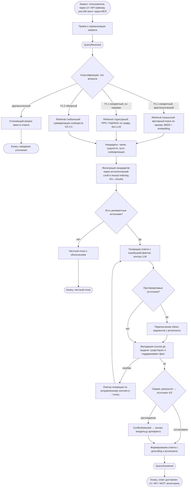

# Code — Поведение движка запросов (F1)

Описание поведения (уровень 4 C4) движка запросов — автомата обработки запроса к системе знаний (`F1. Генерация проверяемых ответов`, `specs/vision.md` §2.2). Показывает жизненный цикл от приёма запроса (пользователь через UI/API, ИИ-агент через MCP) до ответа с grounding и provenance: `QueryReceived → извлечение контекста → QueryAnswered`. Дополнительно описывает жизненный цикл сверки «результат ↔ источник» (K5): валидация ссылок до выдачи и полный контур конфликт-детекции (`ConflictDetected → OwnerSignalDelivered`).

> **Статус:** проект на этапе видения (Фаза 0), `src/` не содержит реализации. Диаграмма описывает **целевое состояние (`to be`/target)** и строится по референсам GraphRAG ([`.ai-factory/references/graphrag/`](../../.ai-factory/references/graphrag/INDEX.md)) и принятым ADR. Актуализируется до `as is` по фактическому коду после появления реализации в `src/`.

## Блок-схема алгоритма

## Контекст — что моделируется

- **Автомат обработки запроса** — жизненный цикл запроса в контейнере «Движок запросов» (F1). Начальное состояние — `QueryReceived` (вход через UI/API Gateway для людей или MCP-сервер для агентов, `container.md`); конечное — `QueryAnswered` (ответ со ссылками на артефакты).
- **Путь чтения — только из опубликованной версии индекса**: retrieval не обращается к GitLab/S3 и не ждёт фоновую переиндексацию; запросы обслуживаются из последнего опубликованного снапшота (`ADR-IMPL.DATA.incremental-update-snapshot-publish`, `REQ-NFR-api.performance.query-responsiveness`).
- **Гибридная композиция GraphRAG** — ядро retrieval: LightRAG (dual-level: low + high), PPR (HippoRAG-стиль) для ассоциативных запросов без LLM, PathRAG для компактного контекста, community summaries для глобальных запросов; KAG-принципы (mutual indexing, grounding, атрибуция) — точность (`ADR-DES.API.hybrid-graphrag-composition`, ПРИНЯТО).
- **Граница F1.1 / F1.2 — тип вопроса** (vision §2.2): конкретный вопрос о факте или месте в проекте vs обзорный вопрос о картине в целом. Полный контур обзорных вопросов — Фаза 2 (vision §2.6); в MVP — базовый контур.
- **Сверка «результат ↔ источник»** (K5) — два уровня: (1) валидация ссылок до выдачи (детерминированная проверка существования артефакта, обязательна, MVP); (2) полный контур конфликт-детекции — `ConsistencyChecker` публикует `ConflictDetected`, агрегат `Contradiction` в `artifact-traceability`, сигнал владельцу (Фаза 2, `domain/aggregates.md`, `domain/domain-events.md`).
- **Внешние системы — чёрные ящики**: контур LLM (генерация, оценка — Local), GitLab/S3 (источники; обращение — только по явному действию «открыть в источнике»).

## Жизненный цикл запроса

| Событие | Триггер | Производитель | Действие системы | Следующее состояние |
|---|---|---|---|---|
| `QueryReceived` | Запрос пользователя (UI/API) или ИИ-агента (MCP) | Вход F1 (движок запросов) | Нормализация, классификация типа вопроса | извлечение контекста |
| — | Классифицирован запрос | Движок запросов | Retrieval из опубликованной версии (local / structural / global) | кандидаты контекста |
| — | Кандидаты отфильтрованы | Движок запросов | Генерация ответа с атрибуцией фактов (контур LLM) | черновик ответа |
| — | Черновик сформирован | Движок запросов | Валидация ссылок, сверка «результат ↔ источник» (K5) | проверенный ответ |
| `QueryAnswered` | Ответ проверен и готов к доставке | Движок запросов | Публикация ответа с grounding и provenance; доставка через UI/API/MCP | пользователь/агент, мониторинг |
| `SecurityEventEmitted` | Аудит обращений / фильтрация утечек (политика аудита) | llm-contour (также MCP/Gateway для аудита) | Фиксация события безопасности (`LeakGuard`, панели аудита) | IT-безопасность, мониторинг |
| `ConflictDetected` | Расхождение «результат ↔ источник» при сверке (K5) | Сверка (query-answering) | Регистрация противоречия (агрегат `Contradiction`) | `OwnerSignalDelivered` |
| `OwnerSignalDelivered` | Противоречие зарегистрировано; требуется решение владельца | artifact-traceability | Доставка сигнала владельцу артефакта с доказательствами | решение владельца |
| `ChangeConfirmed` / `ChangeRejected` | Владелец подтвердил/отклонил предлагаемое изменение | Владелец артефакта (через UI) | Подтверждение: внесение изменения в источник → `DocumentIngested`; отклонение: противоречие остаётся открытым | artifact-traceability, corpus-ingestion |

> **Границы каскадов.** События `QueryReceived → QueryAnswered` и `QueryAnswered → SecurityEventEmitted` — путь ответа (F1, движок запросов). Каскад сверки `ConflictDetected → OwnerSignalDelivered → ChangeConfirmed/ChangeRejected` — полный контур K5 (Фаза 2), исполняется в `artifact-traceability` и замыкается обратной индексацией (`ChangeConfirmed → DocumentIngested`, `code-indexing-pipeline.md`); в MVP сверка ограничена валидацией ссылок до выдачи и перечислением противоречий с provenance (A2).

**Альтернативные потоки (референс: `UC-answers.grounding.cited-answer`):**

- **A1. Нет релевантных источников** — честный отказ с объяснением, а не галлюцинация.
- **A2. Противоречивые источники** — ответ перечисляет оба варианта с provenance; полный контур конфликт-детекции (`ConflictDetected`) — Фаза 2.
- **A3. Двусмысленный запрос** — уточняющий вопрос вместо ответа.

## Стадии алгоритма

### 1. Приём и нормализация запроса

- Запрос приходит от человека (UI/API Gateway) или ИИ-агента (MCP-сервер, после проверки политик Agent Gateway). `QueryReceived` — вход без собственных инвариантов; запрос не является агрегатом, чтение — вне доменной модели (CQRS, `domain/aggregates.md`).
- Нормализация: канал (UI/API/MCP), актор, текст запроса.

### 2. Классификация запроса

- Определяется тип вопроса — граница F1.1 (конкретный) / F1.2 (обзорный) (vision §2.2): тип вопроса, а не качество ответа.
- Двусмысленный запрос (A3) → уточняющий вопрос вместо генерации.
- Выбор режима retrieval: локальный (фактологический), структурный (со связями), глобальный (обзорный) — адаптивный роутинг ([05-design-guide.md](../../.ai-factory/references/graphrag/05-design-guide.md) §2.3; полный адаптивный роутинг — Фаза 2/3).

### 3. Retrieval из опубликованной версии

- Чтение только последней опубликованной версии индекса (граф, чанки, векторный индекс, суммаризации) из хранилища; без обращения к authoritative-источникам и без ожидания перестройки (`REQ-NFR-api.performance.query-responsiveness`).
- **Локальный**: векторный поиск по чанкам (embedding + BM25) — фактологические запросы.
- **Структурный**: PPR (HippoRAG-стиль) и PathRAG по графу — multi-hop, связи, ассоциативный поиск; **без LLM на этапе извлечения** ([03-algorithms.md](../../.ai-factory/references/graphrag/03-algorithms.md) §4, §12; [01-principles.md](../../.ai-factory/references/graphrag/01-principles.md) §7).
- **Глобальный**: суммаризации сообществ уровней C0–C1 — обзорные запросы (sensemaking) ([01-principles.md](../../.ai-factory/references/graphrag/01-principles.md) §4, §3.6).
- **Запрещён полный map-reduce Microsoft GraphRAG на каждый запрос** (`ADR-DES.API.hybrid-graphrag-composition`): глобальные запросы используют готовые суммаризации сообществ, а не итеративный пересчёт по всему корпусу.

### 4. Фильтрация кандидатов

- Кандидаты (чанки, сущности, пути, суммаризации) фильтруются через **онтологический слой** (резолвинг терминов, доменный сервис `TermResolver`) и **mutual indexing KG↔chunks** (KAG): отбрасываются кандидаты, не проходящие по онтологии и не имеющие обратной привязки к чанкам (`ADR-DES.API.hybrid-graphrag-composition`; glossary «Взаимная индексация»).
- Минимизация контекста: PathRAG-прунинг, relevance scoring — компактный контекст для локальных GPU и MCP (`REQ-NFR-api.performance.token-minimization`).
- Нет релевантных источников (A1) → честный отказ.

### 5. Генерация ответа с атрибуцией

- Контур LLM генерирует ответ с атрибуцией каждого факта на конкретные чанки и артефакты (grounding, provenance).
- **Grounding rules**: каждое утверждение, подкреплённое данными, ссылается на источник через `[Data: ...]`; не более 5 record ID в одной ссылке (`+more`); информация без подтверждающего источника не включается ([07-implementation-methodology.md](../../.ai-factory/references/graphrag/07-implementation-methodology.md) §4).
- Противоречивые источники (A2) → перечисление обоих вариантов с provenance.

### 6. Валидация ссылок до выдачи

- Каждая ссылка в ответе — реальный URL на артефакт GitLab/S3 (детерминированная проверка существования) и поддерживает факт (`REQ-NFR-api.compliance.rag-accuracy`; UC-answers.grounding.cited-answer, шаг 6).
- Ошибки валидации → повтор генерации по исправленному контексту или отказ; ответ без подтверждённых источников не публикуется (`BR-constraint.cited-answer`).

### 7. Сверка «результат ↔ источник» (K5)

- Доменный сервис `ConsistencyChecker` сверяет утверждения ответа с породившими источниками (`domain/aggregates.md`); результат — `ConsistencyVerdict` (согласовано / расхождение с evidence).
- При расхождении публикуется `ConflictDetected` → агрегат `Contradiction` (`artifact-traceability`) → `OwnerSignalDelivered` (сигнал владельцу артефакта) → `ChangeConfirmed` / `ChangeRejected` (контур «агент готовит — человек подтверждает», `REQ-NFR-process.compliance.human-confirmation`).
- **Полный контур сверки — Фаза 2** (vision §2.6, K5); в MVP — валидация ссылок (шаг 6) и перечисление противоречий с provenance (A2).

### 8. Публикация ответа

- Ответ формируется с grounding и provenance, привязан к версии индекса (`REQ-NFR-data.maintainability.versioned-provenance`): каждый ответ содержит происхождение, трассируемое до версии индекса и исходных артефактов.
- `QueryAnswered` доставляется пользователю (UI/API) или агенту (MCP); событие уходит в мониторинг (метрики).

## Режимы retrieval

| Режим | Что ищет | Тип запросов | Метод | Когда |
|---|---|---|---|---|
| **Локальный (Vector)** | Конкретные чанки, релевантные запросу | Фактологические (F1.1) | Embedding + BM25 | Lookup, конкретные вопросы |
| **Структурный (Graph)** | Пути/подграфы между сущностями | Multi-hop, со связями (F1.1) | PPR, PathRAG — без LLM | «Где реализована функция X?», связи «требование → реализация» |
| **Глобальный (Communities)** | Суммаризации сообществ C0–C1 | Обзорные, sensemaking (F1.2) | Community summaries | «Как устроен продукт?», темы и тренды |
| **Dual-level (LightRAG)** | Low-level (сущности/отношения) + high-level (темы) | Смешанные | Комбинация уровней | Ядро retrieval, базовый режим |
| **Агентный (ToG, GNN-RAG, GeAR)** | Итеративный обход графа LLM-агентом | Сложная логика | Beam search по KG | Фаза 2/3 (вне MVP) |

> Рекомендация референса — adaptive retrieval с тремя уровнями (local / structural / global) ([05-design-guide.md](../../.ai-factory/references/graphrag/05-design-guide.md) §2.3); полный адаптивный роутинг — Фаза 2/3.

## Ключевые параметры

| Параметр | Значение (целевое) | Обоснование / референс |
|---|---|---|
| Контекстное окно генерации | 8k токенов (эмпирически оптимально; «lost in the middle») | [07-implementation-methodology.md](../../.ai-factory/references/graphrag/07-implementation-methodology.md) §1.2 |
| Уровни сообществ для глобальных запросов | C0–C1; C1 — баланс качества и токен-стоимости | [01-principles.md](../../.ai-factory/references/graphrag/01-principles.md) §4 |
| Retrieval | Без LLM на этапе извлечения (PPR/PathRAG) | [05-design-guide.md](../../.ai-factory/references/graphrag/05-design-guide.md) §2.3, `REQ-NFR-api.performance.token-minimization` |
| Атрибуция | Grounding rules: `[Data: ...]`, ≤ 5 record ID, `+more` | [07-implementation-methodology.md](../../.ai-factory/references/graphrag/07-implementation-methodology.md) §4 |
| Точность RAG | ≥ 70% на утверждённом benchmark-наборе (RAGAS: faithfulness, answer relevancy; LLM-as-judge) | `REQ-NFR-api.compliance.rag-accuracy` |
| Валидация ссылок | Детерминированная проверка существования артефакта до выдачи | `REQ-NFR-api.compliance.rag-accuracy`, UC-answers.grounding.cited-answer |
| Оценка качества ответов | LLM-as-judge (5 реплик), Claimify (claims → comprehensiveness/diversity), Wilcoxon + Holm-Bonferroni | [07-implementation-methodology.md](../../.ai-factory/references/graphrag/07-implementation-methodology.md) §5 |
| Отзывчивость | Запросы не наблюдают «полусобранное» состояние; приоритет пользователя над фоновой переиндексацией | `REQ-NFR-api.performance.query-responsiveness` |

## Компоненты (целевые)

Пайплайн исполняется контейнером «Движок запросов» (F1) во взаимодействии с Ядром, Интеграциями и Хранилищем (`container.md`). Планируемые компоненты (документы уровня 3 — плановая работа):

| Стадия | Компонент (целевой) | Контейнер |
|---|---|---|
| Классификация, retrieval | Retrieval (dual-level, PathRAG, PPR) | Движок запросов |
| Генерация, grounding | Генерация, grounding/provenance | Движок запросов |
| Сверка «результат ↔ источник» | Сверка (ConsistencyChecker, K5) | Движок запросов |
| Онтологический резолвинг, фильтрация | Онтологический слой, граф знаний | Ядро |
| Клиент LLM, векторный поиск (HNSW) | LLM-клиент, CPU-компоненты | Интеграции |
| Чтение опубликованной версии | Граф, чанки, векторный индекс, суммаризации (Neo4j CE) | Хранилище графа и векторов |

## Соответствие референсам

| Стадия алгоритма | Референс |
|---|---|
| Retrieval-стратегии (local / structural / global / adaptive) | [05-design-guide.md](../../.ai-factory/references/graphrag/05-design-guide.md) §2.3 |
| Таксономия retrieval (типы, гранулярность, парадигмы) | [02-taxonomy.md](../../.ai-factory/references/graphrag/02-taxonomy.md) §II |
| Dual-level retrieval (LightRAG) | [03-algorithms.md](../../.ai-factory/references/graphrag/03-algorithms.md) §2 · [01-principles.md](../../.ai-factory/references/graphrag/01-principles.md) §7 |
| PPR / ассоциативные запросы (HippoRAG) | [03-algorithms.md](../../.ai-factory/references/graphrag/03-algorithms.md) §4 |
| PathRAG (компактный контекст, pruning) | [03-algorithms.md](../../.ai-factory/references/graphrag/03-algorithms.md) §12 |
| Глобальные запросы: сообщества C0–C3, map-reduce | [01-principles.md](../../.ai-factory/references/graphrag/01-principles.md) §3.6, §4 · [07-implementation-methodology.md](../../.ai-factory/references/graphrag/07-implementation-methodology.md) §3.3–3.4 |
| Grounding rules и атрибуция | [07-implementation-methodology.md](../../.ai-factory/references/graphrag/07-implementation-methodology.md) §4 |
| Оценка качества (LLM-as-judge, Claimify, метрики) | [07-implementation-methodology.md](../../.ai-factory/references/graphrag/07-implementation-methodology.md) §5 · [05-design-guide.md](../../.ai-factory/references/graphrag/05-design-guide.md) §4 |
| Агентные методы (ToG, GNN-RAG, G-Retriever) — Фаза 2/3 | [03-algorithms.md](../../.ai-factory/references/graphrag/03-algorithms.md) §6–8 |

## Примечания по соответствию

- **Статус `to be`/target**: проект на этапе видения, `src/` не содержит реализации; диаграмма описывает целевой автомат обработки запроса и актуализируется до `as is` по фактическому коду.
- **Запрещён полный map-reduce Microsoft GraphRAG на каждый запрос** и **LLM на этапе ассоциативного извлечения** (PPR-сценарии) — зафиксировано `ADR-DES.API.hybrid-graphrag-composition`.
- **Сверка K5**: полный контур (`ConflictDetected` → сигнал владельцу → подтверждение/отклонение) — Фаза 2; в MVP — валидация ссылок до выдачи и перечисление противоречий с provenance (A2, US-answers.grounding.cited-answer).
- **Полный контур обзорных вопросов (F1.2)** — Фаза 2 (vision §2.6); в MVP — базовый контур.
- **Точность ≥ 70%** — целевая метрика Фазы 1.5 (LLM-as-judge, RAGAS, benchmark K1/K4/K5/K17), не гарантия основного потока (UC-answers.grounding.cited-answer, целевые примечания).
- **Агентные методы** (ToG, GNN-RAG, G-Retriever, GraphSearch) — плановая работа Фаз 2/3; в MVP — детерминированный retrieval без LLM-агента на этапе извлечения.
- **Референсные Python-реализации** (microsoft/graphrag, LightRAG, HippoRAG, PathRAG) — источники для проектирования; продукт реализуется на Go (`ADR-IMPL.STACK.go-single-language-adoption`).

## Связанные артефакты

- [README C4-диаграмм](README.md) · [Container (уровень 2)](container.md) · [Context (уровень 1)](context.md) · [Пайплайн индексации (уровень 4)](code-indexing-pipeline.md)
- [Видение продукта](../vision.md) — F1, §2.4 (события), §2.5 (MVP), §2.6 (Фазы 1–2)
- [UC-answers.grounding.cited-answer](../use-cases/UC-answers.grounding.cited-answer.md) — каскад, альтернативные потоки A1–A3
- [US-answers.grounding.cited-answer](../user-stories/US-answers.grounding.cited-answer.md) — сценарии K1
- [Доменные события](../domain/domain-events.md) — `QueryReceived`, `QueryAnswered`, `ConflictDetected`
- [Агрегаты](../domain/aggregates.md) — `Answer`, сервис `ConsistencyChecker`, агрегат `Contradiction`
- [ADR-DES.API.hybrid-graphrag-composition](../adr/ADR-DES.API.hybrid-graphrag-composition.md) · [ADR-IMPL.DATA.incremental-update-snapshot-publish](../adr/ADR-IMPL.DATA.incremental-update-snapshot-publish.md) · [ADR-IMPL.DATA.graph-storage](../adr/ADR-IMPL.DATA.graph-storage.md)
- [REQ-NFR-api.compliance.rag-accuracy](../nonfun-req/REQ-NFR-api.compliance.rag-accuracy.md) · [REQ-NFR-api.performance.query-responsiveness](../nonfun-req/REQ-NFR-api.performance.query-responsiveness.md) · [REQ-NFR-api.performance.token-minimization](../nonfun-req/REQ-NFR-api.performance.token-minimization.md) · [REQ-NFR-data.maintainability.versioned-provenance](../nonfun-req/REQ-NFR-data.maintainability.versioned-provenance.md)
- [Референсы GraphRAG](../../.ai-factory/references/graphrag/INDEX.md)
