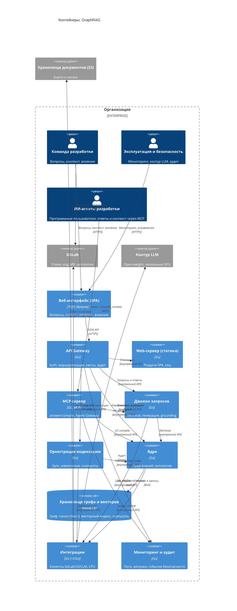

# Container — GraphRAG

Диаграмма контейнеров (уровень 2 C4) проекта **GraphRAG** — корпоративной системы знаний на базе ontology-grounded GraphRAG. Показывает крупные исполняемые блоки системы и их взаимодействие с внешними системами. Контейнеры C4 — логические исполняемые блоки (Go-сервисы/процессы) в защищённом контуре организации и **не эквивалентны Docker-контейнерам**.

> **Статус:** проект на этапе видения (Фаза 0), `src/` не содержит реализации. Диаграмма описывает **целевое состояние (`to be`/target)**. Контейнеры соответствуют канону функций F1–F4 (`specs/vision.md` §2.1–2.2) и плановой структуре модулей (`src/README.md`, `user-stories/README.md`). Технологии и протоколы между контейнерами — плановые, фиксируются ADR уровня `IMPL`.

## Диаграмма контейнеров

## Контекст — что моделируется

- **Границы контейнеров** соответствуют функциям F1–F4; механизмы (онтологический слой, контур LLM, инкрементальное обновление) — компоненты внутри контейнеров, а не отдельные контейнеры. **Agent Gateway и слой планирования** (`ADR-DES.API.agent-gateway-scheduling-layer`) — архитектурная граница внутри MCP-сервера, в MVP не выделяется в отдельный контейнер.
- **API Gateway** — единая HTTP-точка входа для людей (UI в браузере, прямой API, инструменты эксплуатации); внутренние сервисы (Движок запросов, Ядро, Оркестрация) не публикуются наружу напрямую; статика (SPA) — отдельный Web-сервер за гейтвеем (`/` → статика, `/api/*` → сервисы); MCP-сервер — отдельная точка входа для агентов (протокол MCP) (`ADR-DES.API.api-gateway-adoption`, ПРИНЯТО).
- **Инкрементальное обновление** — модель «инкрементальное обновление + версионные снапшоты + атомарная публикация» (`ADR-IMPL.DATA.incremental-update-snapshot-publish`): путь чтения обслуживает только опубликованные версии; сборка версий и очередь задач — в оркестрации индексации.
- **Хранилище** графа, чанков (текста), векторного индекса и версионных снапшотов выделено как `ContainerDb` внутри Ядра; решение — Neo4j (self-hosted, Community Edition), отдельный инстанс на проект + отдельный инстанс глобального слоя; чанки материализуются в индексе; версионные снапшоты — на уровне приложения (`ADR-IMPL.DATA.graph-storage`, ПРИНЯТО).
- **Внешние системы** — GitLab и контур LLM (внутри организации, вне системы), внешнее хранилище документов (S3, за границей организации); мониторинг и аудит — внутренний контейнер системы; книги и легаси — глобальный контекст (решение — `ADR-IMPL.INTEGRATION.s3-document-store`).
- **Персоны** — архетипы: команда разработки и эксплуатация (люди, внутри организации), ИИ-агенты — программные пользователи внутри организации; руководство (менеджер проекта, HR) — в примечаниях `context.md`. Полный список профилей — `vision.md` §3.1.
- **Контейнер C4 ≠ Docker-контейнер** — логические исполняемые блоки: Go-процессы/сервисы в защищённом контуре организации; веб-интерфейс (UI) — клиентское приложение в браузере.

## Контейнеры

| Контейнер | Тип | Технология | Назначение | Функции |
|---|---|---|---|---|
| Ядро | Приложение (сервис) | Go (планово) | Граф знаний, граф зависимостей артефактов, онтологический слой, компилятор контекста | F3 |
| Оркестрация пайплайнов индексации | Приложение (воркер) | Go (планово) | GitLab sync/ingest, S3 ingest, извлечение (вкл. RAPTOR/StructRAG для PDF), очередь задач, инкрементальное обновление, сборка и атомарная публикация версии индекса, пересчёт и суммаризация сообществ | F2 |
| Движок запросов | Приложение (сервис) | Go (планово) | Retrieval (dual-level, PathRAG, PPR), генерация ответов, grounding/provenance, сверка «результат ↔ источник» | F1 |
| MCP-сервер | Приложение (сервис) | Go (планово), MCP | Инструменты `answer`/`compile_context`, Agent Gateway (аутентификация, политики, квоты, бюджет), слой планирования (interactive/workflow/background), фильтрация утечек, аудит обращений | F4 |
| API Gateway | Приложение (сервис) | Go (планово) | Единая HTTP-точка входа для людей: аутентификация, авторизация, TLS, маршрутизация, rate limiting, квоты, аудит | инфраструктура (сквозное) |
| Web-сервер (статика) | Приложение (статическая раздача) | Go (планово) | Раздача SPA-ассетов: hashed-файлы с immutable-кэшем, `index.html` без кэша, SPA-fallback, сжатие; раздача из каталога независимого деплоя фронта | инфраструктура (сквозное) |
| Веб-интерфейс (UI) | Веб-приложение (SPA, в браузере) | TS/JS (планово); раздаётся Go-сервером | UI вопросов/ответов, статусы индексации, метрики, отчёты о влиянии; обращение к данным — через API Gateway | F1, F3 |
| Интеграции | Приложение (инфраструктура) | Go (+CGo) | GitLab-клиент, S3-клиент, LLM-клиент, CPU-компоненты (Leiden, HNSW, токенизатор) | инфраструктура |
| Мониторинг и аудит | Приложение (сервис) | Go (планово) | Сбор логов и метрик, события безопасности (`SecurityEventEmitted`), панели аудита | инфраструктура (сквозное) |
| Хранилище графа и векторного индекса | Хранилище данных | Neo4j CE self-hosted (`ADR-IMPL.DATA.graph-storage`) | Граф знаний, чанки (текст и координаты), векторный индекс, индексы артефактов, версионные снапшоты | F1–F3 |

## Компоненты по контейнерам (плановые)

| Контейнер | Планируемые компоненты | Документ уровня 3 |
|---|---|---|
| Ядро | Граф знаний, ArtifactGraph, онтологический слой, компилятор контекста | `component-core.md` |
| Оркестрация пайплайнов индексации | GitLab sync/ingest, S3 ingest, извлечение (RAPTOR/StructRAG для PDF), очередь задач, инкрементальное обновление, сборка и атомарная публикация версии, пересчёт сообществ и суммаризации | `component-indexing.md` |
| Движок запросов | Retrieval (dual-level, PathRAG, PPR), генерация, grounding/provenance, сверка | `component-query.md` |
| MCP-сервер | MCP-инструменты, Agent Gateway (аутентификация, политики, квоты, бюджет), слой планирования (interactive/workflow/background), компиляция контекста, фильтрация утечек и аудит | `component-mcp.md` |
| API Gateway | Маршрутизация, политики (authN/authZ, rate limiting, квоты), аудит, TLS-терминация | `component-api-gateway.md` |
| Web-сервер (статика) | Раздача hashed-ассетов, кэш-заголовки (immutable / no-cache index.html), SPA-fallback, сжатие | `component-web-server.md` |
| Веб-интерфейс | SPA-компоненты UI (вопросы/ответы, статусы, метрики, отчёты о влиянии), клиент API Gateway | `component-ui.md` |
| Интеграции | GitLab-клиент, S3-клиент, LLM-клиент, CPU-компоненты | `component-integrations.md` |
| Мониторинг и аудит | Сбор логов и метрик, события безопасности (`SecurityEventEmitted`), панели аудита | `component-monitoring.md` |

## Взаимодействия и интерфейсы

| От | К | Назначение | Протокол / канал |
|---|---|---|---|
| Веб-интерфейс (SPA) | API Gateway | JSON API-запросы (вопросы, статусы, метрики, влияние) | HTTPS (планово) |
| API Gateway | Движок запросов | Запросы и ответы | Внутренний API (планово) |
| API Gateway | Ядро | Анализ влияния, компиляция контекста | Внутренний API (планово) |
| API Gateway | Оркестрация | Статусы индексации | Внутренний API (планово) |
| API Gateway | Web-сервер (статика) | Раздача SPA (`/`) | Внутренний API (планово) |
| MCP-сервер | Движок запросов | UC-answer (F1); после планирования и проверки политик Agent Gateway | Внутренний API (планово) |
| MCP-сервер | Ядро | UC-compile_context (F3); после планирования и проверки политик Agent Gateway | Внутренний API (планово) |
| Движок запросов | Ядро | Retrieval по графу и индексу | Внутренний API (планово) |
| Оркестрация | Ядро | Инкрементальное обновление графа | Внутренний API (планово) |
| Движок запросов / Ядро / Оркестрация | Интеграции | Клиенты и CPU-компоненты | Внутренний API (планово) |
| Ядро | Хранилище | Чтение опубликованной версии; запись при сборке/публикации | Bolt (Neo4j) |
| Интеграции | GitLab | Спеки, код, MR, онтология | Git API / MR / webhook |
| Интеграции | Внешнее хранилище (S3) | Книги и легаси | S3 API / события / сверка |
| Интеграции | Контур LLM | Извлечение, генерация, оценка, резолвинг | Local |
| MCP-сервер | Мониторинг и аудит | `SecurityEventEmitted` | Логи |
| API Gateway | Мониторинг и аудит | Журнал аудита обращений | Логи (планово) |
| ИИ-агенты | MCP-сервер | `answer` / `compile_context` (все обращения — через Agent Gateway) | MCP |

## Внешние системы

| Система | Назначение | Канал |
|---|---|---|
| GitLab | Эталонный источник: спеки, код, MR; репозиторий модели предметной области (онтология) | Git API / MR / webhook |
| Внешнее хранилище документов (S3) | Книги и унаследованные документы (глобальный контекст) | S3 API / события / периодическая сверка |
| Контур LLM | Open-weight модели на локальных GPU | Local |

## Инфраструктура

- **Контур развёртывания** — защищённый периметр организации; контейнеры — логические Go-процессы/сервисы; форма развёртывания MVP — **Docker Compose** (однохостовой контур, решение 2026-08-30, `ADR-DES.INFRA.container-composition`); рост — горизонтальное масштабирование воркеров индексации (Фаза 2/3).
- **Веб-интерфейс** — SPA в браузере (TS/JS); раздача статики — отдельный Go-статик-сервер за API Gateway (hashed-ассеты с immutable-кэшем, `index.html` без кэша, SPA-fallback).
- **Контур LLM** — локальные GPU, open-weight модели (NFR-SEC-1); данные разработки не покидают периметр.
- **CPU-компоненты** (Leiden, HNSW, токенизатор) — нативный код через CGo к зрелым C-библиотекам (RULES.md).
- **Хранилище** — Neo4j (self-hosted, Community Edition): граф, чанки (текст) и нативный векторный индекс (HNSW) в одном движке; отдельный инстанс на проект + отдельный инстанс глобального слоя (в CE — одна БД на инстанс); версионные снапшоты и атомарная публикация — на уровне приложения (`ADR-IMPL.DATA.graph-storage`).

## Примечания по соответствию

- **Статус `to be`/target**: проект на этапе видения (Фаза 0), `src/` не содержит реализации; диаграмма описывает целевую архитектуру и актуализируется до `as-is` по фактическому коду.
- **Технологии и протоколы — плановые**: принятые ADR фиксируют: Go как единый язык (`ADR-IMPL.STACK.go-single-language-adoption`); тип GraphRAG — гибридная композиция (`ADR-DES.API.hybrid-graphrag-composition`); источник книг/легаси — внешнее S3 (`ADR-IMPL.INTEGRATION.s3-document-store`); модель обновления — инкрементальное обновление с версионными снапшотами и атомарной публикацией (`ADR-IMPL.DATA.incremental-update-snapshot-publish`); изоляция агентских нагрузок — Agent Gateway и слой планирования (`ADR-DES.API.agent-gateway-scheduling-layer`); хранилище — Neo4j (self-hosted CE) (`ADR-IMPL.DATA.graph-storage`); HTTP-вход — API Gateway + Web-сервер статики (`ADR-DES.API.api-gateway-adoption`). Протоколы между контейнерами фиксируются ADR уровня `IMPL`.
- **Контур LLM — чёрный ящик**: на уровне контейнеров показывается только внешний контракт (Local); фильтрация утечек и аудит (NFR-SEC-1) — уровни 3–4 и ADR.
- **Мониторинг и аудит — внутренний контейнер**: сбор логов и метрик, события безопасности (`SecurityEventEmitted`), панели аудита; потребители — эксплуатация (через UI/API Gateway), MCP-сервер и API Gateway передают события.
- **F4 — канал, а не функция-механизм**: MCP-сервер — канал доступа к F1/F3 для ИИ-агентов; актуализация базы знаний (F2) через MCP не исполняется (граница F4, vision §2.2).
- **Agent Gateway — граница внутри MCP-сервера**: агенты не ходят напрямую во внутренние сервисы; шлюз (аутентификация, политики, квоты, бюджет) и слой планирования (режимы interactive/workflow/background, приоритет пользователей над агентами) — компоненты MCP-сервера в MVP; при росте workflow слой планирования может эволюционировать в отдельный сервис-оркестратор (критерий пересмотра ADR).
- **API Gateway — HTTP-вход для людей; MCP-сервер — вход для агентов**: разделение по протоколу (HTTPS vs MCP) и классу нагрузки; API Gateway не обслуживает MCP (`ADR-DES.API.api-gateway-adoption`, ПРИНЯТО).
- **UI — клиентский слой в браузере**: тонкий SPA (TS/JS) вне серверной Go-кодовой базы — граница `ADR-IMPL.STACK.go-single-language-adoption` («вся кодовая база — Go» относится к серверным компонентам; уточнение зафиксировано в `ADR-DES.API.api-gateway-adoption`).
- **Границы**: GraphRAG — не источник правды; Confluence исключён; fine-tuning и real-time обновление графа — вне рамок (vision §2.7).

## Связанные артефакты

- [README C4-диаграмм](README.md)
- [System Context (уровень 1)](context.md)
- [Видение продукта](../vision.md)
- [Глоссарий](../glossary.md)
- [Архитектурные решения (ADR)](../adr/README.md)
