# Container — GraphRAG

Диаграмма контейнеров (уровень 2 C4) проекта **GraphRAG** — корпоративной системы знаний на базе ontology-grounded GraphRAG. Показывает крупные исполняемые блоки системы и их взаимодействие с внешними системами. Контейнеры C4 — логические исполняемые блоки (Go-сервисы/процессы) в защищённом контуре организации и **не эквивалентны Docker-контейнерам**.

> **Статус:** проект на этапе видения (Фаза 0), `src/` не содержит реализации. Диаграмма описывает **целевое состояние (`to be`/target)**. Контейнеры соответствуют канону функций F1–F4 (`specs/vision.md` §2.1–2.2) и плановой структуре модулей (`src/README.md`, `user-stories/README.md`). Технологии и протоколы между контейнерами — плановые, фиксируются ADR уровня `IMPL`.

## Диаграмма контейнеров

```mermaid
C4Container
    title Контейнеры: GraphRAG

    Person(team, "Команда разработки", "Вопросы, контекст генерации, анализ влияния; создание артефактов через GitLab MR")
    Person(ops, "Эксплуатация и безопасность", "Мониторинг актуальности, управление контуром LLM, аудит")
    Person(agents, "ИИ-агенты автоматизации разработки", "Программные пользователи: ответы и контекст через MCP")

    System_Boundary(graphrag, "GraphRAG") {
        Container(ui, "Веб-интерфейс", "Go (планово)", "Вопросы и ответы, статусы индексации, метрики, отчёты о влиянии")
        Container(mcp, "MCP-сервер", "Go (планово), протокол MCP", "Инструменты answer и compile_context, фильтрация утечек, аудит")
        Container(query, "Query Engine", "Go (планово)", "Retrieval (dual-level, PathRAG, PPR), генерация ответов, grounding/provenance")
        Container(indexing, "Оркестрация пайплайнов индексации", "Go (планово)", "GitLab sync, S3 ingest, извлечение, инкрементальное обновление, сообщества")
        Container(core, "Ядро", "Go (планово)", "Граф знаний, ArtifactGraph, онтологический слой, компилятор контекста")
        ContainerDb(store, "Хранилище графа и векторного индекса", "TBD — ADR-IMPL.DATA.graph-storage", "Граф знаний, векторный индекс, индексы артефактов")
        Container(integrations, "Интеграции", "Go (+CGo)", "GitLab-клиент, S3-клиент, LLM-клиент, CPU-компоненты (Leiden, HNSW, токенизатор)")
    }

    System_Ext(gitlab, "GitLab", "Эталонный источник: спеки, код, MR; репозиторий модели предметной области")
    System_Ext(store, "Внешнее хранилище документов (S3)", "Книги и легаси (глобальный контекст)")
    System_Ext(llm, "Контур LLM", "Open-weight модели на локальных GPU")
    System_Ext(monitoring, "Мониторинг и аудит", "Логи и панели событий безопасности")

    Rel(team, ui, "Вопросы, контекст, анализ влияния", "HTTPS (планово)")
    Rel(team, gitlab, "Создание и изменение артефактов (спеки, код, архитектура, модель)", "MR / Git")
    Rel(ops, ui, "Мониторинг актуальности, управление контуром", "HTTPS (планово)")
    Rel(ops, monitoring, "Аудит обращений", "панели")
    Rel(agents, mcp, "answer / compile_context", "MCP")

    Rel(ui, query, "Запросы и ответы", "внутренний API (планово)")
    Rel(ui, indexing, "Статусы индексации", "внутренний API (планово)")
    Rel(ui, core, "Анализ влияния, компиляция контекста", "внутренний API (планово)")
    Rel(mcp, query, "UC-answer: генерация ответа", "внутренний API (планово)")
    Rel(mcp, core, "UC-compile: компиляция контекста", "внутренний API (планово)")
    Rel(query, core, "Retrieval по графу и индексу", "внутренний API (планово)")
    Rel(indexing, core, "Инкрементальное обновление графа", "внутренний API (планово)")
    Rel(core, store, "Чтение и запись", "TBD")
    Rel(query, integrations, "LLM-клиент, HNSW, токенизатор", "внутренний API (планово)")
    Rel(indexing, integrations, "GitLab-клиент, S3-клиент, LLM-клиент", "внутренний API (планово)")
    Rel(core, integrations, "Leiden, HNSW, токенизатор", "внутренний API (планово)")
    Rel(integrations, gitlab, "Спеки, код, MR, онтология", "Git API / MR / webhook")
    Rel(integrations, store, "Книги и легаси", "S3 API / события / сверка")
    Rel(integrations, llm, "Извлечение, генерация, оценка, резолвинг", "Local")
    Rel(mcp, monitoring, "SecurityEventEmitted", "логи")

    UpdateLayoutConfig($c4ShapeInRow="3", $c4BoundaryInRow="2")
```

## Контекст — что моделируется

- **Границы контейнеров** соответствуют функциям F1–F4; механизмы (онтологический слой, контур LLM, инкрементальное обновление) — компоненты внутри контейнеров, а не отдельные контейнеры.
- **Хранилище** графа и векторного индекса выделено как `ContainerDb` внутри Ядра; технология — открытый вопрос (`ADR-IMPL.DATA.graph-storage`).
- **Внешние системы** — GitLab, внешнее хранилище документов (S3), контур LLM, мониторинг и аудит; книги и легаси — глобальный контекст (решение — `ADR-IMPL.INTEGRATION.s3-document-store`).
- **Персоны** — архетипы: команда разработки, эксплуатация и безопасность, ИИ-агенты; руководство (менеджер проекта, HR) — в примечаниях `context.md`. Полный список профилей — `vision.md` §3.1.
- **Контейнер C4 ≠ Docker-контейнер** — логические Go-процессы/сервисы в защищённом контуре организации.

## Контейнеры

| Контейнер | Тип | Технология | Назначение | Функции |
|---|---|---|---|---|
| Ядро | Приложение (сервис) | Go (планово) | Граф знаний, граф зависимостей артефактов, онтологический слой, компилятор контекста | F3 |
| Оркестрация пайплайнов индексации | Приложение (воркер) | Go (планово) | GitLab sync/ingest, S3 ingest, извлечение сущностей/связей, инкрементальное обновление, пересчёт сообществ | F2 |
| Query Engine | Приложение (сервис) | Go (планово) | Retrieval (dual-level, PathRAG, PPR), генерация ответов, grounding/provenance, сверка «результат ↔ источник» | F1 |
| MCP-сервер | Приложение (сервис) | Go (планово), MCP | Инструменты `answer`/`compile_context`, фильтрация утечек, аудит обращений | F4 |
| Веб-интерфейс | Веб-приложение | Go (планово) | UI вопросов/ответов, статусы индексации, метрики, отчёты о влиянии | F1, F3 |
| Интеграции | Приложение (инфраструктура) | Go (+CGo) | GitLab-клиент, S3-клиент, LLM-клиент, CPU-компоненты (Leiden, HNSW, токенизатор) | инфраструктура |
| Хранилище графа и векторного индекса | Хранилище данных | TBD (`ADR-IMPL.DATA.graph-storage`) | Граф знаний, векторный индекс, индексы артефактов | F1–F3 |

## Компоненты по контейнерам (плановые)

| Контейнер | Планируемые компоненты | Документ уровня 3 |
|---|---|---|
| Ядро | Граф знаний, ArtifactGraph, онтологический слой, компилятор контекста | `component-core.md` |
| Оркестрация пайплайнов индексации | GitLab sync/ingest, S3 ingest, извлечение, инкрементальное обновление, пересчёт сообществ | `component-indexing.md` |
| Query Engine | Retrieval (dual-level, PathRAG, PPR), генерация, grounding/provenance, сверка | `component-query.md` |
| MCP-сервер | MCP-инструменты, компиляция контекста, фильтрация утечек и аудит | `component-mcp.md` |
| Веб-интерфейс | UI вопросов/ответов, статусы, метрики, отчёты о влиянии | `component-ui.md` |
| Интеграции | GitLab-клиент, S3-клиент, LLM-клиент, CPU-компоненты | `component-integrations.md` |

## Взаимодействия и интерфейсы

| От | К | Назначение | Протокол / канал |
|---|---|---|---|
| Веб-интерфейс | Query Engine | Запросы и ответы | Внутренний API (планово) |
| Веб-интерфейс | Ядро | Анализ влияния, компиляция контекста | Внутренний API (планово) |
| Веб-интерфейс | Оркестрация | Статусы индексации | Внутренний API (планово) |
| MCP-сервер | Query Engine | UC-answer (F1) | Внутренний API (планово) |
| MCP-сервер | Ядро | UC-compile_context (F3) | Внутренний API (планово) |
| Query Engine | Ядро | Retrieval по графу и индексу | Внутренний API (планово) |
| Оркестрация | Ядро | Инкрементальное обновление графа | Внутренний API (планово) |
| Query / Ядро / Оркестрация | Интеграции | Клиенты и CPU-компоненты | Внутренний API (планово) |
| Ядро | Хранилище | Чтение и запись | TBD |
| Интеграции | GitLab | Спеки, код, MR, онтология | Git API / MR / webhook |
| Интеграции | Внешнее хранилище (S3) | Книги и легаси | S3 API / события / сверка |
| Интеграции | Контур LLM | Извлечение, генерация, оценка, резолвинг | Local |
| MCP-сервер | Мониторинг и аудит | `SecurityEventEmitted` | Логи |
| ИИ-агенты | MCP-сервер | `answer` / `compile_context` | MCP |

## Внешние системы

| Система | Назначение | Канал |
|---|---|---|
| GitLab | Эталонный источник: спеки, код, MR; репозиторий модели предметной области (онтология) | Git API / MR / webhook |
| Внешнее хранилище документов (S3) | Книги и унаследованные документы (глобальный контекст) | S3 API / события / периодическая сверка |
| Контур LLM | Open-weight модели на локальных GPU | Local |
| Мониторинг и аудит | Фиксация событий безопасности контура LLM | Логи / панели |

## Инфраструктура

- **Контур развёртывания** — защищённый периметр организации; контейнеры — логические Go-процессы/сервисы (форма развёртывания — Docker/системные сервисы — не зафиксирована).
- **Контур LLM** — локальные GPU, open-weight модели (NFR-SEC-1); данные разработки не покидают периметр.
- **CPU-компоненты** (Leiden, HNSW, токенизатор) — нативный код через CGo к зрелым C-библиотекам (RULES.md).
- **Хранилище** — технология графа и векторного индекса — открытый вопрос (кандидат `ADR-IMPL.DATA.graph-storage`).

## Примечания по соответствию

- **Статус `to be`/target**: проект на этапе видения (Фаза 0), `src/` не содержит реализации; диаграмма описывает целевую архитектуру и актуализируется до `as-is` по фактическому коду.
- **Технологии и протоколы — плановые**: зафиксированы только Go как единый язык (`ADR-IMPL.STACK.go-single-language-adoption`) и тип GraphRAG — гибридная композиция (`ADR-DES.API.hybrid-graphrag-composition`). Протоколы между контейнерами и хранилище фиксируются ADR уровня `IMPL`.
- **Контур LLM — чёрный ящик**: на уровне контейнеров показывается только внешний контракт (Local); фильтрация утечек и аудит (NFR-SEC-1) — уровни 3–4 и ADR.
- **F4 — канал, а не функция-механизм**: MCP-сервер — канал доступа к F1/F3 для ИИ-агентов; актуализация базы знаний (F2) через MCP не исполняется (граница F4, vision §2.2).
- **Границы**: GraphRAG — не источник правды; Confluence исключён; fine-tuning и real-time обновление графа — вне рамок (vision §2.7).

## Связанные артефакты

- [README C4-диаграмм](README.md)
- [System Context (уровень 1)](context.md)
- [Видение продукта](../vision.md)
- [Глоссарий](../glossary.md)
- [Архитектурные решения (ADR)](../adr/README.md)
