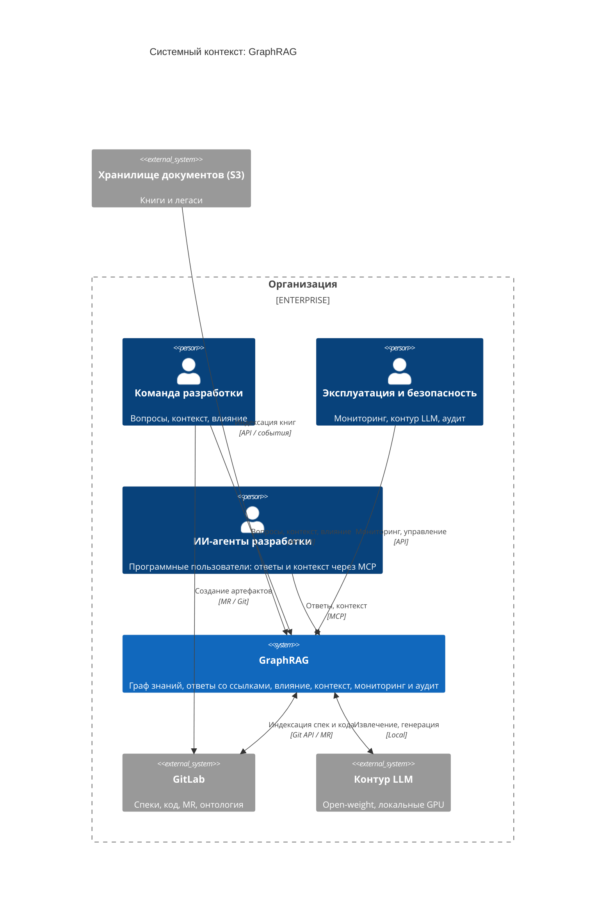

# System Context — GraphRAG

Диаграмма системного контекста (уровень 1 C4) проекта **GraphRAG** — корпоративной системы знаний на базе ontology-grounded GraphRAG (evidence-based context layer / context compiler для ИИ-агентов автоматизации разработки). Показывает систему как единый блок в центре, окружённый пользователями (персонами) и внешними системами, с которыми она взаимодействует. Фокус — люди и программные системы, а не технологии и протоколы.

> **Статус:** проект на этапе видения (Фаза 0, `vision.md` §2.6); `src/` не содержит реализации. Диаграмма описывает **целевое состояние (`to be`/target)**. Источники — `specs/vision.md` §3.3 (канонический контекст) и §2.8 (внешние зависимости).

## Краткое описание

**GraphRAG** — инструмент создания экспертной системы знаний: индексирует корпус (спеки и код из GitLab, книги и легаси из внешнего хранилища) в граф знаний и отвечает на вопросы со ссылками на артефакты, вместо сырого текста и ручных переспросов.

## Развёрнутое описание

GraphRAG — слой проверяемого контекста (evidence-based context layer) и компилятор контекста для ИИ-агентов автоматизации разработки (AI Factory, Hand-off). Два режима: (1) проверяемые ответы команде по спецификациям и коду со ссылками на артефакты и происхождением (F1); (2) контекстный режим для ИИ-агентов — точный набор артефактов и фактов под задачу через MCP (F3, F4). Онтологический слой (машинно-читаемая модель предметной области) — механизм резолвинга запросов и минимизации контекста внутри F1/F3. Система разворачивается в защищённом контуре организации на локальных GPU с open-weight моделями (REQ-NFR-security.compliance.llm-contour): данные разработки (код, спеки, ПДн) не покидают периметр.

## Диаграмма системного контекста

## Контекст — что моделируется

- **Система** — GraphRAG как единый блок; внутренняя структура (контейнеры, компоненты) — уровни 2–3 (`container.md`, `component-*.md`).
- **Акторы** — архетипы пользователей: команда разработки и эксплуатация (люди, внутри организации), ИИ-агенты — программные пользователи внутри организации (через MCP). Полный список профилей — `vision.md` §3.1.
- **Внешние системы** — GitLab и контур LLM (внутри организации, вне системы), внешнее хранилище документов (S3, за границей организации); мониторинг и аудит — внутренняя функция системы (уровень 2).
- **Границы** — защищённый контур организации. GraphRAG — не источник правды (единый источник — репозиторий спек и кода), не чат-бот и не поисковая строка; Confluence исключён (vision §2.7).

## Персоны (архетипы)

Роли сгруппированы в архетипы по каналу доступа и режиму взаимодействия; полный список профилей — `vision.md` §3.1.

| Архетип | Профили (vision §3.1) | Тип | Ценность | Ключевые функции | Канал |
|---|---|---|---|---|---|
| **Команда разработки** | Разработчик, Тестировщик, Аналитик (в команде и вне), Архитектор | Человек | Проверяемые ответы по продукту, спекам и коду; контекст генерации; анализ влияния; трассировка | F1, F3 | API / UI |
| **Эксплуатация и безопасность** | Администратор системы, IT-безопасность | Человек | Управление контуром LLM; мониторинг актуальности; аудит; фильтрация утечек | F2, REQ-NFR-security.compliance.llm-contour | API + логи/панели |
| **Руководство** (в примечаниях) | Менеджер проекта, HR | Человек | Статусы из данных; цепочки артефактов; онбординг | F1, F3 | UI (косвенно) |
| **ИИ-агенты автоматизации разработки** | ИИ-агенты автоматизации разработки | Программный | Ответы и контекст под задачу вместо сырого текста | F4, F3 | MCP |

> Архетипы отражают единообразный вход: производство артефактов — только через GitLab (MR) и внешнее хранилище (S3); потребление — через UI/API (люди) и MCP (агенты). Отдельная роль загрузчика документов не нужна — книги индексируются автоматически (F2.2).

## Функции системы

| Функция | Описание | Персоны |
|---|---|---|
| F1. Генерация проверяемых ответов | Ответы на конкретные вопросы со ссылками на артефакты и происхождением; синтез обзорных ответов | Команда разработки; Руководство (косвенно, HR-онбординг) |
| F2. Индексация источников знаний | Автоиндексация изменений GitLab; индексация книг из внешнего хранилища; инкрементальное обновление графа | Команда разработки (бенефициар); Эксплуатация и безопасность (управление) |
| F3. Оптимизация контекста | Анализ влияния изменений артефакта; компиляция контекста (JSON) для генерации | Команда разработки, ИИ-агенты |
| F4. Доставка ответов и контекста через MCP | Стандартный доступ ИИ-агентов к ответам и контексту | ИИ-агенты |

## Пользовательские путешествия

Ключевые путешествия по функциям F1–F4 (детализация — в UC/US; полный список кейсов K1–K24 — `.ai-factory/RESEARCH.md`):

1. **Ответ со ссылками на артефакты (F1.1, P0)** — Команда разработки: вопрос по спеку/коду → GraphRAG извлекает контекст из графа знаний → ответ со ссылками на артефакты и происхождением → проверка источника. `UC-answers.grounding.cited-answer`, `US-answers.grounding.cited-answer`.
2. **Автоиндексация GitLab (F2.1, P0)** — GitLab: MR → webhook → GraphRAG: `DocumentIngested` → извлечение → `GraphUpdated` → ответы опираются на актуальную версию источника. `UC-knowledge.sync.gitlab-index`, `US-knowledge.sync.gitlab-index`.
3. **Анализ влияния изменения (F3.1, P0)** — Команда разработки: изменение артефакта → `InfluenceComputed` → детерминированный список связанных артефактов → постановка задачи. `UC-context.impact.analyze`, `US-context.impact.analyze`.
4. **Контекст для ИИ-агента (F4, P0)** — ИИ-агент: запрос через MCP → компиляция контекста (`ContextCompiled`) → точный набор артефактов и фактов под задачу вместо сырого текста. `UC-mcp.compile.context`, `US-mcp.compile.context`.
5. **Индексация книг из внешнего хранилища (F2.2, P1)** — событие бакета / периодическая сверка → RAPTOR/StructRAG-обработка → глобальные знания доступны в системе. `US-knowledge.ingest.s3` (планируется).
6. **Компиляция контекста для генерации (F3.2, P1)** — Команда разработки/агент: создание или изменение артефакта → JSON-объект из связанных артефактов с направлениями связей → генерация по полному, но сфокусированному контексту. `UC-context.build.generate`, `US-context.build.generate`.

## Внешние системы и зависимости

| Система | Тип | Описание | Интеграция | Назначение |
|---|---|---|---|---|
| GitLab | Внешняя система (репозиторий) | Эталонный источник: спеки, код, MR, владельцы артефактов; репозиторий модели предметной области (онтология) | Git API / MR / webhook | Источник корпуса и триггеры индексации; поставка исходной модели предметной области (допущение A4, vision §2.8) |
| Внешнее хранилище документов | Внешняя система (объектное хранилище, S3) | Книги и унаследованные документы (глобальный контекст) | API / события / периодическая сверка | Источник глобального контекста (F2.2); решение — ADR-IMPL.INTEGRATION.s3-document-store |
| Контур LLM | Внешняя система (исполнение моделей) | Open-weight модели на локальных GPU | Local | Извлечение, генерация, оценка (REQ-NFR-security.compliance.llm-contour) |

## Примечания по соответствию

- **Статус `to be`/target**: проект на этапе видения (Фаза 0), `src/` не содержит реализации. Диаграмма описывает целевую архитектуру; после появления кода актуализируется до `as-is` (код — источник истины).
- **Источник**: канонический контекст — `specs/vision.md` §3.3; диаграмма расходится с §3.3: роли сгруппированы в архетипы (полные профили — vision §3.1), добавлены внешние зависимости из §2.8 (внешнее хранилище документов); расхождения по отдельным элементам — см. ниже.
- **Ролевая модель — архетипы**: 8 персон сгруппированы в 3 архетипа (команда разработки, эксплуатация и безопасность, руководство — в примечаниях) + ИИ-агенты. Обоснование: единообразный вход — производство артефактов только через GitLab (MR) и внешнее хранилище (S3), потребление через UI/API и MCP; аналитик без отдельной роли (PDF-загрузка автоматизирована через S3, F2.2). Маппинг архетипов на профили — раздел «Персоны».
- **Книги и легаси — из внешнего хранилища документов (S3)**: источник глобального контекста (отдельный граф с ассоциацией проектных сущностей); индексация автоматическая — события + периодическая сверка; прямой ручной ввод отсутствует (решение — `ADR-IMPL.INTEGRATION.s3-document-store`).
- **Контур LLM — чёрный ящик**: на уровне контекста показывается только внешний контракт (Local); детали контура, фильтрация утечек и аудит (REQ-NFR-security.compliance.llm-contour) — уровни 2–3 и ADR.
- **Мониторинг и аудит — внутренняя функция GraphRAG**: сбор событий безопасности (`SecurityEventEmitted`) и аудит обращений — контейнер уровня 2 (`container.md`); на уровне контекста не показывается как внешняя система.
- **ИИ-агенты — программные пользователи внутри организации**: автоматизация разработки (агенты, конвейеры) работает в контуре организации; доступ к GraphRAG — только через MCP (граница F4, vision §2.2).
- **Каналы**: MCP — целевой интерфейс для ИИ-агентов (граница F4, vision §2.2); актуализация базы знаний (F2) через MCP не исполняется — она детерминированная и приходит из GitLab и внешнего хранилища документов.
- **Границы**: GraphRAG — не источник правды, не чат-бот и не поисковая строка; Confluence исключён; fine-tuning и real-time обновление графа — вне рамок (vision §2.7).

## Связанные артефакты

- [README C4-диаграмм](README.md)
- [Видение продукта](../vision.md) — §3.3 (контекст), §2.8 (зависимости), §2.4 (события)
- [Глоссарий](../glossary.md)
- [Прецеденты использования](../use-cases/README.md)
- [Пользовательские истории](../user-stories/README.md)
- [Архитектурные решения (ADR)](../adr/README.md)
