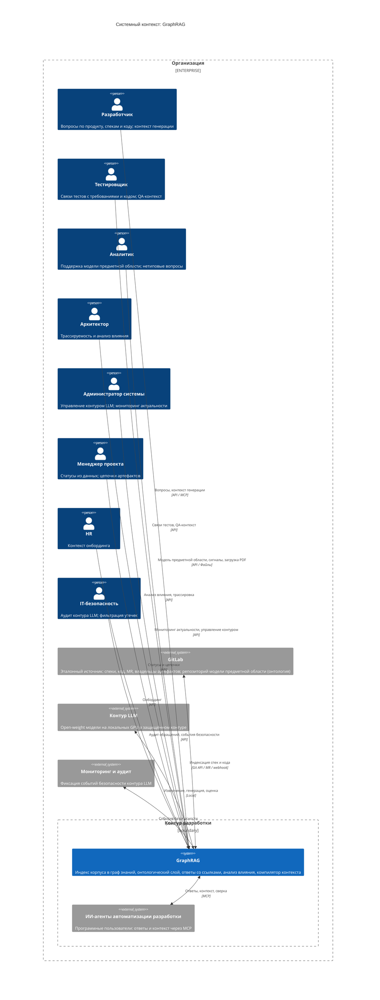

# System Context — GraphRAG

Диаграмма системного контекста (уровень 1 C4) проекта **GraphRAG** — корпоративной системы знаний на базе ontology-grounded GraphRAG (evidence-based context layer / context compiler для ИИ-агентов автоматизации разработки). Показывает систему как единый блок в центре, окружённый пользователями (персонами) и внешними системами, с которыми она взаимодействует. Фокус — люди и программные системы, а не технологии и протоколы.

> **Статус:** проект на этапе видения (Фаза 0, `vision.md` §2.6); `src/` не содержит реализации. Диаграмма описывает **целевое состояние (`to be`/target)**. Источники — `specs/vision.md` §3.3 (канонический контекст) и §2.8 (внешние зависимости).

## Краткое описание

**GraphRAG** — инструмент создания экспертной системы знаний: индексирует корпус (спеки и код из GitLab, PDF-документы) в граф знаний и отвечает на вопросы со ссылками на артефакты, вместо сырого текста и ручных переспросов.

## Развёрнутое описание

GraphRAG — слой проверяемого контекста (evidence-based context layer) и компилятор контекста для ИИ-агентов автоматизации разработки (AI Factory, Hand-off). Два режима: (1) проверяемые ответы команде по спецификациям и коду со ссылками на артефакты и происхождением (F1); (2) контекстный режим для ИИ-агентов — точный набор артефактов и фактов под задачу через MCP (F3, F4). Онтологический слой (машинно-читаемая модель предметной области) — механизм резолвинга запросов и минимизации контекста внутри F1/F3. Система разворачивается в защищённом контуре организации на локальных GPU с open-weight моделями (REQ-NFR-security.compliance.llm-contour): данные разработки (код, спеки, ПДн) не покидают периметр.

## Диаграмма системного контекста

## Контекст — что моделируется

- **Система** — GraphRAG как единый блок; внутренняя структура (контейнеры, компоненты) — уровни 2–3 (`container.md`, `component-*.md`).
- **Акторы** — персоны команды и программные пользователи (ИИ-агенты автоматизации разработки).
- **Внешние системы** — GitLab (эталонный источник, включая репозиторий модели предметной области), контур LLM, инфраструктура мониторинга и аудита.
- **Входные данные** — PDF-документы (книги и legacy): файлы, загружаемые аналитиком (F2.2); это данные, а не внешняя система.
- **Границы** — защищённый контур организации. GraphRAG — не источник правды (единый источник — репозиторий спек и кода), не чат-бот и не поисковая строка; Confluence исключён (vision §2.7).

## Персоны

| Персона | Тип | Ценность | Ключевые функции | Канал |
|---|---|---|---|---|
| Разработчик | Человек | Проверяемые ответы по продукту, спекам и коду; контекст генерации | F1, F3 | API / MCP (IDE) |
| Тестировщик | Человек | Связи тестов с требованиями и кодом; QA-контекст | F1, F3 | API |
| Аналитик | Человек | Поддержка модели предметной области; ответы на нетиповые вопросы | F1, F2, F3 | API |
| Архитектор | Человек | Трассируемость от цели до результата; анализ влияния | F1, F3 | API |
| Администратор системы | Человек | Управление контуром LLM; мониторинг актуальности базы знаний | F2 | API |
| Менеджер проекта | Человек | Статусы из данных; цепочки артефактов | F3 | API |
| HR | Человек | Контекст онбординга новичков | F1 | API |
| IT-безопасность | Человек | Аудит контура LLM; фильтрация утечек | REQ-NFR-security.compliance.llm-contour | API |
| ИИ-агенты автоматизации разработки | Программный | Ответы и контекст под задачу вместо сырого текста | F4, F3 | MCP |

## Функции системы

| Функция | Описание | Персоны |
|---|---|---|
| F1. Генерация проверяемых ответов | Ответы на конкретные вопросы со ссылками на артефакты и происхождением; синтез обзорных ответов | Разработчик, Тестировщик, Аналитик, Архитектор, HR |
| F2. Индексация источников знаний | Автоиндексация изменений GitLab; загрузка PDF; инкрементальное обновление графа | Аналитик, Администратор |
| F3. Оптимизация контекста | Анализ влияния изменений артефакта; компиляция контекста (JSON) для генерации | Разработчик, Архитектор, ИИ-агенты |
| F4. Доставка ответов и контекста через MCP | Стандартный доступ ИИ-агентов к ответам и контексту | ИИ-агенты |

## Пользовательские путешествия

Ключевые путешествия по функциям F1–F4 (детализация — в UC/US; полный список кейсов K1–K24 — `.ai-factory/RESEARCH.md`):

1. **Ответ со ссылками на артефакты (F1.1, P0)** — Разработчик: вопрос по спеку/коду → GraphRAG извлекает контекст из графа знаний → ответ со ссылками на артефакты и происхождением → проверка источника. `UC-answers.grounding.cited-answer`, `US-answers.grounding.cited-answer`.
2. **Автоиндексация GitLab (F2.1, P0)** — GitLab: MR → webhook → GraphRAG: `DocumentIngested` → извлечение → `GraphUpdated` → ответы опираются на актуальную версию источника. `UC-knowledge.sync.gitlab-index`, `US-knowledge.sync.gitlab-index`.
3. **Анализ влияния изменения (F3.1, P0)** — Разработчик: изменение артефакта → `InfluenceComputed` → детерминированный список связанных артефактов → постановка задачи. `UC-context.impact.analyze`, `US-context.impact.analyze`.
4. **Контекст для ИИ-агента (F4, P0)** — ИИ-агент: запрос через MCP → компиляция контекста (`ContextCompiled`) → точный набор артефактов и фактов под задачу вместо сырого текста. `UC-mcp.compile.context`, `US-mcp.compile.context`.
5. **Загрузка PDF-книг (F2.2, P1)** — Аналитик: загрузка PDF → RAPTOR/StructRAG-обработка → знания legacy доступны в системе. `US-knowledge.ingest.pdf` (планируется).
6. **Компиляция контекста для генерации (F3.2, P1)** — Разработчик/агент: создание или изменение артефакта → JSON-объект из связанных артефактов с направлениями связей → генерация по полному, но сфокусированному контексту. `UC-context.build.generate`, `US-context.build.generate`.

## Внешние системы и зависимости

| Система | Тип | Описание | Интеграция | Назначение |
|---|---|---|---|---|
| GitLab | Внешняя система (репозиторий) | Эталонный источник: спеки, код, MR, владельцы артефактов; репозиторий модели предметной области (онтология) | Git API / MR / webhook | Источник корпуса и триггеры индексации; поставка исходной модели предметной области (допущение A4, vision §2.8) |
| PDF-документы | Внешние данные (файлы, не система) | Книги и унаследованные документы | Загрузка файлов (аналитик, F2.2) | Расширение корпуса (legacy) |
| Контур LLM | Внешняя система (исполнение моделей) | Open-weight модели на локальных GPU | Local | Извлечение, генерация, оценка (REQ-NFR-security.compliance.llm-contour) |
| Мониторинг и аудит | Внешняя система | Фиксация событий безопасности контура LLM | Логи / панели | Аудит обращений, `SecurityEventEmitted` (vision §2.4) |
| ИИ-агенты автоматизации разработки | Программный пользователь | Автоматизация разработки: агенты, конвейеры | MCP | Потребители компилятора контекста (F4) |

## Примечания по соответствию

- **Статус `to be`/target**: проект на этапе видения (Фаза 0), `src/` не содержит реализации. Диаграмма описывает целевую архитектуру; после появления кода актуализируется до `as-is` (код — источник истины).
- **Источник**: канонический контекст — `specs/vision.md` §3.3; диаграмма расширена внешней зависимостью из §2.8 (инфраструктура мониторинга и аудита), отсутствующей в §3.3; расхождения с §3.3 по отдельным элементам — см. ниже.
- **Модель предметной области — артефакт в GitLab, а не отдельная система**: онтология поставляется из репозитория модели, размещённого в GitLab (допущение A4, vision §2.8); на уровне контекста отдельной внешней системой не выделяется — источник — GitLab.
- **PDF-документы — входные данные, а не внешняя система**: в `vision.md` §3.3 показаны как System_Ext; здесь моделируются как файлы (книги и legacy), загружаемые аналитиком (F2.2), — данные, не внешняя система.
- **Контур LLM — чёрный ящик**: на уровне контекста показывается только внешний контракт (Local); детали контура, фильтрация утечек и аудит (REQ-NFR-security.compliance.llm-contour) — уровни 2–3 и ADR.
- **Каналы**: MCP — целевой интерфейс для ИИ-агентов (граница F4, vision §2.2); актуализация базы знаний (F2) через MCP не исполняется — она детерминированная и приходит из GitLab/загрузок PDF.
- **Границы**: GraphRAG — не источник правды, не чат-бот и не поисковая строка; Confluence исключён; fine-tuning и real-time обновление графа — вне рамок (vision §2.7).

## Связанные артефакты

- [README C4-диаграмм](README.md)
- [Видение продукта](../vision.md) — §3.3 (контекст), §2.8 (зависимости), §2.4 (события)
- [Глоссарий](../glossary.md)
- [Прецеденты использования](../use-cases/README.md)
- [Пользовательские истории](../user-stories/README.md)
- [Архитектурные решения (ADR)](../adr/README.md)
