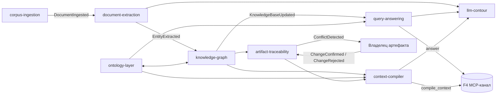

# Карта контекстов — GraphRAG

> **Статус:** baseline (черновик). Источники: `specs/vision.md` (§2.1–2.4, §3.3), `specs/c4/container.md`, `specs/use-cases/README.md`; термины согласованы с `specs/glossary.md`. Контексты — границы знаний, а не контейнеры C4: один контекст может реализовываться несколькими контейнерами (`knowledge-graph` — Ядро + Хранилище графа) и наоборот (`llm-contour` охватывает Интеграции и Мониторинг).

## Контексты

| ID | Название (RU) | Классификация | Функции F1–F4 | Ключевые UC | Инварианты |
|---|---|---|---|---|---|
| `corpus-ingestion` | Приём источников корпуса | supporting | F2 | `UC-knowledge.sync.gitlab-index` (P0), `UC-knowledge.ingest.s3-book` (P1) | Приём только из разрешённых источников знаний; повторная поставка (источник, версия) идемпотентна; документ имеет стабильный ID и происхождение |
| `document-extraction` | Извлечение фактов из документов | core | F2 | `UC-knowledge.sync.gitlab-index`, `UC-knowledge.ingest.s3-book` (этап извлечения) | Чанк принадлежит ровно одной версии документа; извлечённые факты привязаны к чанку (взаимная индексация); результат извлечения не публикуется без источника |
| `knowledge-graph` | Накопление знаний (граф знаний) | core | F2, F1, F3 | `UC-knowledge.sync.gitlab-index`, `UC-knowledge.ingest.s3-book`, `UC-answers.grounding.cited-answer`, `UC-context.impact.analyze` | Чтение — только по согласованному состоянию знаний; узлы/рёбра имеют provenance; обновление инкрементально затрагивает изменённые части |
| `ontology-layer` | Онтологический слой | core | F3, F1 | `UC-answers.grounding.cited-answer`, `UC-context.build.generate`, `UC-mcp.compile.context` (механизм F1/F3) | Публикация версии онтологии атомарна; опубликованная версия неизменяема; резолвинг — по опубликованной версии |
| `query-answering` | Ответы с grounding | core | F1 | `UC-answers.grounding.cited-answer` (P0), `UC-answers.synthesis.multi-hop` (Фаза 2) | Ответ не публикуется без grounding и атрибуции; извлечение опирается на согласованное состояние знаний |
| `artifact-traceability` | Трассируемость артефактов | core | F3 | `UC-context.impact.analyze` (P0), `UC-context.check.*` (K5, Фаза 2) | Анализ влияния детерминирован по состоянию знаний; связи артефактов направлены и типизированы; противоречия разрешаются владельцем артефакта |
| `context-compiler` | Компиляция контекста | core | F3, F4 | `UC-context.build.generate` (P1), `UC-context.impact.analyze`, `UC-mcp.compile.context` (P0) | Контекст — полнота при минимуме токенов (бюджет); только опубликованные и разрешённые артефакты; выданный контекст неизменяем |
| `llm-contour` | Безопасный контур LLM | generic (сквозной) | F1–F4 (сквозное требование) | задействован во всех UC с LLM: `UC-answers.grounding.cited-answer`, `UC-context.build.generate`, `UC-mcp.compile.context`, `UC-knowledge.*` | Каждое обращение к модели проходит проверку и аудит; блокировка до отправки при утечке; журнал аудита append-only |

> F4 — канал доступа, а не ограниченный контекст (vision §2.2): MCP-сервер доставляет `Answer` и `CompiledContext` из `query-answering` и `context-compiler`. Трассируемость F4 обеспечивается контекстами-производителями. Операции, не влезающие в сущности (резолвинг, анализ влияния, сверка, компиляция, фильтрация утечек), — доменные сервисы, перечень — в `aggregates.md`.

> `document-extraction` — core: качество извлечения фактов напрямую определяет точность ответов (ведущий фактор приоритетов, vision §3.2).

## Отношения контекстов

| От | К | Тип отношения | Механизм взаимодействия |
|---|---|---|---|
| `corpus-ingestion` | `document-extraction` | customer-supplier (поставщик → потребитель) | Событие `DocumentIngested` + API чтения документа |
| `document-extraction` | `knowledge-graph` | customer-supplier | Событие `EntityExtracted` + API записи кандидатов в граф |
| `knowledge-graph` | `ontology-layer` | partnership (взаимное согласование) | Общий API резолвинга; события `GraphUpdated` / `OntologyUpdated`; онтология поставляется из репозитория модели (vision §2.8 A4) |
| `knowledge-graph` | `query-answering` | customer-supplier | API чтения согласованного состояния знаний; событие `KnowledgeBaseUpdated` (реализация — ADR-IMPL.DATA.incremental-update-snapshot-publish) |
| `knowledge-graph` | `artifact-traceability` | customer-supplier | API чтения графа; событие `GraphUpdated` |
| `knowledge-graph` | `context-compiler` | customer-supplier | API чтения; событие `KnowledgeBaseUpdated` |
| `ontology-layer` | `query-answering` | customer-supplier | API резолвинга терминов |
| `ontology-layer` | `context-compiler` | customer-supplier | API резолвинга |
| `artifact-traceability` | `context-compiler` | customer-supplier | API результатов влияния; событие `InfluenceComputed` |
| `artifact-traceability` | `corpus-ingestion` | customer-supplier | API чтения источников (артефакты — источники корпуса) |
| `query-answering` | `artifact-traceability` | customer-supplier | Сверка «результат ↔ источник» (K5); событие `ConflictDetected` |
| `document-extraction`, `query-answering`, `context-compiler` | `llm-contour` | ACL (все обращения к модели — через контур) | API контура; событие `SecurityEventEmitted` (кандидат ADR-DES.SECURITY.local-llm-perimeter) |
| `artifact-traceability` | Владелец артефакта (роль) | customer-supplier (контур сигналов) | События `ConflictDetected` → `OwnerSignalDelivered` → `ChangeConfirmed` / `ChangeRejected` (принцип «агент готовит — человек подтверждает», REQ-NFR-process.compliance.human-confirmation) |
| `llm-contour` | Контур LLM (внешняя система) | Открытый хост-сервис | Local; контур исполнения моделей — чёрный ящик (container.md) |
| `query-answering` / `context-compiler` | ИИ-агенты (через MCP) | Канал доставки (F4) | MCP `answer` / `compile_context`; Agent Gateway (ADR-DES.API.agent-gateway-scheduling-layer) |
| `corpus-ingestion` | GitLab / S3 (внешние источники) | ACL для внешних систем | Git API / MR / webhook; S3 API / события / сверка (ADR-IMPL.INTEGRATION.s3-document-store) |

## Инварианты модели

Инварианты не пересекают границы контекстов — каждый выполняется внутри одного контекста:

1. **Provenance обязателен.** Каждый факт (утверждение, узел, ответ) прослеживается до источника (документ/чанк). Provenance формируется в `document-extraction`, хранится в `knowledge-graph`, используется в `query-answering`.
2. **Чтение по согласованному состоянию знаний.** Контексты чтения (`query-answering`, `artifact-traceability`, `context-compiler`) работают только с согласованным состоянием базы знаний; реализация — версионные снапшоты с атомарной публикацией (ADR-IMPL.DATA.incremental-update-snapshot-publish).
3. **Атомарность переключения состояния знаний.** Переход чтения на новое состояние атомарен.
4. **Онтология — входные данные.** Модель предметной области поставляется из репозитория модели; автоматическое построение — Фаза 3 (vision §2.6), не входит в MVP.
5. **Контур LLM.** Данные разработки (код, спеки, ПДн) не покидают периметр; фильтрация утечек и аудит обращений обязательны (REQ-NFR-security.compliance.llm-contour, NFR-SEC-1).
6. **GraphRAG — не источник правды.** Единый источник — репозиторий спек и кода; система — индекс и контекст (vision §2.7.1).
7. **«Агент готовит — человек подтверждает».** Сгенерированные артефакты и предлагаемые изменения принимаются только после подтверждения владельцем (REQ-NFR-process.compliance.human-confirmation, vision §2.8 A3).
8. **Внешние сигналы — вне модели.** Петля обучения и накопление знаний из внешних сигналов (телеметрия, поддержка) не входят в источники корпуса (vision §2.7.4–5).
9. **Противоречия разрешаются владельцем.** Обнаруженное противоречие фиксируется с доказательствами и доставляется владельцу; система не исправляет артефакт в обход процесса (K5, контур сигналов).

**Офлайн-устойчивость.** Инварианты не зависят от постоянной связи с внешними LLM-провайдерами: исполнение — в локальном контуре, чтение обслуживается из опубликованных состояний (vision §2.8 A5, A7).

## Связанные артефакты

- [Агрегаты](aggregates.md) — корни, сущности, объекты-значения и доменные сервисы
- [Доменные события](domain-events.md) — каталог событий и каскадов
- [Видение продукта](../vision.md) — функции F1–F4, события §2.4, границы §2.7
- [Глоссарий](../glossary.md) — единый язык
- [Прецеденты использования](../use-cases/README.md) — домены и ID UC
