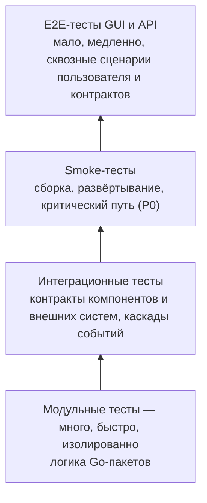

# Контроль качества — GraphRAG

В этой директории фиксируются принципы контроля качества проекта GraphRAG — корпоративной системы знаний (ontology-grounded GraphRAG): индексация корпуса (markdown-спеки GitLab, PDF-книги) в граф знаний, онтологический слой (машинно-читаемая модель предметной области), ответы со ссылками на источники (grounding/provenance), context compiler для ИИ-агентов через MCP. Документ определяет, как качество подтверждается тестированием на всех уровнях: от модульных тестов до сквозных сценариев GUI и API, как тесты связаны с требованиями и как автоматизация ведёт к целевому состоянию (полная автоматизация QA на тестовом контуре; реестр открытых вопросов — `.ai-factory/RESEARCH.md`).

Методологическая основа: Software Requirements Engineering (Wiegers & Beatty, 3rd ed.) — валидация требований как одна из четырёх дисциплин их разработки (Elicitation → Analysis → Specification → Validation). Ключевой постулат для QA: **каждое требование должно быть проверяемым** (verifiable), а тесты — одно из альтернативных представлений требований («test the requirements»).

---

## 1. Назначение и область применения

| Аспект | Значение |
|---|---|
| **Что описывает** | Принципы контроля качества и уровни тестирования продукта, связь тестов с требованиями |
| **Контур тестирования** | Модули GraphRAG: ядро, оркестрация пайплайнов (F1), query engine (F3), MCP-сервер (F6), интеграции (GitLab, GPU-контур), CPU-компоненты (Leiden, HNSW, токенизатор). Внешние зависимости — GitLab, локальный GPU-контур LLM, ИИ-агенты (MCP), сигналы с полей (F5), мониторинг и аудит: тестируются **контракты** взаимодействия с ними, но не внутренняя функциональность внешних систем |
| **Для кого** | Разработчики, QA-инженеры, DevOps, ревьюеры, владельцы требований |
| **Место в спецификации** | QA-артефакты связаны с иерархией требований: `vision.md` → `glossary.md` → `adr/`; каталоги требований (`use-cases/`, `fun-req/`, `nonfun-req/`, `user-strories/`) планируются (vision.md §2.2); тесты — forward-трассировка требований в реализацию |
| **Инструмент полноты** | Матрица программирования качества (5 факторов × 4 этапа ЖЦ, раздел 2.4): каждая ячейка закрывается минимум одной измеримой проверкой (раздел 5.1) |

## 2. Методологическая основа

### 2.1. Тестирование как валидация требований (W&B, Validation)

- **Peer review / Inspection** — ревью требований и тестов наравне с кодом; одна из самых ценных практик качества.
- **Testing the requirements** — тест пишется как альтернативное представление требования: если требование нельзя проверить тестом — оно не готово.
- **Defining acceptance criteria** — критерии приёмки согласуются с заказчиком и становятся основой приёмочных сценариев.
- **Defect checklist** — валидация набора требований: неполнота, неоднозначность, противоречивость, непроверяемость, отсутствие приоритета (используется при ревью требований; каталоги требований планируются — vision.md §2.2).

### 2.2. Проверяемость требований

Характеристики отличного требования (W&B, Chapter 2) применяются к тестированию напрямую:

| Характеристика | Значение для QA |
|---|---|
| **Verifiable** | Каждое FR имеет критерии приёмки; каждое NFR — метрику и целевое значение (каталог `nonfun-req/` планируется — vision.md §2.2). Без этого тест написать нельзя |
| **Unambiguous** | Однозначная формулировка → однозначный тест-сценарий |
| **Complete** | Набор тестов покрывает все сценарии и режимы требования |
| **Traceable** | Каждый тест трассируется к требованию (матрица качества, раздел 5) |

### 2.3. Связь артефактов требований и тестов

```
vision.md (G1–G7, F1–F7)
  └─ use-cases/ (UC) — прецеденты (планируются, vision.md §2.2)
       ├─ fun-req/      (FR, критерии приёмки)   → модульные и интеграционные тесты
       ├─ nonfun-req/   (NFR, метрики качества)  → нагрузочные, security, совместимость
       └─ user-strories/ (US, Gherkin, @US-*, @UC-*, @P0–P2) → E2E-тесты GUI и API
```

Схема — целевая иерархия: каталоги требований (`use-cases/`, `fun-req/`, `nonfun-req/`, `user-strories/`, `business-rules/`) планируются (vision.md §2.2).

Пользовательские истории в формате Gherkin (`user-strories/`) — **основа E2E-тестов**: сценарии `Given/When/Then` исполняются средствами автоматизации (BDD). UC описывают полное поведение, FR детализируют поведение до проверяемых критериев, NFR задают границы качества.

Архитектурная база интеграционных и API-тестов — C4-модель (планируется; `adr/README.md`, референс — `.ai-factory/references/mermaid-c4-diagrams.md`): контейнеры, компоненты и топология развёртывания фиксируют границы компонентов и контракты, которые проверяются интеграционными тестами (раздел 4.2). На текущий момент архитектурные источники — `adr/` и vision.md §3.3.

### 2.4. Матрица программирования качества — инструмент полноты

Полнота контроля качества оценивается по матрице программирования качества: **5 факторов обусловленности** (Среда, Эргономика, Функции, Аварии/Катастрофы, Технологическая обеспеченность ЖЦ) × **4 этапа жизненного цикла** (Проектирование и Разработка, Эксплуатация/Потребности, Эксплуатация/Сопровождение, Вывод из эксплуатации/Миграция). Каждая из 20 ячеек должна быть закрыта **как минимум одной измеримой проверкой**; незакрытая ячейка — «свободный параметр» и неконтролируемый риск для качества.

Для QA это означает:

- QA-покрытие не ограничивается этапом разработки (тестовая пирамида) — проверки распределены по всем ячейкам матрицы (см. раздел 5.1).
- Каждая проверка (гейт, критерий приёмки, тест) **измерима**: численное значение, диапазон или бинарный критерий с детерминированным алгоритмом проверки. Неизмеримый критерий ячейку не закрывает.
- Концентрация проверок только в ячейке «Функции × Эксплуатация» — критический перекос («ловушка 3.2»): вне контроля остаются сопровождение, вывод из эксплуатации, среда и человеческий фактор.

## 3. Принципы контроля качества

1. **Тестируемость требований.** Требование без проверяемого критерия — не готово (W&B: verifiable). Тест появляется вместе с требованием (Validation), а не после реализации.
2. **Тесты — артефакты требований.** Каждый тест трассируется к требованию: US → E2E, FR → модульные/интеграционные, NFR → нагрузочные/security, BR → интеграционные. Свод — матрица качества (раздел 5).
3. **Пирамида тестов.** Больше быстрых и дешёвых модульных тестов, меньше медленных сквозных; каждый уровень ловит свой класс дефектов и не дублирует нижележащий.
4. **Критичность определяет глубину.** Сценарии приоритетов P0–P2 покрываются на всех уровнях по убыванию: P0 — обязательно на каждом уровне, P2 — по решению. Критичные модули — максимальное покрытие: контур LLM (фильтрация утечек, аудит — F7), онтологический слой (резолвинг — F2), извлечение знаний (F1), анализ влияния (детерминизм — F4), MCP-компилятор (F6), CPU-компоненты (токенизатор, HNSW, Leiden), инкрементальное обновление графа.
5. **Негативные сценарии и границы обязательны.** Большинство дефектов — в обработке ошибок: некорректные запросы, повреждённые/несогласованные данные, недоступность LLM-контура/хранилища/GitLab, таймауты, идемпотентность, параллельные запросы, детекция противоречий (F3.4).
6. **Платформа — часть теста.** Поддерживаемая платформа — локальный GPU-контур (Linux-сервер, NVIDIA GPU, open-weight модели; vision.md §2.8); Go-кросс-сборка. Проверки выполняются на каждом уровне, где поведение платформозависимо (развёртывание контура, интеграции, пути, привилегии).
7. **Автоматизация — целевое состояние.** Текущее состояние — проект на этапе видения, кодовой базы и CI нет; целевое — полностью автоматический конвейер QA на тестовом контуре (заглушки GitLab, эмулятор LLM с детерминированными golden-ответами, тестовые хранилища; прод-подобный контур с реальным GPU). Реестр открытых вопросов — `.ai-factory/RESEARCH.md`.
8. **Стабильность тестов.** Тесты должны быть детерминированными: без «флаки» (нестабильных тестов), без зависимости от внешней среды, с фиксированными тестовыми данными. Нестабильный тест хуже отсутствующего — он обесценивает сигнал CI.
9. **Безопасность тестируется отдельно и эшелонированно.** Статический анализ (SAST), сканирование зависимостей (SCA), поиск секретов, DAST, контроль целостности — в CI (целевое состояние); контролируемый контур LLM (G6): фильтрация утечек, аудит, контроль затрат/токенов (F7). Целевые значения метрик не зафиксированы (TBD); проверяются тестами, а не «отсутствием инцидентов».
10. **Shift-left.** Дефект дешевле на ранних стадиях: линтеры, статический анализ, модульные тесты и ревью выполняются до того, как код попадёт в интеграционные и сквозные прогоны.
11. **Полнота по жизненному циклу.** Контроль качества покрывает все четыре этапа ЖЦ: разработку, штатную эксплуатацию, сопровождение (обновления, откаты, восстановление, мониторинг) и вывод из эксплуатации (декомиссия, миграция, ротация моделей). Контроль только на этапе разработки не подтверждает качество продукта в руках пользователя (раздел 5.1).
12. **Измеримость гейтов.** Каждый гейт качества, критерий приёмки и порог входа/выхода выражается числом, диапазоном или бинарным критерием с алгоритмом проверки. «Проверено вручную» без измеримого результата гейтом не является.
13. **Среда и регуляторика — объект тестирования.** Совместимость со средой (развёртывание GPU-контура: драйверы, CUDA, рантайм моделей; протоколы, деградация при недоступности внешних систем) и регуляторные требования (152-ФЗ (ПДн), корпоративные правила ИБ, лицензии open-weight моделей и open-source — SCA) проверяются тестами наравне с функциями.

## 4. Уровни тестирования



| Уровень | Что проверяет | Основная база | Среда выполнения | Время прогона |
|---|---|---|---|---|
| Модульные тесты | Логику единицы кода в изоляции | FR, доменная логика | Локально, CI | Секунды–минуты |
| Интеграционные тесты | Взаимодействие компонентов и контракты интерфейсов | FR, UC, BR (планируются), контракты, C4 (планируется) | CI, тестовый контур | Минуты |
| Smoke-тесты | Жизнеспособность сборки и развёртывания, критический путь | P0-сценарии, US P0 | CI, тестовый контур | Минуты |
| E2E-тесты GUI | Пользовательские сценарии через интерфейс (в т.ч. a11y) | US (Gherkin), UC (планируются) | Тестовый контур, стенд | Десятки минут |
| E2E-тесты API | Сквозные контракты HTTP/MCP/GitLab/LLM-контура | UC, FR (планируются), контракты API | Стенд тестового контура | Десятки минут |

### 4.1. Модульные тесты (unit)

**Назначение.** Быстрая обратная связь при разработке: проверка отдельной функции, типа или пакета в изоляции от внешних зависимостей.

**Объект в проекте.** Факт: проект на этапе видения, кодовой базы нет (`src/` — только `README.md`); модульные тесты появятся с первым кодом. Целевые объекты — Go-пакеты модулей GraphRAG: ядро, оркестрация пайплайнов (F1), query engine (F3), MCP-сервер (F6), интеграции (GitLab, GPU-контур), CPU-компоненты (Leiden, HNSW, токенизатор; на Go, при необходимости CGo): конфигурация, обработчики HTTP/MCP/GitLab-событий, доменная логика функций F1–F7.

**Правила.**

- Изоляция: моки и заглушки генерируются через `mockery` (по интерфейсам); без сети, БД, файловой системы и реального времени.
- Табличные тесты (table-driven) — стандарт Go для наборов входных/выходных данных и граничных случаев.
- Критичные модули (контур LLM — фильтрация утечек, аудит (F7); онтологический слой — резолвинг (F2); извлечение знаний (F1); анализ влияния — детерминизм (F4); MCP-компилятор (F6); CPU-компоненты (токенизатор, HNSW, Leiden); инкрементальное обновление графа) покрываются приоритетно.
- Запуск с детектором гонок: `go test -race`.

**Критерии входа/выхода.** Вход: пакет реализован, интерфейсы выделены. Выход: тесты проходят с `-race`, покрытие критичных пакетов не ниже порога, зафиксированного в NFR/проекте (порог вводится с первым кодом — TBD), отчёт покрытия публикуется в CI (целевое состояние).

**Метрики.** Покрытие утверждений/веток (`coverage.out`, cobertura-отчёт), время прогона, доля упавших тестов.

### 4.2. Интеграционные тесты

**Назначение.** Проверка взаимодействия компонентов друг с другом и с внешними системами: соблюдение контрактов, корректность протоколов, каскады доменных событий.

**Объект в проекте.**

- Внутренние Go-контракты модулей (ядро, оркестрация пайплайнов, query engine, MCP-сервер, интеграции, CPU-компоненты); контрактные тесты по эталонным кейсам K1, K4, K5, K17 (до реализации).
- Внешние контракты: GitLab API/webhook/MR (авторитетный источник корпуса — F1), HTTP API (запросы/метрики), MCP (JSON-RPC), локальный GPU-контур LLM (OpenAI-совместимый inference endpoint — F7), хранилище графа и векторного индекса, импорт сигналов (F5), мониторинг и аудит.
- Каскады доменных событий (vision.md §2.4): `DocumentIngested → EntityExtracted → GraphUpdated → CommunityRecomputed`; `ConflictDetected` → сигнал владельцу; `SecurityEventEmitted` → ИБ.
- Хранилище графа и векторного индекса (выбор открыт — ADR-IMPL.DATA.graph-storage), инкрементальное обновление графа (F1.3).

**Источники информации.** Помимо требований (`FR`, `UC`, `BR` — каталоги планируются, vision.md §2.2), ожидаемую структуру интеграции задают архитектурные источники: на текущий момент — `adr/README.md` и vision.md §3.3; C4-модель планируется (референс — `.ai-factory/references/mermaid-c4-diagrams.md`). Расхождение реализации с архитектурой (изменённый или добавленный контракт, новая внешняя интеграция, отсутствующий компонент) — дефект, который должен ловиться интеграционным тестом. Архитектурные источники поддерживаются актуальными вместе с изменением контрактов; устаревший источник перестаёт быть источником.

**Среда.** Тестовый контур: компоненты как реальные процессы + заглушки внешних систем (заглушки GitLab, эмулятор LLM с детерминированными golden-ответами, тестовые хранилища).

**Правила.**

- Контрактные тесты по эталонным кейсам (RULES.md): K1 (ответ с grounding), K4 (анализ влияния), K5 (сверка результат↔источник), K17 (context compiler) — до реализации; изменение контракта ломает тесты, а не продукт в поле.
- Обязательны негативные сценарии: некорректные запросы, повреждённые/несогласованные данные, недоступность LLM-контура/хранилища/GitLab (ретраи), таймауты, частичная запись, параллельные запросы.
- Платформозависимые интеграции (развёртывание GPU-контура: драйверы, CUDA, рантайм моделей; привилегии) тестируются на соответствующем контуре.

**Критерии входа/выхода.** Вход: контракты зафиксированы, стенд развёрнут. Выход: контрактные и каскадные сценарии проходят на тестовом контуре.

### 4.3. Smoke-тесты

**Назначение.** Быстрая проверка жизнеспособности: «сборка собралась, контур развернулся, сервисы поднялись, критический путь выполняется». Гейт перед полным регрессом и релизом.

**Виды.**

| Вид | Что проверяет | Когда |
|---|---|---|
| Build smoke | Сборка всех компонентов для целевых платформ (конвейер Go-кросс-сборки) | Каждый MR/push |
| Install smoke | Развёртывание контура: GPU-рантайм, модель, хранилище, сервисы, HTTP/MCP endpoints | Каждая сборка, перед e2e |
| Deployment smoke | После развёртывания контура: сервисы живы, индексация мини-корпуса проходит, HTTP/MCP endpoints отвечают, метрики доступны | Каждый деплой контура |

**Минимальный набор.** Критический путь P0 (не более 5–15 минут): индексация мини-корпуса; ответ на эталонный вопрос со ссылками на источники; MCP-запрос; здоровье/метрики; аудит.

**Правила.** Набор стабилен (никаких «флаки»), не зависит от внешних сервисов, выполняется после сборки и перед глубокими уровнями. Провал smoke останавливает конвейер.

**Подробный гайд:** `qa/smoke-testing.md` — проектирование, процедура, стенды, assertions, анти-фейк и исчерпывающий каталог smoke-сценариев (SM-B-*/SM-I-*/SM-D-*).

### 4.4. E2E-тесты GUI

**Назначение.** Сквозная проверка пользовательских сценариев через пользовательский интерфейс — «система работает так, как её видит пользователь». Покрывает сценарии, которые невозможно проверить нижележащими уровнями: навигация, отображение состояния, ошибки пользовательского ввода, доступность.

**База.** Пользовательские истории `user-strories/` (планируются — vision.md §2.2) в формате Gherkin (теги `@US-*`, `@UC-*`, `@P0–P2`, доменные теги, `@accessibility`): сценарии исполняются автоматизацией (BDD-конвейер Gherkin → шаги).

**Объект в проекте.** Веб-интерфейс системы знаний и дашборды администрирования (индексация, онтология, метрики, аудит контура LLM); состав интерфейса не зафиксирован (уточняется на этапе проектирования). Сценарии доступности: screen reader, keyboard-only навигация — по WCAG MVP (состав сценариев — TBD).

**Специфика.**

- Ленивое подключение к сервисам; fallback-режим при недоступности сервиса — только негативные сценарии.
- Автоматизация веб-интерфейса — браузерными средствами (e2e GUI в CI — целевое состояние).

**Среда.** Тестовый контур; для a11y — стенд со screen reader. Автоматизация инициируется из CI (целевое состояние).

**Метрики.** Доля US, покрытых автоматизацией; время прогона; стабильность набора.

**Подробный гайд:** `qa/e2e-gui-testing.md` — проектирование, стенды, процедура, assertions, анти-фейк и шаблоны E2E GUI-сценариев.

### 4.5. E2E-тесты API

**Назначение.** Сквозная проверка внешних контрактов без GUI: «запрос → обработка → ответ/состояние» через публичные интерфейсы и каналы связи. Проверяет то, что недостижимо на уровне единиц и компонентов: полный путь сообщения через реальные процессы и протоколы.

**База.** UC и FR с критериями приёмки (каталоги планируются — vision.md §2.2); контракты — внутренние Go-контракты модулей и внешние контракты (GitLab API/webhook/MR, HTTP API, MCP, LLM-inference, хранилище графа/векторов, импорт сигналов, мониторинг/аудит).

**Объект в проекте.**

| Контракт | Направление | Примеры сценариев |
|---|---|---|
| HTTP API | клиент ↔ query engine (F3) | ответы со ссылками на источники (F3.1), глобальные вопросы (F3.2), multi-hop (F3.3), метрики |
| MCP (JSON-RPC) | ИИ-агенты ↔ context compiler (F6) | точный контекст агенту (F6.1), сверка со спецификациями (F6.2), предзавершающий гейт (F6.3), QA-контекст (F6.4) |
| GitLab API/webhook/MR | GitLab ↔ интеграции (F1) | автоиндексация корпуса (F1.1), инкрементальное обновление графа (F1.3) |
| LLM-inference (OpenAI-совместимый endpoint) | система ↔ локальный GPU-контур (F7) | извлечение сущностей, ответы, детекция противоречий (F3.4), LLM-as-judge (F3.5) |
| Хранилище графа и векторного индекса | система ↔ хранилище | чтение/запись графа, векторный поиск, инкрементальное обновление (F1.3); выбор хранилища открыт (ADR-IMPL.DATA.graph-storage) |
| Импорт сигналов (F5) | источники сигналов ↔ система | сигналы → требования/тесты (F5.1), разбор инцидентов (F5.2), обновление из прода/телеметрии (F5.4) |
| Мониторинг/аудит | система ↔ администратор/ИБ | SecurityEventEmitted → ИБ, фильтрация утечек и аудит (F7.2), контроль затрат/токенов (F7.3) |

**Правила.** Обязательны негативные сценарии и границы: некорректные запросы, повреждённые/несогласованные данные, недоступность LLM-контура/хранилища/GitLab, таймауты, повторная доставка (идемпотентность), параллельные запросы, детекция противоречий (F3.4). Проверяется соблюдение бизнес-правил `BR-*` (каталог планируется — vision.md §2.2).

**Среда.** Стенд: реальные компоненты + тестовый контур (заглушки GitLab, эмулятор LLM с детерминированными golden-ответами, тестовые хранилища).

**Метрики.** Доля API-контрактов, покрытых сквозными тестами; доля негативных сценариев в наборе; стабильность прогона.

## 5. Матрица качества

Матрица качества — свод трассировки «требование → уровень тестирования»: гарантия, что каждое требование имеет хотя бы один проверяющий тест, а каждый уровень — понятную базу требований. Это forward-трассировка требований в тесты (W&B: traceability) и основа метрики «покрытие требований тестами». Матрица рассматривается в двух срезах: трассировка требований в тесты (ниже) и полнота контроля качества по жизненному циклу (раздел 5.1).

| Артефакт | Модульные | Интеграционные | Smoke | E2E GUI | E2E API |
|---|---|---|---|---|---|
| US (Gherkin) — пользовательские истории (планируются) | — | — | P0-сценарии | ✅ основной источник | ✅ по каналам |
| UC — прецеденты (планируются) | — | каскады событий | P0-потоки | ✅ | ✅ |
| FR — функциональные требования (планируются) | ✅ | ✅ | — | ✅ | ✅ |
| NFR — атрибуты качества (планируются) | критичная логика | нагрузка, отказоустойчивость | — | — | ✅ производительность/доступность |
| NFR security | ✅ | ✅ | — | — | ✅ аутентификация/целостность |
| BR — бизнес-правила (планируются) | ✅ | ✅ | — | — | ✅ |
| Платформа — локальный GPU-контур (vision.md §2.8) | — | репрезентативный набор | ✅ развёртывание контура | ✅ | ✅ |
| G6 — контролируемый контур LLM (критерии §1.4) | ✅ | ✅ | — | — | ✅ |
| ADR + vision.md §3.3 (контекст системы); C4 планируется | — | ✅ источник контрактов | ✅ топология развёртывания | — | ✅ внешние контракты |

Правила ведения матрицы:

- **Каждое требование P0/P1** имеет тест минимум на одном уровне; P2 — по решению владельца.
- **Непокрытое требование** — риск релиза: фиксируется в реестре открытых вопросов (`.ai-factory/RESEARCH.md`) и в ревью набора требований (W&B: collection completeness).
- Матрица обновляется при изменении требований (change control, W&B: impact analysis) и при добавлении тестов.
- Архитектурные артефакты (ADR, C4-модель) — не требования, но источник контрактов и топологии: расхождение реализации с архитектурой — дефект, который должен ловить интеграционный тест (раздел 4.2).

### 5.1. Полнота контроля качества по жизненному циклу

Контрольный список полноты QA по матрице программирования качества (факторы × этапы ЖЦ, раздел 2.4). Каждая ячейка закрывается минимум одной **измеримой** проверкой; пустая или неизмеримая ячейка — свободный параметр и риск, фиксируемый в реестре открытых вопросов (`.ai-factory/RESEARCH.md`) и закрываемый в целевом состоянии (полная автоматизация QA на тестовом контуре).

| Фактор \ Этап ЖЦ | 1. Проектирование и Разработка | 2. Эксплуатация / Потребности | 3. Эксплуатация / Сопровождение | 4. Вывод из эксплуатации / Миграция |
|---|---|---|---|---|
| **1. Среда** | SCA (trivy), лицензии и политики open-source, SBOM; изоляция тест-среды от продуктивных данных | Совместимость: тестовый контур (GPU-стек, модели, браузеры/MCP-клиенты); регуляторика: 152-ФЗ (ПДн), лицензии моделей и open-source (SCA); деградация при недоступности внешних систем | Инкрементальное обновление графа и откаты; аудит-следы; SLA на реагирование при инцидентах | Тесты вывода контура из эксплуатации, ротации моделей, отзыва доступов; compliance при архивировании |
| **2. Эргономика** | Ревью UX/доступности требований; онбординг команды | E2E GUI: a11y (WCAG MVP, screen reader, keyboard-only), юзабилити, локализация | Читаемость и фильтрация логов, консоли/дашборды мониторинга | UX администратора при выводе контура из эксплуатации/миграции: понятность процедуры, инструкции |
| **3. Функции** | Модульные и интеграционные тесты; критерии приёмки до кода | E2E GUI/API, smoke P0, нагрузочные тесты | Тесты инкрементального обновления графа (rolling, откат), мониторинга, каскадов событий | Тесты вывода контура из эксплуатации, ротации моделей, экспорта/удаления данных |
| **4. Аварии/Катастрофы** | Негативные сценарии и обработка ошибок с первого дня; SAST | Failover: деградация при недоступности LLM-контура/хранилища, ретраи, защита от атак (OWASP), анти-темперинг | Тесты отката обновления, восстановление/перестройка индекса и графа, бэкап/restore | Тесты миграции: потеря данных, зависшие транзакции, целостность после переноса |
| **5. Тех. обеспеченность ЖЦ** | CI/CD (GitLab CI), golangci-lint, `go test -race`, mockery | Тестовый контур (заглушки GitLab, эмулятор LLM с golden-ответами, тестовые хранилища), детерминированные тестовые данные | Стабильность тестов (анти-«флаки»), регламенты инцидентов тестовой инфраструктуры | Утилизация ресурсов после прогонов, вывод стендов, передача знаний и документации |

## 6. Тестовые окружения и данные

- **Контуры** (целевое состояние): dev-стенд; тестовый контур — заглушки GitLab, эмулятор LLM с детерминированными golden-ответами, тестовые хранилища (единая среда для интеграционных и API-тестов; недоступность внешних систем не должна ломать тесты — принцип 8); прод-подобный контур — реальный GPU (локальный GPU-контур LLM: Linux-сервер, NVIDIA GPU, open-weight модели). Матрица ОС не предполагается.
- **Тестовые данные**: фиксированные тестовые корпуса (markdown-спеки, PDF-книги), модель-фикстура предметной области, golden-наборы «запрос → эталонный ответ → источники», граф-фикстуры, сигналы-фикстуры, MCP-запросы; изолированные от продуктивных; генерация детерминированная.
- **Стенды**: dev-стенд для каждого MR, стабильный тестовый стенд для полных прогонов; деплой — целевое состояние CI (GitLab CI).

## 7. Тестирование NFR

NFR задают измеримые границы качества (каталог `nonfun-req/` планируется — vision.md §2.2); каждый NFR проверяется тестом по своим критериям приёмки (метрика + целевое значение):

| Категория качества | Как проверяется | Примеры NFR (метрики) |
|---|---|---|
| Производительность | Нагрузочные тесты (HTTP API, MCP, индексация корпуса); замеры на стенде | Время ожидания ответа: медиана и p90 (целевые значения — TBD); минимизация токенов и числа LLM-вызовов (сквозное требование) |
| Качество и полнота | Прогон golden-наборов «запрос → эталонный ответ → источники» на эмуляторе LLM; сверка результата с источником (F4.2, K5) | Точность ответов RAG ≥ 70%; число противоречий; доля артефактов со связями в графе (целевые значения уточняются после замера) |
| Доступность | Отказоустойчивость: деградация при недоступности LLM-контура/хранилища/GitLab, ретраи, восстановление/перестройка индекса и графа; перезапуск компонентов | (TBD) |
| Безопасность | SAST (semgrep), SCA (trivy), поиск секретов, DAST; фильтрация утечек и аудит контура LLM (F7) | Доля обращений к LLM через корпоративный канал; 0 вне контура |
| Совместимость | Прогоны на тестовом контуре: GPU-стек, модели, браузеры/MCP-клиенты | (TBD) |
| Наблюдаемость | Проверка полноты и чистоты телеметрии и логов; аудит контура LLM (F7) | Время сигнал→фикс (F5.3); доля вопросов, закрытых без аналитика (целевые значения уточняются после замера) |

Целевое состояние: DevSecOps-сканы (gosec, trivy, semgrep, поиск секретов) в CI; практика распространяется на все компоненты.

## 8. CI/CD и автоматизация

### 8.1. Текущее состояние (факт репозитория)

- Проект на этапе видения: кодовой базы, тестов и CI нет (`src/` — только `README.md`). Методология QA фиксируется заранее (данный документ) и будет применяться к первому коду.
- Эталонные кейсы K1–K24 (RULES.md, RESEARCH.md): контрактные тесты K1 (ответ с grounding), K4 (анализ влияния), K5 (сверка результат↔источник), K17 (context compiler) пишутся до реализации.
- Пороги покрытия вводятся с первым кодом; реестр открытых вопросов — `.ai-factory/RESEARCH.md`.

### 8.2. Целевое состояние

Конвейер контроля качества (полностью автоматический, на тестовом контуре):

```
lint (golangci-lint) → unit (go test -race + coverage)
  → build (Go-кросс-сборка) → smoke (deploy на тестовом контуре)
  → контрактные тесты (K1, K4, K5, K17) → integration (тестовый контур)
  → e2e API (HTTP/MCP) → e2e GUI (браузер, в т.ч. a11y)
  → NFR (бенчмарки, DevSecOps-сканы: gosec, trivy, semgrep, поиск секретов)
  → релизные гейты
```

- Быстрый набор (lint + unit + build smoke) — на каждый push/MR; полный набор (все уровни) — ночной прогон и перед релизом.
- Пороги качества в CI: покрытие критичных пакетов, стабильность (допустимая доля «флаки»), время прогона.
- Тестовый контур: заглушки GitLab, эмулятор LLM с детерминированными golden-ответами, тестовые хранилища; прод-подобный контур с реальным GPU; утилизация ресурсов после прогона.

## 9. Управление дефектами

- **Жизненный цикл**: `new → triage → in progress → fixed → verified → closed`; каждый дефект имеет severity и приоритет.
- **Классификация severity**: Blocker (блокирует релиз, потеря данных, безопасность), Critical, Major, Minor, Trivial.
- **Связь с требованиями**: дефект трассируется к требованию (FR/NFR/BR — каталоги планируются, vision.md §2.2) и к тесту, который его пропустил; пропущенный класс дефектов → новый тест (регрессия навсегда).
- **Регресс**: повторный прогон затронутых уровней после фикса; полный регресс перед релизом.
- **Security-находки**: DevSecOps-сканы в CI (gosec, trivy, semgrep, поиск секретов); критичные уязвимости — гейт релиза.

## 10. Метрики качества

| Метрика | Что показывает | Источник |
|---|---|---|
| Покрытие требований тестами | Доля требований с проверяющим тестом (по матрице качества, раздел 5) | Матрица качества, ревью набора |
| Покрытие матрицы контроля качества | Доля ячеек 5×4 (факторы × ЖЦ), закрытых измеримыми проверками (раздел 5.1) | Матрица 5.1, ревью набора |
| Покрытие кода | Доля утверждений/веток, покрытых модульными тестами | CI (coverage.out, cobertura) |
| Стабильность тестов | Доля «флаки»-прогонов и повторных запусков | CI-история |
| Время прогона | Стоимость уровней: быстрый/полный набор | CI |
| Распределение дефектов | Доля дефектов, найденных на каждом уровне (эффективность уровней) | Баг-трекер |
| Escaped defects | Дефекты, ушедшие в релиз | Баг-трекер, поддержка |
| G6 / критерии §1.4 | Точность ответов RAG ≥ 70%; доля обращений к LLM через корпоративный канал, 0 вне контура (значения уточняются после замера) | Golden-наборы, эмулятор LLM, аудит контура LLM |

## 11. Роли и ответственность

| Роль | Ответственность |
|---|---|
| Разработчик | Модульные и интеграционные тесты своего модуля; запуск линтеров; покрытие критичных пакетов |
| QA-инженер | Стратегия тестирования, E2E-сценарии (GUI/API), smoke-наборы, матрица качества, ручной контур на тестовом контуре |
| DevOps | CI/CD-конвейер, тестовый контур и автоматизация стендов, DevSecOps-сканы |
| Ревьюер | Ревью тестов наравне с кодом; ревью требований (W&B: peer review) |
| Владелец требований | Критерии приёмки, приоритизация, решение по P2-покрытию и открытым `TBD` |

## 12. Связанные артефакты

- [Видение продукта](../vision.md) — цели G1–G7, функции F1–F7 (§2.1–2.2), критерии успеха §1.4, события предметной области §2.4, внешние зависимости §2.8
- [Глоссарий](../glossary.md) — термины предметной области (в т.ч. метрики, §8)
- [Архитектурные решения](../adr/README.md) — в т.ч. ADR-IMPL.STACK.go-single-language-adoption (ПРИНЯТО), ADR-IMPL.DATA.graph-storage (выбор открыт)
- [Код и CI](../src/README.md) — описание модулей GraphRAG (кодовой базы пока нет — этап видения)
- [Исследования и открытые вопросы](../../.ai-factory/RESEARCH.md) — реестр открытых вопросов, эталонные кейсы
- [Правила проекта](../../.ai-factory/RULES.md) — эталонные кейсы K1–K24 (контрактные тесты K1/K4/K5/K17 — до реализации)
- [План проекта](../../.ai-factory/PLAN.md) — этапы и статусы
- [Fitness-функции](../../.ai-factory/references/fitness-functions.md) — референс по fitness-функциям
- [Процедура интеграционного тестирования](./integration.md) — стенды, заглушки, инстансы сервисов и пошаговая процедура на основе внутренних Go-контрактов и эталонных кейсов (K1, K4, K5, K17)
- [Smoke-тестирование](./smoke-testing.md) — виды (build/install/deployment), процедура, стенды, анти-фейк и каталог smoke-сценариев (SM-B-*/SM-I-*/SM-D-*)
- [E2E-тестирование GUI](./e2e-gui-testing.md) — проектирование, стенды, процедура, assertions, анти-фейк и шаблоны E2E GUI-сценариев
- Планируемые каталоги требований: `use-cases/`, `fun-req/`, `nonfun-req/`, `user-strories/`, `business-rules/` (vision.md §2.2); C4-модель планируется (`adr/README.md`; референс — `../../.ai-factory/references/mermaid-c4-diagrams.md`)
- [Скилл «Матрица качества»](../../.agents/skills/quality-matrix/SKILL.md) — методика матрицы программирования качества (полнота и измеримость)
- [Скилл «Формальное определение»](../../.agents/skills/formal-definition/SKILL.md) — строгие определения терминов (глоссарий, онтология)
- [Скилл QA](../../.agents/skills/aif-qa/SKILL.md) — QA-воркфлоу: тест-планы и сценарии
- [Скилл проверки правил](../../.agents/skills/aif-rules-check/SKILL.md) — read-only проверка соответствия правилам проекта
- [Скилл ревью](../../.agents/skills/aif-review/SKILL.md) — ревью кода и тестов
- [Скилл верификации](../../.agents/skills/aif-verify/SKILL.md) — проверка завершённости реализации
- [Скилл security-аудита](../../.agents/skills/aif-security-checklist/SKILL.md) — чек-лист безопасности (OWASP)
