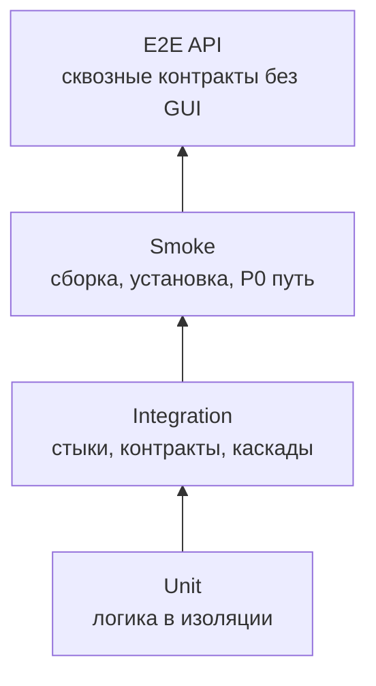
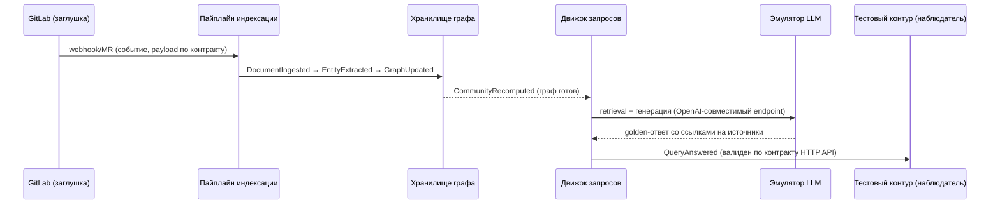

# E2E-тестирование API — GraphRAG

> **Статус:** рабочий гайд для разработчиков, тестировщиков и ИИ-агентов.  
> **Назначение:** описать, как проектировать, запускать, ревьюить и подтверждать сквозные API-тесты так, чтобы они проверяли полный путь «внешний запрос → обработка реальными процессами → внешний ответ/состояние» по публичным контрактам, а не имитировали достижение цели.  
> **Методологическая база:** функции проекта `../vision.md` §2.1–2.2 (подпункты F1.1–F4) — **основной источник E2E-сценариев**; `qa/README.md` §4.5 (E2E API) и §5 (матрица качества), `qa/test-plan.md` (доменные сценарии и уровни), `qa/gates.md` (FG-гейты), методология W&B (Validation, acceptance criteria, traceability); каталоги требований (`fun-req/`, `use-cases/`, `business-rules/`, `nonfun-req/`) и реестр контрактов — **планируются (vision.md §2.2)** и будут контекстом для шагов, payload и assertions; `../glossary.md` и `../adr/README.md` — термины и решения; код `../src/` — только для понимания реализации, не источник правды.  
> **Текущее состояние:** проект на этапе видения — кодовой базы и тестов нет (`../src/` — только `../src/README.md`). Всё, что ниже про стенды, заглушки, прогоны и CI, — **целевое состояние**: сценарии фиксируют целевое поведение функций, а не фактически работающую систему.

---

## 1. Место E2E API-тестов в стратегии качества

E2E API-тест проверяет **полный сквозной путь сообщения через реальные процессы и протоколы по публичным контрактам, без GUI и без вмешательства в середину пути**: внешний инициатор (тестовый контур или внешний клиент) → запрос/сообщение → обработка реальными компонентами контура GraphRAG → внешний наблюдаемый результат (ответ, событие, состояние в тестовом контуре).

E2E API-тест отвечает на вопрос: «работает ли система как единое целое так, как этого требуют функции (vision.md §2.2), каталоги требований и контракты, когда внешний мир взаимодействует с ней только через публичные интерфейсы?». Он проверяет то, что недостижимо на уровне единиц и компонентов, и не должен превращаться в набор integration-проверок с контролем середины пути.

**Правило источников.** E2E-сценарии выводятся **только из функций проекта** (`../vision.md` §2.1–2.2, подпункты F1.1–F4). Каталоги требований (планируются, vision.md §2.2), контракты, ADR и glossary — контекст: они уточняют шаги, payload и assertions, но не порождают E2E-сценарии. Если для пути нет критериев функции — уровень не E2E API, а integration (до появления детализированных требований).



| Параметр | Правило проекта |
|---|---|
| Основная база | `../vision.md` §2.2 — F1.1–F4: основной источник сценариев; каталоги требований (планируются, vision.md §2.2), контракты, ADR, glossary — контекст |
| Объект | Полные пути через ядро, пайплайны индексации (F2), онтологический слой (механизм F1/F3), движок запросов (F1), анализ влияния (F3), MCP-сервер (F4), контур LLM (REQ-NFR-security.compliance.llm-contour) и тестовый контур по контрактам HTTP API / MCP (JSON-RPC 2.0) / GitLab API / LLM-контур / хранилища |
| Среда | Стенд E2E API: полный контур GraphRAG (реальные процессы) + полный тестовый контур; прод-подобный стенд с реальным GPU для GPU-специфичных путей (целевое состояние) |
| Время | Десятки минут; набор самый дорогой, выполняется после integration и smoke, прогон ночной/релизный (целевое состояние) |
| Выходной критерий | Сквозные P0/P1-сценарии проходят с внешним орáкулом и артефактами прогона; негативные сценарии и failure injection выполнены |

**Граница с unit:** если зависимость заменена fake/mock/stub и проверяется единица кода — это unit (`qa/unit-testing.md`).  
**Граница с integration:** если проверяется один стык или каскад с контролем середины пути (заглушка на внешнем стыке, проверка промежуточного состояния компонента) — это integration (`qa/integration.md`). E2E API проверяет весь путь как чёрный ящик: инициация и наблюдение только снаружи.  
**Граница с smoke:** если проверяется только «сервисы поднялись, P0-путь дышит» за 5–15 минут — это smoke (`qa/README.md` §4.3).  
**Граница с E2E GUI:** если путь проходит через графический интерфейс (окна, ввод, a11y) — это E2E GUI (`qa/e2e-gui-testing.md`).

---

## 2. Цели E2E API-тестирования

E2E API-тест должен отвечать на один или несколько вопросов:

1. **Полный путь работает?** Внешний запрос проходит через все звенья (транспорт → ядро → пайплайн/движок запросов → компонент → обратный транспорт → тестовый контур) и даёт ожидаемый внешний результат.
2. **Сквозная согласованность?** Статусы, ID и данные согласованы между звеньями: событие GitLab (webhook/MR) → задача индексации → статусы пайплайна → статус в тестовом контуре не противоречат друг другу.
3. **Бизнес-инварианты держатся?** Правила проекта соблюдаются на всём пути: единый язык терминов (онтологический слой — механизм F1/F3), grounding и атрибуция источников (F1.1), детерминизм анализа влияния (F3), идемпотентность повторной индексации, отсутствие дублей сущностей/утверждений.
4. **Контракт выполнен на каждом сегменте?** Каждый сегмент пути валиден по контракту: HTTP API, MCP (JSON-RPC 2.0), GitLab API/webhook/MR, локальный LLM-контур (OpenAI-совместимый endpoint), хранилище графа/векторов.
5. **Путь устойчив?** Обрыв на любом звене (GitLab, LLM-контур, хранилище графа/векторов, компонент контура) приводит к контролируемому ретраю/отказу/состоянию, а не к потере данных или рассинхрону.
6. **NFR-прокси на уровне пути?** Сквозное время ответа (G1), доступность, стандартизированный формат ошибок и чистота логов проверяются там, где их нельзя проверить нижележащими уровнями.
7. **Сценарий написан до реализации?** Где только возможно, сквозной сценарий проектируется и пишется до фичи и обязан быть «красным» до её реализации (раздел 16.3).
8. **Функция покрыта?** E2E-сценарий существует только там, где есть критерий функции (vision.md §2.2); изменение функции/требования пересматривает сценарий, а не наоборот.

По W&B E2E API — самое близкое к контрактной валидации представление требований: если полный путь нельзя объективно проверить на стенде, это дефект требования, контракта или архитектуры (непроверяемость, неоднозначность, неполнота).

---

## 3. Что покрывать в первую очередь

### 3.1. Приоритеты

| Приоритет | Что обязательно покрывать E2E API |
|---|---|
| P0 | Критический путь: MR/webhook → индексация → граф → ответ со ссылками на источники; запрос → резолвинг по онтологии → retrieval → ответ с grounding; изменение артефакта → анализ влияния → сигнал владельцу; авторизация и подписи на всём пути; отказ/ретрай при недоступности звена |
| P1 | Основные доменные пути (F1–F4), сквозные негативные сценарии, идемпотентность повторной индексации, консистентность состояний, формат ошибок, сквозная телеметрия/аудит |
| P2 | Редкие каналы, целевые функции (to be: PDF-контур RAPTOR/StructRAG, инкрементальное обновление), расширения |

### 3.2. Объекты E2E API-тестирования

| Объект | Что проверять сквозным путём |
|---|---|
| HTTP API (запросы/ответы, метрики, здоровье) | запросы от команды/клиентов через реальные ядро и движок запросов, а не с заглушкой на месте контура |
| MCP (JSON-RPC 2.0) | tools/resources/prompts context compiler: компиляция контекста для ИИ-агента реальным MCP-сервером (F4) |
| GitLab API/webhook/MR | индексация корпуса: webhook/MR → DocumentIngested → EntityExtracted → GraphUpdated → CommunityRecomputed (F2) |
| Локальный LLM-контур | OpenAI-совместимый inference endpoint: извлечение, генерация, оценка; эмулятор с детерминированными golden-ответами на тестовом контуре |
| Хранилище графа/векторов | согласованность графа и векторного индекса после инкрементального обновления (F2); выбор хранилища открыт — ADR-IMPL.DATA.graph-storage |
| Мониторинг/аудит | SecurityEventEmitted от реального контура до приёмника (REQ-NFR-security.compliance.llm-contour) |

### 3.3. Критичные классы дефектов

Обязательные сквозные проверки для проекта:

- рассинхрон состояний между звеньями пути (граф обновлён, а community summaries/индексы устарели; ответ выдан, а событие QueryAnswered не зафиксировано);
- потеря/дублирование события на стыке (webhook → пайплайн индексации, сигнал → обновление знаний);
- нарушение правил, видимое только на полном пути (повторная индексация плодит дубли сущностей, ответ без ссылок на источники, повторная доставка сигнала меняет знания дважды);
- сбой авторизации/подписи на одном из сегментов при общей валидности остальных;
- недоступность звена: нет ретрая, потеря очереди событий, зависшая задача;
- несоответствие внешнего ответа контракту (лишнее/отсутствующее поле, неверный формат ошибки);
- GPU-специфичное поведение пути (совместимость модели с рантаймом, квантование) — выявляется только на целевом GPU.

---

## 4. Источники правды перед написанием сценария

Источник правды для E2E API-сценария — **функция проекта** (`../vision.md` §2.1–2.2, подпункты F1.1–F4): сценарий существует, потому что есть критерий целевого поведения. Остальные артефакты — контекст: они уточняют шаги, payload и assertions, но не порождают E2E-сценарии.

**Основной источник (правило отбора):**

1. **`../vision.md` §2.1–2.2** — функции F1–F4 с подпунктами (F1.1, F1.2, F2.1, F2.2, F3.1, F3.2, F4; критерии целевого поведения). Один E2E-сценарий соответствует одной функции (подпункту): вход задаёт шаги сценария, критерий — ожидаемый результат (oracle).

**Контекст и детали:**

2. **Каталоги требований** (`fun-req/`, `nonfun-req/`, `use-cases/`, `business-rules/`) — планируются (vision.md §2.2): критерии приёмки, ограничения, потоки шагов.
3. **`../glossary.md`** — единый язык терминов (онтологический слой — механизм F1/F3): резолвинг понятий в запросах и артефактах.
4. **Контракты** — HTTP API (запросы/ответы, метрики, здоровье), MCP (JSON-RPC 2.0: tools/resources/prompts), GitLab API/webhook/MR, локальный LLM-контур (OpenAI-совместимый endpoint), хранилище графа/векторов (выбор открыт — ADR-IMPL.DATA.graph-storage), мониторинг/аудит.
5. **Метрики** (vision.md §1.4, glossary §8): точность ответов RAG ≥ 70 %; время ответа (медиана, p90); число противоречий; доля артефактов со связями; доля вопросов, закрытых без аналитика (G7); доля обращений к LLM через корпоративный канал (0 вне контура); минимизация токенов/LLM-вызовов.
6. **`qa/test-plan.md`** — доменные сценарии и уровни; scenario ID (`F1-01`…`F4-07`, `ONT-*`, `SEC-*`, `K1/K4/K5/K17`).
7. **`../adr/README.md`** — решения: единый язык Go (ADR-IMPL.STACK.go-single-language-adoption), выбор хранилища (ADR-IMPL.DATA.graph-storage), топология пути.

Код и конфигурация `../src/` используются только для понимания фактического поведения и диагностики; реализация **не является источником правды** — она может отставать от контрактов или содержать дефекты. Сейчас в `../src/` кода нет (только `../src/README.md`).

**Правило отбора для уровня: нет критерия функции — нет E2E API.** Если для проверяемого пути нет критерия функции (детализированного требования), сценарий исполняется на integration-уровне до появления требований (такие сценарии помечены `†` в §12). Исключение — технические conformance-проверки контрактов и проверки метрик: их источник — контракты и vision.md §1.3, это не функциональные сценарии.

Правило для ИИ-агента: **не выдумывать функции и детали протокола**. Если функция, контракт и реализация расходятся, не «чинить» сценарий под реализацию молча — зафиксировать расхождение как дефект, открытый вопрос или security-gap.

---

## 5. Как выбирать E2E API-сценарии из требований

### 5.1. Алгоритм трассировки функции → E2E API-сценарий (контекст: каталоги требований, ADR, glossary)

1. Найти функцию (подпункт F1.1–F4, vision.md §2.2) с критерием проверяемого поведения — основной источник E2E-сценария; если критерия нет — это не E2E API (раздел 4).
2. Найти связанные артефакты для контекста: каталоги требований (по мере появления, vision.md §2.2), `../glossary.md` (термины), `../adr/README.md` (решения) — шаги, payload, ограничения.
3. Выписать критерий функции: «когда внешний инициатор отправляет X, система в целом возвращает/наблюдается Y, состояние Z согласовано между звеньями».
4. Определить сквозной путь: внешний инициатор → сегменты (транспорты и компоненты) → внешний наблюдатель.
5. Найти контракты всех сегментов: HTTP API, MCP (JSON-RPC 2.0), GitLab API/webhook/MR, локальный LLM-контур (OpenAI-совместимый endpoint), хранилище графа/векторов, мониторинг/аудит.
6. Найти сценарий в `qa/test-plan.md` §7 с уровнем `E2E API` или создать новый ID при расширении плана.
7. Разделить проверки по уровням:
   - чистая логика и mapper → unit;
   - один стык/каскад с контролем середины → integration;
   - полный путь как чёрный ящик, есть критерий функции → E2E API;
   - полный путь без критерия → integration до появления требований;
   - путь через GUI → E2E GUI.
8. Сформировать минимум: happy path, negative case, failure injection на звене, консистентность состояний, oracle.
9. Привязать сценарий к функции (основной trace) и контексту (каталоги требований, ADR, glossary) в метаданных сценария или отчёте.

### 5.2. Шаблон декомпозиции сценария

```text
Функция (основной источник): F<X>.<Y> (vision.md §2.2)
Контекст: каталоги требований (по мере появления), glossary, ADR
Сценарий QA: <F-code-NN / K-кейс> (уровень E2E API)

Сквозной путь:
- initiator: <тестовый контур / внешний клиент>
- segments: <транспорт → компонент → транспорт → компонент → ...>
- observer: <тестовый контур / внешний клиент / внешнее состояние>

Предусловия:
- <полный контур GraphRAG: реальные процессы>
- <полный тестовый контур>
- <тестовые данные>

Проверки:
- happy path: <внешний вход> → <внешний результат + согласованные состояния на пути>
- negative: <невалидный вход/подпись> → <явный отказ на нужном сегменте>
- failure injection: <выключено звено> → <контролируемый retry/fallback/состояние>
- consistency: <статусы/ID/данные согласованы между звеньями>
- oracle: <контракт сегмента, состояние в тестовом контуре, событие на наблюдателе>

Артефакты:
- <команда запуска>
- <логи всех процессов контура GraphRAG и тестового контура>
- <request/response/messages/events по сегментам>
- <ссылка на CI/job>
```

### 5.3. Комментарии и метаданные трассировки

Для автоматизированных E2E API-тестов в Go применяется машинно-проверяемый формат trace-комментариев: основной trace — на функцию (vision.md §2.2), далее контекст (подпункты функций, термины glossary, ADR), по одному ID на строку.

```go
// F1.1: ответ на запрос содержит ссылки на источники (grounding) — основной trace.
// F1.2: multi-hop — контекст.
// Онтологический слой (механизм F1/F3): резолвинг запроса по модели предметной области — контекст.
func TestQueryPipeline_EndToEnd_GroundedAnswer(t *testing.T) {
    // ...
}
```

Другие примеры имён-заготовок:

```go
func TestIndexing_EndToEnd_MRToGraphUpdate(t *testing.T) {
    // F2.1: автоиндексация корпуса по webhook/MR (DocumentIngested → GraphUpdated).
}

func TestContextCompiler_EndToEnd_MCP(t *testing.T) {
    // F4: точный контекст агенту через MCP (ContextCompiled).
}
```

Правила:

- **первая строка — основной trace на функцию** в формате `// F<X>.<Y>: ...`; ID должен существовать в `../vision.md` §2.2;
- далее — контекст: связанные подпункты функций, термины `../glossary.md`, решения `../adr/README.md` (по одному ID на строку);
- описание после двоеточия формулирует проверяемое сквозное поведение, а не название файла;
- scenario ID из `qa/test-plan.md` (`F1-01`) указывается в имени теста, subtest name, metadata или отчёте;
- если проверяется security-gap без оформленного критерия функции, указать ID gap и ближайшую функцию; отсутствие — вопрос к требованиям.

Для ручных или полуавтоматических прогонов трассировка фиксируется в отчёте (шаблон — раздел 21.3).

Связка гейтов: `FG-TEST` (сценарий покрывает критерии функции) → `FG-TRACE` (функции ↔ сценарий) → `FG-TEST-QUALITY` (реальные assertions, negative cases) → `FG-MUTATION` для нижнего unit-слоя критичной логики; связь с целевым CI — раздел 17.4.

---

## 6. Объекты E2E API-тестирования

### 6.1. Сквозные контракты

| Контракт | Направление | Сквозной путь | Сценарии |
|---|---|---|---|
| HTTP API | клиент ↔ контур | HTTP-клиент (запрос/ответ, метрики, здоровье) → ядро/движок запросов → ответ или событие в тестовом контуре | F1-01†, F3-01† |
| MCP (JSON-RPC 2.0) | ИИ-агент ↔ контур | MCP-клиент агента → context compiler (tools/resources/prompts) → компиляция контекста → ответ агенту | F4-01† |
| GitLab API/webhook/MR | GitLab ↔ контур | webhook/MR → пайплайн индексации → граф → события (DocumentIngested → … → CommunityRecomputed) | F2-01† |
| Локальный LLM-контур | контур ↔ GPU | запрос (OpenAI-совместимый endpoint) → эмулятор/GPU → ответ → фильтрация утечек → аудит | SEC-01† |
| Хранилище графа/векторов | пайплайны ↔ хранилище | запись/чтение при инкрементальном обновлении → согласованность графа и индексов | F2-03† |
| Мониторинг/аудит | контур → приёмник | SecurityEventEmitted → приёмник → подпись, идемпотентность | SEC-02† |

### 6.2. Сквозные пути как объект проверки

E2E API проверяет не отдельные ответы, а цепочки причинно-следственных эффектов:

| Путь | Звенья | Что проверить |
|---|---|---|
| MR → индексация → граф → ответ со ссылками (F2+F1) | GitLab webhook/MR → пайплайн индексации → хранилище графа → community summaries → движок запросов → ответ | события DocumentIngested → EntityExtracted → GraphUpdated → CommunityRecomputed; ответ содержит ссылки на источники (grounding) |
| Запрос → резолвинг по онтологии → retrieval → ответ с grounding (механизм F1/F3 + F1) | HTTP API → онтологический слой → dual-level retrieval (LightRAG)/PathRAG/PPR → генерация (LLM-контур) → ответ | состав источников и атрибуция согласованы; дубли запросов не меняют состояние |
| Изменение артефакта → анализ влияния → сигнал владельцу (F3) | webhook/MR → пайплайн → граф связей → InfluenceComputed → сигнал владельцу | список затронутых, сверка результат↔источник, сигнал владельцу (F3.1, F3.2; G4) |
| Запрос агента → MCP-компиляция контекста → сверка со спецификациями (F4) | MCP-клиент → context compiler → сверка → ContextCompiled → ReviewCompleted | предзавершающий гейт и QA-контекст работают на полном пути |
| Обращение к LLM → фильтрация → аудит (REQ-NFR-security.compliance.llm-contour) | движок запросов/пайплайн → контур LLM → фильтр утечек → аудит-журнал → SecurityEventEmitted | утечки блокируются, аудит полный, 0 обращений вне корпоративного канала |

Правила пути:

- фиксировать correlation ID или другой идентификатор связи событий между звеньями;
- проверять промежуточные состояния через внешние статусы (тестовый контур/задача), а не через внутренние структуры контура;
- добавлять negative case: разрыв одного звена должен давать контролируемую ошибку/ретрай;
- при падении сохранять логи всех процессов цепочки и тестового контура.

### 6.3. Что НЕ является E2E API

- проверка одного HTTP-стыка (integration);
- GUI-сценарии (E2E GUI);
- проверка «процесс жив» (smoke);
- прогон с заменой компонента контура fake-реализацией (запрещено, раздел 8.1);
- полный E2E-путь с контролем середины (это integration);
- полный путь без критерия функции (это integration до появления требований, раздел 4).

---

## 7. Тестовые стенды и окружения

> Все стенды ниже — **целевое состояние**: на этапе видения кодовой базы нет, стенды не развёрнуты.

### 7.1. Классы стендов

| Стенд | Состав | Назначение |
|---|---|---|
| Dev / CI быстрый набор | Компоненты как процессы; `go test -race`; lint; сборка | unit + build smoke + быстрые contract/integration проверки на MR/push |
| Основной стенд интеграции | Реальные процессы контура GraphRAG (ядро, пайплайны индексации, движок запросов, MCP-сервер, интеграции, CPU-компоненты) + точечные заглушки внешних стыков | integration-сценарии |
| **Стенд E2E API** | **Полный контур GraphRAG (все реальные процессы) + полный тестовый контур (заглушка GitLab, эмулятор LLM с golden-ответами, тестовые хранилища графа/векторов)** | **E2E API-сценарии, NFR-прокси** |
| Прод-подобный стенд | Реальный GPU-контур (Linux, NVIDIA, CUDA, open-weight модели: vLLM/Ollama/llama.cpp) + полный контур GraphRAG | GPU-специфичные пути, квантование, производительность |
| E2E GUI стенд | (при появлении UI-контура; на этапе видения не планируется) | GUI-сценарии |

### 7.2. Обязательные свойства стенда E2E API

- Все компоненты контура GraphRAG запущены как **реальные процессы**; ни один проверяемый компонент не заменён эмулятором.
- Тестовый контур — **согласованный полный контур** (заглушка GitLab, эмулятор LLM с детерминированными golden-ответами, тестовые хранилища графа/векторов, webhook/MR-приёмник, мониторинг/аудит stub), изолированный от прод-подобного.
- Инициатор и наблюдатель — внешние по отношению к контуру: тестовый контур или внешний клиент (MCP-клиент агента, HTTP/API-клиент, клиент GitLab API).
- Данные детерминированные; секреты, токены, ключи и сертификаты — только тестовые.
- Топология соответствует `../src/README.md` и `../adr/README.md` (детали — уточняются на этапе проектирования).
- Логи всех процессов, версии бинарников и контрактов сохраняются как артефакты (таблица источников и путей — раздел 10, Шаг 6).
- Стенд допускает fault injection: остановку/отключение любого звена пути (GitLab, LLM-контур, хранилище, компонента) для негативных сценариев.

### 7.3. Правило выбора стенда

| Если нужно проверить | Использовать |
|---|---|
| Полный путь «тестовый контур → контур GraphRAG → тестовый контур» | Стенд E2E API |
| Путь через GUI | E2E GUI стенд |
| Один стык/каскад с контролем середины | Основной стенд интеграции |
| GPU-специфичный путь (модель × рантайм, квантование, производительность) | Прод-подобный стенд (реальный GPU) |

---

## 8. Заглушки и эмуляторы

### 8.1. Главное правило

В E2E API-тесте **ни один компонент контура GraphRAG не может быть заменён fake/mock/stub**. Эмуляция допустима только на внешнем контуре — там, где в целевом состоянии находятся внешние зависимости (GitLab, локальный GPU-контур LLM, ИИ-агенты, сигналы с полей).

Примеры:

- проверяем «MR/webhook → индексация → граф» → реальные пайплайны индексации и хранилища, заглушка GitLab как инициатор/наблюдатель;
- проверяем «запрос → ответ с grounding» → реальные ядро и движок запросов, эмулятор LLM (детерминированные golden-ответы) допустим как генератор на внешнем контуре;
- проверяем «агент → MCP-контекст» → реальный MCP-сервер (context compiler), MCP-клиент агента допустим как внешний потребитель.

### 8.2. Тестовый контур: состав и роли

| Сервис контура | Роль в E2E API | Что эмулирует |
|---|---|---|
| Заглушка GitLab | инициатор/наблюдатель индексации | webhook/MR-события, содержимое корпуса (markdown-спеки, PDF-книги), подписи, отказы |
| Эмулятор LLM | генератор/оценщик | детерминированные golden-ответы: извлечение, генерация, оценка (LLM-as-judge); задержки и отказы |
| Тестовые хранилища графа/векторов | состояние | граф сущностей/связей/утверждений, векторный индекс (выбор хранилища — ADR-IMPL.DATA.graph-storage) |
| Webhook/MR-приёмник | наблюдатель событий | события пайплайнов, подписи, идемпотентность event ID |
| Мониторинг/аудит stub | наблюдатель телеметрии | приём SecurityEventEmitted, метрики, подтверждение |

Правило: тестовый контур **не является предметом проверки**, но он — независимый орáкул. Эмуляторы задают контрактные ответы по контрактам, а не «как удобно текущей реализации контура».

### 8.3. Внешние клиенты

- MCP-клиенты ИИ-агентов — MCP-сценарии (tools/resources/prompts);
- HTTP/API-клиенты команды — запросы/ответы, метрики, здоровье;
- клиент GitLab API/webhook/MR — инициация и наблюдение индексации;
- HTTP-клиент к локальному LLM-контуру — OpenAI-совместимый inference endpoint.

---

## 9. Инстансы сервисов

### 9.1. Контур GraphRAG: реальные процессы

| Инстанс | Роль в E2E API-пути |
|---|---|
| Ядро | оркестрация пайплайнов, события, онтологический слой (механизм F1/F3), анализ влияния (F3), статусы задач |
| Пайплайны индексации (F2) | DocumentIngested → EntityExtracted → GraphUpdated → CommunityRecomputed; PDF-контур RAPTOR/StructRAG; mutual indexing; инкрементальное обновление |
| Движок запросов (F1) | dual-level retrieval (LightRAG), PathRAG (без map-reduce), PPR (без LLM на извлечении), multi-hop, grounding, детекция противоречий, LLM-as-judge |
| MCP-сервер (F4) | context compiler: tools/resources/prompts, сверка со спецификациями, предзавершающий гейт |
| Интеграции | GitLab (API/webhook/MR), локальный GPU-контур LLM (OpenAI-совместимый endpoint) |
| CPU-компоненты | Leiden, HNSW, токенизатор (CGo при необходимости) |

### 9.2. Тестовый контур: эмуляторы

Заглушка GitLab, эмулятор LLM (детерминированные golden-ответы), тестовые хранилища графа/векторов, webhook/MR-приёмник, мониторинг/аудит stub.

### 9.3. Минимальный набор по типу пути

| Тип E2E API-пути | Минимально поднять |
|---|---|
| MR/webhook → граф (F2) | заглушка GitLab + пайплайн индексации + тестовое хранилище графа |
| Запрос → ответ (F1) | онтологический слой + движок запросов + эмулятор LLM + хранилища графа/векторов |
| Изменение → влияние (F3) | ядро (анализ влияния) + хранилища |
| Агент → MCP-контекст (F4) | MCP-сервер + движок запросов + эмулятор LLM + хранилища |
| Обращение к LLM (REQ-NFR-security.compliance.llm-contour) | эмулятор LLM + фильтр утечек/аудит stub |

---

## 10. Процедура E2E API-тестирования

> Процедура описывает **целевое состояние**; на этапе видения прогоны не выполняются.

### Шаг 0. Подготовка входных критериев

1. Проверить, что unit-уровень зелёный для затронутых компонентов: `go test -race ./...`.
2. Проверить, что integration-сценарии по затронутым стыкам зелёные (нижний уровень пирамиды).
3. Проверить контрактные тесты эталонных кейсов K1/K4/K5/K17 (команда — уточняется на этапе проектирования).
4. Зафиксировать версии: commit SHA, версии бинарников, версии контрактов, конфигурацию стенда.
5. Выбрать E2E API-сценарии из §12 и `qa/test-plan.md` §7 по изменению/риску.
6. Подготовить тестовые данные из §13.
7. Убедиться, что продуктивные секреты и окружения не используются.

### Шаг 1. Развернуть стенд

1. Поднять полный тестовый контур из §9.2.
2. Поднять реальные процессы контура GraphRAG из §9.1.
3. Проверить deployment-smoke:
   - процессы живы;
   - порты доступны только там, где ожидается;
   - интеграция с заглушкой GitLab поднята (webhook/MR принимаются);
   - health/метрики HTTP API отвечают;
   - статус контура виден наблюдателю (лог/метрика).
4. Очистить или инициализировать state: хранилища графа/векторов, очереди событий, топики, сессии.
5. Сохранить стартовые логи и конфигурацию стенда.

### Шаг 2. Выполнить conformance-проверки сегментов пути

Перед сквозными сценариями убедиться, что каждый сегмент пути валиден по контракту (иначе падение сквозного сценария будет нелокализуемым):

- HTTP API: path, method, status code, schema, required fields, формат ошибок;
- MCP (JSON-RPC 2.0): методы tools/resources/prompts, параметры, результат, ошибки;
- GitLab API/webhook/MR: событие, payload, подпись;
- LLM-контур (OpenAI-совместимый endpoint): request/response, параметры, ошибки, детерминизм golden-ответов;
- хранилище графа/векторов: схема сущностей/связей/утверждений, индексы (ADR-IMPL.DATA.graph-storage);
- GitLab webhook/MR: подписи, повторная доставка, идемпотентность.

### Шаг 3. Выполнить сквозные E2E API-сценарии

Прогнать наборы сценариев с уровнем `E2E API` из §12 / `qa/test-plan.md` (F1-01…F4-07, ONT-*, SEC-*, K1/K4/K5/K17).

Для каждого пути обязательно:

1. **Happy path** — полный путь с внешним орáкулом.
2. **Negative path** — невалидный вход/подпись отклоняется на нужном сегменте.
3. **Failure injection** — выключено звено → контролируемый retry/fallback/состояние.
4. **Consistency** — статусы/ID согласованы между звеньями.
5. **Observability** — событие/лог/метрика с correlation ID доказывают прохождение.

### Шаг 4. Выполнить негативные и security-gap сценарии

Прогнать security-gap и доменные негативы (REQ-NFR-security.compliance.llm-contour, §11):

- webhook GitLab без валидной подписи отклоняется, replay по event ID не проходит;
- HTTP API без авторизации/токена отклоняется;
- LLM-запрос с утечкой ПДн блокируется фильтром контура (REQ-NFR-security.compliance.llm-contour) и фиксируется как SecurityEventEmitted;
- обращение к LLM вне корпоративного канала: целевая доля — 0 вне контура (REQ-NFR-security.compliance.llm-contour).

Если security-gap пока отражает целевое, но не реализованное поведение, сценарий должен быть помечен как expected fail / known gap, а не как passed.

### Шаг 5. Выполнить GPU-специфичные пути

На прод-подобном стенде с реальным GPU (Linux, NVIDIA, CUDA, open-weight модели) проверить полный путь:

- совместимость модели с рантаймом (vLLM/Ollama/llama.cpp);
- квантование: качество ответов, метрики RAG (точность ≥ 70 %);
- производительность на целевом GPU: время ответа (медиана, p90);
- воспроизводимость ответов при повторных прогонах.

Текущее ограничение: прод-подобного стенда с реальным GPU пока нет (этап видения), поэтому GPU-специфичные пути подтверждаются отдельным прогоном при появлении стенда; до этого на тестовом контуре используется эмулятор LLM с детерминированными golden-ответами.

### Шаг 6. Зафиксировать результат

Сценарий считается завершённым только если есть:

- список выполненных scenario IDs;
- trace на функцию (основной) и контекст (каталоги требований, ADR, glossary, security-gap);
- версии компонентов и контрактов;
- команда запуска или инструкция ручного прогона;
- логи всех процессов контура GraphRAG и тестового контура — по таблицам источников ниже;
- входные payload/messages и фактические responses/events по сегментам пути;
- результат схемной/контрактной валидации;
- подтверждение negative case и failure injection;
- ссылка на CI/job или архив локального прогона;
- дефект с воспроизводимыми шагами при падении.

**Источники логов для факт-чекинга и разбора полётов** (собираются со стенда как артефакты, привязываются к scenario ID и таймстампам):

**Процессы контура GraphRAG** (файлы и пути — уточняются на этапе проектирования; сейчас в `../src/` только `README.md`):

| Источник | Роль в E2E API-пути | Для чего нужен при разборе |
|---|---|---|
| Ядро | оркестрация пайплайнов, события, статусы задач | координация модулей, события, статусы |
| Пайплайны индексации (F2) | DocumentIngested → EntityExtracted → GraphUpdated → CommunityRecomputed; PDF-контур | статусы индексации, идемпотентность повторных событий |
| Движок запросов (F1) | retrieval (LightRAG/PathRAG/PPR), multi-hop, grounding | состав источников, QueryAnswered |
| Онтологический слой (механизм F1/F3) | загрузка модели предметной области, резолвинг | OntologyUpdated, конфликты терминов |
| Анализ влияния (F3) | граф связей, влияние изменения | InfluenceComputed, сигналы владельцу |
| MCP-сервер (F4) | context compiler | ContextCompiled, ReviewCompleted |
| Интеграции | GitLab, LLM-контур | webhook/MR, запросы к LLM |
| CPU-компоненты | Leiden, HNSW, токенизатор | производительность, детерминизм |

**Тестовый контур (эмуляторы; пути зависят от реализации стенда):**

| Сервис контура | Логи/метрики | Для чего нужен при разборе |
|---|---|---|
| Заглушка GitLab | логи/метрики | webhook/MR-события, содержимое корпуса — независимый наблюдатель сегмента индексации |
| Эмулятор LLM | логи/метрики | golden-ответы, отказы, задержки — независимый наблюдатель сегмента генерации |
| Тестовые хранилища графа/векторов | состояние | согласованность графа и индексов после обновлений |
| Webhook/MR-приёмник | логи приёмника | события, подписи, идемпотентность event ID |
| Мониторинг/аудит stub | логи приёмника | SecurityEventEmitted, метрики |

Дополнительные источники доказательств: сетевые захваты (tcpdump/Wireshark) для HTTP/MCP/GitLab-сегментов; состояние хранилища графа/векторов — только для диагностики, не oracle; вывод contract/schema validation. Правила сбора: логи пишутся с уровнем `debug`; ротация (max size/age/backups) настраивается в конфиге; ПДн и секреты в логи не выводятся (REQ-NFR-security.compliance.llm-contour). Логи — материал для диагностики и разбора, **не основной oracle**: assertions строятся по внешнему наблюдателю (тестовый контур/внешний клиент), payload-ам сегментов и contract/schema validation (раздел 14).

---

## 11. Специфика по функциям проекта

Ниже — сквозные проверки по функциям (vision.md §2.1–2.2). Сценарии, помеченные `†` в §12 (нет детализированных требований), фиксируют целевое поведение функции и исполняются на integration-уровне до появления детализированных требований/пользовательских историй.

### 11.1. F2: индексация источников знаний

E2E API-проверки:

- сквозной путь индексации: webhook/MR (GitLab) → DocumentIngested → EntityExtracted → GraphUpdated → CommunityRecomputed; корпус — markdown-спеки GitLab и PDF-книги (F2.1, F2.2);
- автоиндексация корпуса: новый/изменённый артефакт в GitLab → граф обновлён без ручных действий (F2.1);
- инкрементальное обновление: изменение части корпуса пересчитывает только затронутые подграфы, не трогая остальное (F2);
- PDF-контур: RAPTOR/StructRAG для книг — извлечение структуры и иерархии (F2.2);
- mutual indexing: сущности/связи/утверждения согласованы между графом и текстовым индексом (F2);
- идемпотентность повторной индексации: повторный webhook/MR-событие не плодит дубли сущностей/утверждений.

Обязательные negative cases: дубликат webhook/MR-события, повреждённый/невалидный артефакт, недоступная заглушка GitLab, конфликт сущностей при слиянии, обрыв на середине индексации (ретрай без дублей).

### 11.2. Механизм: онтологический слой (внутри F1/F3)

E2E API-проверки:

- загрузка/обновление модели предметной области: смена модели → OntologyUpdated, резолвинг начинает работать по новой модели (онтологический слой);
- резолвинг запросов по онтологии: термины запроса сводятся к сущностям графа через канонические определения (онтологический слой);
- обновление модели из репозитория: новая версия модели → онтология обновлена → последующие запросы используют новую модель (онтологический слой);
- минимизация контекста: число токенов и LLM-вызовов на запрос не превышает целевого (REQ-NFR-api.performance.token-minimization, метрика «минимизация токенов/LLM-вызовов»).

Обязательные negative cases: невалидная модель предметной области (не проходит загрузку), конфликт терминов в модели (явная ошибка, а не тихий перевес), запрос с термином вне онтологии.

### 11.3. F1: генерация проверяемых ответов

E2E API-проверки:

- сквозной путь ответа: запрос → QueryAnswered → ответ со ссылками на источники (grounding) (F1.1);
- dual-level retrieval (LightRAG): глобальный и локальный уровни поиска согласованы (F1.2);
- PathRAG: multi-hop по путям графа без map-reduce (F1.2);
- PPR: извлечение кандидатов без LLM (детерминизм) (F1.2);
- детекция противоречий: конфликтующие утверждения в корпусе → ConflictDetected, ответ помечается (G3);
- LLM-as-judge: оценка качества ответа (точность ≥ 70 %) на полном пути (REQ-NFR-api.compliance.rag-accuracy);
- глобальные вопросы: ответ агрегирует по community summaries (C0–C1) (F1.2).

Обязательные negative cases: вопрос вне онтологии, отсутствие источников (ответ не выдаётся без grounding), противоречивый корпус (конфликт-детекция, а не «уверенный» ответ), отказ LLM-контура (fallback/явная ошибка).

### 11.4. F3: оптимизация контекста для автоматической разработки

E2E API-проверки:

- граф связей артефактов: каждый артефакт связан с сущностями/утверждениями (F3.1; метрика G4 «доля артефактов со связями»);
- влияние изменения: изменение артефакта → InfluenceComputed → список затронутых артефактов/запросов (F3.1, F3.2);
- сверка «результат ↔ источник»: каждый факт ответа сходится к источнику (G4; K5);
- граф до клиентского результата: цепочка от источника до выданного ответа прослеживается (F3.2);
- сигнал владельцу: при затронутости → сигнал владельцу артефакта (F3.2);
- детерминизм: повторный прогон анализа даёт тот же список затронутых (критичный модуль качества).

Обязательные negative cases: изменение без связей (пустой список затронутых — явно), циклы в графе влияния, недетерминизм списка затронутых, потеря сигнала владельцу.

### 11.5. Вне рамок проекта (vision §2.7 п.4–5)

Накопление знаний из внешних сигналов, импорт сигналов с полей и петля обучения — **вне рамок проекта** (vision.md §2.7 п.4–5). E2E API-сценарии не разрабатываются; связанные метрики («время сигнал → фикс») в E2E-набор не включаются.

### 11.6. F4: доставка ответов и контекста через MCP

E2E API-проверки:

- компиляция контекста: запрос агента → ContextCompiled → точный контекст агенту (F4);
- сверка со спецификациями: скомпилированный контекст сверен со спеками корпуса → ReviewCompleted (F4, G4);
- предзавершающий гейт: агент не получает контекст, если сверка не прошла (F4, Фаза 2/3);
- QA-контекст: подготовка контекста для QA-сценариев (F4);
- схема инструментов: tools/resources/prompts по MCP (JSON-RPC 2.0) валидны и согласованы с контрактом (K17).

Обязательные negative cases: запрос агента вне скоупа онтологии, отсутствие источников в контексте, нарушение схемы инструментов MCP, контекст без сверки (гейт блокирует).

### 11.7. Сквозное требование: безопасный контур LLM (REQ-NFR-security.compliance.llm-contour)

E2E API-проверки:

- сквозной путь обращения к LLM: запрос → локальный GPU-контур → фильтрация утечек → аудит (REQ-NFR-security.compliance.llm-contour);
- фильтрация утечек: ПДн/секреты в промпте или ответе блокируются (REQ-NFR-security.compliance.llm-contour);
- аудит: каждое обращение фиксируется как SecurityEventEmitted и доступно ИБ (REQ-NFR-security.compliance.llm-contour);
- контроль затрат: лимиты токенов/вызовов на запрос и период (REQ-NFR-api.performance.token-minimization);
- лицензии: open-weight модели и open-source компоненты проходят SCA-контроль; ПДн не обрабатываются системой (vision §2.7 п.12), фильтрация утечек блокирует ПДн при попадании в промпты/ответы;
- доля обращений через корпоративный канал: целевое 100 % (0 вне контура) (REQ-NFR-security.compliance.llm-contour, метрика).

Обязательные negative cases: промпт с ПДн (блок + аудит), обращение к внешнему LLM вне контура (блок), нелицензионная модель (SCA-гейт), превышение лимита затрат.

---

## 12. Каталог E2E API-сценариев

Полные описания — в `qa/test-plan.md` §7. Ниже свод идентификаторов с уровнем `E2E API`. Идентификаторы `F1-01`…`F4-07` (плюс `ONT-*`, `SEC-*`) — заготовки: финальные scenario ID формируются в `qa/test-plan.md` (уточняется на этапе проектирования).

| Функция (vision §2.1–2.2) | Идентификаторы сценариев | Источник трассировки |
|---|---|---|
| F2 Индексация источников знаний | F2-01†…F2-09† | F2.1, F2.2 (vision.md §2.2) |
| Онтологический слой (механизм F1/F3) | ONT-01†…ONT-07† | механизм (vision.md §2.5) |
| F1 Генерация проверяемых ответов | F1-01†…F1-08† | F1.1, F1.2 (vision.md §2.2) |
| F3 Оптимизация контекста для автоматической разработки | F3-01†…F3-06† | F3.1, F3.2 (vision.md §2.2) |
| Вне рамок (vision §2.7 п.4–5) | — | — |
| F4 Доставка через MCP | F4-01†…F4-07† | F4 (vision.md §2.2) |
| REQ-NFR-security.compliance.llm-contour — безопасный контур LLM (сквозное требование) | SEC-01†…SEC-08† | REQ-NFR-security.compliance.llm-contour (vision.md §2.5) |
| Контрактные кейсы (эталонные) | K1, K4, K5, K17 | эталонные кейсы: контрактные тесты до реализации |
| Метрики / NFR-прокси | точность RAG ≥ 70 %, время ответа (медиана, p90), число противоречий, доля артефактов со связями, доля вопросов, закрытых без аналитика (G7), доля обращений к LLM через корпоративный канал (0 вне контура), минимизация токенов/LLM-вызовов | не функциональные сценарии: vision.md §1.3 |

† — детализированных требований и пользовательских историй нет (каталоги требований планируются, vision.md §2.2); по правилу §4 сценарий исполняется на integration-уровне до появления детализированных требований.

K1/K4/K5/K17 — эталонные кейсы: контрактные тесты пишутся до реализации (см. §17.1).

Правила:

- E2E-сценарии выводятся **только из функций** (основной trace); каталоги требований, ADR, glossary — контекст;
- conformance-проверки контрактов и метрики — не функциональные сценарии, их источник — контракты и vision.md §1.3;
- сценарий с уровнем только `integration` не входит в E2E API-набор; сценарий с уровнями `E2E API, integration` в E2E API-наборе исполняется как полный путь (без контроля середины).

---

## 13. Тестовые данные

Полный перечень — `qa/test-plan.md` §5. Для E2E API-сценариев использовать фиксированные наборы:

| Группа | Данные |
|---|---|
| Корпус | markdown-спеки (GitLab), PDF-книги; валидные/повреждённые артефакты, дубликаты, большой корпус |
| Онтология (модель предметной области) | валидная/невалидная модель, конфликты терминов, версии модели |
| Граф/векторы | сущности/связи/утверждения, golden-подграфы, пустые и частичные состояния, циклы |
| LLM-контур | golden-ответы (детерминированные), отказы эмулятора, задержки, невалидный JSON, квантованные варианты |
| Запросы | простые, глобальные, multi-hop, вне онтологии, противоречивые, с ПДн |
| MCP | вызовы tools, ресурсы, промпты; запросы агентов в/вне скоупа |
| Контрактные payload | HTTP API examples, JSON-RPC 2.0, GitLab webhook-события, OpenAI-совместимые ответы |
| Security | запросы с утечкой ПДн, подписанные/неподписанные webhook, попытки обхода контура |

Правила данных:

- не использовать продуктивные секреты и сертификаты;
- хранить тестовые payload рядом со сценарием или в выделенном каталоге test fixtures;
- фиксировать версию fixture при изменении контракта;
- минимум один валидный и один невалидный payload на критичный сегмент пути;
- для retry/idempotency использовать повторяемые ID (event ID, ID сигнала, ID артефакта), чтобы результат был воспроизводим;
- данные должны быть согласованы **между звеньями пути**: один и тот же event ID в GitLab-webhook, MCP-запросе, LLM-вызове и аудит-журнале.

---

## 14. Качество assertions и oracle

### 14.1. Что является реальной проверкой

Хороший E2E API-тест не ограничивается «процесс не упал» или «ответ получен». Он проверяет минимум один независимый внешний oracle:

- ответ/событие, наблюдаемое тестовым контуром или внешним клиентом;
- schema validation по контракту каждого сегмента пути;
- состояние в тестовом контуре (граф, индексы, статус задачи, полученное событие);
- согласованность статусов/ID между звеньями пути;
- отсутствие запрещённого эффекта: нет дубля обработки события, нет ответа без ссылок на источники, нет ПДн в логах/ответах;
- сквозной лог/метрика с correlation ID (диагностика прохождения).

Плохо:

```text
Scenario F3-01: passed, потому что движок запросов вернул ответ.
```

Лучше:

```text
Scenario F3-01: passed.
- HTTP API принял запрос (payload валиден по контракту HTTP API).
- Онтологический слой выполнил резолвинг терминов по модели предметной области.
- Движок запросов выполнил dual-level retrieval (LightRAG) + PPR; PathRAG — без map-reduce.
- Эмулятор LLM вернул golden-ответ; ответ содержит ссылки на источники (grounding).
- Наблюдалось событие QueryAnswered; состав источников согласован между звеньями.
- Тестовый контур получил событие; аудит-журнал обращения к LLM зафиксирован.
```

### 14.2. Независимый oracle

Ожидаемый результат берётся из требований, контрактов и внешнего наблюдателя, а не из текущей реализации контура. Если код возвращает поле, которого нет в контракте, тест должен подсветить расхождение, а не расширить expected result без изменения спецификации.

Приоритет oracle:

1. **Функция (vision.md §2.2)** — ожидаемый результат по критерию F1.1–F4;
2. **Контракты** — форма и payload (HTTP API, MCP JSON-RPC 2.0, GitLab API/webhook/MR, LLM-контур);
3. **Каталоги требований (по мере появления), glossary** — контекст и критерии;
4. **ADR** — решения (стек Go, хранилище, топология);
5. **`qa/test-plan.md`**;
6. **тестовый контур** как независимый наблюдатель;
7. текущий код — только для понимания реализации и диагностики.

Тестовый контур — **независимый орáкул**: он задаёт контрактные ответы по спецификациям и наблюдает результаты, не полагаясь на внутренние состояния контура GraphRAG.

### 14.3. Negative assertions

Для каждого P0/P1 E2E API-пути должен быть хотя бы один negative assertion:

- невалидный payload/подпись отклонён на нужном сегменте;
- неавторизованный запрос отклонён;
- выключенное звено → контролируемый retry/fallback/ошибка, без потери данных;
- duplicate/replay не меняет состояние повторно;
- таймаут не оставляет систему в неконсистентном состоянии.

---

## 15. Детерминированность и anti-flake

E2E API-тесты самые дорогие и потенциально нестабильные, поэтому детерминизм обязателен.

### 15.1. Таксономия причин флаки

| Категория | Типичная причина | Пример в проекте |
|---|---|---|
| Синхронизация | `sleep` вместо polling с внешнего наблюдателя; таймауты на грани | ожидание события QueryAnswered / статуса индексации |
| Состояние стенда | незачищенные хранилища/очереди, общий namespace | старые сущности, события в очереди |
| Внешний контур | нестабильный эмулятор LLM / заглушка GitLab | задержки, отказы эмулятора |
| Параллелизм | параллельные прогоны с общими event ID/портами | конфликт namespace |
| Окружение | загрузка стенда, GPU-различия (квантование) | таймауты, расхождения ответов |
| Fault injection | недетерминированный обрыв звена пути | непредсказуемое поведение при выключении звена |

### 15.2. Правила детерминизма

- не использовать продуктивные внешние сервисы;
- не зависеть от текущего времени без контролируемого окна/clock skew fixture;
- не использовать случайные ID без записи seed/значения в отчёт;
- очищать хранилища, очереди событий, топики перед сценарием;
- задавать явные timeouts и retries на каждом сегменте пути;
- ожидать события по condition/polling с внешнего наблюдателя, а не фиксированным `sleep`, где возможно;
- запускать сценарии в изолированном namespace: event ID, префиксы коллекций графа/индексов;
- **идентичность пути**: один сценарий — один путь; объединение путей затрудняет локализацию дефекта;
- при flake фиксировать причину: race, timeout, shared state, external dependency, platform issue.

### 15.3. Методы детекции

- повторные прогоны на стенде: `go test -race -count=2 -tags=e2e ./...`;
- история прогонов в CI: падение при неизменном коде и стенде — кандидат в флаки;
- метрика стабильности набора (`qa/README.md` §10): доля флаки-прогонов ≤ порога (целевое состояние).

### 15.4. Жизненный цикл флаки-сценария

Сценарий, который «иногда проходит», не является подтверждением требования. Если сценарий нестабилен:

1. **Завести дефект** с владельцем; приложить логи всех процессов контура GraphRAG и тестового контура, версии и конфигурацию стенда.
2. **Карантин** с зарегистрированным дефектом; «тихий» пропуск без дефекта запрещён.
3. **Устранить корень** по таксономии (15.1): синхронизация, состояние стенда, контур, fault injection; не увеличивать `sleep` «для стабилизации».
4. **Верифицировать**: N успешных прогонов подряд на чистом стенде (N ≥ 5).
5. **Вернуть** сценарий в набор, закрыть дефект.

---

## 16. Защита от имитации результатов (анти-фейк)

E2E API — самый дорогой уровень, и его результат проще всего имитировать: заявить «стенд развёрнут, сквозной путь прошёл» без фактического исполнения. Поэтому результат принимается только по проверяемым артефактам.

### 16.1. Векторы имитации

| Вектор | Пример | Механизм обнаружения |
|---|---|---|
| «Зелёный» отчёт без прогона | заявлено «F1-01, F3-01 прошли» без логов и CI | обязательные артефакты §16.4 |
| Эмулятор вместо компонента контура | реальный пайплайн индексации заменён fake-реализацией | правило §8.1: эмуляция только на внешнем контуре |
| Слабый oracle | «ответ получен» без внешнего наблюдателя и схемы | assertions §14 |
| Сокращённый путь | проверен сегмент webhook→пайплайн, но не путь до ответа/графа | шаг 3 раздела 10, чек полноты пути §19 |
| Проверка по логам контура вместо внешнего результата | «прошло», потому что в логе ядра нет ошибки | oracle = тестовый контур/клиент §14.2 |
| Пропуск negative/failure injection | сценарии обрывов звеньев не запускались | обязательный шаг 4 и DoD §18 |
| Подгонка expected под текущий код | тест закрепляет ответ без ссылок на источники как норму | приоритет oracle §14.2 |
| Фальшивый CI/лог | лог не содержит command, SHA, versions | чек артефактов §16.4 и fresh-context §16.5 |

### 16.2. Слои защиты

| Слой | Что закрывает | Механизм | Гейт |
|---|---|---|---|
| 1. Требование | Неоднозначность/непроверяемость пути | Verifiable + unambiguous (W&B), метрики vision.md §1.3 | Ревью набора требований |
| 2. Привязка | «Сценарий не про то требование» | Комментарий `// F<X>.<Y>: ...` (раздел 5.3) | `FG-TRACE` |
| 3. Декомпозиция | Пропуск части критериев пути | Каждый критерий → конкретный сценарий (раздел 5) | `FG-TEST` |
| 4. Чувствительность | Сценарий, который не может упасть | Red-first, sabotage (раздел 16.3) | `FG-TEST-QUALITY` |
| 5. Орáкул | Орáкул = контур сам себя (тавтология) | Внешний наблюдатель: тестовый контур/клиент, контракт | `FG-TEST`, conformance |
| 6. Независимость | Слепые пятна автора | Fresh-context ревьюер, саботаж-агент | Ревью (раздел 19) |
| 7. Исполнение | «Я запустил и всё зелёное» | Артефакты прогона, CI — доверенный исполнитель | DoD (раздел 18) |
| 8. Пирамида | Фейк на нижних уровнях | Integration/unit перепроверяют поведение | CI, пирамида |

### 16.3. Red-first на уровне сценария

Сценарий считается качественным, если есть одно из подтверждений:

- до реализации он падал на отсутствующей функции или невыполненном контракте;
- при выключении любого звена пути (GitLab, LLM-контур, хранилище, компонент) он падает ожидаемо;
- при подмене валидного payload на invalid он падает ожидаемо;
- при намеренной поломке схемы/контракта/подписи/correlation ID он падает ожидаемо.

Red-first не означает ломать продуктивную ветку. Достаточно временного локального изменения, feature flag, sabotage branch или controlled fault injection на тестовом стенде.

На уровне требований TDD означает: сквозной сценарий пишется до реализации фичи и до неё обязан быть «красным» (сервис без фичи, контракт не выполнен). Где это невозможно (код уже существует) — применяется sabotage-проверка: намеренная поломка звена/контракта должна ронять сценарий.

### 16.4. Артефакты прогона вместо заявлений

Минимальный набор доказательств:

- команда запуска или playbook;
- commit SHA и версии бинарников;
- версии контрактов и fixtures;
- логи всех процессов контура GraphRAG и тестового контура (таблица источников и путей — раздел 10, Шаг 6);
- request/response/messages/events по каждому сегменту пути;
- вывод contract/schema validation;
- подтверждение negative case и failure injection;
- подтверждение red-first/sabotage для P0/P1 сценариев;
- ссылка на CI/job или архив локального прогона.

Если артефактов нет, статус сценария — **not verified**, даже если агент написал «passed».

### 16.5. Свежая верификация

Fresh-context reviewer или второй ИИ-агент должен:

1. прочитать только требование, контракт, сценарий и артефакты;
2. проверить, что scenario ID и trace ID совпадают;
3. убедиться, что подняты реальные процессы контура GraphRAG и полный тестовый контур;
4. убедиться, что oracle внешний, а не логи контура;
5. сверить payload каждого сегмента с контрактом;
6. проверить наличие negative assertion;
7. проверить, что вывод «passed» следует из артефактов, а не из текста автора.

---

## 17. Команды запуска и автоматизация

### 17.1. Контрактные тесты эталонных кейсов (K1/K4/K5/K17)

Контрактные тесты эталонных кейсов — K1 (ответ с grounding), K4 (анализ влияния), K5 (сверка результат↔источник), K17 (context compiler) — пишутся до реализации функций (контрактный уровень). Точная команда запуска уточняется на этапе проектирования (TBD).

Ожидаемый результат: контракты HTTP API / MCP / GitLab / LLM-контура согласованы с требованиями vision.md §2.2.

### 17.2. Go E2E API-тесты

Рекомендуемый паттерн для автоматизированных Go E2E API-тестов — отдельный build tag `e2e` (тяжелее, чем `integration`):

```sh
go test -race -v -tags=e2e ./...
```

Правила:

- тесты с тегом `e2e` требуют стенда E2E API и не входят в быстрый набор CI;
- адреса стенда задаются через test config/env;
- тесты не должны обращаться к продуктивным endpoint;
- секреты только тестовые;
- `t.Skip` допустим только с явной причиной отсутствующего стенда и не должен скрывать обязательный P0/P1 гейт;
- для наблюдения использовать внешние клиенты (MCP-клиент агента, HTTP-клиент к тестовому контуру, клиент GitLab API), а не внутренние структуры контура.

### 17.3. Локальный playbook ручного сценария

Если сценарий пока ручной, в отчёте фиксировать:

```text
Scenario: <ID>
Trace: <F<X>.<Y>> (основной); <каталоги требований/ADR/glossary/security-gap> (контекст)
Build: <commit SHA, version>
Stand: <топология, все процессы контура GraphRAG, тестовый контур>
Command/playbook: <шаги с точными payload>
Expected: <контракт/требование/внешний наблюдатель>
Actual: <наблюдаемый ответ/событие/состояние>
Artifacts: <логи всех процессов, payload, CI link>
Result: passed/failed/blocked/not verified
```

### 17.4. Связь с CI

Целевое состояние CI (`qa/README.md` §8.2):

1. `FG-BUILD` — сборка компонентов.
2. `FG-UNIT` — unit-тесты и race для затронутых компонентов.
3. `FG-CONTRACT` — контрактные тесты K1/K4/K5/K17.
4. `FG-TRACE` — функции (vision.md §2.2) ↔ тесты/сценарии.
5. `FG-INTEGRATION` — integration-сценарии на стенде.
6. E2E API — сквозные контракты (HTTP API, MCP, GitLab, LLM-контур) через реальные процессы на стенде с тестовым контуром (**целевое состояние**).
7. `FG-SECURITY` — security-gap сценарии и secret checks.
8. NFR — проверки метрик vision.md §1.3.

Целевой конвейер: golangci-lint → `go test -race` → сборка → контрактные тесты → интеграционные → e2e → NFR. Быстрый набор (lint + unit + build smoke) — на каждый push/MR; полный набор (включая e2e API) — ночной прогон и перед релизом. Пока конвейер не реализован (этап видения), его требования проверяются ревью и артефактами прогона.

---

## 18. Definition of Done для E2E API-теста

E2E API-тест или сценарий считается готовым, если:

- [ ] есть **обязательная привязка к функции** (`F<X>.<Y>`, vision.md §2.2) — основной trace; каталоги требований (по мере появления), ADR, glossary — контекст;
- [ ] указан scenario ID из `qa/test-plan.md` или создан новый ID;
- [ ] указаны контракты и версии всех сегментов пути;
- [ ] определён полный путь: внешний инициатор → звенья → внешний наблюдатель;
- [ ] все компоненты контура GraphRAG на пути — реальные процессы;
- [ ] тестовый контур — полный согласованный контур (не точечные заглушки там, где нужен сквозной путь);
- [ ] есть happy path с внешним орáкулом;
- [ ] есть negative case и failure injection для P0/P1;
- [ ] проверяется консистентность статусов/ID между звеньями;
- [ ] oracle независим от текущей реализации;
- [ ] сценарий детерминирован и изолирован по данным;
- [ ] есть red-first/sabotage evidence для критичных сценариев;
- [ ] сценарий написан до реализации, где возможно (TDD на уровне требований, раздел 16.3);
- [ ] сохранены артефакты прогона (логи контура и тестового контура, payload, CI/job);
- [ ] результат подтверждён CI или явно помечен как локальный/ручной;
- [ ] known gaps помечены как expected fail / blocked, а не passed.

---

## 19. Чек-лист ревью E2E API-сценария

### 19.1. Трассировка

- [ ] Есть основной trace на функцию (`F<X>.<Y>`, vision.md §2.2) и контекст (каталоги требований, ADR, glossary) в комментарии/metadata/отчёте.
- [ ] F-ID реально существует в `../vision.md` §2.2; остальные ID — в реестрах требований (по мере появления).
- [ ] Есть scenario ID (`F1-01`…`F4-07`, `ONT-*`, `SEC-*`, `K1/K4/K5/K17`, `C-*`) с уровнем E2E API.
- [ ] Есть ссылки на контракты и версии всех сегментов пути.

### 19.2. Полнота пути

- [ ] Путь полный: внешний инициатор → все звенья → внешний наблюдатель.
- [ ] Ни одно звено контура не заменено fake/эмулятором.
- [ ] Тестовый контур — полный контур, согласованный между сервисами.
- [ ] Oracle внешний (тестовый контур/клиент/событие), а не внутренние логи контура.
- [ ] Сценарий не дублирует unit/integration и не подменяет E2E GUI.

### 19.3. Полнота сценариев

- [ ] Есть happy path.
- [ ] Есть negative case.
- [ ] Есть failure injection (выключение звена) там, где применимо.
- [ ] Есть проверка консистентности статусов/ID между звеньями.
- [ ] Есть boundary/retry/idempotency/restart там, где применимо.

### 19.4. Качество проверки

- [ ] Assertions проверяют внешний результат, схему, состояние в тестовом контуре, событие.
- [ ] Нет always-pass проверок.
- [ ] Expected result не скопирован из текущей реализации без сверки с контрактом.
- [ ] ПДн/security-sensitive данные не выводятся в логах.

### 19.5. Артефакты и воспроизводимость

- [ ] Есть команда запуска или playbook.
- [ ] Зафиксированы commit SHA, версии бинарников, версии контрактов.
- [ ] Приложены логи всех процессов контура GraphRAG и тестового контура.
- [ ] Приложены payload/messages/responses по сегментам.
- [ ] Есть CI/job или архив локального прогона.
- [ ] Flake/skip/blocker объяснены явно.

---

## 20. Инструкция для ИИ-агента: генерация E2E API-тестов

Используй этот алгоритм при любой задаче «добавь E2E API-тест», «покрой сквозной путь», «исправь баг на полном пути».

### Шаг 1. Найди сквозной путь

Определи, что нужно проверить:

- новый или изменённый сквозной поток (индексация по MR, ответ с grounding, анализ влияния, сигнал, MCP-компиляция, обращение к LLM);
- изменение контракта сегмента пути;
- регресс функции, видимый только на полном пути;
- security-gap на сегменте;
- NFR-прокси (метрики vision.md §1.3: время ответа, точность RAG, число противоречий).

Найди внешнего инициатора и внешнего наблюдателя. Если середину пути можно проверить отдельно без потери смысла — это integration, а не E2E API.

### Шаг 2. Найди источники правды

Минимально прочитай:

1. `../vision.md` §2.1–2.2 — функции F1.1–F4 по пути: основной источник сценария и его критерии;
2. контракты всех сегментов: HTTP API, MCP (JSON-RPC 2.0), GitLab API/webhook/MR, LLM-контур (OpenAI-совместимый endpoint), хранилища;
3. `qa/test-plan.md` по scenario ID (уровень E2E API);
4. `../glossary.md` — единый язык терминов;
5. `../adr/README.md` — решения (стек Go, хранилище графа/векторов);
6. каталоги требований — по мере появления (планируются, vision.md §2.2);
7. код `../src/` — только для понимания фактических процессов и конфигурации; не источник правды.

Если критерия функции для пути нет — не пиши E2E API-сценарий: это integration до появления требований (раздел 4).

Если данных недостаточно — сформулируй вопрос. Не выдумывай поведение.

### Шаг 3. Составь мини-план сценария

Перед написанием теста или отчёта выпиши. Где возможно, следуй TDD на уровне сценариев: сценарий пишется до реализации и должен быть «красным» до неё (раздел 16.3):

```text
Scenario ID: <ID>
Trace: F<X>.<Y> (основной); каталоги требований/ADR (контекст)
Path:
- initiator: <тестовый контур / клиент>
- segments: <транспорт → компонент → ...>
- observer: <тестовый контур / клиент / событие>
Contracts: <contract-id>@<version> для каждого сегмента
Processes: real <компоненты контура GraphRAG>; test contour <сервисы тестового контура>
Assertions:
- happy: <внешний oracle>
- negative: <oracle>
- failure injection: <какое звено выключить и ожидаемое поведение>
- consistency: <статусы/ID между звеньями>
Artifacts: <что будет сохранено>
```

### Шаг 4. Реализуй или опиши прогон

Если пишешь автоматизированный тест:

- используй build tag `e2e`, если тест требует стенда;
- добавь trace-комментарии: основной `// F<X>.<Y>: ...`, затем контекст (подпункты функций, glossary, ADR);
- используй внешних клиентов (MCP-клиент агента, HTTP к тестовому контуру, клиент GitLab API) как наблюдателя;
- не обращайся к продуктивным endpoint;
- проверяй контракт/схему/внешнее состояние/событие;
- сохраняй диагностические логи всех процессов при падении.

Если пишешь ручной playbook:

- укажи точные шаги с конкретными payload;
- используй конкретные тестовые данные;
- опиши expected result через контракт/требование/внешнего наблюдателя;
- перечисли обязательные артефакты.

### Шаг 5. Запусти проверку

Предпочтительный порядок:

0. red-first/sabotage evidence: сценарий падает до реализации фичи или при намеренной поломке звена/контракта (раздел 16.3);
1. контрактные тесты (K1/K4/K5/K17);
2. unit для затронутых компонентов;
3. integration для затронутых стыков;
4. E2E API-сценарий на стенде;
5. negative/security сценарий;
6. broader suite/CI, если доступно.

Не пиши «прошло», если команду не запускал или нет артефактов. Пиши честно: `not run`, `blocked`, `not verified`.

### Шаг 6. Самопроверка перед ответом

Перед финальным ответом проверь:

- [ ] есть основной trace на функцию (`F<X>.<Y>`) и контекст (каталоги требований, ADR, glossary, security-gap);
- [ ] есть контракты и версии всех сегментов;
- [ ] путь полный, компоненты контура не заменены fake;
- [ ] oracle внешний;
- [ ] есть negative case и failure injection;
- [ ] есть проверка консистентности статусов;
- [ ] есть команда/CI/logs или честно указано, что прогон не выполнялся;
- [ ] anti-fake требования §16 выполнены;
- [ ] known gaps не названы passed.

---

## 21. Шаблоны для генерации

### 21.1. Карточка E2E API-сценария

```md
### <Scenario-ID>. <Название>

**Trace:** `F<X>.<Y>` (основной источник, vision.md §2.2); каталоги требований/ADR/glossary (контекст)  
**Contracts:** `<contract-id>@<version>` для каждого сегмента  
**Path:** `<initiator> → <segment> → ... → <observer>`  
**Priority:** P0/P1/P2

#### Preconditions

- Real processes: `<полный контур GraphRAG>`
- Test contour: `<полный тестовый контур>`
- Test data: `<fixture IDs>`

#### Steps

1. <step>
2. <step>
3. <step>

#### Expected result

- <внешний ответ/событие/состояние, валидное по контракту>
- <статусы согласованы между звеньями>
- <negative/failure injection assertion>

#### Artifacts

- <логи контура и тестового контура>
- <payload по сегментам>
- <CI/job>
```

### 21.2. Go E2E API-test skeleton

```go
//go:build e2e

package e2e_test

import "testing"

// F<X>.<Y>: <проверяемое сквозное поведение>.
// F<X>.<Y2>: <критерий> (контекст).
func TestScenario_<ID>_<FullPath>(t *testing.T) {
    // arrange: connect to test stand (контур GraphRAG + тестовый контур), load fixtures
    // act: initiate from external initiator (тестовый контур / HTTP API / MCP-клиент / GitLab webhook)
    // assert: validate external observer result, contract of each segment,
    //         consistency of statuses/IDs, negative/failure-injection assertions
}
```

### 21.3. Отчёт ручного прогона

```md
# E2E API run report

- Scenario: `<ID>`
- Trace: `F<X>.<Y>` (основной); каталоги требований/ADR (контекст)
- Contracts: `<contract-id>@<version>` (по сегментам)
- Commit: `<SHA>`
- Build: `<versions>`
- Stand: `<топология, полный контур GraphRAG и тестовый контур>`
- Result: `passed | failed | blocked | not verified`

## Evidence

- Command/playbook: `<...>`
- Logs (контур + тестовый контур): `<path/link>`
- Payloads/messages по сегментам: `<path/link>`
- Contract validation: `<output/link>`
- Red-first/sabotage evidence: `<path/link>`
- Consistency check: `<статусы/ID по звеньям>`

## Notes

- Defects: `<links>`
- Open questions: `<links>`
- Known gaps: `<links>`
```

### 21.4. Диаграмма сквозного пути (для документации сценария)



---

## 22. Что не надо делать

- Не принимать E2E API-сценарий без trace на функцию (основной источник); каталоги требований/ADR/glossary — только контекст.
- Не выводить E2E API-сценарий из контекста, если для пути нет критерия функции.
- Не заменять компонент контура fake/эмулятором.
- Не проверять только «процесс не упал» или сегмент пути вместо полного пути.
- Не использовать внутренние логи контура как основной oracle.
- Не копировать expected result из текущего кода без сверки с контрактом.
- Не пропускать negative cases и failure injection для P0/P1.
- Не использовать продуктивные endpoint, секреты, сертификаты, хранилища.
- Не скрывать `t.Skip`, flake или expected fail под статусом passed.
- Не смешивать в одном сценарии несколько путей, если дефект потом нельзя локализовать.
- Не заявлять CI/стендовый прогон без ссылки на job/logs/artifacts.

---

## 23. Риски и ограничения

Свод рисков — `qa/test-plan.md` §10. Ключевые для E2E API-уровня:

- **R1 (security/152-ФЗ):** часть проверок фиксирует целевое поведение после усиления (фильтрация утечек, аудит REQ-NFR-security.compliance.llm-contour) — сценарии исполняются как expected fail/known gap до реализации.
- **R2 (negative):** негативные сценарии обязательны, но ряд защит пока не реализован (этап видения).
- **R3 (GPU-платформа):** GPU-специфичные пути (совместимость модели с рантаймом, квантование, производительность) требуют прод-подобного стенда с реальным GPU; на этапе видения стенда нет — пути подтверждаются отдельным прогоном при его появлении.
- **R4 (to be):** часть функций — целевая модель (PDF-контур RAPTOR/StructRAG, инкрементальное обновление, предзавершающий гейт F4 — Фаза 2/3), реализация может отсутствовать.
- **R6 (открытые вопросы):** выбор хранилища графа/векторов открыт (ADR-IMPL.DATA.graph-storage) и влияет на контракты и стенды.
- **R10 (каскады):** полные пути требуют согласованного состояния стенда, fault-injection-возможностей и качественных артефактов.
- **R11 (покрытие):** каталоги требований (в т.ч. пользовательские истории) планируются (vision.md §2.2) — сценарии `†` исполняются на integration-уровне до появления требований; детализация требований расширяет E2E API-набор.
- **CI:** целевой конвейер пока не реализован (этап видения) — подтверждение ревью и артефактами прогона.

---

## 24. Связанные артефакты

- `../vision.md` — видение: функции F1–F4 (§2.1–2.2), события (§2.4), цели (§1.3), внешние зависимости (§2.8).
- `../glossary.md` — единый язык терминов (онтологический слой — механизм F1/F3).
- `../adr/README.md` — ADR: единый язык Go (ADR-IMPL.STACK.go-single-language-adoption, ПРИНЯТО), выбор хранилища графа/векторов (ADR-IMPL.DATA.graph-storage — открыт), топология.
- `../src/README.md` — модули и компоненты (ядро, оркестрация пайплайнов, движок запросов, MCP-сервер, интеграции, CPU-компоненты).
- `qa/README.md` — методология, уровни тестирования, §4.5 (E2E API), матрица качества.
- `qa/unit-testing.md` — unit-уровень, trace-комментарии, anti-fake и test-quality gates.
- `qa/integration.md` — граница между integration и E2E API, стенды и заглушки.
- `qa/test-plan.md` — доменные сценарии (уровни), тестовые данные, риски.
- `qa/gates.md` — FG-гейты.
- `qa/e2e-gui-testing.md` — GUI-уровень (граница с E2E API).
- `../../.ai-factory/RESEARCH.md` — исследование (эталонные кейсы K1/K4/K5/K17, методы LightRAG/PathRAG/PPR/RAPTOR/StructRAG).
- `../../.ai-factory/PLAN.md` — план работ и целевой конвейер.
- `../../.ai-factory/RULES.md` — правила проекта.
- `../../.ai-factory/references/fitness-functions.md` — fitness-функции и метрики.
- `../../.agents/skills/quality-matrix/SKILL.md` — матрица качества.
- `../../.agents/skills/formal-definition/SKILL.md` — формальные определения терминов.
- `../../.agents/skills/aif-qa/SKILL.md`, `../../.agents/skills/aif-rules-check/SKILL.md`, `../../.agents/skills/aif-review/SKILL.md`, `../../.agents/skills/aif-verify/SKILL.md`, `../../.agents/skills/aif-security-checklist/SKILL.md` — QA-инструменты для ИИ-агента.
- Каталоги требований (`fun-req/`, `nonfun-req/`, `use-cases/`, `user-strories/`, `business-rules/`) и реестр контрактов — **планируются (vision.md §2.2)**; появятся как контекст и критерии.
