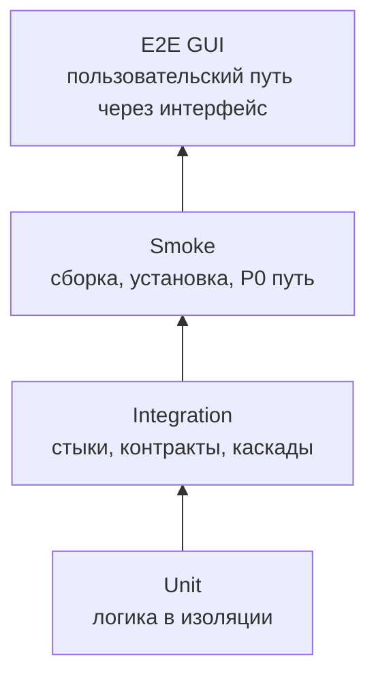
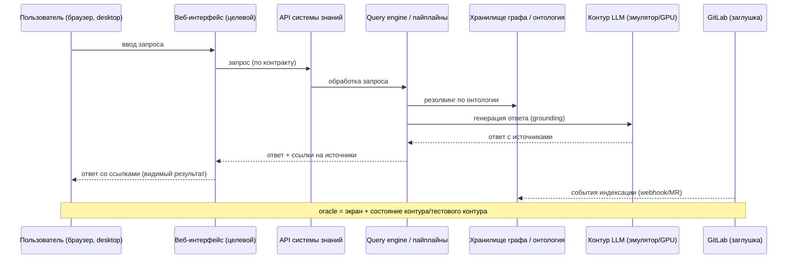

# E2E-тестирование GUI — GraphRAG

> **Статус:** рабочий гайд для разработчиков, тестировщиков и ИИ-агентов.  
> **Назначение:** описать, как проектировать, запускать, ревьюить и подтверждать сквозные GUI-тесты так, чтобы они проверяли полный путь «пользователь → веб-интерфейс (ввод/навигация) → реальные процессы контура GraphRAG → наблюдаемый пользователем результат», а не имитировали достижение цели скриншотом или mock-данными.  
> **Текущее состояние проекта:** этап видения — интерфейс и кодовая база отсутствуют (`../src/README.md`); всё, что касается прогонов, стендов и CI, описывает **целевое состояние**; состав экранов веб-интерфейса уточняется на этапе проектирования (Фаза 1).  
> **Методологическая база:** спецификации `specs/qa/*.md` (E2E GUI, граница с E2E API, unit/integration, гейты, план тестирования), методология W&B (Validation, acceptance criteria, traceability), навыки `../../.agents/skills/aif-qa/SKILL.md` и `../../.agents/skills/quality-matrix/SKILL.md`; `../vision.md` (функции F1–F7, режимы, роли, метрики, эталонные кейсы K1/K4/K5/K17) — контекст для шагов, ожидаемых состояний и assertions; каталоги требований (функциональных, use cases, бизнес-правил, НФТ, пользовательских историй) — планируются (vision.md §2.2); код `../src/` — только для понимания реализации, не источник правды.

---

## 1. Место E2E GUI-тестов в стратегии качества

E2E GUI-тест проверяет **полный сквозной путь пользователя через веб-интерфейс**: действие пользователя (ввод запроса, навигация, клик) → обработка реальными процессами контура GraphRAG (ядро, оркестрация пайплайнов, query engine, MCP-сервер, контур LLM) → наблюдаемый пользователем результат (ответ со ссылками на источники, статус индексации, метрики, событие аудита). Тест исполняется в **браузере пользователя** (desktop): веб-интерфейс системы знаний, а не сервис.

E2E GUI-тест отвечает на вопрос: «работает ли система так, как её видит и как с ней взаимодействует пользователь — навигация, отображение состояния, ввод, ошибки, доступность?». Он проверяет то, что недостижимо на нижележащих уровнях: видимость и корректность UI-состояний, пользовательский ввод, ошибки и a11y. Он не должен превращаться в набор unit/integration-проверок API-стыков с контролем середины пути.

**Правило источников.** E2E GUI-сценарии выводятся **только из зафиксированных пользовательских сценариев**: на этапе видения — из функций `../vision.md` (F-коды F1.1–F7.3, §2.2) и эталонных кейсов (K1, K4, K5, K17); после появления каталога пользовательских историй (Gherkin) он станет основным источником. Роли, режимы, НФТ-метрики и контракты — контекст: они уточняют шаги, ожидаемые состояния и assertions, но не порождают E2E GUI-сценарии. Если для пути нет пользовательского сценария — уровень не E2E GUI, а GUI-integration (до появления требований), сценарий помечается `†` (раздел 12).



| Параметр | Правило проекта |
|---|---|
| Основная база | каталог пользовательских историй (планируется, vision.md §2.2); `../vision.md` (F1–F7, режимы, роли, метрики), `../glossary.md`, `../../.ai-factory/RESEARCH.md`, `../../.ai-factory/PLAN.md` — контекст; спецификации `specs/qa/*.md` — методология |
| Объект | целевой веб-интерфейс системы знаний (состав экранов уточняется на этапе проектирования): режим вопросов/ответов со ссылками на источники (F3), администрирование (индексация F1, онтология F2, метрики), аудит контура LLM (F7); a11y |
| Среда | E2E GUI стенд: браузер пользователя (desktop) + реальные процессы контура GraphRAG + тестовый контур (заглушки GitLab, эмулятор LLM с golden-ответами, тестовые хранилища); screen reader для a11y; матрица целевых браузеров |
| Время | Десятки минут; набор самый дорогой и наименее параллелизуемый, выполняется после integration и smoke, прогон ночной/релизный |
| Выходной критерий | Сквозные P0/P1 GUI-сценарии проходят с внешним орáкулом и артефактами прогона (скриншоты/видео/a11y-дерево); негативные и a11y-сценарии выполнены |

**Граница с unit:** если заменяются зависимости (mock, fake API) и проверяется единица кода/компонента/преобразования — это unit (`specs/qa/unit-testing.md`).  
**Граница с integration:** если проверяется один стык (веб-интерфейс ↔ API системы знаний, query engine ↔ хранилище графа) с контролем середины пути — это integration (`specs/qa/integration.md`); проверка внутренних состояний без пользовательского сценария — тоже integration.  
**Граница с smoke:** если проверяется только «веб-интерфейс открылся, страница загрузилась» за 5–15 минут — это deployment smoke (`specs/qa/README.md`).  
**Граница с E2E API:** если путь не проходит через пользовательский интерфейс (ИИ-агент → MCP/API, Git API GitLab) — это E2E API (`specs/qa/e2e-api-testing.md`). MCP-протокол и контракты API проверяются E2E API; пользовательский путь через веб-интерфейс — E2E GUI.

---

## 2. Цели E2E GUI-тестирования

E2E GUI-тест должен отвечать на один или несколько вопросов:

1. **Пользовательский сценарий работает через интерфейс?** Действие пользователя в веб-интерфейсе приводит к ожидаемому пользовательскому результату (ответ со ссылками на источники, статус индексации обновлён, метрики отображены, событие аудита записано).
2. **GUI отображает актуальное состояние системы знаний?** Статус индексации, доступность контура LLM, метрики, состояние онтологии согласованы с реальным состоянием контура GraphRAG, а не с mock.
3. **Действия в GUI приводят к реальным изменениям системы?** Запуск индексации, изменение онтологии, настройки контура LLM меняют состояние контура GraphRAG, и GUI отражает результат.
4. **Состояние согласовано между GUI и остальной системой?** Статусы в интерфейсе и за интерфейсом (пайплайны индексации, хранилище графа, контур LLM, GitLab) не противоречат друг другу; смена состояния извне (коммит/webhook GitLab, падение контура LLM) отображается в GUI.
5. **Ошибки понятны пользователю?** Системные ошибки (контур LLM недоступен, индекс не готов, ошибка индексации) показываются явным сообщением/состоянием, а не «молчанием» или падением.
6. **Негативные и граничные сценарии безопасны?** Неавторизованный доступ отклоняется, поведение интерфейса при недоступности сервиса контролируемо (только негативные сценарии), повторный ввод не ломает состояние.
7. **Сценарий доступен (a11y)?** Screen reader (NVDA, VoiceOver) объявляет ключевые элементы (ответ, источники, статусы), навигация выполнима с клавиатуры, фокус видим и предсказуем (WCAG).
8. **Платформозависимое поведение корректно?** Вёрстка, тема, масштаб, локализация в целевых браузерах (desktop).
9. **NFR-прокси на уровне UI?** Тёмная тема, время ответа интерфейса (медиана, p90), отсутствие секретов в логах.
10. **Сценарий написан до реализации?** Где только возможно, сквозной GUI-сценарий проектируется и пишется до фичи и обязан быть «красным» до её реализации (раздел 16.3).
11. **Пользовательский сценарий покрыт?** E2E GUI-сценарий существует только там, где есть зафиксированное пользовательское поведение (F-код/эталонный кейс; Gherkin — после появления каталога); изменение требования пересматривает сценарий, а не наоборот.

По W&B E2E GUI — самое близкое к валидации пользовательского опыта представление требований: если пользовательский сценарий нельзя объективно проверить через интерфейс на стенде, это дефект требования, контракта интерфейса или архитектуры (непроверяемость, неоднозначность, неполнота).

---

## 3. Что покрывать в первую очередь

### 3.1. Приоритеты

| Приоритет | Что обязательно покрывать E2E GUI |
|---|---|
| P0 | Критический GUI-путь (эталонные кейсы K1, функции F1, F7): пользователь задаёт вопрос → ответ со ссылками на источники; администратор запускает индексацию → статус и метрики обновляются; ИБ просматривает аудит обращений к контуру LLM; корпоративная аутентификация и аудит действий (целевой сценарий) |
| P1 | Основные пользовательские пути: куратор вносит изменение в онтологию → пересчёт резолвинга (F2.3); сверка ответа с источником (K5); обработка сигналов с полей (F5); контекстный режим через MCP (F6, K17); a11y-основа (screen reader, keyboard-only) |
| P2 | Отображение деталей (источники, метаданные артефактов), тёмная тема, трассируемость/анализ влияния (F4), детальные отчёты метрик |

### 3.2. Объекты E2E GUI-тестирования

| Объект | Что проверять сквозным пользовательским путём |
|---|---|
| Режим вопросов/ответов (F3) | (целевой, состав экранов уточняется на этапе проектирования): ввод запроса → ответ со ссылками на источники (grounding/provenance), переход к источнику, пустые/неоднозначные результаты |
| Администрирование (F1, F2) | (целевой): запуск/статус индексации, метрики индекса, онтологический слой (F2), сообщения об ошибках |
| Аудит контура LLM (F7) | (целевой): события обращений к LLM, фильтрация утечек (F7.2), журнал аудита, понятные сообщения |
| Диалоги и ошибки | понятное сообщение об ошибке, кнопки «Повторить», состояние «Загрузка...», отсутствие «молчаливых» сбоев |
| a11y | объявление элементов screen reader-ом, keyboard-only навигация, порядок фокуса, текстовые альтернативы, контраст |

### 3.3. Критичные классы дефектов

Обязательные сквозные проверки для проекта:

- рассинхрон GUI ↔ система: GUI показывает устаревший статус индексации/доступности контура LLM, а реальное состояние контура GraphRAG — актуальное (или наоборот);
- GUI отображает mock/фиктивные данные как реальные (подмена реальных ответов заглушками);
- некорректное отображение статуса индексации, доступности контура LLM, метрик, источников ответа;
- поведение интерфейса при недоступности сервиса: падение/«молчание» вместо понятного состояния (контур LLM, GitLab недоступны);
- действие без корпоративной аутентификации проходит, журнал аудита обращений к контуру LLM не пишется (пользователь, действие, время, результат);
- ошибки пользовательского ввода (невалидный запрос, некорректные параметры индексации) не объяснены или приводят к неконсистентному состоянию;
- a11y-нарушения: элементы без текстовых альтернатив, недоступная клавиатурная навигация, невидимый фокус (WCAG);
- платформозависимое поведение: вёрстка/тема/масштаб/локализация в конкретном браузере — выявляется только на реальном браузере.

---

## 4. Источники правды перед написанием сценария

Источник правды для E2E GUI-сценария — **зафиксированный пользовательский сценарий**: сценарий существует, потому что есть пользовательское поведение, которое нужно проверить через интерфейс. На этапе видения основной источник — **`../vision.md`**: функции F1–F7 (§2.2), режимы (§1.5/§2.1), роли (§3.1), метрики и эталонные кейсы (K1, K4, K5, K17). Остальные артефакты — контекст: они уточняют шаги, ожидаемые состояния и assertions, но не порождают E2E GUI-сценарии.

**Основной источник (правило отбора):**

1. **`../vision.md`** — функции F1–F7 с подфункциями (F1.1–F7.3, §2.2), режимы продукта, роли, метрики; каталог пользовательских историй (Gherkin) **планируется** (vision.md §2.2) и станет основным источником E2E GUI-сценариев. Пока каталога нет, сценарии помечаются `†` и исполняются на GUI-integration-уровне (разделы 4 и 12).

> **Текущее состояние:** проект на этапе видения — интерфейс и кодовая база отсутствуют (`../src/README.md`); каталог пользовательских историй не создан. Все GUI-сценарии — целевые («состав экранов уточняется на этапе проектирования (Фаза 1)»), помечены `†`/`*` и до появления требований исполняются на GUI-integration-уровне или ожидают этапа проектирования (разделы 4 и 12). Появление каталога требований расширяет E2E GUI-набор и является предусловием для гейта трассируемости (FG-TRACE).

**Контекст и детали:**

2. **`../vision.md`** — функции F1–F7 (vision §2.2): F1 индексация и граф знаний, F2 онтологический слой, F3 ответы со ссылками на источники, F4 трассируемость/анализ влияния, F5 накопление знаний, F6 context compiler (MCP), F7 безопасный контур LLM — критерии целевого поведения; каталоги требований (функциональных, use cases, бизнес-правил) — планируются (vision.md §2.2).
3. **Роли и каналы** — vision §3.1: разработчик (быстрый доступ через IDE/MCP), аналитик, тестировщик, куратор онтологии, администратор (индексация, метрики, контур LLM), ИБ (аудит контура LLM), менеджер проекта; взаимодействие через API/MCP.
4. **Контракты интерфейсов** — уточняются на этапе проектирования (Фаза 1): веб-интерфейс ↔ API системы знаний; MCP-сервер (F6); Git API/webhook/MR (GitLab).
5. **НФТ-метрики** — vision §2.2: точность ответов RAG ≥ 70 %, время ответа (медиана, p90), число противоречий, доля артефактов со связями, время сигнал→фикс, доля обращений к LLM через корпоративный канал (0 вне контура), минимизация токенов.
6. **`specs/qa/test-plan.md`** — целевые сценарии UI-01…UI-04, UI-A11Y-* (раздел 12).
7. **`../adr/README.md`** — ADR: единый язык Go (ADR-IMPL.STACK.go-single-language-adoption, ПРИНЯТО); архитектурные диаграммы (C4) планируются.
8. **`../../.ai-factory/RESEARCH.md`, `../../.ai-factory/PLAN.md`, `../../.ai-factory/RULES.md`** — исследование, планы и правила проекта; **`../../.ai-factory/references/fitness-functions.md`** — fitness-функции.

Код и конфигурация `../src/` используются только для понимания фактического поведения и диагностики; реализация **не является источником правды** — она может отставать от требований или содержать дефекты. На этапе видения кодовой базы нет (`../src/README.md` — только описание).

**Правило отбора для уровня: нет пользовательского сценария — нет E2E GUI.** Если для проверяемого пути нет зафиксированного пользовательского поведения, сценарий исполняется на GUI-integration-уровне до появления требований (такие сценарии помечены `†` в разделе 12). Исключение — НФТ-проверки UI (тёмная тема, время отклика, чистота логов): их источник — метрики vision §2.2, это не пользовательские сценарии.

Правило для ИИ-агента: **не выдумывать пользовательские сценарии, элементы UI и детали контракта** (состав экранов уточняется на этапе проектирования). Если требование и предполагаемая реализация расходятся, не «чинить» сценарий молча — зафиксировать расхождение как дефект, открытый вопрос или known gap.

---

## 5. Как выбирать E2E GUI-сценарии из требований

### 5.1. Алгоритм трассировки требований → E2E GUI-сценарий (контекст: vision F-коды, роли, НФТ)

1. Найти пользовательский сценарий проверяемого поведения — F-код (vision §2.2) или эталонный кейс (K1, K4, K5, K17); после появления каталога — Gherkin-историю; если пользовательского сценария нет — это не E2E GUI (раздел 4).
2. Найти связанные F-коды (F1.1–F7.3), роли (vision §3.1), режимы (vision §1.5/§2.1) и НФТ-метрики для контекста: шаги, ожидаемые состояния, ограничения.
3. Выписать критерий пользовательского сценария: «когда пользователь делает X в интерфейсе, система отображает/выполняет Y, состояние Z согласовано между GUI и системой».
4. Определить сквозной путь: пользователь → элемент веб-интерфейса → сегменты (API системы знаний → query engine / пайплайны индексации → хранилище графа / контур LLM / GitLab) → наблюдаемый пользовательский результат.
5. Найти контракт сегмента (уточняется на этапе проектирования) и внутренние состояния системы за интерфейсом.
6. Найти сценарий в `specs/qa/test-plan.md` с уровнем E2E GUI (UI-01…UI-04, UI-A11Y-*) или создать новый ID при расширении плана.
7. Разделить проверки по уровням:
   - чистая логика и преобразования → unit;
   - стык (веб-интерфейс ↔ API, query engine ↔ хранилище) с контролем середины → integration;
   - полный пользовательский путь как чёрный ящик, есть пользовательский сценарий → E2E GUI;
   - полный пользовательский путь без зафиксированного сценария → GUI-integration до появления требований;
   - путь без GUI (ИИ-агент → MCP/API) → E2E API (`specs/qa/e2e-api-testing.md`).
8. Сформировать минимум: happy path, negative case, сбойное состояние (контур LLM/GitLab недоступны, невалидный ввод), a11y-проверка, oracle.
9. Привязать сценарий к требованию (F-код/эталонный кейс — основной trace) и ролям/режимам/НФТ (контекст) в метаданных сценария или отчёте.

### 5.2. Шаблон декомпозиции сценария

```text
Требование (основной источник): <F-код F1.1–F7.3 / эталонный кейс K1/K4/K5/K17> (vision §2.2;
  Gherkin-история появится в каталоге требований — планируется)
Контекст: <роль (vision §3.1), режим (vision §1.5/§2.1), НФТ-метрика>
Сценарий QA: <UI-01…UI-04 / UI-A11Y-*> (уровень E2E GUI, целевой; состав экранов уточняется на этапе проектирования)

Сквозной путь:
- initiator: <пользователь в браузере (desktop) / MCP-клиент>
- segments: <элемент веб-интерфейса → API системы знаний → query engine / пайплайны индексации
            → хранилище графа / контур LLM / GitLab>
- observer: <экран пользователя (скриншот/a11y-дерево) + внешнее состояние
            (хранилище графа, контур LLM, GitLab, файлы)>

Предусловия:
- <браузер с фиксированными темой/масштабом/локалью>
- <реальные процессы контура GraphRAG: ядро, оркестрация пайплайнов, query engine, MCP-сервер, интеграции>
- <тестовый контур как фон/наблюдатель: заглушки GitLab, эмулятор LLM с golden-ответами>
- <тестовые данные: артефакты корпуса, учётные записи, фикстуры>

Проверки:
- happy path: <действие пользователя> → <пользовательский результат + согласованное состояние системы>
- negative: <невалидный ввод/действие без авторизации> → <явный отказ/сообщение>
- fallback: <контур LLM / GitLab недоступен> → <понятное состояние, без падения>
- consistency: <статусы GUI ↔ контур GraphRAG ↔ GitLab согласованы>
- oracle: <что видит пользователь + состояние системы за интерфейсом>

Артефакты:
- <команда запуска/playbook>
- <скриншоты с таймстампами, видео сессии>
- <a11y-дерево страницы>
- <логи интерфейса и процессов контура GraphRAG>
- <ссылка на CI/job>
```

### 5.3. Комментарии и метаданные трассировки

Для автоматизированных E2E GUI-тестов применяется машинно-проверяемый формат trace-комментариев: основной trace — на требование (F-код/эталонный кейс), далее контекст (роли, режимы, НФТ), по одному ID на строку. GUI-автоматизация в проекте — браузерная автоматизация (Playwright, раздел 17), поэтому формат — docstring/комментарии:

```python
# F3 (vision §2.2): пользователь задаёт вопрос и получает ответ со ссылками на источники (K1).
# F1 (vision §2.2): администратор запускает индексацию и видит статус и метрики (контекст).
# F2.3 (vision §2.2): куратор вносит изменение в онтологию, резолвинг пересчитывается (контекст).
def test_scenario_UI01_query_answer_with_sources():
    ...
```

Правила:

- **первая строка — основной trace на требование** в формате `// F<1-7>.<подфункция>: ...` (или `// K<номер>: ...` для эталонного кейса); после появления каталога пользовательских историй основной trace — на Gherkin-историю; ID должен существовать в `../vision.md` (или в каталоге требований после его создания);
- далее — контекст: F-коды, роли (vision §3.1), НФТ-метрики (по одному ID на строку);
- описание после двоеточия формулирует проверяемое пользовательское поведение, а не название файла;
- scenario ID из `specs/qa/test-plan.md` (UI-01, UI-A11Y-02) указывается в имени теста, metadata или отчёте;
- если проверяется security-gap или known gap без оформленного требования (например, a11y-домен), указать ID gap и ближайший F-код; отсутствие — вопрос к требованиям (раздел «Открытые вопросы» планируется).

Для ручных или полуавтоматических прогонов трассировка фиксируется в отчёте (шаблон — раздел 21.3).

Связка гейтов: `FG-TEST` (сценарий покрывает acceptance criteria) → `FG-TRACE` (F-коды ↔ сценарий) → `FG-TEST-QUALITY` (реальные assertions, negative cases); в целевом CI — гейт E2E GUI (планируется).

---

## 6. Объекты E2E GUI-тестирования

### 6.1. Экраны и элементы как контракт UI

Состав экранов не зафиксирован (этап видения); целевой веб-интерфейс: режим вопросов/ответов (F3), администрирование (индексация F1, онтология F2, метрики), аудит контура LLM (F7) — контракт UI уточняется при проектировании.

| Область интерфейса | Реализация | Ключевые состояния/значения | Сценарии |
|---|---|---|---|
| Состав экранов | не зафиксирован (этап видения; `../src/README.md`) | целевой веб-интерфейс: режим вопросов/ответов (F3), администрирование (F1, F2), аудит контура LLM (F7) | UI-01…UI-04 |
| Контракт UI | уточняется на этапе проектирования (Фаза 1) | ключевые элементы, состояния и значения определяются контрактом UI | UI-01…UI-04 |
| Режим вопросов/ответов (F3) | уточняется на этапе проектирования | ввод запроса, ответ со ссылками на источники (grounding), переход к источнику, состояния «Загрузка...»/ошибка | UI-01 |
| Администрирование (F1, F2) | уточняется на этапе проектирования | запуск/статус индексации, метрики индекса, онтологический слой (F2), состояния ошибок | UI-02, UI-03 |
| Аудит контура LLM (F7) | уточняется на этапе проектирования | события обращений к LLM, фильтрация утечек (F7.2), журнал аудита | UI-04 |
| API/MCP-стык | уточняется на этапе проектирования | веб-интерфейс ↔ API системы знаний; MCP-сервер (F6) — для ИИ-агентов | фон всех UI-* |

### 6.2. Сквозные GUI-пути как объект проверки

E2E GUI проверяет не отдельные элементы, а цепочки «пользовательское действие → системный эффект → отображение»:

| Путь | Звенья | Что проверить |
|---|---|---|
| Запрос → ответ (K1) | пользователь → ввод запроса → API → query engine → граф/онтология → контур LLM → экран | ответ со ссылками на источники; источник реально существует и соответствует grounding |
| Индексация (F1) | администратор → запуск индексации → пайплайны → хранилище графа → экран | статус индексации и метрики обновляются; изменения GitLab (webhook/MR) подхватываются |
| Онтология (F2.3) | куратор → изменение онтологии → пересчёт резолвинга → экран | сигнал о пересчёте; резолвинг пересчитан (F2.3) |
| Аудит контура LLM (F7.2) | ИБ → открытие аудита → события контура → экран | события обращений к LLM, фильтрация утечек (F7.2); вне контура — 0 обращений |
| Контекстный режим (F6, K17) | ИИ-агент → MCP → context compiler → контур | контекст собран и передан агенту (проверяется в E2E API; в GUI — отображение/статус) |
| Состояние системы знаний | внешнее изменение (коммит GitLab, падение контура LLM) → интерфейс | статусы/метрики в GUI согласованы с реальным состоянием контура |

Правила пути:

- фиксировать состояние GUI через внешние средства чтения (a11y-дерево/DOM страницы), а не через внутренние структуры процесса;
- проверять системный эффект действия через внешний oracle: состояние хранилища графа/контура LLM/GitLab, файлы, логи — а не только «кнопка нажалась»;
- добавлять negative case: недоступный контур LLM/GitLab, невалидный ввод, отсутствие авторизации должны давать понятное состояние;
- при падении сохранять скриншоты, видео, a11y-дерево и логи всех процессов контура.

### 6.3. Что НЕ является E2E GUI

- проверка одного API-стыка (веб-интерфейс ↔ API системы знаний, query engine ↔ хранилище) с контролем середины (integration);
- unit-тесты компонентов/преобразований;
- проверка «веб-интерфейс открылся, страница загрузилась» (deployment smoke);
- прогон с заменой реальных процессов контура на mock, когда сценарий заявлен как E2E (запрещено, раздел 8.2);
- скриншот без проверки содержимого/состояния («страница есть» без assertion-а);
- контракты API/MCP (MCP-протокол, Git API) — это E2E API (`specs/qa/e2e-api-testing.md`);
- полный пользовательский путь без зафиксированного пользовательского сценария (это GUI-integration до появления требований, раздел 4).

---

## 7. Тестовые стенды и окружения

### 7.1. Классы стендов

| Стенд | Состав | Назначение |
|---|---|---|
| Dev / CI быстрый набор | Компоненты как процессы; `go test -race`; lint; проверка контрактов | unit + build smoke + быстрые контрактные/integration проверки на MR/push |
| Основной стенд интеграции | Реальные процессы контура GraphRAG (ядро, оркестрация пайплайнов, query engine, MCP-сервер, интеграции) + точечные заглушки внешних стыков | integration-сценарии, в т. ч. GUI-integration (UI-* до появления требований) |
| **Стенд E2E GUI** | **Браузер пользователя (desktop)** + реальные процессы контура GraphRAG + тестовый контур (заглушки GitLab, эмулятор LLM с golden-ответами, тестовые хранилища) + средства браузерной автоматизации | **E2E GUI-сценарии, a11y, проверки на целевых браузерах** |
| a11y-стенд | Стенд E2E GUI + screen reader (NVDA, VoiceOver), keyboard-only контур | сценарии доступности (WCAG) |
| Браузерная матрица (desktop) | целевые браузеры в периметре компании (фиксированные версии, темы, масштабы) | платформозависимые GUI-пути, smoke после развёртывания |

### 7.2. Обязательные свойства стенда E2E GUI

- **Браузер пользователя**: веб-интерфейс работает в браузере пользователя (desktop); тесты запускаются через браузерную автоматизацию (Playwright); прогон, не проходящий через реальный браузер, не является E2E GUI.
- **Реальные процессы контура GraphRAG**: ядро, оркестрация пайплайнов, query engine, MCP-сервер, интеграции — реальные процессы; ни один проверяемый компонент не заменён эмулятором.
- **Тестовый контур** — согласованный фон (заглушки GitLab, эмулятор LLM с golden-ответами, тестовые хранилища), изолированный от продуктивного; недоступность внешних систем не должна ломать тесты (принцип изоляции, `specs/qa/README.md`).
- **Детерминированное окружение сессии**: фиксированные браузер/версия, локаль, тема (светлая/тёмная), масштаб, разрешение окна, отключённые системные анимации и автообновления.
- **Средства чтения UI**: DOM/a11y-дерево страницы + скриншоты/видео; для a11y — screen reader.
- Данные детерминированные; артефакты корпуса, учётные записи, golden-ответы эмулятора LLM — только тестовые.
- Топология соответствует `../vision.md` и ADR (`../adr/README.md`); логи интерфейса и процессов контура и версии бинарников/контрактов сохраняются как артефакты.
- Стенд допускает fault injection: остановку компонентов контура (query engine, MCP-сервер, контур LLM), отключение сети, смену темы/масштаба для негативных и НФТ-сценариев.
- Тестовые стенды управляются оркестратором (целевое состояние): фиксация состояния до прогона, утилизация после.

### 7.3. Правило выбора стенда

| Если нужно проверить | Использовать |
|---|---|
| Полный пользовательский путь через интерфейс | Стенд E2E GUI |
| Доступность (screen reader, keyboard-only) | a11y-стенд |
| API-стык с контролем середины | Основной стенд интеграции |
| Платформозависимый GUI-путь (тема, масштаб, локализация) | Браузерная матрица целевых браузеров (desktop) |
| Путь без GUI (ИИ-агент → MCP/API, Git API) | Стенд E2E API |

---

## 8. Заглушки и эмуляторы

### 8.1. Главное правило

В E2E GUI-тесте **ни один компонент контура GraphRAG не может быть заменён fake/mock/stub**, и **веб-интерфейс не может быть заменён эмуляцией интерфейса «в памяти»**: сквозной путь обязан проходить через реальный браузер и реальные процессы контура. Эмуляция допустима только на внешнем контуре — там, где в продуктиве находятся GitLab, контур LLM или внешние клиенты (ИИ-агенты).

Примеры:

- проверяем «запрос → ответ со ссылками» → реальные интерфейс, query engine и хранилище графа, тестовый контур (эмулятор LLM с golden-ответами) как источник состояния;
- проверяем «сверка ответа с источником (K5)» → реальные интерфейс и хранилище графа, заглушка GitLab и файлы корпуса как наблюдатель;
- проверяем «аудит контура LLM (F7)» → реальные интерфейс и контур LLM (эмулятор), события аудита как наблюдатель.

### 8.2. Поведение интерфейса при недоступности сервиса — только негативные сценарии

Режим подмены реальных сервисов контура заглушками (внутри интерфейса) — это debug/разработка-режим, и его использование в E2E GUI-сценарии ограничено:

- сценарий «поведение интерфейса при недоступности сервиса» — единственный штатный случай: проверяется, что интерфейс переходит в понятное состояние без падения (negative/деградационный сценарий);
- в happy-path E2E GUI-сценариях подмена реальных процессов заглушками **запрещена**: она имитирует данные и обесценивает результат прогона (анти-фейк, раздел 16);
- если сценарий случайно выполнился в режиме подмены (заглушка включена на стенде), это **дефект стенда/конфигурации**, и результат не принимается: статус сценария — `not verified`.

### 8.3. Тестовый контур как фон и наблюдатель

| Сервис контура | Роль в E2E GUI-пути |
|---|---|
| GitLab (заглушка) | источник корпуса (markdown-спеки) и событий webhook/MR, от которых зависят статусы индексации |
| Эмулятор LLM (golden-ответы) | источник ответов с известными golden-результатами для сверки grounding (K5) |
| Тестовые хранилища (граф, артефакты) | источник состояния, которое интерфейс должен отображать |
| Мониторинг/аудит (stub) | наблюдатель событий, порождённых действиями пользователя (обращения к LLM, индексация) |

Тестовый контур **не является предметом проверки**, но он — независимый орáкул состояния за интерфейсом: GUI обязан отображать то, что реально происходит в системе.

### 8.4. Инструменты браузерной автоматизации — интерфейс чтения, не замена

Средства браузерной автоматизации (Playwright и подобные) — это **способ читать и управлять реальным веб-интерфейсом**, а не замена GUI: они работают с живой страницей в браузере и не должны использоваться для «прорисовки» ожидаемого результата в обход приложения.

---

## 9. Инстансы сервисов

### 9.1. Контур GraphRAG: реальные процессы

| Инстанс | Роль в E2E GUI-пути |
|---|---|
| Веб-интерфейс | целевой веб-интерфейс системы знаний (браузер пользователя); состав экранов уточняется на этапе проектирования |
| Ядро / оркестрация пайплайнов | индексация корпуса (F1), статусы и метрики |
| Query engine | обработка запросов, ответы со ссылками на источники (F3, K1) |
| Онтологический слой (F2) | машинно-читаемая DDD-модель, резолвинг (F2.3) |
| MCP-сервер | контекстный режим для ИИ-агентов (F6, K17) |
| Контур LLM | локальный GPU-контур (Linux, NVIDIA; open-weight; vLLM/Ollama/llama.cpp, OpenAI-совместимый endpoint); в тестовом контуре — эмулятор с golden-ответами |
| Интеграции (GitLab) | источник корпуса, webhook/MR |
| Screen reader | NVDA / VoiceOver — для a11y-сценариев |

### 9.2. Тестовый контур

Заглушки GitLab, эмулятор LLM с golden-ответами, тестовые хранилища — как фон состояния, которое GUI обязан отображать.

### 9.3. Минимальный набор по типу сценария

| Тип E2E GUI-пути | Минимально поднять |
|---|---|
| Запрос → ответ (UI-01) | веб-интерфейс + query engine + хранилище графа + эмулятор LLM (golden-ответы) |
| Индексация (UI-02) | веб-интерфейс + пайплайны индексации + хранилище графа + заглушка GitLab |
| Онтология (UI-03) | веб-интерфейс + онтологический слой (F2) + хранилище графа |
| Аудит контура LLM (UI-04) | веб-интерфейс + контур LLM (эмулятор) + журнал аудита |
| Поведение при недоступности сервиса | веб-интерфейс + fault injection (остановка компонента контура) |
| Контекстный режим MCP (F6, K17) | MCP-сервер + query engine + контур LLM (проверяется в E2E API; в GUI — статус/отображение) |
| a11y (screen reader, keyboard-only) | веб-интерфейс + screen reader |
| Тёмная тема | веб-интерфейс; все экраны |

---

## 10. Процедура E2E GUI-тестирования

### Шаг 0. Подготовка входных критериев

1. Проверить, что unit-уровень зелёный для затронутых компонентов: `go test -race ./...`.
2. Проверить, что integration-сценарии по затронутым стыкам зелёные (веб-интерфейс ↔ API, query engine ↔ хранилище и др.).
3. Проверить контракты API/MCP (по мере появления; на этапе видения контрактов нет, уточняется на этапе проектирования).
4. Зафиксировать версии: commit SHA, версии бинарников, версии контрактов (по мере появления), конфигурацию стенда (браузер, локаль, тема, масштаб).
5. Выбрать E2E GUI-сценарии из раздела 12 и `specs/qa/test-plan.md` по изменению/риску.
6. Подготовить тестовые данные из раздела 13 (артефакты корпуса, учётные записи, golden-ответы, фикстуры).
7. Убедиться, что продуктивные секреты и окружения не используются; на тестовых стендах отключены автообновления и блокировки.

### Шаг 1. Развернуть стенд

1. Развернуть стенд: тестовый контур (заглушки GitLab, эмулятор LLM с golden-ответами, тестовые хранилища) и реальные процессы контура GraphRAG.
2. Установить компоненты контура GraphRAG (ядро, оркестрация пайплайнов, query engine, MCP-сервер, интеграции), открыть веб-интерфейс в браузере пользователя.
3. Проверить deployment-smoke:
   - веб-интерфейс отвечает, страница загружается;
   - навигация по интерфейсу работает;
   - контур GraphRAG отвечает (query engine, MCP-сервер, контур LLM);
   - статус системы знаний виден в GUI и согласован с наблюдателем (лог/метрика/тестовый контур).
4. Очистить или инициализировать state: файлы логов, хранилища, темы, окружение браузера; зафиксировать стартовые скриншоты.
5. Сохранить стартовые логи и конфигурацию стенда.

### Шаг 2. Выполнить conformance-проверки сегментов пути

Перед сквозными сценариями убедиться, что каждый сегмент валиден (иначе падение сквозного сценария будет нелокализуемым):

- **API-контракт** (веб-интерфейс ↔ API системы знаний; контракт уточняется на этапе проектирования): ключевые операции отвечают по контракту; таймауты, status/error mapping корректны — проверяется внешним API-клиентом (это conformance, не E2E GUI);
- **UI-контракт**: ключевые элементы страницы доступны через DOM/a11y-дерево с ожидаемыми ролями/именами; скриншот-эталон основных экранов снят (состав экранов уточняется на этапе проектирования);
- **a11y-контракт** (для a11y-сценариев): screen reader объявляет ключевые элементы (ответ, источники, статус), фокус перемещается по ожидаемому порядку.

### Шаг 3. Выполнить сквозные E2E GUI-сценарии

Прогнать наборы `UI-01…UI-04`, `UI-A11Y-*` с уровнем `E2E GUI` из `specs/qa/test-plan.md`.

Для каждого пути обязательно:

1. **Happy path** — полное пользовательское действие с внешним орáкулом (экран + состояние системы).
2. **Negative path** — невалидный ввод/действие без авторизации отклоняется с понятным сообщением.
3. **Failure injection** — остановлен компонент контура (query engine, MCP-сервер, контур LLM), отключена сеть → контролируемое состояние GUI, без падения.
4. **Consistency** — статусы/метрики в GUI согласованы с контуром GraphRAG и тестовым контуром.
5. **Observability** — событие/лог/скриншот доказывают прохождение пути.

### Шаг 4. Выполнить негативные и security-сценарии

- неавторизованный доступ к интерфейсу/настройкам отклоняется; аудит обращений к контуру LLM пишется (F7.2);
- невалидный ввод (запрос, параметры индексации) → явная ошибка, состояние не ломается;
- контур LLM/query engine недоступен → интерфейс показывает понятное состояние без падения (только негативные сценарии);
- повторное действие (дублирующая индексация, повторная отправка) не ломает состояние;
- секреты не выводятся в логи и на экран;
- GUI не показывает mock-данные как реальные (проверка отсутствия подмены реальных процессов заглушками в happy path).

Если security-gap пока отражает целевое, но не реализованное поведение, сценарий помечается как expected fail / known gap, а не как passed.

### Шаг 5. Выполнить a11y-прогоны и проверки на целевых браузерах

На целевых браузерах (desktop) проверить полный путь:

- a11y-прогоны (WCAG, screen reader, keyboard-only): screen reader (NVDA, VoiceOver) объявляет ключевые элементы (ответ, источники, статус), keyboard-only навигация, порядок фокуса, контраст;
- тема/масштаб/локаль: тёмная тема, масштаб 100/125/150 %, русская/английская локаль;
- поведение интерфейса при недоступности сервиса (только негативные сценарии).

Текущее ограничение: CI-покрытие E2E GUI — целевое состояние (на этапе видения CI не настроен); прогоны выполняются локально/на стендах до появления целевого CI.

### Шаг 6. Зафиксировать результат

Сценарий считается завершённым только если есть:

- список выполненных scenario IDs;
- trace на F-коды/роли/режимы/НФТ/security-gap;
- версии компонентов, контрактов, стенда и окружения сессии;
- команда запуска или инструкция ручного прогона;
- скриншоты с таймстампами (и видео, где применимо) по каждому шагу;
- a11y-дерево страницы для a11y-сценариев;
- логи интерфейса и всех процессов контура — по таблице источников ниже;
- подтверждение negative case и failure injection;
- ссылка на CI/job или архив локального прогона;
- дефект с воспроизводимыми шагами при падении.

**Источники логов для факт-чекинга и разбора полётов** (собираются со стенда как артефакты, привязываются к scenario ID и таймстампам):

| Источник | Файл (по умолчанию) | Для чего нужен при разборе |
|---|---|---|
| Веб-интерфейс | логи интерфейса (пути уточняются на этапе проектирования) | действия/ошибки интерфейса, запуск/выход, адреса API |
| Ядро / оркестрация пайплайнов | логи пайплайнов индексации | статусы индексации (F1), события GitLab (webhook/MR) |
| Query engine | логи query engine | запросы, ответы, grounding (F3, K1) |
| MCP-сервер | логи MCP-сервера | сессии ИИ-агентов (F6, K17) |
| Контур LLM | логи шлюза LLM | обращения к LLM, фильтрация утечек (F7) |
| Тестовый контур (заглушки GitLab, эмулятор LLM) | логи/метрики эмуляторов | независимый орáкул состояния за UI |

Правила сбора: стендовые логи пишутся с уровнем `debug`; ротация (max size/age/backups) настроена в конфиге; секреты в логи не выводятся. Логи — материал для диагностики и разбора, **не основной oracle**: assertions строятся по экрану (скриншоты/a11y-дерево) и внешнему состоянию системы.

---

## 11. Специфика по целевым областям интерфейса и доменам

Ниже — сквозные проверки по целевым областям веб-интерфейса и смежным доменам. Состав экранов не зафиксирован (этап видения); все сценарии — целевые («состав экранов уточняется на этапе проектирования (Фаза 1)»). Сценарии `†` (нет зафиксированного пользовательского сценария) исполняются на GUI-integration-уровне до появления требований; `*` — целевая модель (to be).

### 11.1. Режим вопросов/ответов (F3)

E2E GUI-проверки (целевые; состав экранов уточняется на этапе проектирования):

- пользователь задаёт вопрос → интерфейс показывает ответ со ссылками на источники (grounding/provenance) (UI-01, эталонный кейс K1);
- ссылки на источники ведут к реальным артефактам корпуса (markdown-спеки GitLab, PDF-книги);
- сверка результата с источником (K5): фрагменты ответа соответствуют источнику;
- точность ответов RAG ≥ 70 % (критерий успеха vision §1.4) подтверждается на golden-наборах эмулятора LLM;
- состояние «Загрузка...» и понятная ошибка при недоступности контура LLM.

Обязательные negative cases: пустой/неоднозначный запрос, недоступный контур LLM, ссылка на отсутствующий источник.

### 11.2. Администрирование (F1, F2)

E2E GUI-проверки (целевые; состав экранов уточняется на этапе проектирования):

- администратор запускает индексацию корпуса → статус индексации и метрики обновляются (UI-02, F1);
- изменения в GitLab (коммит/webhook/MR) подхватываются индексацией (F1);
- куратор вносит изменение в онтологию → сигнал и пересчёт резолвинга (UI-03, F2.3);
- отображаются метрики: доля артефактов со связями, число противоречий, время сигнал→фикс;
- состояние «Загрузка...» и понятная ошибка при сбое индексации.

Обязательные negative cases: некорректные параметры индексации, недоступный GitLab, конфликтующие изменения онтологии, повторный запуск индексации (без дублирования эффекта).

### 11.3. Аудит контура LLM (F7)

E2E GUI-проверки (целевые; состав экранов уточняется на этапе проектирования):

- ИБ открывает аудит обращений к контуру LLM → события фильтрации и аудита (UI-04, F7.2/F7.3);
- доступ к интерфейсу/настройкам разрешён только авторизованным пользователям; попытка без корпоративной аутентификации отклоняется с понятным сообщением;
- каждое обращение к LLM фиксируется: пользователь/агент, действие, время, результат;
- доля обращений к LLM через корпоративный канал — 100 %, 0 вне контура (критерий успеха vision §1.4) — отображается и сверяема;
- попытка обращения вне контура LLM фиксируется как событие утечки.

Обязательные negative cases: неавторизованная попытка, отсутствие записи аудита при выполненном действии — дефект.

### 11.4. Доступность (a11y)

E2E GUI-проверки (домен a11y — целевой; WCAG, screen reader, keyboard-only):

- screen reader (NVDA, VoiceOver) объявляет ключевые элементы (ответ, источники, статусы) — текстовые альтернативы обязательны;
- keyboard-only навигация: все элементы и действия достижимы с клавиатуры, фокус видим и предсказуем;
- порядок фокуса и контраст соответствуют WCAG;
- до появления требований сценарии a11y исполняются как known gap / expected fail (UI-A11Y-*) и фиксируются в разделе «Открытые вопросы» (планируется).

---

## 12. Каталог E2E GUI-сценариев

Полные описания — в `specs/qa/test-plan.md`. Ниже свод идентификаторов с уровнем `E2E GUI` (все — целевые, состав экранов уточняется на этапе проектирования).

| Домен/область | Идентификаторы сценариев | Требование-источник |
|---|---|---|
| Режим вопросов/ответов (F3, сквозной) | UI-01† | F3; эталонный кейс K1 (vision §2.2) |
| Администрирование: индексация и граф знаний (F1) | UI-02† | F1 (vision §2.2) |
| Администрирование: онтологический слой (F2) | UI-03† | F2, F2.3 (vision §2.2) |
| Аудит контура LLM (F7) | UI-04† | F7, F7.2, F7.3 (vision §2.2) |
| НФТ UI | время ответа (медиана, p90); точность ответов RAG ≥ 70 % | vision §1.4 (критерии успеха), §3.2 (приоритеты) |
| a11y (сквозной, target) | UI-A11Y-*† | целевой домен a11y (WCAG); каталог требований планируется |

† — пользовательский сценарий (Gherkin) не заведён (каталог требований планируется, vision.md §2.2); по правилу раздела 4 сценарий исполняется на GUI-integration-уровне до появления требований.

\* — целевая модель (to be): интерфейс отсутствует (этап видения), сценарий фиксирует целевую модель и исполняется как expected fail / known gap до этапа проектирования (Фаза 1).

Правила:

- пользовательские E2E GUI-сценарии выводятся **только из зафиксированных пользовательских сценариев** (F-коды vision §2.2, эталонные кейсы — основной trace); роли/режимы/НФТ-метрики — контекст;
- НФТ-проверки UI (время отклика, точность RAG) — не пользовательские сценарии, их источник — метрики vision §2.2;
- сценарий с уровнем только `integration` не входит в E2E GUI-набор; сценарий с уровнями `E2E GUI, integration` в E2E GUI-наборе исполняется как полный пользовательский путь (без контроля середины).

---

## 13. Тестовые данные

Полный перечень — `specs/qa/test-plan.md`. Для E2E GUI-сценариев использовать фиксированные наборы:

| Группа | Данные |
|---|---|
| Стенд и сессия | фиксированные браузер/версия; локаль RU/en; тема light/dark; масштаб 100/125/150 %; разрешения 1920×1080 / 1366×768 / 1024×768; отключённые анимации и автообновления |
| Учётные записи | пользователь без прав, администратор; корпоративные тестовые учётные записи; пользователи для аудита (кто, действие, время, результат) |
| Корпус | тестовые артефакты: markdown-спеки (GitLab), PDF-книги; известные источники для сверки (K5) |
| Индексация | фикстуры: состояние индекса, метрики, события GitLab (коммит/webhook/MR) |
| Онтология | тестовые изменения DDD-модели: валидные/невалидные, конфликтующие |
| LLM | golden-ответы эмулятора LLM: валидные/невалидные, с/без grounding |
| Логи | тестовые наборы файлов логов с известными именами/размерами; пустой набор |
| Аудит | события обращений к LLM: в контуре, вне контура (утечка), без авторизации |
| Security | попытка доступа без авторизации, секреты в логах (негатив) |
| Контрактные payload | API/MCP-запросы/ответы: валидные/невалидные (по мере появления контрактов) |

Правила данных:

- не использовать продуктивные секреты, сертификаты и учётные записи;
- хранить фикстуры (конфиг, артефакты корпуса, golden-ответы, логи, скриншот-эталоны) рядом со сценарием или в выделенном каталоге test fixtures;
- фиксировать версию fixture при изменении контракта/интерфейса;
- минимум один валидный и один невалидный набор на критичный элемент UI;
- данные должны быть согласованы **между GUI и системой**: один и тот же артефакт/источник/статус в GUI, контуре GraphRAG, тестовом контуре и скриншот-эталоне;
- окружение сессии (тема, масштаб, локаль) фиксируется в отчёте — от него зависит воспроизводимость скриншотов.

---

## 14. Качество assertions и oracle

### 14.1. Что является реальной проверкой

Хороший E2E GUI-тест не ограничивается «страница открылась» или «скриншот снят». Он проверяет минимум один независимый внешний oracle и пользовательский результат:

- видимость и текст элемента (через DOM/a11y-дерево): ответ, источники, статус, сообщение об ошибке;
- изменение состояния интерфейса в ответ на действие: страница/секция обновлена, статус показан;
- системный эффект действия за интерфейсом: индекс обновлён в хранилище графа, событие аудита записано, настройка применена;
- согласованность GUI ↔ система: статусы в интерфейсе и в контуре GraphRAG/тестовом контуре не противоречат;
- отсутствие запрещённого эффекта: нет mock-данных в happy path, нет секретов в логах/на экране, нет обращений к LLM вне контура;
- a11y-результат: screen reader объявляет элемент, фокус в ожидаемом месте.

Плохо:

```text
Scenario UI-01: passed, потому что страница открылась и скриншот сохранён.
```

Лучше:

```text
Scenario UI-01: passed.
- Введён запрос; интерфейс показал ответ со ссылками на источники.
- Ссылки ведут к реальным артефактам корпуса (проверено по хранилищу графа вне UI).
- Точность ответа на golden-наборе ≥ 70 %; источник совпадает с grounding (сверено с эмулятором LLM).
- Скриншоты <answer_01.png>…<answer_03.png> и a11y-дерево приложены; логи query engine и контура LLM — артефакты.
```

### 14.2. Независимый oracle

Ожидаемый результат берётся из требований, контрактов и внешнего наблюдателя, а не из текущей реализации GUI. Если GUI показывает поле/состояние, которого нет в контракте, тест должен подсветить расхождение, а не расширить expected result без изменения спецификации.

Приоритет oracle:

1. **Пользовательский сценарий (F-код vision §2.2, эталонный кейс)** — ожидаемый пользовательский результат;
2. контракты API/MCP (уточняются на этапе проектирования) — контракт интерфейсов и состояния;
3. `../vision.md` (F1–F7), `../glossary.md`, ADR — контекст и критерии;
4. ADR (`../adr/README.md`) и архитектурные диаграммы (планируются);
5. `specs/qa/test-plan.md`;
6. внешний наблюдатель: состояние хранилища графа, контура LLM, тестового контура (заглушки GitLab, эмулятор LLM), файловая система, журнал аудита;
7. текущий код — только для понимания реализации и диагностики.

Тестовый контур и состояние контура GraphRAG — **независимый орáкул**: GUI обязан отображать реальное состояние системы, а не свои внутренние представления.

### 14.3. Negative assertions

Для каждого P0/P1 E2E GUI-пути должен быть хотя бы один negative assertion:

- неавторизованное действие отклонено с понятным сообщением;
- невалидный ввод (запрос, параметры индексации) отклонён, состояние не ломается;
- контур LLM/query engine недоступен → контролируемое состояние ошибки, без падения;
- повторное действие (дублирующая индексация, повторная отправка) не дублирует эффект;
- таймаут не оставляет GUI в неконсистентном состоянии.

---

## 15. Детерминированность и anti-flake

E2E GUI-тесты самые дорогие и потенциально нестабильные: они зависят от рендеринга, фокуса, сессии и платформы. Детерминизм обязателен.

### 15.1. Таксономия причин флаки

| Категория | Типичная причина | Пример в проекте |
|---|---|---|
| Рендеринг/тайминг | `sleep` вместо ожидания состояния элемента; асинхронные обновления страницы | «Загрузка...» → ответ/статус индексации |
| Окружение сессии | масштаб/тема/локаль/анимации не зафиксированы | скриншоты не совпадают, элементы не помещаются в окно |
| Фокус и ввод | фокус зависит от порядка окон; системные диалоги перехватывают ввод | диалог выбора файла, подтверждение закрытия |
| Браузер/вёрстка | элементы не готовы к моменту проверки; поведение различается по браузерам | DOM/a11y-дерево не находит элемент |
| Screen reader | асинхронность объявления; состояние фокуса | a11y-assertion ловит «пустое» объявление |
| Состояние стенда/контура | незачищенные логи/файлы/сессии, общий namespace | старые данные индекса, прежняя тема/масштаб |
| Параллелизм | параллельные прогоны на общем стенде | конфликт фокуса, файлов, данных корпуса |
| Внешний контур | нестабильный эмулятор LLM/заглушка GitLab | задержки ответов query engine |
| Fault injection | недетерминированный обрыв звена | остановка контура LLM в середине сценария |
| Системные помехи | автообновления, скринсейвер, блокировка сессии | «залипшие» тесты |

### 15.2. Правила детерминизма

- использовать фиксированные стенды: браузер/версия, локаль, тема, масштаб, разрешение, отключённые анимации;
- не зависеть от текущего времени без контролируемого окна/clock skew fixture;
- очищать файлы, логи, сессии, state GUI и окружение сессии перед сценарием;
- ожидать состояния по condition/polling (элемент виден, текст изменился, диалог появился), а не фиксированным `sleep`, где возможно;
- задавать явные timeouts и retries на каждом шаге (ожидание страницы, API, файла);
- запускать сценарии в изолированном окружении: один сценарий — одна сессия/путь;
- **идентичность пути**: один сценарий — один пользовательский путь; объединение путей затрудняет локализацию дефекта;
- системные помехи (автообновления, скринсейвер, блокировки) отключаются на тестовых стендах;
- при flake фиксировать причину: render, focus, session state, external dependency, platform issue.

### 15.3. Методы детекции

- повторные прогоны на стенде: тот же сценарий N раз на чистом окружении;
- история прогонов в CI: падение при неизменном коде и стенде — кандидат в флаки;
- метрика стабильности набора (`specs/qa/README.md`): доля флаки-прогонов ≤ порога (целевое состояние).

### 15.4. Жизненный цикл флаки-сценария

Сценарий, который «иногда проходит», не является подтверждением требования. Если сценарий нестабилен:

1. **Завести дефект** с владельцем; приложить скриншоты, видео, a11y-дерево, логи всех процессов контура, версии и конфигурацию стенда.
2. **Карантин** с зарегистрированным дефектом; «тихий» пропуск без дефекта запрещён.
3. **Устранить корень** по таксономии (15.1): рендеринг, фокус, состояние сессии, контур, fault injection; не увеличивать `sleep` «для стабилизации».
4. **Верифицировать**: N успешных прогонов подряд на чистом окружении (N ≥ 5).
5. **Вернуть** сценарий в набор, закрыть дефект.

---

## 16. Защита от имитации результатов (анти-фейк)

E2E GUI — самый дорогой уровень, и его результат проще всего имитировать: заявить «стенд развёрнут, GUI прошёл» без фактического исполнения. Поэтому результат принимается только по проверяемым артефактам.

### 16.1. Векторы имитации

| Вектор | Пример | Механизм обнаружения |
|---|---|---|
| «Зелёный» отчёт без прогона | заявлено «UI-01, UI-04 прошли» без скриншотов и CI | обязательные артефакты §16.4 |
| Скриншот не той страницы/стенда | скриншот другого приложения/старого стенда | таймстампы, хэш снапшота, a11y-дерево той же страницы |
| Mock вместо реального пути | happy path выполнен с подменой реальных процессов заглушками | правило §8.2: подмена только в сценарии недоступности сервиса; проверка конфигурации стенда |
| Слабый oracle | «страница открылась» без проверки содержимого и состояния системы | assertions §14 |
| Сокращённый путь | проверен только рендер экрана, но не системный эффект (индекс/событие аудита/статус) | шаг 3 раздела 10, чек полноты пути §19 |
| Проверка по логам вместо экрана | «прошло», потому что в логах интерфейса нет ошибки | oracle = экран + внешнее состояние §14.2 |
| Пропуск negative/failure injection | сценарии «недоступность сервиса», невалидного ввода не запускались | обязательный шаг 4 и DoD §18 |
| Подгонка expected под текущее поведение | тест закрепляет незавершённое поведение как норму | приоритет oracle §14.2 |
| Фальшивый CI/лог | лог не содержит command, SHA, versions | чек артефактов §16.4 и fresh-context §16.5 |

### 16.2. Слои защиты

| Слой | Что закрывает | Механизм | Гейт |
|---|---|---|---|
| 1. Требование | Неоднозначность/непроверяемость пользовательского пути | Verifiable + unambiguous (W&B), FG-гейты | Ревью набора требований |
| 2. Привязка | «Сценарий не про то требование» | trace-комментарий `// F3: ...` (раздел 5.3) | `FG-TRACE` |
| 3. Декомпозиция | Пропуск части критериев пути | Каждый критерий → конкретный сценарий (раздел 5) | `FG-TEST` |
| 4. Чувствительность | Сценарий, который не может упасть | Red-first, sabotage (раздел 16.3) | `FG-TEST-QUALITY` |
| 5. Орáкул | Орáкул = сам GUI (тавтология) | Внешний наблюдатель: экран + состояние контура GraphRAG/тестового контура/файлов | `FG-TEST`, conformance |
| 6. Независимость | Слепые пятна автора | Fresh-context ревьюер, саботаж-агент | Ревью (раздел 19) |
| 7. Исполнение | «Я запустил и всё зелёное» | Артефакты прогона, CI — доверенный исполнитель | DoD (раздел 18) |
| 8. Пирамида | Фейк на нижних уровнях | Integration/unit перепроверяют поведение | CI, пирамида |

### 16.3. Red-first на уровне сценария

Сценарий считается качественным, если есть одно из подтверждений:

- до реализации он падал на отсутствующей функции или невыполненном контракте;
- при остановке компонента контура (query engine, контур LLM) он падает ожидаемо;
- при невалидном вводе (запрос, параметры индексации) он падает ожидаемо;
- при намеренной поломке элемента/состояния (переименован элемент, сменён статус, включена заглушка) он падает ожидаемо.

Red-first не означает ломать продуктивную ветку. Достаточно временного локального изменения, feature flag, sabotage-ветки или controlled fault injection на тестовом стенде.

На уровне требований TDD означает: сквозной сценарий пишется до реализации фичи и до неё обязан быть «красным» (GUI без фичи, контракт не выполнен). Где это невозможно (код уже существует) — применяется sabotage-проверка: намеренная поломка звена/состояния должна ронять сценарий.

### 16.4. Артефакты прогона вместо заявлений

Минимальный набор доказательств:

- команда запуска или playbook;
- commit SHA, версии бинарников, версии контрактов и fixtures;
- идентификатор стенда и параметры сессии (браузер, локаль, тема, масштаб);
- скриншоты с таймстампами по каждому ключевому шагу (и видео, где применимо);
- a11y-дерево страницы для a11y-сценариев;
- логи интерфейса и всех процессов контура (таблица источников — раздел 10, Шаг 6);
- подтверждение системного эффекта: индекс/событие аудита/статус/файл;
- подтверждение negative case и failure injection;
- подтверждение red-first/sabotage для P0/P1 сценариев;
- ссылка на CI/job или архив локального прогона.

Если артефактов нет, статус сценария — **not verified**, даже если агент написал «passed».

### 16.5. Свежая верификация

Fresh-context reviewer или второй ИИ-агент должен:

1. прочитать только требование, контракт, сценарий и артефакты;
2. проверить, что scenario ID и trace ID совпадают;
3. убедиться, что GUI исполнялся в реальном браузере (не headless/подмена заглушками);
4. убедиться, что oracle внешний: экран + состояние системы, а не логи GUI;
5. сверить скриншоты/a11y-дерево с ожидаемым состоянием;
6. проверить наличие negative assertion;
7. проверить, что вывод «passed» следует из артефактов, а не из текста автора.

---

## 17. Команды запуска и автоматизация

### 17.1. Contract validation

Если в репозитории доступна команда проверки контрактов — выполнить её перед E2E-прогонами (команда уточняется на этапе проектирования вместе с появлением контрактов).

Ожидаемый результат: контракты интерфейсов (веб-интерфейс ↔ API системы знаний, MCP-сервер) и их версии согласованы.

### 17.2. Нижние уровни и настоящий E2E GUI

```sh
# unit/integration для затронутых компонентов
# нижние уровни не заменяют полноценный E2E GUI в реальном браузере
go test -race ./...
```

Веб-интерфейс позволяет использовать браузерную автоматизацию: один инструмент (Playwright) покрывает стабильные CI-проверки, реальную страницу в браузере, темы, масштаб и пользовательскую сессию. Поэтому для проекта используется двухслойная модель:

| Слой | Инструмент | Что проверяет | Где запускать |
|---|---|---|---|
| Быстрые component/integration-проверки | Go unit/integration tests | логику компонентов, обработку ответов API, состояния и ошибки | обычный CI |
| Contract/integration веб-интерфейс ↔ API | Go integration tests + API assertions | контракты API, payload, ошибки, статусы | CI / integration stand |
| Настоящий E2E GUI в браузере | Playwright (браузерная автоматизация) | реальную страницу в браузере, DOM/a11y-дерево, навигацию, keyboard-only, скриншоты | выделенные GUI-раннеры |
| Ручной/исследовательский E2E | playbook + артефакты | a11y, edge cases окружения, сценарии без стабильной автоматизации | E2E stand |

Политика выбора инструмента:

- Go unit/integration-тесты — основной инструмент для стабильной автоматизации логики в CI, но результат такого теста **не считается полноценным E2E GUI**, потому что он не проходит через реальную страницу в браузере;
- Playwright — рекомендуемый инструмент для **браузерного E2E GUI**, где тест управляет приложением как пользователь через DOM/a11y-дерево, клавиатуру и экран;
- Playwright используется выборочно, для критичных smoke/regression сценариев: открытие интерфейса, навигация, запрос/ответ (K1), индексация (F1), аудит (F7), keyboard-only;
- не переносить весь регресс на браузерную автоматизацию: для бизнес-логики, обработки ответов API, ошибок и состояний предпочтительнее Go unit/integration-проверки;
- клик, координата или скриншот-матчинг в браузерной автоматизации не являются oracle сами по себе: ожидаемый результат подтверждается скриншотом/видео, состоянием DOM/a11y-дерева, состоянием контура GraphRAG/тестового контура, payload, логами и независимыми артефактами;
- a11y-дерево (accessibility tree) браузера допустимо как вспомогательный локатор/читатель состояния, если оно работает с живым интерфейсом и повышает устойчивость по сравнению с координатами.

Минимальная привязка сценариев к инструментам:

| Сценарии | Рекомендуемый слой | Комментарий |
|---|---|---|
| `UI-01` (запрос/ответ, K1), `UI-04` (аудит, F7) | Go integration + выборочно Playwright smoke | Основную логику дешевле и стабильнее проверять ниже E2E; браузерный smoke подтверждает реальную страницу |
| `UI-02`, `UI-03` (индексация, онтология) | Go integration + проверки хранилища; выборочно Playwright | В E2E дополнительно подтверждать статусы и метрики |
| `UI-A11Y-*` | screen reader + a11y tooling; Playwright keyboard-only | Playwright помогает с состояниями, но не заменяет NVDA/VoiceOver |

Требования к контуру браузерной автоматизации:

| Параметр | Минимальные условия |
|---|---|
| Браузер | целевой браузер (desktop) с фиксированной версией; фиксированные тема/масштаб/локаль; отсутствие блокировок и скринсейвера |
| Стенд | тестовый контур (заглушки GitLab, эмулятор LLM с golden-ответами, тестовые хранилища) + реальные процессы контура GraphRAG; доступ к логам интерфейса и контура |
| Развёртывание | dev-стенд / тестовый контур / прод-подобный (реальный GPU-контур LLM, Linux, NVIDIA) |

Для браузерной автоматизации обязательны anti-flake правила:

- предпочитать селекторы по ролям/тексту/a11y-состоянию, а не голым координатам;
- фиксировать разрешение, масштаб, тему, язык и размер окна браузера;
- ожидать состояния через polling с timeout, а не через слепые `sleep`;
- сохранять видео/скриншоты до и после ключевых действий;
- собирать логи интерфейса и процессов контура и артефакты тестового контура по таблице источников логов из шага 6;
- при падении сценария сохранять последний screenshot, найденный селектор/состояние DOM, URL страницы и ссылку на CI job.

UI-автоматизация E2E GUI — **целевое состояние** (на этапе видения кода и CI нет; гейт E2E GUI в целевом CI планируется). Рекомендуемый контур автоматизации:

- нижний слой: Go unit/integration tests на каждый push/MR;
- браузерный слой: Playwright smoke/regression на выделенных GUI-раннерах;
- видео/скриншоты: ffmpeg или системный recorder, фиксированные пути артефактов;
- оркестрация стендов: скрипты или runner playbook, фиксация состояния до прогона, утилизация после;
- BDD-конвейер: пользовательские сценарии (F-коды/эталонные кейсы) → шаги unit/integration/Playwright по уровню проверки (`specs/qa/README.md`);
- тесты не должны обращаться к продуктивным endpoint; секреты только тестовые;
- `skip` допустим только с явной причиной отсутствующего стенда и не должен скрывать обязательный P0/P1 гейт.

### 17.3. Локальный playbook ручного сценария

Если сценарий пока ручной, в отчёте фиксировать:

```text
Scenario: <ID>
Trace: <F-код/эталонный кейс/роль/НФТ/security-gap>
Build: <commit SHA, version>
Stand: <стенд, браузер, сессия, тема, масштаб, процессы контура, тестовый контур>
Command/playbook: <шаги с точными значениями ввода>
Expected: <требование/наблюдаемая страница>
Actual: <наблюдаемое состояние страницы и системы>
Artifacts: <скриншоты, видео, a11y-дерево, логи интерфейса/контура, CI link>
Result: passed/failed/blocked/not verified
```

### 17.4. Связь с CI

Целевое состояние CI (`specs/qa/README.md`):

1. `FG-BUILD` — сборка компонентов.
2. `FG-UNIT` — unit-тесты и race для затронутых компонентов.
3. `FG-CONTRACT` / проверка контрактов — контракты API/MCP согласованы (по мере появления).
4. `FG-TRACE` — F-коды ↔ тесты/сценарии.
5. `FG-INTEGRATION` — integration-сценарии на стенде (включая GUI-integration).
6. `E2E GUI` — пользовательские сценарии GUI (запрос/ответ, индексация, онтология, аудит, a11y: NVDA/VoiceOver, keyboard-only) в браузере на стенде (**целевое состояние**, планируется).
7. `FG-SECURITY` — security-gap сценарии и secret checks.

Быстрый набор (lint + unit + build smoke) — на каждый push/MR; полный набор (включая E2E GUI) — ночной прогон и перед релизом. Пока гейт не автоматизирован (на этапе видения CI не настроен), его требования проверяются ревью и артефактами прогона.

---

## 18. Definition of Done для E2E GUI-теста

E2E GUI-тест или сценарий считается готовым, если:

- [ ] есть привязка к F-коду/эталонному кейсу (основной trace), роли (vision §3.1), режиму (vision §1.5/§2.1) или НФТ-метрике;
- [ ] указан scenario ID из `specs/qa/test-plan.md` (UI-01…UI-04, UI-A11Y-*) или создан новый ID;
- [ ] указаны контракты и версии сегментов пути (по мере появления; на этапе видения — пометка «уточняется на этапе проектирования»);
- [ ] определён полный путь: пользователь → элемент интерфейса → звенья → наблюдаемый результат;
- [ ] GUI исполняется в реальном браузере (desktop) на целевом стенде;
- [ ] компоненты контура GraphRAG — реальные процессы; подмена заглушками — только в сценарии недоступности сервиса (негативные сценарии);
- [ ] есть happy path с внешним орáкулом (экран + состояние системы);
- [ ] есть negative case и failure injection для P0/P1;
- [ ] проверяется согласованность GUI ↔ система;
- [ ] oracle независим от текущей реализации;
- [ ] окружение сессии (тема, масштаб, локаль) детерминировано и зафиксировано;
- [ ] есть red-first/sabotage evidence для критичных сценариев;
- [ ] сценарий написан до реализации, где возможно (TDD на уровне требований, раздел 16.3);
- [ ] сохранены артефакты прогона (скриншоты, видео, a11y-дерево, логи интерфейса/контура, CI/job);
- [ ] результат подтверждён CI или явно помечен как локальный/ручной;
- [ ] known gaps помечены как expected fail / blocked, а не passed.

---

## 19. Чек-лист ревью E2E GUI-сценария

### 19.1. Трассировка

- [ ] Есть основной trace на требование (F-код vision §2.2 / эталонный кейс) и контекст (роли, режимы, НФТ-метрики) в комментарии/metadata/отчёте.
- [ ] Требование-ID реально существует в `../vision.md` (или сценарий помечен `†` до появления каталога требований); остальные ID — в реестрах требований (планируются).
- [ ] Есть scenario ID `UI-01…UI-04` / `UI-A11Y-*` с уровнем E2E GUI.
- [ ] Есть ссылки на контракты и версии сегментов пути (по мере появления).

### 19.2. Полнота пути

- [ ] Путь полный: пользователь → элемент интерфейса → все звенья → наблюдаемый результат.
- [ ] GUI — реальная страница в браузере; ни одно звено контура GraphRAG не заменено fake/эмулятором.
- [ ] Подмена реальных процессов заглушками не используется в happy path.
- [ ] Oracle внешний (экран + состояние контура GraphRAG/тестового контура/файлов), а не внутренние структуры/логи GUI.
- [ ] Сценарий не дублирует unit/integration и не подменяет E2E API.

### 19.3. Полнота сценариев

- [ ] Есть happy path.
- [ ] Есть negative case (невалидный ввод, неавторизованный доступ).
- [ ] Есть failure injection (остановка компонента контура/сети) там, где применимо.
- [ ] Есть проверка согласованности GUI ↔ система.
- [ ] Есть проверка поведения при недоступности сервиса/boundary/retry там, где применимо.
- [ ] Для P1+ a11y-сценариев — проверка screen reader и keyboard-only.

### 19.4. Качество проверки

- [ ] Assertions проверяют пользовательский результат, состояние экрана, системный эффект, согласованность.
- [ ] Нет always-pass проверок («страница открылась» без содержимого).
- [ ] Expected result не скопирован из текущей реализации без сверки с контрактом.
- [ ] Security-sensitive данные не выводятся в логи и на экран.

### 19.5. Артефакты и воспроизводимость

- [ ] Есть команда запуска или playbook.
- [ ] Зафиксированы commit SHA, версии бинарников, контрактов, стенда и параметры сессии (браузер/локаль/тема/масштаб).
- [ ] Приложены скриншоты с таймстампами (и видео/a11y-дерево).
- [ ] Приложены логи интерфейса и процессов контура.
- [ ] Есть CI/job или архив локального прогона.
- [ ] Flake/skip/blocker объяснены явно.

---

## 20. Инструкция для ИИ-агента: генерация E2E GUI-тестов

Используй этот алгоритм при любой задаче «добавь E2E GUI-тест», «покрой пользовательский сценарий», «исправь баг в интерфейсе».

### Шаг 1. Найди сквозной GUI-путь

Определи, что нужно проверить:

- новый или изменённый пользовательский поток (запрос/ответ, индексация, онтология, аудит, статусы);
- изменение контракта API/MCP или элементов интерфейса;
- регресс, видимый только пользователю (отображение статуса, ошибки, a11y);
- сбойное состояние (контур LLM/GitLab недоступны, подмена заглушками);
- NFR-прокси (тёмная тема, чистота логов, время отклика).

Найди пользователя (инициатора) и наблюдаемый результат. Если середину пути можно проверить отдельно без потери смысла — это integration, а не E2E GUI.

### Шаг 2. Найди источники правды

Минимально прочитай:

1. `../vision.md` — функции F1–F7, режимы (§1.5/§2.1), роли (§3.1), метрики (§2.2), эталонные кейсы (K1, K4, K5, K17); каталог пользовательских историй (Gherkin) планируется — до появления сценарии `†`;
2. контракты API/MCP (уточняются на этапе проектирования);
3. `specs/qa/test-plan.md` по scenario ID (уровень E2E GUI);
4. каталоги требований (функциональных, use cases, бизнес-правил) — планируются (vision.md §2.2); `../glossary.md` — термины;
5. НФТ-каталог — планируется (vision.md §2.2); метрики — vision §2.2;
6. `../adr/README.md` (ADR-IMPL.STACK.go-single-language-adoption) и `../vision.md` при изменении топологии/UI;
7. код `../src/` — только для понимания фактических процессов и конфигурации; не источник правды (на этапе видения кодовой базы нет).

Если пользовательского сценария для пути нет — не пиши E2E GUI-сценарий: это GUI-integration до появления требований (раздел 4).

Если данных недостаточно — сформулируй вопрос. Не выдумывай поведение UI и контракт (состав экранов уточняется на этапе проектирования).

### Шаг 3. Составь мини-план сценария

Перед написанием теста или отчёта выпиши. Где возможно, следуй TDD на уровне сценариев: сценарий пишется до реализации и должен быть «красным» до неё (раздел 16.3):

```text
Scenario ID: <ID>
Trace: <F-код F1.1–F7.3 / эталонный кейс> (основной); <роль, режим, НФТ-метрика> (контекст)
Path:
- initiator: <пользователь в браузере (desktop) / MCP-клиент>
- segments: <элемент веб-интерфейса → API → query engine / пайплайны индексации
            → хранилище графа / контур LLM / GitLab>
- observer: <экран (скриншот/a11y-дерево) + внешнее состояние>
Contracts: <контракты API/MCP — уточняются на этапе проектирования>
Environment: <браузер, локаль, тема, масштаб>
Processes: real <ядро, оркестрация пайплайнов, query engine, MCP-сервер, ...>;
           test contour <заглушки GitLab, эмулятор LLM с golden-ответами>
Assertions:
- happy: <пользовательский результат + внешний oracle>
- negative: <oracle>
- failure injection: <какое звено выключить и ожидаемое поведение GUI>
- consistency: <GUI ↔ контур GraphRAG ↔ GitLab>
Artifacts: <скриншоты, видео, a11y-дерево, логи>
```

### Шаг 4. Реализуй или опиши прогон

Если пишешь автоматизированный тест:

- используй браузерную автоматизацию (Playwright) и DOM/a11y-дерево для чтения и управления реальным веб-интерфейсом;
- добавь trace-комментарии: основной F-код/эталонный кейс, затем контекст (роли, режимы, НФТ);
- проверяй системный эффект через внешний oracle (состояние хранилища графа/контура LLM/GitLab/файлов), а не только экран;
- не используй подмену реальных процессов заглушками в happy path;
- не обращайся к продуктивным endpoint;
- сохраняй скриншоты с таймстампами, видео и логи при падении.

Если пишешь ручной playbook:

- укажи точные шаги с конкретными значениями ввода (запрос, параметры индексации, имя файла);
- используй конкретные тестовые данные из раздела 13;
- опиши expected result через контракт/требование/наблюдаемую страницу;
- перечисли обязательные артефакты.

### Шаг 5. Запусти проверку

Предпочтительный порядок:

0. red-first/sabotage evidence: сценарий падает до реализации фичи или при намеренной поломке звена/состояния (раздел 16.3);
1. contract validation;
2. unit для затронутых компонентов;
3. integration для затронутых стыков;
4. E2E GUI-сценарий на стенде (реальный браузер);
5. negative/security/a11y-сценарий;
6. broader suite/CI, если доступно.

Не пиши «прошло», если команду не запускал или нет артефактов. Пиши честно: `not run`, `blocked`, `not verified`.

### Шаг 6. Самопроверка перед ответом

Перед финальным ответом проверь:

- [ ] есть основной trace на требование (F-код/эталонный кейс) и контекст (роли, режимы, НФТ/security-gap);
- [ ] есть контракты и версии сегментов;
- [ ] путь полный, GUI — реальная страница в браузере, подмена заглушками не используется в happy path;
- [ ] oracle внешний (экран + состояние системы);
- [ ] есть negative case и failure injection;
- [ ] есть проверка согласованности GUI ↔ система;
- [ ] есть команда/CI/скриншоты/логи или честно указано, что прогон не выполнялся;
- [ ] anti-fake требования §16 выполнены;
- [ ] known gaps не названы passed.

---

## 21. Шаблоны для генерации

### 21.1. Карточка E2E GUI-сценария

```md
### <Scenario-ID>. <Название>

**Trace:** `<F-код vision §2.2 / эталонный кейс>` (основной источник); `<роль, режим, НФТ-метрика>` (контекст)  
**Contracts:** `<контракты API/MCP — уточняются на этапе проектирования>`  
**Path:** `<пользователь → элемент веб-интерфейса → ... → наблюдаемый результат>`  
**Environment:** `<браузер, локаль, тема, масштаб>`  
**Priority:** P0/P1/P2

#### Preconditions

- Real processes: `<ядро, оркестрация пайплайнов, query engine, MCP-сервер, контур LLM, ...>`
- Test contour: `<заглушки GitLab, эмулятор LLM с golden-ответами, тестовые хранилища>`
- Test data: `<fixture IDs, артефакты корпуса, golden-ответы, логи>`

#### Steps

1. <step>
2. <step>
3. <step>

#### Expected result

- <пользовательский результат, видимый на экране>
- <системный эффект: индекс/событие аудита/статус/файл>
- <состояния согласованы GUI ↔ контур GraphRAG ↔ тестовый контур>
- <negative/failure injection assertion>

#### Artifacts

- <скриншоты с таймстампами, видео>
- <a11y-дерево>
- <логи интерфейса/контура>
- <CI/job>
```

### 21.2. Шаблон GUI-автотеста (skeleton, Playwright/веб)

```python
# F3 (vision §2.2): пользователь задаёт вопрос и получает ответ со ссылками на источники (K1).
# F1 (vision §2.2): индексация корпуса, статусы и метрики (контекст).
def test_scenario_UI01_query_answer_with_sources(stand, browser):
    # arrange: развернуть тестовый контур (заглушки GitLab, эмулятор LLM с golden-ответами),
    #          поднять реальные процессы контура GraphRAG, открыть веб-интерфейс в браузере
    # act: выполнить пользовательское действие через браузерную автоматизацию (Playwright):
    #      ввод запроса, навигация по интерфейсу
    # assert: проверить видимый результат (текст/состояние элемента, a11y-дерево),
    #         системный эффект (индекс/событие аудита/статус через внешний oracle),
    #         согласованность GUI ↔ контур GraphRAG ↔ тестовый контур, negative-assertion
    # artifacts: скриншоты с таймстампами, видео, a11y-дерево, логи интерфейса и контура
```

### 21.3. Отчёт ручного прогона

```md
# E2E GUI run report

- Scenario: `<ID>`
- Trace: `<F-код vision §2.2 / эталонный кейс>` (основной); `<роль, режим, НФТ-метрика>` (контекст)
- Contracts: `<контракты API/MCP — уточняются на этапе проектирования>`
- Commit: `<SHA>`
- Build: `<versions>`
- Stand: `<стенд, браузер, сессия, локаль, тема, масштаб, процессы контура, тестовый контур>`
- Result: `passed | failed | blocked | not verified`

## Evidence

- Command/playbook: `<...>`
- Screenshots (таймстампы) / video: `<path/link>`
- a11y-tree: `<path/link>`
- Logs (интерфейс + контур): `<path/link>`
- Contract validation: `<output/link>`
- Red-first/sabotage evidence: `<path/link>`
- Consistency check: `<статусы GUI ↔ контур GraphRAG ↔ тестовый контур>`

## Notes

- Defects: `<links>`
- Open questions: `<links>`
- Known gaps: `<links>`
```

### 21.4. Диаграмма сквозного GUI-пути (для документации сценария)



---

## 22. Что не надо делать

- Не принимать E2E GUI-сценарий без trace на требование (F-код/эталонный кейс, основной источник); роли/режимы/НФТ — только контекст.
- Не выводить E2E GUI-сценарий из требований, если для пути нет зафиксированного пользовательского сценария.
- Не заменять веб-интерфейс или компонент контура fake/эмулятором; не использовать подмену реальных процессов заглушками в happy path.
- Не проверять только «страница открылась» или скриншот без проверки содержимого и системного эффекта.
- Не использовать внутренние структуры/логи GUI как основной oracle.
- Не копировать expected result из текущего кода без сверки с контрактом.
- Не пропускать negative cases и failure injection для P0/P1.
- Не использовать продуктивные endpoint, секреты и учётные записи.
- Не скрывать `skip`, flake или expected fail под статусом passed.
- Не смешивать в одном сценарии несколько пользовательских путей, если дефект потом нельзя локализовать.
- Не заявлять CI/стендовый прогон без ссылки на job/screenshots/logs/artifacts.
- Не игнорировать окружение сессии (тема, масштаб, локаль) — от него зависит воспроизводимость.

---

## 23. Риски и ограничения

Свод рисков — `specs/qa/test-plan.md`. Ключевые для E2E GUI-уровня:

- **R3 (этап видения):** интерфейс и кодовая база отсутствуют; все GUI-сценарии — целевые, состав экранов уточняется на этапе проектирования (Фаза 1); CI-покрытие E2E GUI — целевое состояние.
- **R9 (реальный браузер):** E2E GUI требует реального браузера и средств браузерной автоматизации — высокая стоимость, ограниченный параллелизм; прогон без реальной страницы не является E2E GUI.
- **R11 (покрытие требованиями):** каталог пользовательских историй не создан (этап видения) — сценарии `†` исполняются на GUI-integration-уровне до появления требований; появление каталога требований (vision.md §2.2) расширяет E2E GUI-набор.
- **R12 (a11y):** домен a11y — требования не заведены; сценарии доступности фиксируют целевую модель WCAG и исполняются как known gap до появления требований.
- **R13 (интерфейс не зафиксирован):** состав экранов уточняется на этапе проектирования; сценарии UI-01…UI-04 фиксируют целевую модель (expected fail / known gap).
- **R14 (флаки-скриншоты):** скриншоты и визуальные assertions чувствительны к теме/масштабу/локали/рендерингу — требуется детерминированное окружение сессии и ассерты по a11y-дереву в дополнение к пиксельным сравнениям.
- **E2E GUI в CI:** гейт CI не автоматизирован (целевое состояние) — подтверждение ревью и артефактами прогона.
- **K1/F7 (P0):** проверка «ответ со ссылками на источники» и «аудит контура LLM» требует согласованного стенда (реальные процессы контура + тестовый контур с golden-ответами) — дефект в этом классе блокирует релиз.

---

## 24. Связанные артефакты

- Каталог пользовательских историй (Gherkin) — **планируется** (vision.md §2.2); станет основным источником E2E GUI-сценариев.
- `specs/qa/README.md` — методология, уровни тестирования, E2E GUI, матрица качества.
- `specs/qa/e2e-api-testing.md` — граница между E2E GUI и E2E API (MCP/API-пути), стенды и заглушки.
- `specs/qa/unit-testing.md` — unit-уровень, trace-комментарии, anti-fake.
- `specs/qa/integration.md` — граница между integration и E2E GUI, стенды и заглушки.
- `specs/qa/test-plan.md` — целевые E2E GUI-сценарии (UI-01…UI-04, UI-A11Y-*), тестовые данные, риски.
- `specs/qa/gates.md` — FG-гейты; целевой CI-конвейер с гейтом E2E GUI — **планируется**.
- `../vision.md` — функции F1–F7, режимы (§1.5/§2.1), роли (§3.1), метрики (§2.2), эталонные кейсы (K1, K4, K5, K17) — основной источник требований на этапе видения.
- `../glossary.md` — термины проекта.
- `../adr/README.md` — ADR: единый язык Go (ADR-IMPL.STACK.go-single-language-adoption, ПРИНЯТО).
- `../src/README.md` — состояние кодовой базы (на этапе видения — только описание).
- `../../.ai-factory/RESEARCH.md`, `../../.ai-factory/PLAN.md`, `../../.ai-factory/RULES.md` — исследование, планы, правила; `../../.ai-factory/references/fitness-functions.md` — fitness-функции.
- `../../.agents/skills/quality-matrix/SKILL.md`, `../../.agents/skills/formal-definition/SKILL.md`, `../../.agents/skills/aif-qa/SKILL.md`, `../../.agents/skills/aif-rules-check/SKILL.md`, `../../.agents/skills/aif-review/SKILL.md`, `../../.agents/skills/aif-verify/SKILL.md`, `../../.agents/skills/aif-security-checklist/SKILL.md` — методология качества, определения, QA-процессы и проверки.
- Каталоги требований (функциональных, use cases, бизнес-правил, НФТ) и архитектурные диаграммы (C4) — **планируются** (vision.md §2.2).
- Контракты API/MCP — **уточняются на этапе проектирования** (Фаза 1).
- Раздел «Открытые вопросы» — **планируется** (домен a11y без требований, состав экранов).
