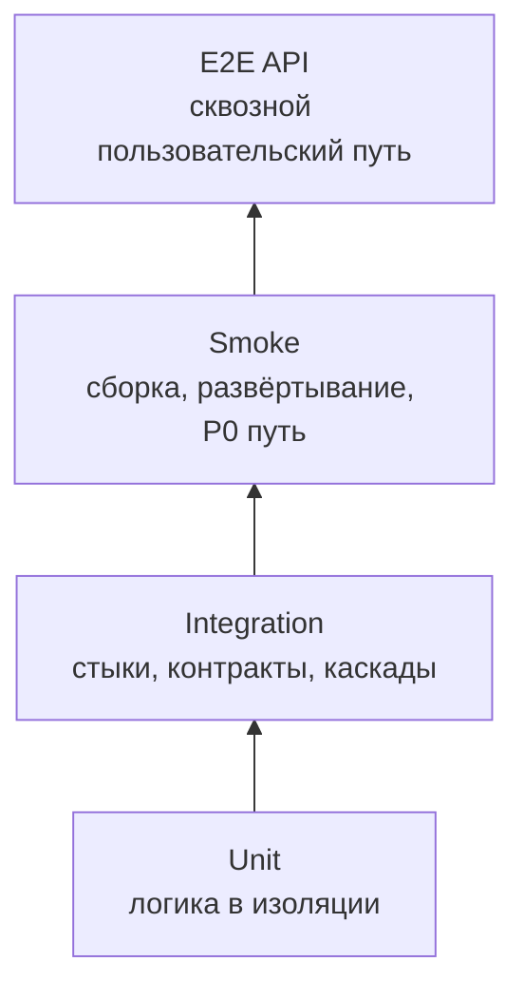

# Интеграционное тестирование — GraphRAG

> **Статус:** рабочий гайд для разработчиков, тестировщиков и ИИ-агентов.  
> **Назначение:** описать, как проектировать, запускать, ревьюить и подтверждать интеграционные тесты так, чтобы они проверяли реальные требования, контракты и взаимодействие процессов, а не имитировали достижение цели.  
> **Методологическая база:** `qa/README.md` (пирамида тестов, матрица качества, shift-left), `qa/test-plan.md` (доменные сценарии), `qa/gates.md` (FG-гейты), контракты модулей и внешних систем (источник правды по интерфейсам; реестр планируется — vision.md §2.2), W&B «Software Requirements» (Validation, acceptance criteria, traceability), C4-модель (планируется; референс: `.ai-factory/references/mermaid-c4-diagrams.md`); код `src/` — только для понимания реализации, не источник правды.  
> **Текущее состояние:** проект на этапе видения: кодовой базы и тестов нет (`../src/` — только `README.md`), CI нет. Все описания прогонов, стендов, заглушек и CI ниже — **целевое состояние** (что проектируется и как будет проверяться), а не описание работающего процесса.

---

## 1. Место интеграционных тестов в стратегии качества

Интеграционный тест проверяет **стык нескольких реальных компонентов**: процесс ↔ процесс, модуль ↔ тестовый контур, модуль ↔ контрактный протокол, доменное событие ↔ последующая реакция системы.

Интеграционный тест отвечает на вопрос: «работает ли согласованное поведение системы на границе компонентов так, как требуют требования (функции F1–F4, vision.md §2.1–2.2) и контракты модулей?». Он не заменяет unit-тесты и не должен превращаться в полный E2E без возможности локализовать дефект.



| Параметр | Правило проекта |
|---|---|
| Основная база | `../vision.md` (§1.3, §2.1–2.2), `../glossary.md`, `../adr/README.md`; каталоги требований и реестр контрактов — планируются (vision.md §2.2); C4-модель — планируется (референс: `.ai-factory/references/mermaid-c4-diagrams.md`) |
| Объект | Взаимодействие модулей GraphRAG (ядро, оркестрация пайплайнов, движок запросов, MCP-сервер, интеграции, CPU-компоненты), тестового контура и внешних систем (GitLab, LLM-контур) |
| Среда | Основной интеграционный стенд, тестовый контур, CI (целевое состояние); GPU-контур для GPU-специфичных проверок |
| Время | Минуты; набор тяжелее unit, но должен быть воспроизводимым |
| Выходной критерий | Контрактные, доменные, негативные и каскадные сценарии проходят с артефактами прогона |

**Граница с unit:** если зависимость заменена fake/mock/stub и проверяется один пакет/метод/use case — это unit (`qa/unit-testing.md`).  
**Граница с E2E API:** если проверяется весь путь «внешний запрос → обработка → ответ» без вмешательства в середину — это E2E API (`qa/README.md` §4.5).  
**Граница с smoke:** если проверяется только «сервис поднялся, версия отвечает, P0 путь жив» — это smoke (`qa/README.md` §4.3).

---

## 2. Цели интеграционного тестирования

Интеграционный тест должен проверять один или несколько классов поведения:

1. **Контракт выполнен?** Запросы, ответы, топики, payload, error codes, обязательные поля и версии соответствуют контрактам модулей и внешних систем (реестр контрактов планируется — vision.md §2.2).
2. **Компоненты совместимы?** Producer и consumer одинаково понимают формат, статусы, enum, correlation ID, retry и timeout.
3. **Каскад событий работает?** Событие в одном компоненте приводит к ожидаемому действию в другом: например, `DocumentIngested → EntityExtracted → GraphUpdated → CommunityRecomputed`.
4. **Негативный сценарий безопасен?** Неверная подпись, повреждённый документ, недоступный внешний сервис (GitLab, LLM-контур), подделанный источник сигнала, невалидный payload отклоняются явно.
5. **Состояние сохраняется?** Очереди, статусы задач, токены, загруженные артефакты и идемпотентность переживают рестарт там, где это требуется.
6. **Дефект локализуем?** При падении понятно, какой стык сломан: контракт, транспорт, бизнес-правило, инфраструктура или GPU-контур.
7. **Сценарий написан до реализации?** Где только возможно, сценарии проектируются и пишутся до фичи (TDD на уровне требований): до реализации сценарий обязан быть «красным» (раздел 16.3).

По W&B тест — это альтернативное представление требования. Если сценарий нельзя объективно проверить на стенде, это дефект требования или контракта: непроверяемость, неоднозначность, неполнота или отсутствие acceptance criteria.

---

## 3. Что покрывать в первую очередь

### 3.1. Приоритеты

| Приоритет | Что обязательно покрывать integration-уровнем |
|---|---|
| P0 | Безопасный контур LLM (фильтрация утечек, аудит — REQ-NFR-security.compliance.llm-contour), ответы с grounding и ссылками на источники (F1), целостность графа и инкрементальное обновление (F2), каскады событий предметной области, контрактные кейсы K1/K4/K5/K17 |
| P1 | Основные доменные потоки F1–F4, retry/timeout/idempotency, стыки с GitLab, HTTP API, MCP (JSON-RPC) и LLM-контуром, каскады событий, persistence при рестарте |
| P2 | Редкие GPU/аппаратные конфигурации, planned/to-be контракты, диагностические сценарии, визуальные сценарии |

### 3.2. Объекты интеграционного тестирования

| Объект | Что проверять |
|---|---|
| Внутренние контракты модулей | Интерфейсы пакетов, EventBus, хранилище графа/векторов между ядром, оркестрацией пайплайнов, движок запросов, MCP-сервером, интеграциями и CPU-компонентами |
| Контракты с внешними системами | GitLab API/webhook/MR (индексация корпуса), HTTP API (запросы, метрики), MCP (JSON-RPC: tools/resources/prompts), LLM-inference endpoint (OpenAI-совместимый), хранилище графа и векторного индекса (выбор открыт — ADR-IMPL.DATA.graph-storage), мониторинг/аудит (SecurityEventEmitted) |
| Каскады событий | DocumentIngested → EntityExtracted → GraphUpdated → CommunityRecomputed; OntologyUpdated → пересчёт резолвинга; InfluenceComputed → сигнал владельцу; ConflictDetected → сигнал на изменение источника; ContextCompiled → ReviewCompleted; SecurityEventEmitted → ИБ |
| Инфраструктура | Хранилище графа/векторов, инкрементальное обновление, GPU-контур (драйверы, CUDA, рантайм моделей), мониторинг/аудит |

### 3.3. Критичные классы дефектов

Обязательные негативные и граничные проверки:

- невалидный, неполный или несовместимый payload;
- несовпадение версии контракта или breaking change без депрекации;
- отсутствующая/неверная подпись, HMAC, JWT, certificate chain;
- plaintext-секреты там, где требуется TLS/шифрование;
- недоступность внешних систем (GitLab, LLM-контур, хранилище) и корректный fallback/retry;
- дубликаты документов/сигналов, повторная доставка, повторный webhook `event_id`;
- out-of-order события и потеря correlation ID;
- рестарт процесса в середине сценария;
- устаревший token/session, истёкший TTL, clock skew;
- GPU-специфичные различия: драйверы, CUDA, совместимость модели с рантаймом, квантование.

---

## 4. Источники правды перед написанием сценария

Источник правды для integration-сценария — **контракты и требования**, а не реализация. Перед генерацией или запуском сценария человек или ИИ-агент должен прочитать минимальный набор источников:

1. **`../vision.md`** — цели G1–G7 (§1.3), функции F1–F4 (§2.1–2.2), события предметной области (§2.4), внешние зависимости (§2.8), метрики.
2. **Спецификации контрактов** — OpenAPI 3.1 (HTTP API), JSON Schema 2020-12 (payload), MCP JSON-RPC (tools/resources/prompts), Go-интерфейсы пакетов (внутренние контракты). Формируются на этапе проектирования (TBD).
3. **Политика версионирования контрактов** — SemVer, additive-only, breaking changes, депрекации (TBD).
4. **Требования** — функции F1–F4 (vision.md §2.1–2.2), цели G1–G7 (§1.3), метрики; каталоги требований (функциональных, бизнес-правил, use cases, нефункциональных) планируются (vision.md §2.2).
5. **`qa/test-plan.md`** — доменные сценарии по функциям F1–F4; каталог scenario ID — (TBD), эталонные контрактные кейсы K1/K4/K5/K17.
6. **C4-модель** — планируется (референс: `.ai-factory/references/mermaid-c4-diagrams.md`).

Код и конфигурация `src/` используются только для понимания реализации и диагностики; реализация **не является источником правды** — она может отставать от контрактов или содержать дефекты. На этапе видения `src/` содержит только `../src/README.md`, кодовой базы нет.

Правило для ИИ-агента: **не выдумывать детали протокола и бизнес-логики**. Если контракт, требование и код расходятся, не «чинить» сценарий под текущую реализацию молча. Нужно зафиксировать расхождение как дефект, открытый вопрос или security-gap.

---

## 5. Как выбирать интеграционные сценарии из требований

### 5.1. Алгоритм трассировки FR/BR → integration-сценарий

1. Найти требование из vision.md (функция F1–F4, §2.1–2.2), цель (G1–G7, §1.3) или security-gap, которые реализуются изменением. Точные trace-коды появятся с каталогом требований (планируется, vision.md §2.2); до этого — ссылаться на `F<номер>.<подпункт>`.
2. Выписать проверяемый критерий: «когда компонент A отправляет X, компонент B принимает Y и меняет состояние Z».
3. Определить границу интеграции:
   - внутренний стык модулей (интерфейсы пакетов, EventBus, хранилище);
   - внешний стык (GitLab API/webhook/MR, HTTP API, MCP, LLM-inference endpoint, хранилище, импорт сигналов);
   - каскад нескольких компонентов;
   - persistence/restart;
   - GPU-специфичный стык (драйверы, CUDA, рантайм модели).
4. Найти контракт: внутренний (интерфейсы пакетов Go) или внешний (GitLab API/webhook/MR, HTTP API, MCP JSON-RPC, OpenAI-совместимый inference endpoint). Реестр контрактов планируется (vision.md §2.2).
5. Найти доменный сценарий в `qa/test-plan.md` (§7) или создать новый ID при расширении плана (каталог scenario ID для GraphRAG — (TBD)).
6. Разделить проверки по уровням:
   - чистая логика и mapper → unit;
   - два или больше реальных процесса / контракт / тестовый контур → integration;
   - полный путь пользователя/API без вмешательства → E2E.
7. Сформировать минимум: happy path, negative case, boundary/retry/idempotency, observability/assertion.
8. Привязать сценарий к требованию (F1–F4), цели (G1–G7) и контракту в описании теста или отчёте.

### 5.2. Шаблон декомпозиции сценария

```text
Требование: F<номер>.<подпункт> (vision.md §2.1–2.2)
Цель: G<номер> (vision.md §1.3)
Контракт: <contract-id>@<version> (<спецификация>)
Сценарий QA: <scenario-id> (каталог — TBD)

Граница интеграции:
- from: <модуль/процесс>
- to: <модуль/процесс/тестовый контур>
- transport: <Go-интерфейс/EventBus/HTTP/MCP JSON-RPC/OpenAI-совместимый endpoint/хранилище>

Предусловия:
- <какие реальные процессы подняты>
- <какие заглушки внешнего стыка подняты>
- <какие тестовые данные загружены>

Проверки:
- happy path: <вход> → <ожидаемый ответ/состояние/событие>
- negative: <ошибка зависимости/невалидный payload> → <ожидаемый отказ>
- boundary: <timeout/retry/duplicate/restart> → <ожидаемое поведение>
- trace/observability: <лог/метрика/event/correlation_id>

Артефакты:
- <команда запуска>
- <логи процессов>
- <ответы/сообщения/схемная валидация>
- <ссылка на CI/job>
```

### 5.3. Комментарии и метаданные трассировки

Для автоматизированных integration-тестов в Go применяется тот же машинно-проверяемый формат trace-комментариев, что и в unit-тестах:

```go
// F2: приём документа (MR/webhook → DocumentIngested) приводит к обновлению затронутого подграфа.
// F3.2: изменение артефакта формирует сигнал владельцу (InfluenceComputed).
func TestDocumentIngested_RebuildsAffectedSubgraph(t *testing.T) {
    // ...
}
```

Правила:

- одна строка — одно требование (`F<номер>.<подпункт>`) или одна метрика;
- описание после двоеточия формулирует проверяемое поведение, а не название файла;
- ID должен существовать в vision.md (F1–F4) или в каталоге требований (планируется, vision.md §2.2);
- если сценарий основан на `qa/test-plan.md`, дополнительно указывать ID сценария в имени теста, subtest name, metadata или отчёте: например, `K1`, `K4`, `K5`, `K17` (эталонные контрактные кейсы); остальные scenario ID — (TBD);
- если проверяется security-gap без оформленного требования (например, REQ-NFR-security.compliance.llm-contour — контур LLM), нужно указать ID security-gap и ближайшее требование; отсутствие требования — вопрос к vision.md.

Для ручных или полуавтоматических прогонов трассировка фиксируется в отчёте:

```text
Scenario: K1
Trace: F1.1 (ссылки на источники), метрика «точность ответов RAG ≥ 70%»
Contract: query-engine@<version>, mcp-server@<version>
Result: passed
Artifacts: ci-job-<id>, logs/run-k1-<дата>.zip
```

Связка гейтов: `FG-TEST` (сценарий покрывает acceptance criteria) → `FG-TRACE` (требование ↔ тест/сценарий) → `FG-TEST-QUALITY` (есть real assertions и negative cases) → `FG-MUTATION` для нижнего unit-слоя критичной логики.

---

## 6. Контракты и объекты интеграции

### 6.1. Внутренние контракты модулей

| Контракт | Направление | Источник правды | Доменные сценарии |
|---|---|---|---|
| Интерфейсы пакетов ядра | ядро ↔ оркестрация пайплайнов | `../src/README.md`; спецификации — (TBD) | F2 (K1) |
| EventBus (паттерн) | модуль ↔ модуль | — | каскады событий (vision.md §2.4) |
| Хранилище графа/векторов | модули ↔ хранилище | выбор открыт — ADR-IMPL.DATA.graph-storage | F1, F2 |
| Контракты движка запросов | движок запросов ↔ MCP-сервер / HTTP API | `../src/README.md`; спецификации — (TBD) | F1 (K1, K4, K5) |
| MCP-контракт (JSON-RPC: tools/resources/prompts) | MCP-сервер ↔ ИИ-агенты | `../src/README.md`; спецификации — (TBD) | F4 (K17) |

Проверять:

- совместимость request/response (входа/выхода контракта);
- обязательные поля и enum;
- error codes/status codes;
- deadline/cancel/retry;
- backward compatibility при изменении контракта;
- поведение consumer при unknown/optional fields.

### 6.2. Контракты с внешними системами

| Канал | Контракт | Направление | Доменные сценарии |
|---|---|---|---|
| GitLab API/webhook/MR | `../vision.md` §2.8; спецификации — (TBD) | GitLab → оркестрация пайплайнов | F2 (индексация) |
| HTTP API (запросы, метрики) | (TBD) | клиенты ↔ движок запросов | F1, G1 |
| MCP (JSON-RPC: tools/resources/prompts) | (TBD) | ИИ-агенты ↔ MCP-сервер | F4 |
| LLM-inference endpoint (OpenAI-совместимый) | (TBD) | движок запросов/извлечение ↔ GPU-контур | F2, F1, REQ-NFR-security.compliance.llm-contour |
| Хранилище графа и векторного индекса | выбор открыт — ADR-IMPL.DATA.graph-storage | модули ↔ хранилище | F1, F2 |
| Мониторинг и аудит | (TBD) | система → ИБ/мониторинг | REQ-NFR-security.compliance.llm-contour (SecurityEventEmitted) |

### 6.3. Каскады доменных событий

Каскадный сценарий проверяет не один ответ, а цепочку причинно-следственных эффектов:

| Каскад | Что проверить |
|---|---|
| `DocumentIngested → EntityExtracted → GraphUpdated → CommunityRecomputed` | приём документа (MR/webhook) запускает извлечение сущностей, обновление графа и пересчёт сообществ; события приходят в правильном порядке |
| `OntologyUpdated → пересчёт резолвинга` | обновление модели предметной области пересчитывает резолвинг запросов по терминам (механизм F1/F3) |
| `InfluenceComputed → сигнал владельцу` | анализ влияния изменения доставляет сигнал владельцу затронутого артефакта (F3) |
| `ConflictDetected → сигнал на изменение источника` | детекция противоречия между ответом и источником формирует сигнал (G3) |
| `ContextCompiled → ReviewCompleted` | скомпилированный контекст для агента проходит сверку со спецификациями (F4) |
| `SecurityEventEmitted → ИБ` | событие безопасности контура LLM доставляется в аудит/ИБ с корректной подписью и correlation ID (REQ-NFR-security.compliance.llm-contour) |

Правила каскада:

- фиксировать correlation ID или другой идентификатор связи событий;
- проверять промежуточные состояния, а не только финальный результат;
- добавлять negative case: разрыв одного звена должен давать контролируемую ошибку/ретрай;
- при падении сохранять логи всех процессов цепочки.

### 6.4. Инфраструктура

Проверять на integration/smoke уровне, если поведение зависит от реальной среды:

- хранилище графа/векторов — сохранение состояний пайплайнов, статусов заданий индексации при рестарте;
- файловая система — временные файлы загрузки, atomic rename, очистка, права доступа;
- инкрементальное обновление графа — периодическая перестройка/переиндексация без потери данных;
- GPU-контур — развёртывание (драйверы, CUDA, рантайм моделей), запуск/рестарт, привилегии;
- сетевые порты — loopback-only там, где это требуется, отсутствие open-by-default.

---

## 7. Тестовые стенды и окружения

### 7.1. Классы стендов

| Стенд | Состав | Назначение |
|---|---|---|
| Dev / CI быстрый набор | Модули как процессы; `go test -race`; lint (golangci-lint); контрактные тесты K1/K4/K5/K17 | unit + build smoke + быстрые контрактные/integration проверки на MR/push (целевое состояние CI) |
| Основной стенд интеграции | Реальные процессы контура GraphRAG (ядро, оркестрация пайплайнов, движок запросов, MCP-сервер, интеграции, CPU-компоненты) + тестовый контур | интеграционные и часть E2E API сценариев |
| GPU-матрица | Разные GPU/драйверы/CUDA/рантаймы (Linux, NVIDIA, open-weight) | GPU-специфичные проверки, развёртывание контура LLM, квантование |
| E2E API стенд | Полный контур GraphRAG + тестовый контур | сквозные сценарии «документ → граф → ответ с grounding» |

### 7.2. Обязательные свойства основного стенда

- Компоненты контура GraphRAG запущены как **реальные процессы**, без замены проверяемого компонента эмулятором.
- Тестовый контур изолирован от продуктивного.
- Тестовые секреты, сертификаты, корпус, индексы и конфигурации не пересекаются с продуктивными.
- Данные детерминированные: один и тот же сценарий на чистом стенде даёт один и тот же результат.
- Топология соответствует C4-модели (планируется; референс: `.ai-factory/references/mermaid-c4-diagrams.md`).
- Логи, конфигурация, версии бинарников и версии контрактов сохраняются как артефакты.

### 7.3. Правило выбора стенда

| Если нужно проверить | Использовать |
|---|---|
| Один внешний контракт | Проверяемый модуль + заглушка стороны `to` (заглушка GitLab / эмулятор LLM) |
| Внутренний стык модулей | Два реальных процесса: producer и consumer |
| Каскад событий | Весь контур GraphRAG + нужные части тестового контура |
| Persistence/restart | Реальный процесс + реальное тестовое хранилище на стенде |
| GPU-специфичное поведение | Реальный GPU-контур (Linux, NVIDIA) + целевой рантайм модели |
| Полный пользовательский путь | E2E API поверх интеграционного стенда |

---

## 8. Заглушки и эмуляторы

### 8.1. Главное правило

В интеграционном тесте заглушки допустимы **только на внешнем стыке**, который не является предметом проверки. Проверяемый компонент нельзя заменять fake-реализацией.

Примеры:

- проверяем `движок запросов → LLM-контур` → реальный `движок запросов`, эмулятор LLM (детерминированные golden-ответы);
- проверяем `интеграция GitLab → оркестрация пайплайнов` → реальные оба модуля, заглушка GitLab;
- проверяем `оркестрация → хранилище графа` → реальный модуль + тестовое хранилище графа/векторов;
- проверяем MCP-компилятор → реальный MCP-сервер + тестовый MCP-клиент (агент-заглушка).

### 8.2. Тестовый контур по контрактам

| Контракт | Заглушка / эмулятор | Что эмулирует | Используется в |
|---|---|---|---|
| GitLab (API/webhook/MR) | заглушка GitLab | события MR/webhook, файлы корпуса (markdown-спеки, PDF-книги), отказ/retry | F2 (индексация) |
| LLM-контур | эмулятор LLM | детерминированные golden-ответы на OpenAI-совместимом endpoint, отказ/таймаут/дрейф ответов | F2 (извлечение), F1 (ответы), REQ-NFR-security.compliance.llm-contour |
| Хранилище графа/векторов | тестовое хранилище | граф сущностей/связей/утверждений, векторный индекс, инкрементальные обновления | F1, F2 |
| Мониторинг/аудит | аудит-заглушка | приём SecurityEventEmitted и подтверждение доставки | REQ-NFR-security.compliance.llm-contour |
| MCP | тестовый MCP-клиент | tools/resources/prompts, сверка контекста (ContextCompiled → ReviewCompleted) | F4 |

### 8.3. Локальные mock/fake/stub

- **Mockery-моки Go-интерфейсов** — для unit-тестов, не для основного integration-прогона.
- **In-memory fake repository** — unit или component-level проверка, не замена реального межпроцессного стыка.
- **In-memory хранилище графа** — допустимо для unit/component проверок, но не доказывает integration с реальным хранилищем.
- **Test client** допустим как внешний инициатор: HTTP-клиент, MCP-клиент (агент-заглушка), клиент GitLab API, генератор сигналов.

---

## 9. Инстансы сервисов

### 9.1. Контур GraphRAG: реальные процессы

| Инстанс | Роль | Основные стыки |
|---|---|---|
| Ядро | события предметной области, EventBus, оркестрация потоков | EventBus, хранилище графа/векторов, интеграции |
| Оркестрация пайплайнов (F2) | индексация корпуса: DocumentIngested → EntityExtracted → GraphUpdated → CommunityRecomputed; обработка PDF (RAPTOR/StructRAG); mutual indexing | GitLab API/webhook/MR, CPU-компоненты, хранилище, LLM-контур |
| Движок запросов (F1) | запросы: dual-level retrieval (LightRAG), PathRAG (без map-reduce), PPR, multi-hop, grounding (QueryAnswered), детекция противоречий (ConflictDetected), LLM-as-judge | LLM-inference endpoint, хранилище графа/векторов, HTTP API |
| MCP-сервер (F4) | компиляция контекста агенту (ContextCompiled), сверка со спецификациями (ReviewCompleted), предзавершающий гейт, QA-контекст | MCP (JSON-RPC: tools/resources/prompts), движок запросов |
| Интеграции | GitLab (authoritative-источник корпуса), GPU-контур | GitLab API/webhook/MR, OpenAI-совместимый inference endpoint |
| CPU-компоненты | Leiden (сообщества), HNSW (векторный индекс), токенизатор; CGo при необходимости | оркестрация, хранилище |

### 9.2. Тестовый контур

| Инстанс | Роль |
|---|---|
| Заглушка GitLab | события MR/webhook, корпус (markdown-спеки, PDF-книги) |
| Эмулятор LLM | детерминированные golden-ответы (OpenAI-совместимый endpoint) |
| Тестовое хранилище графа/векторов | граф сущностей/связей/утверждений, векторный индекс, инкрементальные обновления |
| Аудит-заглушка | приём SecurityEventEmitted и подтверждение (REQ-NFR-security.compliance.llm-contour) |
| MCP-клиент (агент-заглушка) | потребление контекста, сверка со спецификациями (F4) |

### 9.3. Минимальный набор по типу сценария

| Тип сценария | Минимально поднять |
|---|---|
| Контракт GitLab (индексация) | оркестрация пайплайнов + заглушка GitLab + тестовое хранилище графа |
| Инкрементальное обновление графа | оркестрация + тестовое хранилище + эмулятор LLM (извлечение) |
| Запрос через HTTP API | движок запросов + хранилище + эмулятор LLM |
| MCP-контракт (F4) | MCP-сервер + движок запросов + эмулятор LLM |
| Обработка PDF (RAPTOR/StructRAG) | оркестрация + CPU-компоненты + эмулятор LLM |
| Контур LLM (REQ-NFR-security.compliance.llm-contour) | движок запросов + эмулятор LLM (или реальный GPU-контур) + аудит-заглушка |
| Domain cascade | все реальные процессы цепочки + нужные заглушки тестового контура |

---

## 10. Процедура интеграционного тестирования

### Шаг 0. Подготовка входных критериев

1. Проверить, что unit-уровень зелёный для затронутых компонентов: `go test -race ./...` в соответствующем компоненте или CI job.
2. Проверить контрактные тесты эталонных кейсов K1/K4/K5/K17 (`go test -tags=contract`), если они реализованы (целевое состояние).
3. Зафиксировать версии: commit SHA, версии бинарников, версии контрактов, конфигурацию стенда.
4. Выбрать сценарии из §12 и `qa/test-plan.md` по изменению/риску.
5. Подготовить тестовые данные из §13.
6. Убедиться, что продуктивные секреты и окружения не используются.

### Шаг 1. Развернуть стенд

1. Поднять заглушки тестового контура из §8.2 с известной конфигурацией.
2. Поднять реальные процессы контура GraphRAG из §9.1 (Linux, периметр компании).
3. Проверить health/deployment smoke:
   - процессы живы;
   - порты доступны только там, где ожидается;
   - корпус индексируется (первичная индексация завершается);
   - граф/векторный индекс доступны для запросов;
   - лог/метрика показывают статус пайплайнов и версии компонентов.
4. Очистить или инициализировать state: хранилище графа/векторов, очереди заданий, индексы.
5. Сохранить стартовые логи и конфигурацию стенда.

### Шаг 2. Выполнить conformance-проверки

Для каждого проверяемого контракта выполнить conformance-сценарии из `qa/test-plan.md` (каталог scenario ID — (TBD)):

- HTTP API (OpenAPI 3.1): path, method, status code, schema, required fields, `error_code`;
- webhook GitLab: событие, payload schema, headers/metadata, подпись;
- JSON Schema 2020-12: valid payload принимается, invalid payload отклоняется;
- Go-интерфейсы модулей: request/response, статусы, ошибки, deadline/retry (контрактные тесты K1/K4/K5/K17);
- MCP (JSON-RPC): tools/resources/prompts, формат контекста, ошибки;
- реестр контрактов (планируется, vision.md §2.2) согласован со спецификациями.

Минимум assertions:

- ответ или сообщение валидируется независимой схемой;
- негативный payload отклоняется;
- breaking change не проходит без обновления версии и traceability;
- лог/метрика содержит correlation ID, если он предусмотрен контрактом.

### Шаг 3. Выполнить доменные сценарии

Прогнать доменные сценарии по функциям F1–F4 с уровнем `integration` из `qa/test-plan.md` (каталог scenario ID — (TBD); на этапе видения — сценарии по событиям vision.md §2.4).

Для каждой функции обязательно:

1. **Happy path** — основной поток работает на реальных процессах.
2. **Negative path** — ошибка зависимости, невалидный payload, таймаут или отказ авторизации обработаны явно.
3. **Boundary/retry/idempotency** — дубликаты, повторная доставка, restart или истечение TTL не ломают состояние.
4. **Observability** — есть логи, события, статусы или метрики, позволяющие доказать прохождение.

### Шаг 4. Выполнить security-gap сценарии

Прогнать security-gap сценарии из `qa/test-plan.md` и зафиксированные в ADR ограничения:

- запросы к LLM идут только через корпоративный канал (локальный GPU-контур); 0 обращений вне контура (метрика REQ-NFR-security.compliance.llm-contour);
- фильтрация утечек ПДн/чувствительных данных при обращении к LLM (REQ-NFR-security.compliance.llm-contour), требования 152-ФЗ;
- аудит обращений к LLM (SecurityEventEmitted) доставляется в ИБ с корректной подписью;
- webhook без валидной подписи отклоняется, replay по `event_id` не проходит;
- GitLab webhook/MR без валидной подписи отклоняется;
- HTTP API требует авторизацию/TLS согласно целевому контракту;
- данные корпуса и графа не доступны потребителям без ACL/авторизации;
- нестрогие схемы не принимают лишние/невалидные payload.

Если security-gap пока отражает целевое, но не реализованное поведение, сценарий должен быть помечен как expected fail / known gap, а не как passed.

### Шаг 5. Выполнить GPU-специфичные проверки

На GPU-контуре (Linux, NVIDIA) проверить:

- развёртывание контура LLM: драйверы NVIDIA, CUDA, рантайм моделей (vLLM/Ollama/llama.cpp), автостарт/рестарт;
- права доступа к файлам, портам, сертификатам, хранилищу;
- совместимость open-weight модели с рантаймом, квантование, запуск на реальном GPU;
- различия путей, кодировок, сетевых интерфейсов;
- поведение контура LLM под нагрузкой (время ответа, медиана/p90 — цель G1).

Текущее состояние: проект на этапе видения, CI нет; целевой CI включает GPU-специфичные проверки на выделенном контуре с реальным GPU (Linux, NVIDIA).

### Шаг 6. Зафиксировать результат

Сценарий считается завершённым только если есть:

- список выполненных scenario IDs;
- trace на требование (F1–F4, vision.md), цель (G1–G7) или security-gap;
- версии компонентов и контрактов;
- команда запуска или инструкция ручного прогона;
- логи всех участвующих процессов;
- входные payload/messages и фактические responses/events;
- результат схемной/контрактной валидации;
- ссылка на CI/job или архив локального прогона;
- дефект с воспроизводимыми шагами при падении.

---

## 11. Специфика по функциям проекта (F1–F4)

### 11.1. F2 — индексация источников знаний

Проверять integration-уровнем:

- приём документа: событие MR/webhook GitLab → `DocumentIngested`;
- чанкинг корпуса (markdown-спеки GitLab, PDF-книги) и извлечение сущностей/связей/утверждений (`EntityExtracted`);
- обновление графа знаний (`GraphUpdated`) и пересчёт сообществ (`CommunityRecomputed`);
- обработка PDF: RAPTOR/StructRAG;
- mutual indexing (KAG-принцип);
- инкрементальное обновление: изменение одного артефакта не перестраивает весь граф;
- недоступность GitLab/LLM-контура и retry/backoff.

Обязательные negative cases:

- дубликат документа / повторный webhook (идемпотентность);
- повреждённый или невалидный документ;
- расхождение извлечённых сущностей с моделью предметной области (сигнал на онтологический слой — механизм F1/F3);
- рестарт пайплайна на середине индексации;
- дубликаты и противоречия в корпусе должны детектироваться явно.

### 11.2. Механизм: онтологический слой (внутри F1/F3)

Проверять:

- загрузка машинно-читаемой модели предметной области и резолвинг запросов по терминам (онтологический слой);
- канонические определения: разные формулировки запроса резолвятся в одни и те же сущности (онтологический слой);
- обновление модели из репозитория → `OntologyUpdated` → пересчёт резолвинга (онтологический слой);
- минимизация контекста (REQ-NFR-api.performance.token-minimization): в ответ и контекст попадает минимум необходимых сущностей.

Negative/boundary:

- неизвестный термин вне модели предметной области;
- конфликт синонимов/омонимов;
- пустая или частично загруженная модель;
- обновление модели на середине запроса.

### 11.3. F1 — генерация проверяемых ответов

Проверять:

- сквозной путь запроса: `QueryAnswered` со ссылками на источники (grounding/provenance, F1.1);
- dual-level retrieval (LightRAG), PathRAG (без map-reduce), PPR (без LLM на извлечении);
- глобальные вопросы (F1.2) и multi-hop запросы (F1.2);
- детекция противоречий: `ConflictDetected` при расхождении ответа и источника (G3);
- LLM-as-judge (REQ-NFR-api.compliance.rag-accuracy);
- метрики времени ответа: медиана и p90 (цель G1).

Negative/boundary:

- вопрос вне корпуса — корректный отказ/«не знаю» без выдумывания;
- недоступный LLM-контур — явный fallback/retry;
- противоречивые источники — явный сигнал, а не молчаливый выбор;
- точность ответов RAG ≥ 70% (целевая метрика) проверяется на golden-наборе.

### 11.4. F3 — оптимизация контекста для автоматической разработки

Проверять:

- граф связей артефактов (F3.1): список затронутых при изменении;
- `InfluenceComputed` — сигнал владельцу затронутого артефакта (F3.2);
- сверка «результат ↔ источник» (G4): каждый факт ответа прослеживается до источника;
- граф от артефакта до клиентского результата (F3.2);
- детерминизм анализа влияния (критичный модуль качества).

Negative/boundary:

- изменение без затронутых артефактов — пустой список (или явное «влияния нет»);
- недоступный или удалённый источник;
- циклы в графе зависимостей.

### 11.5. Вне рамок проекта (vision §2.7 п.4–5)

Накопление знаний из внешних сигналов, импорт сигналов с полей и петля обучения — **вне рамок проекта** (vision.md §2.7 п.4–5). Интеграционные сценарии не разрабатываются; связанная метрика («время сигнал → фикс») в план не включается.

### 11.6. F4 — доставка ответов и контекста через MCP

Проверять:

- компиляция точного контекста агенту через MCP (JSON-RPC: tools/resources/prompts) — `ContextCompiled`;
- сверка контекста со спецификациями — `ReviewCompleted`;
- предзавершающий гейт (F4, Фаза 2/3);
- QA-контекст (F4);
- контрактный кейс K17 — контрактные тесты до реализации.

Negative/boundary:

- запрос агента вне компетенции системы;
- контекст превышает лимит токенов — минимизация контекста;
- недоступный движок запросов — контролируемая ошибка.

### 11.7. Сквозное требование: безопасный контур LLM (REQ-NFR-security.compliance.llm-contour)

Проверять:

- обращение к LLM только через корпоративный канал: локальный GPU-контур (Linux, NVIDIA, open-weight); доля обращений через корпоративный канал — 0 вне контура;
- фильтрация утечек ПДн/чувствительных данных (REQ-NFR-security.compliance.llm-contour), требования 152-ФЗ;
- аудит обращений: `SecurityEventEmitted` доставляется в ИБ;
- лицензии open-weight моделей и open-source зависимостей (SCA);
- контроль затрат: минимизация токенов/LLM-вызовов (REQ-NFR-api.performance.token-minimization).

Negative/boundary:

- попытка обращения вне контура блокируется;
- утечка ПДн в запросе/ответе — событие аудита;
- недоступность GPU-контура — явный отказ без fallback в публичные сервисы.

---

## 12. Каталог интеграционных сценариев

Полные описания — в `qa/test-plan.md` §7. Каталог scenario ID для GraphRAG формируется на этапе проектирования; ниже — свод по функциям с уровнем `integration` и эталонные контрактные кейсы.

| Функция | Идентификаторы сценариев |
|---|---|
| F2 — индексация источников знаний | (TBD) |
| Онтологический слой (механизм F1/F3) | (TBD) |
| F1 — генерация проверяемых ответов | K1 (ответ с grounding); остальные — (TBD) |
| F3 — оптимизация контекста для автоматической разработки | K4 (анализ влияния), K5 (сверка «результат ↔ источник») |
| F4 — доставка через MCP | K17 (context compiler) |
| REQ-NFR-security.compliance.llm-contour — безопасный контур LLM (сквозное требование) | (TBD) |
| Контракты / security-gaps | (TBD) |

Эталонные кейсы K1, K4, K5, K17 — контрактные тесты до реализации.

Сценарии с уровнем `E2E API` не входят в основной интеграционный набор, но могут быть пройдены на том же стенде как следующий уровень.

---

## 13. Тестовые данные

Полный перечень — `qa/test-plan.md` §5. Для интеграционных сценариев использовать фиксированные наборы:

| Группа | Данные |
|---|---|
| Корпус | markdown-спеки GitLab, PDF-книги; документы с известными сущностями/связями/утверждениями; дубликаты, противоречивые документы |
| Модель предметной области | валидная, неполная, конфликтующая (синонимы/омонимы), устаревшая |
| Golden-ответы эмулятора LLM | детерминированные ответы на фиксированные запросы, отказы/таймауты/дрейф ответов |
| Запросы | глобальные, multi-hop, вне корпуса, противоречивые, с терминами вне модели предметной области |
| Контрактные payload | HTTP API, MCP JSON-RPC (tools/resources/prompts), webhook GitLab, OpenAI-совместимые запросы к LLM |
| Security | запрос вне контура LLM, утечка ПДн, webhook без подписи, malformed схемы |

Правила данных:

- не использовать продуктивные секреты и сертификаты;
- хранить тестовые payload рядом со сценарием или в выделенном каталоге test fixtures;
- фиксировать версию fixture при изменении контракта;
- иметь минимум один валидный и один невалидный payload на критичный контракт;
- для retry/idempotency использовать повторяемые IDs, чтобы результат был воспроизводим.

---

## 14. Качество assertions и oracle

### 14.1. Что является реальной проверкой

Хороший integration-тест не ограничивается «процесс не упал» или «ответ получен». Он проверяет минимум один независимый oracle:

- schema validation по OpenAPI/JSON Schema/контрактам модулей;
- expected status/error code;
- изменение состояния в хранилище/очереди/статусе задачи;
- публикацию события в ожидаемый канал/webhook;
- отсутствие запрещённого эффекта: нет plaintext secret, нет повторной обработки duplicate, нет open port;
- audit/log/metric с correlation ID.

Плохо:

```text
Scenario <ID>: passed, потому что пайплайн индексации завершился без ошибки.
```

Лучше:

```text
Scenario <ID>: passed.
- Оркестрация получила событие MR/webhook GitLab → `DocumentIngested`.
- Извлечение сущностей завершилось статусом `EXTRACTED` (`EntityExtracted`).
- Граф обновлён (`GraphUpdated`), сообщества пересчитаны (`CommunityRecomputed`).
- Запрос вернул ответ с grounding (`QueryAnswered`) и ссылками на источники.
- Payload ответа валиден по контракту HTTP API/MCP.
```

### 14.2. Независимый oracle

Ожидаемый результат берётся из требований и контрактов, а не из текущей реализации. Если код возвращает поле, которого нет в контракте, тест должен подсветить расхождение, а не расширить expected result без изменения спецификации.

Приоритет oracle:

1. контракты модулей и внешних систем (реестр планируется — vision.md §2.2);
2. `../vision.md` — функции F1–F4, цели G1–G7, метрики;
3. `../adr/README.md` и ADR (например, ADR-IMPL.STACK.go-single-language-adoption, ADR-IMPL.DATA.graph-storage);
4. `qa/test-plan.md`;
5. текущий код — только для понимания реализации и диагностики.

### 14.3. Negative assertions

Для каждого P0/P1 integration-сценария должен быть хотя бы один negative assertion:

- invalid payload отклонён;
- unauthorized request отклонён;
- dependency unavailable приводит к retry/fallback/error state;
- duplicate/replay не меняет состояние повторно;
- timeout не оставляет систему в неконсистентном состоянии.

---

## 15. Детерминированность и anti-flake

Интеграционные тесты дороже и потенциально нестабильнее unit, поэтому детерминизм обязателен.

### 15.1. Таксономия причин флаки

| Категория | Типичная причина | Пример в проекте |
|---|---|---|
| Синхронизация | `sleep` вместо condition/polling; таймауты на грани | ожидание событий пайплайна (GraphUpdated), статуса задания индексации |
| Состояние стенда | незачищенные индексы/хранилище/очереди между прогонами | старые события GitLab/webhook, документы в очереди индексации |
| Внешние зависимости | реальный внешний сервис с непредсказуемой задержкой | доступность GitLab/LLM-контура/хранилища |
| Параллелизм | параллельные сценарии с общим namespace/портами | общий корпус/индексы, порты |
| Окружение | загрузка CI/GPU, платформенные различия | таймауты под нагрузкой, GPU/пути ОС |
| Данные | случайные/разделяемые ID | случайные `event_id`, ID документов |

### 15.2. Правила детерминизма

- не использовать продуктивные внешние сервисы;
- не зависеть от текущего времени без контролируемого окна/clock skew fixture;
- не использовать случайные IDs без записи seed/значения в отчёт;
- очищать индексы, хранилище, очереди заданий перед сценарием;
- задавать явные timeouts и retries;
- ожидать события по condition/polling, а не фиксированным `sleep`, где возможно;
- запускать сценарии в изолированном namespace: корпус/префикс хранилища/индекса;
- при flake фиксировать причину: race, timeout, shared state, external dependency, GPU issue.

### 15.3. Методы детекции

- `go test -race -count=2 -tags=integration ./...` для затронутого набора;
- история прогонов в CI: падение при неизменном коде и стенде — кандидат в флаки;
- метрика «стабильность тестов» (`qa/README.md` §10): доля флаки-прогонов ≤ порога (целевое состояние, enforced в CI).

### 15.4. Жизненный цикл флаки-сценария

Сценарий, который «иногда проходит», не является подтверждением требования. Если сценарий нестабилен:

1. **Завести дефект** с владельцем; приложить логи всех процессов, конфигурацию стенда и версии.
2. **Карантин** с зарегистрированным дефектом; «тихий» пропуск без дефекта запрещён.
3. **Устранить корень** по таксономии (15.1): синхронизация, состояние стенда, данные; не увеличивать `sleep` «для стабилизации».
4. **Верифицировать**: N успешных прогонов подряд на чистом стенде (N ≥ 5).
5. **Вернуть** сценарий в набор, закрыть дефект.

---

## 16. Защита от имитации результатов (анти-фейк)

Интеграционный уровень — естественный «детектор лжи» для unit-слоя: реальные процессы и контракты не позволяют сфейкать поведение одним моком. Но сам интеграционный прогон агент может имитировать: заявить «стенд развёрнут, сценарии прошли» без фактического исполнения. Поэтому интеграционный результат принимается только по проверяемым артефактам.

### 16.1. Векторы имитации

| Вектор | Пример | Механизм обнаружения |
|---|---|---|
| «Зелёный» отчёт без прогона | заявлено «K1, <scenario-id> прошли» без логов | обязательные артефакты §16.4 |
| Заглушка вместо реального компонента | проверяемый модуль (например, движок запросов) заменён эмулятором | правило §8.1: stub только на внешнем стыке |
| Слабый oracle | «ответ получен» вместо проверки схемы/состояния | conformance-проверки (шаг 2 раздела 10) и assertions §14 |
| Пропуск negative cases | security-gap-сценарии не запускались | обязательный шаг 4 и DoD §18 |
| Сокращённый каскад | проверен один ответ без downstream-событий | правила каскадов §6.3 |
| Подгонка expected к текущему коду | тест закрепляет баг как норму | приоритет oracle §14.2 |
| Фальшивый CI/лог | лог не содержит command, SHA, versions | чек артефактов §16.4 и fresh-context §16.5 |

### 16.2. Слои защиты

1. **Проверяемые требования** — сценарий связан с требованием (F1–F4), целью (G1–G7) или security-gap.
2. **Контракт как независимый oracle** — схема/контракт модуля/OpenAPI/JSON Schema проверяют форму и семантику сообщений.
3. **Реальные процессы внутри контура** — нельзя заменить проверяемый компонент fake-реализацией.
4. **Red-first** — сценарий должен быть красным до реализации или при намеренной поломке.
5. **Артефакты прогона** — принимаются логи и CI/job, а не текстовое заявление агента.
6. **Fresh-context review** — второй агент/ревьюер сверяет артефакты с требованиями без доверия к автору реализации.
7. **Саботаж-проверка** — намеренное нарушение контракта/каскада должно ронять сценарий.
8. **Пирамида тестов** — unit (`qa/unit-testing.md` §14) ловит локальную ложь, integration проверяет реальные стыки, E2E подтверждает сквозной путь.

### 16.3. Red-first на уровне сценария

Сценарий считается качественным, если есть одно из подтверждений:

- до реализации он падал на отсутствующей функции или невыполненном контракте;
- при выключении нужного компонента он падает ожидаемо;
- при подмене валидного payload на invalid он падает ожидаемо;
- при намеренной поломке схемы/топика/подписи/correlation ID он падает ожидаемо.

Red-first не означает ломать продуктивную ветку. Достаточно временного локального изменения, feature flag, sabotage branch или controlled fault injection на тестовом стенде.

На уровне требований TDD означает: сценарий пишется до реализации фичи и до неё обязан быть «красным» (сервис без фичи, контракт не выполнен). Где это невозможно (код уже существует) — применяется sabotage-проверка: намеренная поломка контракта/каскада должна ронять сценарий.

### 16.4. Артефакты прогона вместо заявлений

Минимальный набор доказательств:

- команда запуска или playbook;
- commit SHA и версии бинарников;
- версии контрактов и fixtures;
- логи всех процессов сценария;
- request/response/messages/events;
- вывод contract/schema validation;
- подтверждение negative case;
- подтверждение red-first/sabotage для P0/P1 сценариев;
- ссылка на CI/job или архив локального прогона.

Если артефактов нет, статус сценария — **not verified**, даже если агент написал «passed».

### 16.5. Свежая верификация

Fresh-context reviewer или второй ИИ-агент должен:

1. прочитать только требование, контракт, сценарий и артефакты;
2. проверить, что scenario ID и trace ID совпадают;
3. убедиться, что подняты реальные процессы, а не fake проверяемого компонента;
4. сверить payload с контрактом;
5. проверить наличие negative assertion;
6. проверить, что вывод «passed» следует из артефактов, а не из текста автора.

---

## 17. Команды запуска и автоматизация

### 17.1. Контрактные тесты (K1/K4/K5/K17)

Контрактные кейсы K1 (ответ с grounding), K4 (анализ влияния), K5 (сверка «результат ↔ источник»), K17 (context compiler) пишутся до реализации и запускаются как обычные Go-тесты:

```sh
go test -race -v -tags=contract ./...
```

Ожидаемый результат: контрактные кейсы K1, K4, K5, K17 проходят; реестр контрактов (планируется) согласован со спецификациями. На этапе видения контрактных тестов нет — команда относится к целевому состоянию.

### 17.2. Go integration tests

Рекомендуемый паттерн для автоматизированных Go integration-тестов:

```sh
go test -race -v -tags=integration ./...
```

Если integration-тесты разнесены по модулям, запускать затронутый модуль (путь пакета — по структуре `src/`, уточняется на этапе проектирования):

```sh
go test -race -v -tags=integration ./<путь-модуля>/...
```

Правила:

- тяжелые тесты должны иметь build tag `integration` или отдельный suite;
- тесты не должны случайно обращаться к продуктивным endpoint;
- адреса стенда задаются через test config/env;
- секреты только тестовые;
- `t.Skip` допустим только с явной причиной отсутствующего стенда и не должен скрывать обязательный P0/P1 гейт.

### 17.3. Локальный playbook ручного сценария

Если сценарий пока ручной, в отчёте фиксировать:

```text
Scenario: <ID>
Trace: <F1–F4/цель G1–G7/security-gap>
Build: <commit SHA, version>
Stand: <ОС, процессы, заглушки>
Command/playbook: <steps>
Expected: <контракт/требование как oracle>
Actual: <наблюдаемый ответ/состояние/событие>
Artifacts: <логи, payload, CI link>
Result: passed/failed/blocked/not verified
```

### 17.4. Связь с CI

Целевое состояние CI:

1. `FG-LINT` — golangci-lint для затронутых модулей.
2. `FG-UNIT` — unit-тесты и race для затронутых модулей.
3. `FG-CONTRACT` — контрактные тесты K1/K4/K5/K17.
4. `FG-TRACE` — требование (F1–F4, vision.md) ↔ тесты/сценарии.
5. `FG-TEST-QUALITY` — нет always-pass, есть assertions и negative cases.
6. `FG-INTEGRATION` — выбранный набор integration-сценариев прошёл на стенде (тестовый контур).
7. `FG-E2E` — сквозные сценарии «документ → граф → ответ с grounding».
8. `FG-NFR` — метрики: точность ответов RAG ≥ 70%, время ответа (медиана/p90), число противоречий, доля артефактов со связями, доля вопросов, закрытых без аналитика (G7), доля обращений к LLM через корпоративный канал (0 вне контура), минимизация токенов/LLM-вызовов.

Пока гейт не автоматизирован, его требования проверяются ревью и артефактами прогона. На этапе видения CI отсутствует — приведённый порядок является целевым состоянием.

---

## 18. Definition of Done для integration-теста

Integration-тест или сценарий считается готовым, если:

- [ ] есть привязка к требованию (F1–F4, vision.md), цели (G1–G7) или security-gap;
- [ ] указан scenario ID из `qa/test-plan.md` или создан новый ID (каталог — (TBD));
- [ ] указан проверяемый контракт и версия;
- [ ] определены реальные процессы и допустимые stubs;
- [ ] есть happy path;
- [ ] есть negative/boundary case для P0/P1;
- [ ] oracle независим от текущей реализации;
- [ ] проверяется не только «ответ получен», но и схема/состояние/событие/лог;
- [ ] сценарий детерминирован и изолирован по данным;
- [ ] есть red-first/sabotage evidence для критичных сценариев;
- [ ] сценарий написан до реализации, где возможно (TDD на уровне требований, раздел 16.3);
- [ ] сохранены артефакты прогона;
- [ ] результат подтверждён CI или явно помечен как локальный/ручной;
- [ ] known gaps помечены как expected fail / blocked, а не passed.

---

## 19. Чек-лист ревью integration-сценария

### 19.1. Трассировка

- [ ] Есть trace на требование (F1–F4, vision.md) или метрику в комментарии/metadata/отчёте.
- [ ] ID реально существует в vision.md или каталоге требований (планируется, vision.md §2.2).
- [ ] Есть scenario ID (каталог — (TBD)) или эталонный кейс K1/K4/K5/K17.
- [ ] Есть ссылка на контракт и версию.

### 19.2. Граница интеграции

- [ ] Проверяемый компонент поднят как реальный процесс.
- [ ] Stub используется только на внешнем стыке.
- [ ] Сценарий не дублирует unit и не подменяет E2E.
- [ ] При падении можно локализовать сломанный стык.

### 19.3. Полнота сценариев

- [ ] Есть happy path.
- [ ] Есть negative case.
- [ ] Есть boundary/retry/idempotency/restart там, где применимо.
- [ ] Каскад проверяется полностью, а не по одному промежуточному ответу.

### 19.4. Качество проверки

- [ ] Assertions проверяют schema/status/state/event/log.
- [ ] Нет always-pass проверок.
- [ ] Expected result не скопирован из текущей реализации без сверки с контрактом.
- [ ] Security-sensitive данные не выводятся в логах.

### 19.5. Артефакты и воспроизводимость

- [ ] Есть команда запуска или playbook.
- [ ] Зафиксированы commit SHA, версии бинарников, версии контрактов.
- [ ] Приложены логи всех процессов.
- [ ] Приложены payload/messages/responses.
- [ ] Есть CI/job или архив локального прогона.
- [ ] Flake/skip/blocker объяснены явно.

---

## 20. Инструкция для ИИ-агента: генерация integration-тестов

### Шаг 1. Найди цель изменения

Определи, что нужно проверить:

- новый или изменённый контракт;
- изменение межпроцессного взаимодействия;
- регресс функции (F1–F4);
- security-gap;
- persistence/restart;
- GPU-специфичное поведение.

Не начинай со скрипта запуска. Сначала найди требование и oracle.

### Шаг 2. Найди источники правды

Минимально прочитай:

1. `../vision.md` — функции F1–F4 (§2.1–2.2), цели G1–G7 (§1.3), события (§2.4), метрики;
2. спецификацию нужного контракта (при наличии; реестр планируется — vision.md §2.2);
3. `qa/test-plan.md` по scenario ID;
4. каталог требований по trace ID (планируется, vision.md §2.2) или F1–F4 из vision.md;
5. ADR (`../adr/README.md`) при изменении границ модулей; C4-модель — планируется (референс: `.ai-factory/references/mermaid-c4-diagrams.md`);
6. код `src/` — только для понимания фактических процессов и конфигурации; не источник правды.

Если данных недостаточно — сформулируй вопрос. Не выдумывай поведение.

### Шаг 3. Составь мини-план сценариев

Перед написанием теста или отчёта выпиши. Где возможно, следуй TDD на уровне сценариев: сценарий пишется до реализации и должен быть «красным» до неё (раздел 16.3):

```text
Scenario IDs:
- <ID> (каталог — TBD): <что проверяет>

Trace:
- F<номер>.<подпункт>: <критерий>
- метрика: <показатель>

Contracts:
- <contract-id>@<version>: <спецификация>

Processes:
- real: <модули контура GraphRAG>
- stubs: <заглушки тестового контура>

Assertions:
- happy: <oracle>
- negative: <oracle>
- boundary/retry/restart: <oracle>

Artifacts:
- <что будет сохранено>
```

### Шаг 4. Реализуй или опиши прогон

Если пишешь автоматизированный тест:

- используй build tag `integration`, если тест требует стенда;
- добавь trace-комментарии `// F<номер>.<подпункт>: ...`;
- не обращайся к продуктивным endpoint;
- проверяй contract/schema/state/event;
- сохраняй полезные диагностические логи при падении.

Если пишешь ручной playbook:

- укажи точные шаги;
- используй конкретные тестовые данные;
- опиши expected result через контракт/требование;
- перечисли обязательные артефакты.

### Шаг 5. Запусти проверку

Предпочтительный порядок:

0. red-first/sabotage evidence: сценарий падает до реализации фичи или при намеренной поломке контракта/каскада (раздел 16.3);
1. контрактные тесты (K1/K4/K5/K17);
2. unit для затронутых компонентов;
3. нужный integration-сценарий;
4. negative/security сценарий;
5. broader suite/CI, если доступно.

Не пиши «прошло», если команду не запускал или нет артефактов. Пиши честно: `not run`, `blocked`, `not verified`.

### Шаг 6. Самопроверка перед ответом

Перед финальным ответом проверь:

- [ ] есть trace на требование (F1–F4)/цель/security-gap;
- [ ] есть контракт и версия;
- [ ] проверяемый компонент не заменён fake;
- [ ] есть negative case;
- [ ] oracle независим от реализации;
- [ ] есть команда/CI/logs или честно указано, что прогон не выполнялся;
- [ ] anti-fake требования §16 выполнены;
- [ ] known gaps не названы passed.

---

## 21. Шаблоны для генерации

### 21.1. Карточка integration-сценария

```md
### <Scenario-ID>. <Название>

**Trace:** `F<номер>.<подпункт>` (vision.md §2.1–2.2), метрика  
**Contract:** `<contract-id>@<version>` (`<спецификация>`)  
**Boundary:** `<модуль A> → <модуль B/тестовый контур>`  
**Priority:** P0/P1/P2

#### Preconditions

- Real processes: `<list>`
- Stubs: `<list>`
- Test data: `<fixture IDs>`

#### Steps

1. <step>
2. <step>
3. <step>

#### Expected result

- <schema/status/state/event/log assertion>
- <negative/boundary assertion>

#### Artifacts

- <logs>
- <payloads>
- <CI/job>
```

### 21.2. Go integration-test skeleton

```go
//go:build integration

package integration_test

import "testing"

// F1.2: после обновления графа пересчитываются сообщества (GraphUpdated → CommunityRecomputed).
func TestGraphUpdated_RecomputesCommunities(t *testing.T) {
    // arrange: подключиться к тестовому контуру, загрузить корпус и fixtures
    // act: инициировать обновление графа (GraphUpdated)
    // assert: проверить событие CommunityRecomputed, состояние сообществ, контракт
}
```

### 21.3. Отчёт ручного прогона

```md
# Integration run report

- Scenario: `<ID>`
- Trace: `F<номер>.<подпункт>`, метрика
- Contract: `<contract-id>@<version>`
- Commit: `<SHA>`
- Build: `<versions>`
- Stand: `<ОС/топология>`
- Result: `passed | failed | blocked | not verified`

## Evidence

- Command/playbook: `<...>`
- Logs: `<path/link>`
- Payloads/messages: `<path/link>`
- Contract validation: `<output/link>`
- Red-first/sabotage evidence: `<path/link>`

## Notes

- Defects: `<links>`
- Open questions: `<links>`
- Known gaps: `<links>`
```

---

## 22. Что не надо делать

- Не принимать integration-сценарий без trace на требование (F1–F4, vision.md), цель или security-gap.
- Не заменять проверяемый процесс fake-реализацией.
- Не проверять только «процесс не упал».
- Не копировать expected result из текущего кода без сверки с контрактом.
- Не пропускать negative cases для P0/P1.
- Не использовать продуктивные endpoint, секреты, сертификаты, хранилища, индексы.
- Не скрывать `t.Skip`, flake или expected fail под статусом passed.
- Не смешивать в одном сценарии слишком много функций, если дефект потом нельзя локализовать.
- Не заявлять CI/стендовый прогон без ссылки на job/logs/artifacts.

---

## 23. Риски и ограничения

Свод рисков — `qa/test-plan.md` §10. Ключевые для интеграционного уровня:

- **R1 (security, контур LLM, F7):** часть проверок фиксирует целевое поведение (фильтрация утечек, аудит обращений) — до реализации сценарии исполняются как expected fail/known gap.
- **R2 (negative):** негативные сценарии обязательны, но часть атак/утечек пока не закрыта в реализации (этап видения, кодовой базы нет).
- **R3 (GPU):** GPU-специфичные проверки требуют реального GPU-контура (Linux, NVIDIA); эмулятор LLM даёт только детерминированные golden-ответы и не покрывает аппаратные различия.
- **R4 (to be):** часть функций F1–F4 (например, mutual indexing (F2), LLM-as-judge (REQ-NFR-api.compliance.rag-accuracy), предзавершающий гейт F4 — Фаза 2/3) — целевая модель; реализация может отсутствовать.
- **R5 (каталоги):** каталоги требований и реестр контрактов планируются (vision.md §2.2); до их появления трассировка опирается на F1–F4, цели G1–G7 и метрики.
- **R6 (открытые вопросы):** открытые вопросы фиксируются и влияют на ожидаемое поведение контрактов — (TBD, уточняется на этапе проектирования).
- **R10 (каскады):** многошаговые цепочки требуют согласованного состояния стенда и качественных артефактов.

---

## 24. Связанные артефакты

- `../vision.md` — цели G1–G7, функции F1–F4, события предметной области (§2.4), внешние зависимости (§2.8), метрики.
- `../glossary.md` — глоссарий терминов.
- `../adr/README.md` — реестр ADR (в т.ч. ADR-IMPL.STACK.go-single-language-adoption, ADR-IMPL.DATA.graph-storage).
- `../src/README.md` — описание модулей: ядро, оркестрация пайплайнов (F2), движок запросов (F1), MCP-сервер (F4), интеграции, CPU-компоненты.
- `../../.ai-factory/RESEARCH.md` — исследования методов (LightRAG, KAG, PathRAG, PPR, RAPTOR/StructRAG).
- `../../.ai-factory/PLAN.md` — план реализации.
- `../../.ai-factory/RULES.md` — правила проекта.
- `../../.ai-factory/references/fitness-functions.md` — фитнес-функции (метрики качества).
- `../../.agents/skills/quality-matrix/SKILL.md` — матрица качества.
- `../../.agents/skills/formal-definition/SKILL.md` — формальные определения (онтологический слой F2).
- `../../.agents/skills/aif-qa/SKILL.md` — QA-workflow агента.
- `../../.agents/skills/aif-rules-check/SKILL.md` — проверка правил проекта.
- `../../.agents/skills/aif-review/SKILL.md` — ревью изменений.
- `../../.agents/skills/aif-verify/SKILL.md` — верификация реализации.
- `../../.agents/skills/aif-security-checklist/SKILL.md` — чек-лист безопасности.
- `qa/README.md` — методология, уровни тестирования, матрица качества.
- `qa/unit-testing.md` — unit-уровень, trace-комментарии, anti-fake и test-quality gates.
- `qa/test-plan.md` — тест-план по функциям F1–F4 (каталог scenario ID — (TBD)).
- `qa/gates.md` — FG-гейты и целевые гейты CI.

Планируется:

- Каталоги требований и реестр контрактов (vision.md §2.2).
- C4-модель (референс: `.ai-factory/references/mermaid-c4-diagrams.md`).