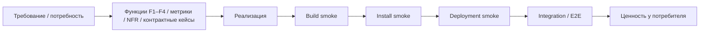

# Smoke-тестирование — GraphRAG

> **Статус:** рабочий гайд для разработчиков, тестировщиков, DevOps и ИИ-агентов.
> **Назначение:** описать smoke как быстрый и детерминированный способ проверить, что сборка, развёртывание контура и стенд **живы** и готовы двигаться дальше по CI/CD. Smoke отвечает не на вопрос «верна ли функциональность», а на вопрос «есть ли сигналы жизнеспособности, достаточные для перехода к более дорогим проверкам и релизу».
> **Текущее состояние:** проект на этапе видения (`../vision.md`): кодовой базы и CI нет (`../src/` содержит только README.md). Всё, что в этом документе относится к прогонам и CI, — целевое состояние.
> **Методологическая база:** `../qa/README.md` §4.3, §5, §8; `../qa/test-plan.md` §6 и §9; `../qa/gates.md` (`FG-BUILD`, `FG-UNIT`, `FG-REGRESSION`); каталоги требований — планируются (`../vision.md` §2.2); `../vision.md` §1.3, §2.1–2.2, §2.4, §2.8; `../../.ai-factory/RESEARCH.md`; `../../.ai-factory/PLAN.md`.

---

## 1. Smoke в системе качества

Smoke — это **проверка сигналов жизнеспособности**, а не функциональная верификация.

| Сигнал | Что проверяем |
|---|---|
| Связь | порт слушает, HTTP/MCP-эндпоинт отвечает, соединение с LLM-inference endpoint установлено |
| Процесс | сервисы контура стартовали и не упали, `systemd` показывает `active` |
| Индексация | корпус индексируется, пайплайн показывает статус `running`/`done` |
| Состояние | граф построен, пайплайн дошёл до `DONE` |
| Артефакт | бинарник собран, версия и хэш совпали |

Функциональность как таковая — правильность расчётов, валидаций, бизнес-правил и обработок ошибок — **не smoke**. Это зона unit, integration и E2E.



### Smoke, gate и US — не одно и то же

| Понятие | Роль |
|---|---|
| Smoke | Быстрая проверка жизнеспособности |
| Gate | Решение: можно ли продвигать дальше |
| US / функция | Требование о пользовательской ценности |

Smoke даёт данные для gate-решения. US (в GraphRAG — функции F1–F4, `../vision.md` §2.1–2.2) описывает ценность и, если касается критического пути, может усиливать трассировку, но не является источником smoke-набора.

---

## 2. Что smoke покрывает в первую очередь

### 2.1. Три вида smoke

| Вид | Что проверяет | Когда |
|---|---|---|
| Build smoke | Сборка и артефакты для целевых платформ | Каждый MR/push |
| Install smoke | Развёртывание контура: GPU-рантайм, open-weight модель, хранилище графа/векторов, сервисы | На целевом контуре до глубоких уровней |
| Deployment smoke | Критический путь после деплоя стенда | Каждый деплой стенда |

### 2.2. Что smoke не делает

- не проверяет подробную функциональную корректность;
- не заменяет integration и E2E;
- не покрывает детальные негативные сценарии и границы;
- не доказывает бизнес-ценность, если нет внешнего сигнала жизнеспособности;
- не использует fake/mock/stub в критическом пути контура.

### 2.3. Минимальный смысл каждого вида

- **Build**: «собирается ли продукт вообще».
- **Install**: «разворачивается ли контур и стартуют ли базовые сервисы».
- **Deployment**: «готов ли стенд принимать дальнейшие проверки и релиз».

---

## 3. Источники правды и граница с требованиями

Smoke строится только из:

1. **P0 FR / функции F1–F4** — критические функциональные требования (`../vision.md` §2.1–2.2);
2. **P0 NFR** — платформенные ограничения контура (GPU-рантайм, CUDA, хранилища);
3. **UC P0** — когда появятся (каталоги требований планируются, `../vision.md` §2.2);
4. **Эталонные кейсы K1, K4, K5, K17** — контрактные тесты критического пути до реализации;
5. **`../src/README.md`** — состав модулей и топология контура.

### Правило трассировки

1. Определить вид smoke: build / install / deployment.
2. Найти функции F1–F4, метрики, NFR и соответствующие контрактные кейсы (K1, K4, K5, K17).
3. Свести их к одному минимальному сценарию жизнеспособности.
4. Отделить smoke от integration/E2E: если нужен детальный негатив, граница или полный пользовательский путь — это уже не smoke.
5. Зафиксировать scenario ID, trace и артефакты.

### Про US

US не является обязательным источником smoke. Если US существует и лежит на критическом пути, он может усилить трассировку, но не определяет smoke-набор. На этапе видения каталоги требований планируются (`../vision.md` §2.2), поэтому smoke опирается на функции F1–F4, метрики и эталонные кейсы K1, K4, K5, K17.

---

## 4. Объекты smoke-проверки

### 4.1. Build smoke

Проверяем:

- сборку Go-модулей: `go build ./...`;
- кросс-сборку бинарников для целевых платформ контура (Linux, архитектуры GPU-сервера);
- отсутствие ошибок компиляции/линковки;
- согласованность версий артефактов;
- упаковку артефактов для развёртывания контура;
- целостность сгенерированного кода (в т.ч. CGo-обвязки CPU-компонентов при необходимости).

### 4.2. Install smoke (развёртывание контура)

Проверяем:

- развёртывание на чистом стенде (Linux, GPU-сервер);
- GPU-рантайм: драйверы и CUDA подняты;
- open-weight модель загружена и совместима с рантаймом (квантование);
- хранилище графа/векторов поднято;
- старт сервисов: ядро, оркестрация пайплайнов, query engine, MCP-сервер;
- доступность HTTP/MCP endpoints;
- конфигурация по умолчанию;
- автозапуск сервисов;
- обновление и откат развёртывания для P1-набора.

### 4.3. Deployment smoke

Проверяем сигналы жизнеспособности критического пути:

- сервисы контура живы;
- HTTP/MCP endpoints отвечают;
- корпус индексируется: мини-корпус (markdown-спеки, PDF) → граф построен;
- эталонный вопрос получает ответ со ссылками на источники (K1);
- MCP-запрос возвращает точный набор артефактов (K17);
- анализ влияния для изменения артефакта (K4);
- сверка «результат ↔ источник» (K5);
- аудит фиксирует события (SecurityEventEmitted при срабатывании фильтрации утечек);
- версии на стенде совпадают с релизом.

### 4.4. Что не является smoke

- функциональные подробности индексации, ответов и валидаций;
- негативы про повреждённые данные, сбои GPU-рантайма, ретраи, утечки;
- полный пользовательский путь через интерфейс;
- полный контрактный путь (K1, K4, K5, K17) с детальными assertions;
- нагрузка, отказоустойчивость, длительная стабильность.

---

## 5. Окружения, заглушки и oracle

### 5.1. Стенды

| Стенд | Назначение |
|---|---|
| CI / быстрый набор | Build smoke и проверка сборки |
| Dev-стенд | Install smoke (развёртывание контура) |
| Тестовый контур | Deployment smoke: реальные сервисы + заглушки GitLab, эмулятор LLM с golden-ответами, тестовые хранилища |
| Прод-подобный стенд | Проверка на реальном GPU-контуре (GPU, open-weight модель) |
| Специфичные GPU-конфигурации | Эмуляция только для P2 |

### 5.2. Обязательные свойства стенда

- чистый снапшот;
- детерминированные ОС, локаль и пути;
- реальные сервисы контура в критическом пути;
- тестовый контур как согласованный фон;
- измеримый бюджет времени;
- наблюдаемость: логи, состояния, версии, метрики;
- возможность fault injection для негативного smoke.

### 5.3. Заглушки и эмуляция

- в критическом пути сервисы контура не подменяются fake/mock/stub;
- заглушки допустимы только на внешнем контуре: GitLab, эмулятор LLM, тестовые хранилища;
- специфичные GPU-конфигурации допускается проверять через эмуляцию, но это пометка `P2`, а не замена нативного прогона.

### 5.4. Что считается oracle

Oracle — это внешний наблюдатель, а не текст «команда прошла»:

- процесс/порт;
- статус сервисов и пайплайнов;
- файл/путь/хэш (граф, индексы, версии артефактов);
- ответ на эталонный вопрос со ссылками на источники;
- версия артефакта и commit SHA.

---

## 6. Процедура smoke-тестирования

### Шаг 0. Подготовка

- подтвердить, что предыдущий уровень зелёный;
- зафиксировать commit SHA, версии, конфигурацию стенда;
- выбрать smoke-вид;
- подготовить тестовые данные;
- исключить продуктивные секреты и окружения.

### Шаг 1. Build smoke

- сборка Go-модулей и кросс-сборка;
- упаковка артефактов;
- валидация контрактных кейсов (K1, K4, K5, K17);
- фиксация версий и хэшей;
- остановка конвейера при падении.

### Шаг 2. Install smoke (развёртывание контура)

- чистый стенд;
- развёртывание контура: GPU-рантайм, open-weight модель, хранилище, сервисы;
- старт сервисов: ядро, пайплайны, query engine, MCP-сервер;
- проверка конфигурации по умолчанию;
- автозапуск, обновление и откат для P1.

### Шаг 3. Deployment smoke

- поднять тестовый контур (заглушки GitLab, эмулятор LLM, тестовые хранилища);
- подтвердить процессы и порты;
- пройти критический путь P0;
- проверить версии;
- уложиться в бюджет времени.

### Шаг 4. Негативный smoke

- внешние системы недоступны, но сервисы контура работают;
- повторный деплой не ломает состояние;
- сценарий устойчив на чистом снапшоте.

### Шаг 5. GPU-специфичные прогоны

- install smoke (развёртывание контура) на целевой конфигурации;
- GPU-специфика: драйверы, CUDA, совместимость модели с рантаймом — до полной автоматизации может быть ручной контур;
- редкие GPU-конфигурации — только как P2/эмуляция.

### Шаг 6. Фиксация результата

В результате должны быть:

- scenario ID;
- trace на функции F1–F4, метрики и контрактные кейсы;
- версии, хэши, снапшот стенда;
- команда запуска или playbook;
- логи и состояния;
- метрики и состояние пайплайнов;
- ссылка на CI/job или архив ручного прогона;
- дефект, если smoke упал.

---

## 7. Каталог smoke-сценариев

### 7.1. Build smoke

| ID | Проверка | Окружение | Приоритет |
|---|---|---|---|
| SM-B-01 | Сборка Go-модулей и кросс-сборка для целевых платформ контура | CI | P0 |
| SM-B-02 | Версии и хэши артефактов согласованы | CI | P0 |
| SM-B-03 | `go test -race` по затронутым компонентам | CI | P0 |
| SM-B-04 | `golangci-lint run` по затронутым компонентам | CI | P0 |
| SM-B-05 | Бинарники для целевых платформ контура созданы | CI | P0 |
| SM-B-06 | CPU-компоненты (Leiden, HNSW, токенизатор) собираются (CGo при необходимости) | CI | P0 |
| SM-B-07 | Подпись артефактов | CI | P1 |
| SM-B-08 | SBOM для поставляемых сборок | CI | P1 |
| SM-B-09 | Нет секретов и запрещённых зависимостей | CI | P1 |
| SM-B-10 | Эмулятор LLM и заглушки тестового контура собираются | CI | P2 |

### 7.2. Install smoke (развёртывание контура)

| ID | Проверка | Окружение | Приоритет |
|---|---|---|---|
| SM-I-01 | Чистый стенд: GPU-рантайм (драйверы, CUDA) развёрнут | dev-стенд | P0 |
| SM-I-02 | Open-weight модель загружена, совместима с рантаймом (квантование) | dev-стенд | P0 |
| SM-I-03 | Хранилище графа/векторов поднято | dev-стенд | P0 |
| SM-I-04 | Сервисы развёрнуты: ядро, пайплайны, query engine, MCP-сервер | dev-стенд | P0 |
| SM-I-05 | HTTP/MCP endpoints отвечают | dev-стенд | P0 |
| SM-I-06 | Конфигурация по умолчанию валидна | dev-стенд | P0 |
| SM-I-07 | Автозапуск сервисов работает | dev-стенд | P1 |
| SM-I-08 | Обновление контура сохраняет состояние | dev-стенд | P1 |
| SM-I-09 | Откат развёртывания восстанавливает стенд | dev-стенд | P1 |
| SM-I-10 | Повторное развёртывание не теряет данные | dev-стенд | P2 |
| SM-I-11 | Специфичные GPU-конфигурации проверены через эмуляцию | эмуляция | P2 |
| SM-I-12 | Эмулятор LLM с golden-ответами развёрнут | тестовый контур | P0 |

### 7.3. Deployment smoke

| ID | Проверка | Приоритет |
|---|---|---|
| SM-D-01 | После деплоя сервисы контура живы, HTTP/MCP endpoints отвечают | P0 |
| SM-D-02 | Индексация мини-корпуса (markdown + PDF) завершается, граф построен | P0 |
| SM-D-03 | Эталонный вопрос получает ответ со ссылками на источники (K1) | P0 |
| SM-D-04 | MCP-запрос возвращает точный набор артефактов (K17) | P0 |
| SM-D-05 | Анализ влияния для изменения артефакта (K4) | P0 |
| SM-D-06 | Сверка «результат ↔ источник» (K5) | P0 |
| SM-D-07 | Здоровье сервисов и метрики доступны | P0 |
| SM-D-08 | Аудит-события пишутся; SecurityEventEmitted при срабатывании фильтрации утечек | P0 |
| SM-D-09 | Онтологический слой загружен, резолвинг по модели предметной области работает (механизм F1/F3) | P1 |
| SM-D-11 | Версии компонентов и SHA совпадают | P0 |
| SM-D-12 | Внешние системы недоступны, но сервисы контура работают | P0 |
| SM-D-13 | Повторный деплой/перезапуск сохраняет состояние | P1 |
| SM-D-14 | Критический путь укладывается в 15 минут, прогон стабилен | P0 |

### 7.4. Функциональные акценты (F1–F4)

- `F2 индексация источников знаний`: SM-D-02, SM-D-11, SM-D-12
- `Онтологический слой (механизм F1/F3)`: SM-D-09
- `F1 генерация проверяемых ответов`: SM-D-03, SM-D-06
- `F3 оптимизация контекста для автоматической разработки`: SM-D-05
- `F4 доставка через MCP`: SM-D-04
- `NFR-SEC-1 безопасный контур LLM`: SM-D-08
- `здоровье/метрики`: SM-D-07

### 7.5. Базовый набор

Обязательный минимум deployment smoke:
SM-D-02, SM-D-03, SM-D-04, SM-D-05, SM-D-06, SM-D-07, SM-D-08.
Это и есть основной сигнал жизнеспособности критического пути.

---

## 8. Качество smoke

### 8.1. Детерминизм и anti-flake

Smoke — частый прогон, поэтому флейки дорогие.

Правила:

- чистые снапшоты;
- фиксированные версии, локаль и пути;
- polling вместо `sleep`;
- один сценарий — одна жизнеспособность;
- при флаке — дефект и карантин, а не увеличение таймаута.

### 8.2. Anti-fake

Нельзя принимать за smoke:

- «джоба зелёная» без артефактов;
- «команда прошла», но состояние не изменилось;
- старую сборку или старый стенд;
- отсутствующий oracle;
- частичный прогон, выданный за полный.

### 8.3. Definition of Done

Smoke-сценарий готов, если:

- есть trace на функции F1–F4, метрики и контрактные кейсы;
- есть scenario ID из `SM-*`;
- выбран вид smoke и внешний oracle;
- подтверждён минимальный P0-набор;
- заданы negative assertion и бюджет времени;
- артефакты сохранены;
- провал сценария останавливает конвейер.

---

## 9. CI/CD и автоматизация

> Целевое состояние: на этапе видения CI отсутствует; описанная ниже цепочка — целевая автоматизация.

### 9.1. Целевая цепочка

```text
golangci-lint → go test -race → сборка → smoke (развёртывание тестового контура) → интеграционные → e2e → NFR
```

### 9.2. Команды-ориентиры

```sh
# build smoke
go build ./...
go test -race ./...
golangci-lint run ./...

# install smoke (развёртывание контура; конкретные команды и скрипты — уточняются на этапе проектирования)
# 1. GPU-рантайм: драйверы, CUDA
# 2. загрузка open-weight модели, проверка совместимости с рантаймом (квантование)
# 3. подъём хранилища графа/векторов
# 4. старт сервисов: ядро, пайплайны, query engine, MCP-сервер

# deployment smoke (команда определяется на этапе проектирования)
# базовый набор: SM-D-02, SM-D-03, SM-D-04, SM-D-05, SM-D-06, SM-D-07, SM-D-08, SM-D-11, SM-D-12
```

### 9.3. Правила

- build smoke — быстрый набор на каждый push/MR;
- install/deployment smoke — после готовности стенда;
- провал smoke останавливает дальнейшее продвижение;
- пока CI не автоматизирует весь набор, ручной прогон подтверждается артефактами.

---

## 10. Чек-лист ревью smoke-сценария

- [ ] Трассировка идёт от функций F1–F4, метрик и контрактных кейсов.
- [ ] Сценарий действительно smoke, а не integration/E2E.
- [ ] Выбран правильный вид smoke.
- [ ] Oracle внешний.
- [ ] Нет подмены сервисов контура fake/mock/stub.
- [ ] Есть negative assertion.
- [ ] Время укладывается в бюджет.
- [ ] Есть артефакты прогона и ссылка на CI/job.
- [ ] Флаки и skip не скрыты под `passed`.

---

## 11. Что не надо делать

- Не превращать smoke в integration/E2E.
- Не проверять только код возврата или зелёную джобу.
- Не использовать внутренние логи как основной oracle.
- Не подменять критический путь заглушками.
- Не заявлять прогон без артефактов.
- Не скрывать флаки и expected fail.
- Не смешивать в одном сценарии несколько независимых жизнеспособностей.
- Не превышать бюджет 15 минут без waiver.

---

## 12. Риски и ограничения

- GPU-специфичные прогоны (драйверы, CUDA, совместимость модели с рантаймом) могут быть ручными до полной автоматизации.
- `SCA/лицензии open-weight моделей`, соответствие 152-ФЗ (ПДн) и часть `security` — целевая модель, могут исполняться как expected fail / known gap.
- smoke не покрывает негатив и границы, поэтому эти дефекты остаются риском integration/E2E.
- smoke зависит от согласованного тестового контура, но не должен зависеть от внешних систем.
- редкие GPU-конфигурации допускаются как эмуляция, но не заменяют нативный прогон.

---

## 13. Связанные артефакты

- `../vision.md` — видение: цели G1–G7 (§1.3), функции F1–F4 (§2.1–2.2), события (§2.4), внешние зависимости (§2.8)
- `../glossary.md` — глоссарий
- `../adr/README.md` — решения (в т.ч. ADR-IMPL.STACK.go-single-language-adoption, ПРИНЯТО)
- `../src/README.md` — состав модулей контура
- `../qa/README.md` — методологическая база smoke
- `../qa/test-plan.md` — тест-план
- `../qa/gates.md` — gates: FG-BUILD, FG-UNIT, FG-REGRESSION
- `../qa/integration.md` — интеграционное тестирование
- `../qa/e2e-gui-testing.md`
- `../qa/e2e-api-testing.md`
- прочие сценарии каталога `../qa/` (всего 8 файлов)
- `../../.ai-factory/RESEARCH.md` — исследование
- `../../.ai-factory/PLAN.md` — план
- `../../.ai-factory/RULES.md` — правила проекта
- `../../.ai-factory/references/fitness-functions.md` — метрики и fitness-функции
- `../../.agents/skills/quality-matrix/SKILL.md`
- `../../.agents/skills/formal-definition/SKILL.md`
- `../../.agents/skills/aif-qa/SKILL.md`
- `../../.agents/skills/aif-rules-check/SKILL.md`
- `../../.agents/skills/aif-review/SKILL.md`
- `../../.agents/skills/aif-verify/SKILL.md`
- `../../.agents/skills/aif-security-checklist/SKILL.md`
- Каталоги требований (функции, метрики, NFR) — планируются (`../vision.md` §2.2)
- Контрактные кейсы K1, K4, K5, K17 — определяются на этапе проектирования
