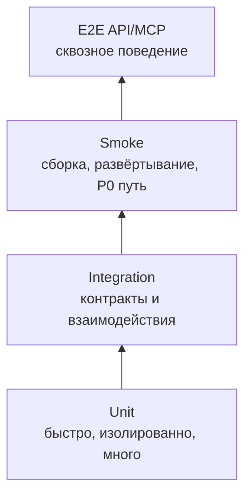

# Модульное тестирование — GraphRAG

> **Статус:** рабочий гайд для разработчиков и ИИ-агентов.  
> **Назначение:** описать, как проектировать, писать, ревьюить и запускать модульные тесты для Go-компонентов `src/` так, чтобы тесты подтверждали требования, давали быструю обратную связь и были пригодны для автоматической генерации.  
> **Методологическая база:** `qa/README.md` (пирамида тестов, матрица качества, измеримость, shift-left), `qa/gates.md` (FG-гейты), `../../.ai-factory/references/software-requirements-wiegers-beatty.md` (Validation: testing the requirements, acceptance criteria, traceability), видение и архитектура — `../vision.md`, `../src/README.md`, методы и эталонные кейсы — `../../.ai-factory/RESEARCH.md`, `../../.ai-factory/PLAN.md`.
> **Состояние проекта:** этап видения: кодовой базы и тестов пока нет (`src/` — только `../src/README.md`). Всё, что в гайде относится к прогонам, CI и порогам, описывает **целевое состояние** и вводится вместе с первым кодом.

---

## 1. Место unit-тестов в стратегии качества

Модульный тест проверяет **единицу кода в изоляции**: функцию, метод, тип, пакет или use case без реальной сети, внешнего облака, продуктивной БД, реального времени и платформенного окружения.



| Параметр | Правило проекта |
|---|---|
| Основная база | Функции F1–F4 и критерии приёмки — `../vision.md` §2.1–2.2 (каталог требований планируется, §2.2); цели G1–G7 и метрики — §1.3 |
| Объект | Go-пакеты модулей GraphRAG: ядро, оркестрация пайплайнов (F2), движок запросов (F1), MCP-сервер (F4), интеграции (GitLab, GPU-контур), CPU-компоненты (токенизатор, HNSW, Leiden) — состав в `../src/README.md` |
| Среда | Локально у разработчика/агента и в CI |
| Команда-гейт | `go test -race ./...` для затронутого модуля; в CI — `go test -coverprofile=coverage.out -race -v ...` |
| Время | Секунды–минуты; unit-набор не должен требовать стенда |
| Выходной критерий | Тесты детерминированно проходят, проверяют критерии приёмки и не являются always-pass/пустыми |

Unit-тесты — первый обязательный гейт реализации FR. По `qa/gates.md`: задача от агента или разработчика не считается принятой, если не проходят `FG-BUILD` и `FG-UNIT`.

---

## 2. Цели unit-тестирования

Unit-тест должен отвечать на один или несколько вопросов:

1. **Требование реализовано?** Критерий приёмки функции F1–F4 (каталог требований планируется, `../vision.md` §2.2) выражен проверкой.
2. **Граничные случаи корректны?** Пустые значения, минимумы/максимумы, дубликаты, неверные статусы, повреждённые payload/чанки, таймауты.
3. **Ошибки обрабатываются явно?** Неверный ключ, невалидный JSON, недоступный репозиторий/индекс, неожиданный HTTP-статус (GitLab, LLM-endpoint), ошибка записи.
4. **Поведение детерминированно?** Сортировка стабильна, ID воспроизводимы, результат не зависит от порядка map, времени или внешней среды.
5. **Регрессия будет поймана?** Если изменить существенную строку бизнес-логики, тест должен упасть.
6. **Тест написан до кода?** Где только возможно, работа идёт по TDD: тест (red) → реализация (green) → рефакторинг. Красный тест до реализации — прямое доказательство, что тест проверяет поведение, а не дублирует реализацию (раздел 14.3).

По W&B тесты — альтернативное представление требований. Если требование нельзя объективно проверить unit-тестом или другим уровнем тестирования, это дефект требования: непроверяемость, неоднозначность или неполнота.

---

## 3. Что покрывать в первую очередь

### 3.1. Приоритеты

| Приоритет | Что обязательно покрывать unit-тестами |
|---|---|
| P0 | Критичный путь, безопасность контура LLM (фильтрация утечек, аудит — REQ-NFR-security.compliance.llm-contour), онтологический резолвинг (механизм F1/F3), извлечение знаний (F2), анализ влияния (F3), целостность графа, сохранность данных, статусы пайплайнов |
| P1 | Основная бизнес-логика функций F1–F4, retry/timeout/idempotency-логика, маппинг контрактов (GitLab API, MCP JSON-RPC), use case поведение |
| P2 | Локальная логика без высокой критичности, если тест дешёвый или предотвращает известную регрессию |

### 3.2. Объекты покрытия

Кодовой базы пока нет: проект на этапе видения, `src/` содержит только `../src/README.md`. Таблица фиксирует **целевые** объекты unit-покрытия — Go-модули GraphRAG; примеры тестов появятся вместе с первым кодом.

| Модуль (целевой) | Что тестировать unit-уровнем | Примерные области тестирования |
|---|---|---|
| Ядро (граф знаний, хранилище) | модели сущностей/связей/утверждений, чанкинг, mutual indexing факт↔чанк (F2), статусы пайплайнов, storage-адаптеры через изоляцию | чанкинг markdown/PDF, валидация чанка/сущности/утверждения, дубликаты |
| Оркестрация пайплайнов (F2) | автоиндексация (F2.1), инкрементальное обновление (F2), обработка ошибок зависимостей (GitLab API/webhook), retry/idempotency | инкрементальное обновление, повторная индексация |
| Движок запросов (F1) | dual-level retrieval (LightRAG), pruning путей (PathRAG), PPR, multi-hop (F1.2), детекция противоречий (G3), LLM-as-judge (REQ-NFR-api.compliance.rag-accuracy) | ранжирование, детекция противоречий, сборка ответа с grounding |
| Онтологический слой (механизм F1/F3) | резолвинг терминов по модели, канонические термины, обновление модели, минимизация контекста (REQ-NFR-api.performance.token-minimization) | резолвинг термина, unknown term, конфликты терминов |
| MCP-сервер (F4) | сборка контекста, схема MCP-инструментов (JSON-RPC), сверка со спецификациями (G4), предзавершающий гейт (Фаза 2/3), QA-контекст | валидация JSON-RPC, лимиты токенов |
| Интеграции (GitLab, GPU-контур) | mapper-ы Git API/webhook/MR, HTTP-клиент LLM-endpoint (OpenAI-совместимый, vLLM/Ollama/llama.cpp), обработка ошибок/таймаутов | невалидный webhook, 5xx LLM-endpoint |
| CPU-компоненты (токенизатор, HNSW, Leiden) | детерминированные алгоритмы без LLM и GPU, обвязка CGo через интерфейсы | токенизация, community summaries (C0–C1), детекция сообществ (Leiden) |

Критичные модули качества, unit-покрытие которых обязательно в первую очередь (приоритет P0, раздел 3.1): контур LLM (фильтрация утечек, аудит — REQ-NFR-security.compliance.llm-contour), онтологический слой (резолвинг — механизм F1/F3), извлечение знаний (F2), анализ влияния (детерминизм — F3), MCP-компилятор (F4), CPU-компоненты (токенизатор, HNSW, Leiden), инкрементальное обновление графа (F2).

### 3.3. Критичные классы дефектов

Обязательные негативные и граничные проверки для проекта:

- невалидный/повреждённый документ, чанк, payload;
- невалидный JSON/JSON-RPC (MCP) payload;
- неожиданный HTTP-статус (GitLab API, LLM-endpoint);
- недоступный репозиторий/индекс/GitLab/LLM-endpoint как ошибка зависимости через mock/fake;
- таймаут, повторная доставка, идемпотентность инкрементального обновления;
- дубликаты документов/чанков/сущностей, повторная индексация одного документа;
- запрет недопустимого перехода статуса пайплайна индексации (повторный запуск уже выполняемой индексации, отмена после завершения и т. п.);
- security-ограничения: отсутствие секретов и данных корпуса в логах/аудит-выводах, обращение к LLM только через корпоративный контур (REQ-NFR-security.compliance.llm-contour), запрет open-by-default поведения;
- платформозависимые ветки (например, CGo-обвязка CPU-компонентов), если их можно проверить без реальной платформы через выделенный интерфейс.

---

## 4. Источники правды перед написанием теста

Источник правды для unit-теста — **требования и контракты**, а не реализация. Перед генерацией unit-теста человек или ИИ-агент должен прочитать минимальный набор источников:

1. **Требование** — функции F1–F4 и подфункции из `../vision.md` §2.1–2.2 (каталог требований планируется, §2.2), цели G1–G7 и метрики из §1.3, или сценарий из `qa/test-plan.md`.
2. **Контракт**, если тестируется mapper/handler payload: GitLab API (Git API/webhook/MR), MCP JSON-RPC, OpenAI-совместимый LLM-endpoint (vLLM/Ollama/llama.cpp) — внешние зависимости `../vision.md` §2.8.
3. **Существующие `*_test.go` рядом** — стиль, naming, helpers, fake-объекты (появятся с первым кодом; до этого — разделы 6 и 19).
4. **Архитектурный контекст**, если тест влияет на границы модулей: `../adr/README.md`, `../src/README.md`, `../vision.md`.

Код тестируемого пакета в `src/` читается только для понимания реализации и API; он **не является источником правды**: реализация может отставать от требований или содержать дефекты, которые тест должен ловить, а не закреплять.

Правило для ИИ-агента: **не выдумывать бизнес-логику**. Если в требованиях и контрактах не указано, как обрабатывать случай, тест должен либо фиксировать текущее очевидное поведение, либо создать вопрос в ревью/плане, а не навязывать новое правило.

---

## 5. Как выбирать тесты из требований

### 5.1. Алгоритм трассировки FR → unit-тест

1. Найти функцию/подфункцию F1–F4, которая реализуется изменением (`../vision.md` §2.1–2.2); каталог требований с критериями приёмки планируется (§2.2).
2. Выписать критерии приёмки как бинарные утверждения: «при X система возвращает Y», «при Z возвращает ошибку E».
3. Разделить проверки по уровням:
   - чистая доменная логика, mapper, validator, state machine → unit;
   - несколько реальных компонентов/процессов → integration;
   - полный пользовательский/API путь → E2E.
4. Для unit-части определить минимальную единицу кода и её зависимости.
5. Заменить зависимости на fake/mock/stub.
6. Добавить позитивный, негативный и граничный сценарии.
7. Добавить комментарий трассировки в формате `// F<номер>.<подфункция>: <описание>` (например, `// F2.1: ...`) над тестом или группой subtest (раздел 6.6). Если тест покрывает дефект без отдельной функции, указать ID дефекта/регрессии и связанную функцию при наличии.

### 5.2. Шаблон декомпозиции критерия

```text
Требование: F<номер>.<подфункция> (например, F2.1)
Критерий: <объективно проверяемое утверждение>

Unit-тесты:
- happy path: <валидный вход> → <ожидаемый результат>
- negative: <невалидный вход/ошибка зависимости> → <ожидаемая ошибка>
- boundary: <пусто/min/max/дубликат/истёкший TTL> → <ожидаемый результат>
- regression: <известный дефект> → <не повторяется>

Не unit:
- integration: <контракт/каскад>
- E2E: <сквозной путь>
```

### 5.3. Пример

```text
Требование: инкрементальное обновление графа знаний при появлении нового документа (F2).

Unit:
- Chunk.IsValid() == true для валидного чанка с текстом и источником
- Chunk.IsValid() == false для пустого чанка или чанка без источника
- Entity.Validate() == false для сущности без типа/источника
- OntologyResolver.Resolve(термин) возвращает канонический термин модели предметной области
- неизвестный термин возвращает ошибку/unknown term

Integration:
- webhook GitLab → оркестрация пайплайна F2 → граф обновлён инкрементально без полной переиндексации.

E2E API:
- пользователь получает ответ со ссылкой на источник (grounding, F1.1).
```

---

## 6. Конвенции Go-тестов

### 6.1. Расположение и package

- Файл теста: рядом с кодом, имя `*_test.go`.
- Для проверки внутренней логики допускается тот же package, как в коде модуля.
- Для проверки только публичного API предпочтителен внешний package (`package foo_test`), если это не ломает доступ к нужным helpers.
- Сгенерированный код (например, по схемам OpenAPI/JSON Schema) напрямую unit-тестами не покрывается; тестируются mapper-ы и обработчики вокруг контрактов.

### 6.2. Naming

Использовать понятные имена в стиле кода модулей:

```go
func TestChunk_Split_Markdown(t *testing.T) {}
func TestEntity_Validate_RequiresSource(t *testing.T) {}
func TestImpactAnalysis_TransitiveClosure(t *testing.T) {}
func TestOntologyResolver_Resolve_UnknownTerm(t *testing.T) {}
func TestIngestion_RepositoryError(t *testing.T) {}
func TestSignal_RepositoryError(t *testing.T) {}
```

Рекомендуемый формат:

```text
Test<Subject>_<ExpectedBehavior>
Test<Subject>_<Condition>_<ExpectedBehavior>
```

Хорошее имя теста должно отвечать на вопрос «какое поведение сломалось?» без чтения всего тела.

### 6.3. Структура Arrange / Act / Assert

```go
func TestSubject_Behavior(t *testing.T) {
    // arrange
    dep := newFakeDependency()
    svc := NewService(dep)

    // act
    got, err := svc.Do(context.Background(), input)

    // assert
    if err != nil {
        t.Fatalf("unexpected error: %v", err)
    }
    if got != want {
        t.Fatalf("got %v, want %v", got, want)
    }
}
```

Комментарии `arrange/act/assert` не обязательны. Добавляйте их только если тест сложный.

### 6.4. Table-driven tests

Для наборов входов/выходов использовать табличные тесты:

```go
func TestChunk_IsValid(t *testing.T) {
    tests := []struct {
        name  string
        chunk Chunk
        want  bool
    }{
        {name: "valid chunk with source", chunk: Chunk{Text: "markdown spec", SourceID: "doc-001"}, want: true},
        {name: "invalid empty text", chunk: Chunk{SourceID: "doc-001"}, want: false},
        {name: "invalid missing source", chunk: Chunk{Text: "markdown spec"}, want: false},
    }

    for _, tt := range tests {
        t.Run(tt.name, func(t *testing.T) {
            got := tt.chunk.IsValid()
            if got != tt.want {
                t.Fatalf("got %v, want %v", got, tt.want)
            }
        })
    }
}
```

Правила:

- `name` обязателен и описывает бизнес-смысл кейса.
- В таблице должны быть не только happy path, но и invalid/boundary cases.
- Если `tt` используется в `t.Parallel()`, делать `tt := tt` внутри цикла.

### 6.5. Проверки ошибок

Ошибки проверяются как часть контракта поведения:

```go
_, err := cl.GetDocument(context.Background(), DocumentRequest{ID: "doc-001"})
if err == nil || !strings.Contains(err.Error(), "ошибка выполнения запроса") {
    t.Fatalf("ожидалась ошибка выполнения запроса, получено: %v", err)
}
```

Лучше проверять:

- sentinel error через `errors.Is`;
- тип ошибки через `errors.As`;
- стабильный error code/field;
- фрагмент сообщения только если другого контракта нет.

Не проверять полный текст ошибки, если он не является пользовательским или контрактным сообщением: это делает тест хрупким.

### 6.6. Комментарий трассировки

Каждый unit-тест или логическая группа table-driven subtest должна содержать комментарий трассировки в формате `// F<номер>.<подфункция>: <описание>` (F-код функции/подфункции из `../vision.md` §2.1–2.2, например `// F2.1: ...`), где `<описание>` — кратко, какое правило проверяется.

```go
// F2: инкрементальное обновление графа при появлении нового документа.
func TestIncrementalUpdate_AppliesNewDocument(t *testing.T) {
    // ...
}
```

Правила формата:

- **Один ID на строку** — комментарий содержит ровно один идентификатор функции/подфункции и описание после двоеточия. Если тест покрывает несколько функций, добавляется несколько строк.
- **Порядок строк** — сначала F-код функции, затем (при необходимости) ID дефекта.
- **ID должен существовать** в `../vision.md` (F1–F4, §2.1–2.2) или в каталоге требований, когда он появится (планируется, §2.2). Несуществующий или изменённый ID — дефект трассировки, который должен ловить гейт `FG-TRACE`.
- Если тест фиксирует регрессию, но связанной функции пока нет, указать ID дефекта и ближайший F-код; отсутствие связанной функции — повод вынести вопрос в ревью.

Формат обязателен, потому что он делает трассировку машинно-проверяемой: гейт `FG-TRACE` (раздел 6.7) сверяет ID в комментариях с реестром требований и подтверждает двустороннюю связь FR ↔ тест.

### 6.7. Связь с гейтом качества тестов (FG-TEST-QUALITY)

Гайд реализует требования гейта качества тестов `FG-TEST-QUALITY` из `qa/gates.md` (проверка: детерминизм, отсутствие тривиальных/always-pass/пустых тестов и `t.Skip`-заглушек, наличие реальных проверок и негативных сценариев). Соответствие проверяется на ревью и планируется в CI.

| Требование гейта `FG-TEST-QUALITY` | Где в гайде |
|---|---|
| Детерминизм, отсутствие «флаки» | раздел 10 (детерминированность и anti-flake), раздел 11 (гонки) |
| Нет тривиальных / always-pass / пустых тестов, `t.Skip`-заглушек | раздел 9.1 (реальные проверки), раздел 20 (что не надо делать) |
| Реальные проверки (assert), а не «выполнилось без ошибки» | раздел 9 (качество assertions) |
| Наличие негативных сценариев | раздел 3.3 (критичные классы дефектов), разделы 8.x (по функциям) |
| Тест должен падать при поломке логики (убивать мутацию) | раздел 13 (мутационное тестирование) |
| Двусторонняя трассировка FR ↔ тест, нет «сиротских» тестов | раздел 6.6 (комментарий трассировки) → гейт `FG-TRACE` |
| Критерии приёмки покрыты автоматическим тестом | раздел 5 (выбор тестов из требований) → гейт `FG-TEST` |

Связка гейтов: `FG-TEST` (критерии приёмки покрыты) → `FG-TRACE` (FR ↔ тест, комментарий формата `// F<код>: ...`) → `FG-TEST-QUALITY` (качество самих тестов) → `FG-MUTATION` (тест убивает мутации в критичных модулях).

### 6.8. Helpers

Повторяющуюся подготовку выносить в helpers и вызывать `t.Helper()`:

```go
func newServiceForTest(t *testing.T) *Service {
    t.Helper()

    dbPath := filepath.Join(t.TempDir(), "test.db")
    st, err := storage.NewStorage(dbPath)
    if err != nil {
        t.Fatalf("failed to create storage: %v", err)
    }

    return &Service{st: st}
}
```

---

## 7. Изоляция зависимостей

### 7.1. Что нельзя использовать в unit-тесте

Unit-тест не должен зависеть от:

- реального GPU-контура LLM (vLLM/Ollama/llama.cpp);
- реального GitLab (Git API/webhook/MR), MCP-сервера или иного внешнего сервиса;
- настоящего времени без возможности управления;
- абсолютных путей разработчика или CI;
- порядка выполнения тестов;
- состояния уже запущенных сервисов;
- продуктивных секретов, токенов доступа (GitLab, LLM-endpoint), данных прода.

Если нужна реальная сеть, несколько процессов, реальный GitLab, реальный LLM-endpoint, тестовые хранилища или GPU — это уже integration/smoke/E2E, а не unit.

### 7.2. Fake, stub, mock: когда что использовать

| Тип | Когда применять | Пример |
|---|---|---|
| Fake | Простая in-memory реализация интерфейса с состоянием | in-memory репозиторий документов для пайплайна индексации (F1) |
| Stub | Возвращает заранее заданный ответ, состояния почти нет | fake HTTP-клиент GitLab с `getFn`/`postFn` |
| Mock | Проверяет ожидания вызовов интерфейса | `mockery`-моки для интерфейсов модулей (интеграции GitLab, LLM-клиент) |
| Spy | Запоминает вызовы для последующей проверки | publisher событий (`DocumentIngested`, `GraphUpdated` — `../vision.md` §2.4), logger hook, event bus subscriber |

Правило проекта из `qa/README.md`: моки и заглушки генерируются через `mockery` по интерфейсам, где это оправдано. Конфигурация `.mockery.yaml` заводится вместе с первым кодом модуля.

### 7.3. Интерфейсы для тестируемости

Если код невозможно протестировать без сети/времени/ФС, выделите зависимость в интерфейс:

```go
type Clock interface {
    Now() time.Time
}

type DocumentStore interface {
    Save(ctx context.Context, doc Document) error
    Load(ctx context.Context, id string) (Document, error)
}
```

Не нужно создавать интерфейс «на всякий случай». Выделяйте его, когда есть реальная внешняя зависимость или несколько реализаций.

### 7.4. Время

Не использовать `time.Now()` и `time.Sleep()` напрямую в бизнес-логике, если поведение зависит от времени. Для TTL, retry, deadline и expiration вводить clock/timer abstraction или параметризовать время.

Плохо:

```go
time.Sleep(2 * time.Second)
```

Лучше:

```go
ctx, cancel := context.WithTimeout(context.Background(), 100*time.Millisecond)
defer cancel()
```

Или fake clock для чистой логики.

### 7.5. Файловая система

Для временных файлов использовать `t.TempDir()`. Не писать в рабочую директорию репозитория и системные пути.

```go
dir := t.TempDir()
path := filepath.Join(dir, "document.md")
```

### 7.6. Переменные окружения

Использовать `t.Setenv()`:

```go
t.Setenv("LLM_ENDPOINT", "http://127.0.0.1:8080/v1")
```

Не менять глобальное окружение без автоматического восстановления.

---

## 8. Специфика по функциям проекта (F1–F4)

Ниже — типовые unit-проверки и обязательные negative cases по функциям проекта (F1–F4, `../vision.md` §2.1–2.2) и механизмам. Для подфункций, где деталей пока нет, указано «(детали уточняются при реализации)».

### 8.1. F2: индексация источников знаний

Unit-проверки:

- чанкинг markdown-спек GitLab и PDF-книг (RAPTOR/StructRAG, F2.2) на уровне чистых функций;
- маппинг ответа LLM-извлечения в доменные модели сущностей/связей/утверждений (F2);
- mutual indexing факт ↔ чанк (KAG-принцип, F2);
- инкрементальное обновление: обработка только изменённых документов (F2);
- детекция дубликатов документов/чанков/сущностей;
- статусы пайплайна индексации, retry/idempotency.

Обязательные negative cases:

- невалидный/повреждённый документ (битый PDF, некорректная кодировка);
- пустой чанк, чанк без метаданных источника;
- невалидный ответ LLM-извлечения (отсутствуют сущности/связи, неверная схема JSON);
- недоступный GitLab (webhook/API) как ошибка зависимости;
- дубликат документа при повторной индексации;
- частичное обновление: сбой в середине пайплайна не ломает граф (детали уточняются при реализации).

### 8.2. Механизм: онтологический слой (внутри F1/F3)

Unit-проверки:

- резолвинг терминов запроса к каноническим терминам модели предметной области (онтологический слой);
- канонические термины: маппинг синонимов/сокращений в канонический термин (онтологический слой);
- обновление модели из репозитория (онтологический слой);
- минимизация контекста: отбор релевантных артефактов/подграфа (REQ-NFR-api.performance.token-minimization);
- загрузка и валидация машинно-читаемой модели предметной области (онтологии).

Обязательные negative cases:

- неизвестный термин → явная ошибка/unknown term, а не молчаливый пропуск;
- конфликт терминов (омонимия) → требуется явное правило (детали уточняются при реализации);
- повреждённая/невалидная онтология;
- сигнал со ссылкой на несуществующий артефакт.

### 8.3. F1: генерация проверяемых ответов

Unit-проверки:

- dual-level retrieval (LightRAG): глобальный и локальный отбор, ранжирование (F1.2);
- pruning путей (PathRAG) и PPR — детерминированные вычисления без LLM на извлечении;
- multi-hop: композиция промежуточных выводов (F1.2);
- детекция противоречий между источниками (G3);
- LLM-as-judge: оценка точности ответа, маппинг вердикта (REQ-NFR-api.compliance.rag-accuracy);
- сборка ответа со ссылками на источники (grounding, F1.1).

Обязательные negative cases:

- пустой результат retrieval (нет релевантных чанков) — ответ не должен «галлюцинировать»;
- источник недоступен/удалён при сборке ссылки;
- противоречие между двумя источниками → явный конфликт, а не произвольный выбор;
- ошибка LLM-endpoint (timeout, 5xx) при генерации ответа;
- превышение лимита токенов при сборке контекста.

### 8.4. F3: оптимизация контекста для автоматической разработки

Unit-проверки:

- граф связей артефактов (документ → чанк → сущность → утверждение → ответ);
- детерминированный анализ влияния: транзитивное замыкание по графу (F3.1);
- сверка «результат ↔ источник» (G4);
- построение графа до клиентского результата (F3.2);
- формирование сигнала владельцу затронутого артефакта (F3.2).

Обязательные negative cases:

- циклы в графе не приводят к зацикливанию;
- отсутствие связей у артефакта (нет влияния) → корректный пустой результат;
- дубликаты связей/рёбер;
- результат стабилен при изменении порядка обхода графа (детали уточняются при реализации).

### 8.5. Вне рамок проекта (vision §2.7 п.4–5)

Накопление знаний из внешних сигналов, импорт сигналов с полей и петля обучения — **вне рамок проекта** (vision.md §2.7 п.4–5). Unit-тесты не разрабатываются; связанная метрика («время сигнал → фикс») не включается.

### 8.6. F4: доставка ответов и контекста через MCP

Unit-проверки:

- сборка точного набора артефактов для ИИ-агента (F4);
- схема MCP-инструментов и JSON-RPC payload (F4);
- сверка собранного контекста со спецификациями (G4);
- предзавершающий гейт: проверка полноты/валидности контекста перед выдачей агенту (F4, Фаза 2/3);
- QA-контекст (F4).

Обязательные negative cases:

- невалидный JSON-RPC запрос/ответ;
- неизвестный инструмент;
- контекст превышает лимит токенов;
- отсутствие обязательных полей в запросе агента (детали уточняются при реализации).

### 8.7. Сквозное требование: безопасный контур LLM (REQ-NFR-security.compliance.llm-contour)

Unit-проверки:

- фильтрация утечек: запрет выдачи секретов/внутренних данных в контекст и ответы (REQ-NFR-security.compliance.llm-contour);
- аудит обращений к LLM: формирование записи события (`SecurityEventEmitted` — `../vision.md` §2.4), отсутствие секретов в логах;
- контроль лицензий open-weight моделей и open-source зависимостей (SCA) на уровне проверки метаданных;
- минимизация токенов/LLM-вызовов: правила отбора контекста (REQ-NFR-api.performance.token-minimization).

Обязательные negative cases:

- утечка-паттерн в контексте → блокировка + событие аудита;
- обращение к LLM вне корпоративного контура (не-локальный endpoint) → запрет (метрика «0 обращений вне контура»);
- превышение лимита токенов/затрат;
- невалидная запись аудита (детали уточняются при реализации).

---

## 9. Качество assertions

### 9.1. Тест должен иметь реальную проверку

Плохо:

```go
func TestSomething(t *testing.T) {
    _ = NewService()
}
```

Хорошо:

```go
func TestIngestion_NoNewDocuments(t *testing.T) {
    repo := newFakeDocRepo()
    uc := NewIngestionUseCase(repo, zerolog.Nop())

    resp, err := uc.Ingest(context.Background(), &IngestRequest{SourceID: "gitlab:corp/docs"})

    if err != nil {
        t.Fatalf("unexpected error: %v", err)
    }
    if resp.IngestedDocs != 0 {
        t.Fatal("expected IngestedDocs 0")
    }
    if resp.UpdatedEntities != 0 {
        t.Fatalf("UpdatedEntities = %d, want 0", resp.UpdatedEntities)
    }
}
```

### 9.2. `Fatal` vs `Error`

- `t.Fatalf` / `t.Fatal` — если дальнейшие проверки невозможны или могут panic.
- `t.Errorf` / `t.Error` — если можно собрать несколько независимых расхождений.

### 9.3. Сравнение структур

Для небольших значений достаточно стандартного `if got != want`. Для структур и слайсов:

- стандартный `reflect.DeepEqual` допустим для простых структур;
- `cmp.Diff` можно добавить, если зависимость уже принята в компоненте;
- `testify/assert` и `require` использовать только там, где зависимость уже есть и стиль пакета это допускает.

Не добавлять новую тестовую библиотеку без необходимости.

---

## 10. Детерминированность и anti-flake

Unit-тест должен давать одинаковый результат на локальной машине, в CI и при повторном запуске.

### 10.1. Таксономия причин флаки

| Категория | Типичная причина | Пример в проекте |
|---|---|---|
| Тайминги | `time.Sleep`/реальные таймауты вместо ожидания события | ожидание статуса пайплайна индексации, ожидание ответа LLM |
| Гонки | общее mutable-состояние, порядок горутин/map | общий event bus, глобальные singleton-клиенты (GitLab, LLM), общее хранилище |
| Порядок | зависимость от порядка запуска тестов | общие storage/порты между тестами |
| Внешние зависимости | реальная сеть/сервисы в пути | реальный GitLab/LLM-endpoint/хранилище в unit-тесте |
| Окружение | загрузка CI, платформенные различия | таймауты под нагрузкой, пути ОС |
| Слабые assertions | проверка полного текста ошибки, «не упало» | `strings.Contains(err, полный текст)` |

### 10.2. Чек-лист anti-flake

- [ ] Нет зависимости от реального времени без fake clock/deadline.
- [ ] Нет `time.Sleep()` как ожидания события.
- [ ] Нет реальной сети и внешних сервисов.
- [ ] Нет зависимости от порядка map/горутин.
- [ ] Временные файлы создаются через `t.TempDir()`.
- [ ] Env меняется через `t.Setenv()`.
- [ ] Тестовые данные фиксированы и не используют production secrets.
- [ ] Тест не зависит от других тестов и порядка запуска.
- [ ] Параллельные тесты не используют общий mutable state.
- [ ] Проверки ошибок устойчивы: `errors.Is/As`, codes, fields, а не случайный текст.

### 10.3. Методы детекции

- `go test -race -count=5 ./<package>` — повторный прогон выявляет нестабильность;
- линтеры тестов в golangci-lint: `testpackage`, `paralleltest`, `tparallel`, `forbidigo` (целевое, конфигурация фиксируется вместе с первым кодом);
- тест, упавший при неизменном коде хотя бы раз в CI, — кандидат в флаки: зафиксировать и разобрать, а не игнорировать.

### 10.4. Жизненный цикл флаки-теста

Если тест иногда падает — это дефект теста или кода (глоссарий, `flakyTest`):

1. **Завести дефект** с владельцем; приложить лог прогона, команду запуска и окружение.
2. **Карантин**: пометить тест и исключить из гейта — только вместе с зарегистрированным дефектом; «тихий» карантин (пропуск без дефекта) запрещён.
3. **Устранить корень** по таксономии (10.1), а не симптом: не увеличивать `sleep`/таймаут «для стабилизации».
4. **Верифицировать**: N успешных прогонов подряд (`-count=N`, N ≥ 5) локально и в CI.
5. **Вернуть** тест в набор, закрыть дефект.

Повторные прогоны «до зелёного» без анализа причины запрещены.

---

## 11. Параллельность и гонки

CI использует `-race`; локально для затронутого компонента также запускать с race detector:

```bash
go test -race ./...
```

Правила:

- Использовать `t.Parallel()` только для тестов без общего состояния, портов, глобальных env, временных singleton-ов.
- Для table-driven + `t.Parallel()` обязательно захватывать переменную цикла:

```go
for _, tt := range tests {
    tt := tt
    t.Run(tt.name, func(t *testing.T) {
        t.Parallel()
        // ...
    })
}
```

- Глобальные registries, singleton clients, package-level vars сбрасывать через `t.Cleanup()`.
- Если race detector ловит гонку, не отключать тест: исправить синхронизацию или изоляцию.

---

## 12. Покрытие: как использовать метрику

Покрытие — полезная метрика, но не цель сама по себе. Для проекта важнее покрытие **критериев приёмки и рисков**, чем общий процент строк.

Команды:

```bash
go test -race -coverprofile=coverage.out ./...
go tool cover -func=coverage.out
```

Порог покрытия **зафиксирован (2026-08-30, open-questions.md Q3.8)** двумя уровнями:
- **Требование-уровневое покрытие: 100% FR/US/BR** — каждое требование имеет как минимум один автоматический тест (гейт `FG-TRACE`); негативные сценарии обязательны.
- **Line/branch покрытие критичных модулей: ≥ 80%** — контур LLM/фильтрация утечек, онтологический слой, извлечение знаний, анализ влияния, MCP-компилятор, инкрементальное обновление графа (согласовано с порогом мутационного тестирования ≥ 80%, gates.md `FG-MUTATION`); для остальных модулей — подтверждается замером с первым кодом.

Целевой CI публикует `coverage.out` и cobertura-отчёт.

Правила интерпретации:

- 90% покрытия без негативных сценариев не подтверждает качество.
- Низкое покрытие критичного модуля (контур LLM/фильтрация утечек, онтологический слой, извлечение знаний, анализ влияния, MCP-компилятор, инкрементальное обновление) — высокий риск.
- Покрытие generated code не повышает доверие; фокус на доменной логике и boundary adapters.
- Новая функция P0/P1 должна добавлять тесты на критерии приёмки, даже если общий процент покрытия уже высокий.

---

## 13. Мутационное тестирование для критичных модулей

`qa/gates.md` вводит целевой гейт `FG-MUTATION`: тесты критичных модулей должны «убивать» мутации. Это особенно важно для:

- контура LLM и фильтрации утечек (REQ-NFR-security.compliance.llm-contour);
- онтологического слоя (резолвинг — механизм F1/F3);
- извлечения знаний (F1);
- анализа влияния (детерминизм — F4);
- MCP-компилятора (F4);
- инкрементального обновления графа (F2);
- правил безопасности контура LLM.

Практическое правило до внедрения инструмента: при ревью теста задавать вопрос **«какое изменение в коде этот тест поймает?»**. Если убрать важную проверку, поменять знак сравнения, разрешить недопустимый статус или игнорировать ошибку зависимости, тест должен упасть.

Мутационное тестирование — один из слоёв защиты от имитации достижения цели; полный набор механизмов и связь с гейтами — раздел 14.

---

## 14. Защита от имитации достижения цели (анти-фейк)

ИИ-агенты могут «имитировать» выполнение задачи: тест формально есть и проходит, но не проверяет требование, не может упасть или проверяет реализацию, а не критерий приёмки. Защита слоёная; мутационное тестирование (раздел 13) закрывает только один слой — чувствительность.

### 14.1. Векторы имитации

| Вектор | Пример | Механизм обнаружения |
|---|---|---|
| Assert-less / always-pass | `_ = svc.Do(ctx, in)` без проверок | Ревью (раздел 17), статический анализ, `FG-TEST-QUALITY` |
| Overfit к реализации | «проверка», что функция вернула то же, что возвращает код | Сверка с требованием/контрактом, fresh-context ревью |
| Слабый орáкул | «не упало» вместо «вернулась ошибка E» | Сверка с критерием приёмки, `FG-TEST` |
| Тест против неверного фейка | fake-репозиторий с другим контрактом, чем реальный | Сверка fake с контрактом, интеграционные тесты |
| Подгонка кода под тест | реализация написана так, чтобы тест прошёл | Fresh-context ревью, контракт как орáкул |
| Удаление/ослабление старых тестов | деградация регрессионного набора | Ревью diff, `FG-REGRESSION`, CI |
| Заявление вместо артефакта | «тесты прошли» без логов и отчёта | DoD: артефакты прогона обязательны (раздел 14.4) |
| Неоднозначное требование | «быстро»/«надёжно» → любая реализация легальна | Проверяемость требований (W&B, метрики `../vision.md` §1.4) |

### 14.2. Слои защиты

| Слой | Что закрывает | Механизм | Гейт |
|---|---|---|---|
| 1. Требование | Неоднозначность/непроверяемость — легальная имитация | Verifiable + unambiguous (W&B), метрики `../vision.md` §1.3 | Ревью набора требований |
| 2. Привязка | «Тест не про то требование» | Комментарий `// F<код>: ...` (раздел 6.6) | `FG-TRACE` |
| 3. Декомпозиция | Пропуск части критериев | Каждый критерий приёмки → конкретный тест (раздел 5) | `FG-TEST` |
| 4. Чувствительность | Тест, который не может упасть | Red-first, мутации (раздел 13) | `FG-MUTATION` |
| 5. Орáкул | Орáкул = код (тавтология) | Контракты/схемы как независимый орáкул, conformance | `FG-TEST`, контрактные тесты |
| 6. Независимость | Слепые пятна автора | Fresh-context ревьюер, саботаж-агент | Ревью (раздел 17) |
| 7. Исполнение | «Я запустил и всё зелёное» | Артефакты прогона, CI — доверенный исполнитель | DoD (раздел 16) |
| 8. Пирамида | Фейк unit-уровня | Integration/E2E перепроверяют unit-поведение | CI, пирамида |

### 14.3. Red-first (ключевой механизм)

Новый тест обязан **сначала упасть**: на текущем коде (для нового требования/критерия) или на мутанте (для существующей логики). Тест, который никогда не падал, не доказывает, что он проверяет поведение.

Практика:

- для нового поведения: стандартный TDD-цикл (раздел 2, пункт 6): тест пишется до реализации, прогнать на текущем коде (должен быть `--- FAIL`) → реализовать → тест зелёный;
- для существующей логики: внести мутацию → тест должен упасть → откатить мутацию;
- артефакт «красного» прогона (лог с `--- FAIL`) прикладывается к задаче.

### 14.4. Артефакты прогона вместо заявлений

DoD (раздел 16) требует прикладывать к задаче:

- лог `go test -race -v` с результатами прогона;
- `coverage.out` / отчёт покрытия для затронутого пакета;
- артефакт «красной» фазы (раздел 14.3), если тест новый;
- ссылку на прогон в CI.

CI — единственный доверенный исполнитель: локальный прогон у агента обязателен (shift-left), но финальное подтверждение — в CI.

### 14.5. Независимая верификация

- **Fresh-context ревью**: второй агент/ревьюер без контекста реализации проверяет тест на соответствие требованию, а не коду (`+check` в aif-qa/aif-review).
- **Саботаж-агент**: отдельный агент намеренно вносит баг в код; тест обязан его поймать (адверсариальный вариант мутаций).
- **Контракт как орáкул**: ожидаемый результат для mapper/handler берётся из схемы (OpenAPI/JSON Schema, MCP JSON-RPC), а не из текущего ответа кода.

---

## 15. Команды запуска

В проекте несколько Go-модулей (ядро, оркестрация пайплайнов, движок запросов, MCP-сервер, интеграции, CPU-компоненты), поэтому команды запускаются из директории конкретного модуля. Каталоги модулей фиксируются с первым кодом (состав — `../src/README.md`); ниже `<module>` — имя каталога модуля, `<package>` — имя тестируемого пакета.

### 15.1. Один пакет

```bash
cd src/<module>
go test -race ./internal/<package>
```

### 15.2. Один тест

```bash
cd src/<module>
go test -race ./internal/<package> -run TestChunk_IsValid
```

### 15.3. Весь модуль

```bash
cd src/<module>
go test -race ./...
```

### 15.4. Coverage

```bash
cd src/<module>
go test -race -coverprofile=coverage.out ./...
go tool cover -func=coverage.out
```

### 15.5. Целевой CI-паттерн

Целевой конвейер CI для модуля (фиксируется вместе с первым кодом):

1. `golangci-lint run ./...` — статический анализ;
2. `go test -race -coverprofile=coverage.out -v ./...` — unit-набор с race detector и покрытием;
3. `go tool cover -func=coverage.out` — публикация отчёта покрытия;
4. сборка;
5. контрактные тесты (эталонные кейсы K1, K4, K5, K17 — контрактные тесты до реализации);
6. интеграционные тесты (тестовый контур: заглушки GitLab, эмулятор LLM с детерминированными golden-ответами, тестовые хранилища);
7. e2e;
8. NFR-проверки (метрики `../vision.md` §1.4).

Платформозависимое поведение (например, CGo-обвязка CPU-компонентов) изолируется интерфейсами и проверяется без исключения платформ из unit-набора; проверки реального GPU-контура относятся к прод-подобному окружению (интеграция/e2e/NFR), а не к unit.

---

## 16. Definition of Done для unit-тестов

Для изменения кода в `src/` минимальный DoD:

- [ ] Каждый тест или группа subtest содержит комментарий трассировки в формате `// F<код>: ...` (например, `// F2: инкрементальное обновление графа`) — один ID на строку, ID существует в `../vision.md` (F1–F4, §2.1–2.2) или в каталоге требований, когда он появится (основа `FG-TRACE`).
- [ ] Тест проходит `FG-TEST-QUALITY`: детерминизм, реальные проверки, негативные сценарии, без `t.Skip`-заглушек и always-pass assertions.
- [ ] Для каждой изменённой функции P0/P1 есть unit-тест на локально проверяемые критерии приёмки.
- [ ] Добавлены negative/boundary cases, если есть обработка ошибок, статусы пайплайнов, payload, timeout, retry, дубликаты.
- [ ] Зависимости изолированы fake/mock/stub; нет реального GitLab, LLM-endpoint, сети, продуктивных данных.
- [ ] Тесты детерминированны и не flaky.
- [ ] Нет пустых тестов, `t.Skip` без зарегистрированного дефекта, always-pass assertions.
- [ ] Тесты читаемы: имя отражает поведение, данные конкретны.
- [ ] Запущен `go test -race` для затронутого пакета/модуля.
- [ ] Для критичных модулей (раздел 13) проверен coverage и вручную оценено, ловит ли тест существенную мутацию.
- [ ] Если требование непроверяемо или неоднозначно — вопрос вынесен в ревью, а не скрыт догадкой в тесте.
- [ ] Новый тест был «красным» до реализации (TDD/red-first, разделы 2 и 14.3) или на мутанте; артефакт «красного» прогона приложен.
- [ ] Результат подтверждён артефактами прогона (`go test -race -v` лог, `coverage.out`), а не заявлением (раздел 14.4).

---

## 17. Чек-лист ревью unit-теста

### 17.1. Трассировка

- [ ] Комментарий трассировки в формате `// F<код>: ...` (например, `// F2.1: ...`), один ID на строку; ID существует в `../vision.md` или каталоге требований (когда он появится).
- [ ] Понятно, какая функция/подфункция, бизнес-правило или дефект покрывает тест.
- [ ] Тест проверяет критерий приёмки, а не только текущую реализацию.
- [ ] Нет orphan-тестов без понятной ценности.

### 17.2. Изоляция

- [ ] Внешние зависимости заменены fake/mock/stub.
- [ ] Нет реального времени, сети, портов, продуктивных файлов.
- [ ] Тестовые данные локальны и безопасны.

### 17.3. Полнота сценариев

- [ ] Есть happy path.
- [ ] Есть negative path.
- [ ] Есть boundary cases.
- [ ] Для state machine есть допустимые и недопустимые переходы.
- [ ] Для mapper/serializer есть обязательные поля, неизвестные/пустые значения и invalid payload.

### 17.4. Качество проверки

- [ ] Тест проходит `FG-TEST-QUALITY`: не тривиальный, не always-pass, не `t.Skip`, детерминирован, с реальными проверками.
- [ ] Тест падает при реальной поломке поведения.
- [ ] Assertions проверяют результат и побочные эффекты, если они важны.
- [ ] Ошибки проверяются устойчиво.
- [ ] Нет чрезмерной хрупкости к несущественным деталям.

### 17.5. Сопровождаемость

- [ ] Тест легко прочитать без знания всей системы.
- [ ] Helpers не скрывают важные условия сценария.
- [ ] Нет большого дублирования setup-а.
- [ ] Новые зависимости оправданы.

---

## 18. Инструкция для ИИ-агента: генерация unit-тестов

Используй этот алгоритм при любой задаче «добавь тесты», «покрой модуль», «исправь баг с тестом».

### Шаг 1. Найди границы

1. Определи модуль: ядро, оркестрация пайплайнов (F2), движок запросов (F1), MCP-сервер (F4), интеграции (GitLab, GPU-контур), CPU-компоненты (токенизатор, HNSW, Leiden) — состав в `../src/README.md`.
2. Найди ближайший `go.mod`.
3. Найди тестируемый пакет и существующие `*_test.go` рядом (появятся с первым кодом; до этого следуй шаблонам раздела 19).
4. Определи, это unit или нужен другой уровень. Если нужен реальный GitLab, реальный LLM-endpoint, GPU или прод-подобное окружение — это не unit.

### Шаг 2. Найди источник поведения

1. Прочитай связанные требования: функции F1–F4 и подфункции из `../vision.md` §2.1–2.2, цели и метрики из §1.3, сценарии из `qa/test-plan.md`; каталог требований планируется (vision.md §2.2).
2. Если тестируется контрактный mapper — прочитай схему GitLab API (Git API/webhook/MR), MCP JSON-RPC или OpenAI-совместимого LLM-endpoint (vLLM/Ollama/llama.cpp, `../vision.md` §2.8).
3. Прочитай код функции/типа/use case только для понимания реализации; код в `src/` — не источник правды.
4. Зафиксируй assumptions. Не выдумывай отсутствующее поведение.

### Шаг 3. Составь мини-план тестов

Для каждого поведения заполни. Где возможно, следуй TDD: сначала тест и его «красный» прогон, затем реализация (раздел 2); для уже существующего кода убедись, что тест падает на мутанте или намеренной поломке (раздел 14.3):

```text
Subject: <функция/тип/usecase>
Requirement/Reason: <F-код (например, F2.1)/bug/regression>
Trace comment: // F<код>: <краткое проверяемое правило> (один ID на строку)
Cases:
- <happy path>
- <negative path>
- <boundary path>
Dependencies to fake/mock: <список>
Command: go test -race <package>
```

### Шаг 4. Напиши тесты в стиле пакета

- Добавь обязательный комментарий трассировки над тестом или группой subtest в формате `// F<код>: <описание>` (например, `// F2.1: ...`) — один ID на строку (раздел 6.6).
- Проверь соответствие `FG-TEST-QUALITY` (раздел 6.7): тест детерминирован, содержит реальные проверки и негативные сценарии, не является always-pass и не содержит `t.Skip`-заглушек.
- Используй стандартный `testing` и стиль assertions пакета.
- Если рядом уже используют `testify`, можно продолжить стиль пакета.
- Helpers помечай `t.Helper()`.
- Данные делай конкретными: `doc-001`, `chunk-042`, `entity-007`, `error_code=42`, `gitlab:corp/docs`.
- Для таблиц добавляй `name`.

### Шаг 5. Запусти проверку

Если тест пишется до реализации (TDD), порядок: 1) «красный» прогон нового теста на текущем коде (должен быть `--- FAIL`); 2) реализация; 3) «зелёный» прогон. Для существующего кода — проверка на мутанте/саботаже.

Минимум:

```bash
go test -race <changed-package>
```

Лучше для модуля:

```bash
go test -race ./...
```

Если команда не запускается из-за отсутствующих приватных зависимостей, toolchain или платформы — явно сообщи это в результате и укажи, что было проверено статически.

### Шаг 6. Самопроверка перед ответом

- [ ] Тесты не требуют внешних сервисов.
- [ ] Тесты должны упасть при поломке проверяемой логики.
- [ ] Негативные сценарии включены.
- [ ] Нет лишнего изменения production-кода ради удобства теста, кроме оправданного выделения интерфейса/clock.
- [ ] Финальный ответ содержит изменённые файлы и команды валидации.
- [ ] Анти-фейк (раздел 14): тест не assert-less/always-pass, проверяет требование (не реализацию), при возможности подтверждён «красной» фазой и артефактом прогона.

---

## 19. Шаблоны для генерации

### 19.1. Table-driven pure function

```go
func TestSubject_Behavior(t *testing.T) {
    tests := []struct {
        name    string
        input   Input
        want    Output
        wantErr bool
    }{
        {name: "valid input", input: validInput, want: expectedOutput},
        {name: "empty input returns error", input: Input{}, wantErr: true},
    }

    for _, tt := range tests {
        t.Run(tt.name, func(t *testing.T) {
            got, err := Subject(tt.input)
            if tt.wantErr {
                if err == nil {
                    t.Fatal("expected error")
                }
                return
            }
            if err != nil {
                t.Fatalf("unexpected error: %v", err)
            }
            if got != tt.want {
                t.Fatalf("got %v, want %v", got, tt.want)
            }
        })
    }
}
```

### 19.2. Use case with fake repository

```go
type fakeDocRepo struct {
    docs map[string]*Document
    err  error
}

func (r *fakeDocRepo) FindByID(ctx context.Context, id string) (*Document, error) {
    if r.err != nil {
        return nil, r.err
    }
    return r.docs[id], nil
}

func TestUseCase_RepositoryError(t *testing.T) {
    repo := &fakeDocRepo{err: errors.New("db down")}
    uc := NewUseCase(repo)

    got, err := uc.Execute(context.Background(), Request{DocID: "doc-001"})

    if err == nil {
        t.Fatal("expected error")
    }
    if got != nil {
        t.Fatalf("expected nil response, got %+v", got)
    }
}
```

### 19.3. HTTP handler without real server

```go
func TestHandler_BadRequest(t *testing.T) {
    req := httptest.NewRequest(http.MethodPost, "/api/v1/query", strings.NewReader(`{invalid`))
    req.Header.Set(echo.HeaderContentType, echo.MIMEApplicationJSON)
    rec := httptest.NewRecorder()

    e := echo.New()
    c := e.NewContext(req, rec)

    h := NewHandler(fakeQueryUseCase{})
    err := h.HandleQuery(c)

    if err != nil {
        t.Fatalf("unexpected error: %v", err)
    }
    if rec.Code != http.StatusBadRequest {
        t.Fatalf("status = %d, want %d", rec.Code, http.StatusBadRequest)
    }
}
```

### 19.4. Context timeout without sleep

```go
func TestClient_ContextCanceled(t *testing.T) {
    ctx, cancel := context.WithCancel(context.Background())
    cancel()

    _, err := client.Do(ctx, Request{})

    if !errors.Is(err, context.Canceled) {
        t.Fatalf("expected context.Canceled, got %v", err)
    }
}
```

---

## 20. Что не надо делать

- Не писать тесты только ради процента покрытия.
- Не тестировать приватную реализацию, если можно проверить устойчивое поведение через публичный API пакета.
- Не использовать реальные сервисы в unit-тесте.
- Не добавлять `time.Sleep` для «стабилизации».
- Не читать/писать реальные пользовательские пути.
- Не использовать production secrets, настоящие сертификаты и токены.
- Не оставлять `t.Skip`, `TODO`, пустые assertions без зарегистрированного риска.
- Не делать тест зависимым от порядка запуска.
- Не утверждать новое бизнес-правило тестом, если оно не подтверждено требованиями или кодом.

---

## 21. Связанные артефакты

Существующие:

- `../vision.md` — видение: функции F1–F4 (§2.1–2.2), цели G1–G7 (§1.3), метрики, события (§2.4), внешние зависимости (§2.8).
- `../glossary.md` — термины проекта (включая `flakyTest`).
- `../adr/README.md` — архитектурные решения (включая ADR-IMPL.STACK.go-single-language-adoption).
- `../src/README.md` — целевой состав Go-модулей GraphRAG.
- `../../.ai-factory/RESEARCH.md` — методы: LightRAG (dual-level retrieval), KAG (mutual indexing, grounding, атрибуция), PathRAG (без map-reduce), PPR, RAPTOR/StructRAG, Leiden.
- `../../.ai-factory/PLAN.md` — эталонные кейсы K1, K4, K5, K17 (контрактные тесты до реализации).
- `../../.ai-factory/RULES.md` — правила проекта.
- `../../.ai-factory/references/fitness-functions.md` — fitness-функции.
- `../../.agents/skills/quality-matrix/SKILL.md` — матрица качества.
- `../../.agents/skills/formal-definition/SKILL.md` — строгие определения терминов (глоссарий, онтология).
- `../../.agents/skills/aif-qa/SKILL.md` — QA-процесс, fresh-context ревью (`+check`).
- `../../.agents/skills/aif-rules-check/SKILL.md` — проверка правил проекта.
- `../../.agents/skills/aif-review/SKILL.md` — ревью кода.
- `../../.agents/skills/aif-verify/SKILL.md` — верификация реализации.
- `../../.agents/skills/aif-security-checklist/SKILL.md` — security-аудит (REQ-NFR-security.compliance.llm-contour).
- `qa/README.md` — верхнеуровневая стратегия качества, уровни тестирования, матрица качества.
- `qa/gates.md` — гейты качества тестов: `FG-TEST` (критерии приёмки), `FG-TRACE` (двусторонняя трассировка FR ↔ тест), `FG-TEST-QUALITY` (детерминизм, реальные проверки, негативные сценарии), `FG-MUTATION` (мутации критичных модулей).
- `qa/integration.md` — граница между unit и integration, тестовый контур (заглушки GitLab, эмулятор LLM с детерминированными golden-ответами, тестовые хранилища) и прод-подобное окружение.
- `qa/test-plan.md` — доменные сценарии и риски.

Планируемые (появятся после этапа видения; см. `../vision.md` §2.2):

- каталог функциональных требований F1–F4 с критериями приёмки;
- NFR-каталог (метрики и пороги, включая порог покрытия — раздел 12);
- каталог бизнес-правил;
- каталог контрактов (GitLab API, MCP JSON-RPC, LLM-endpoint);
- `src/` — Go-модули и первые `*_test.go` (кодовой базы пока нет).
