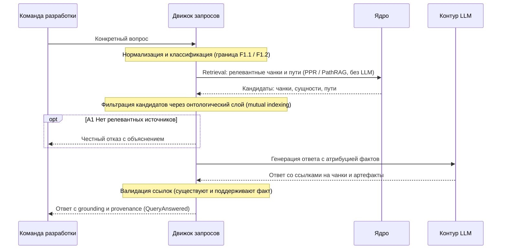

### UC-answers.grounding.cited-answer: Ответ на конкретный вопрос с grounding

**Актор:** Разработчик, Аналитик (vision §3.1)

**Приоритет:** P0

**Ключевая функция:** F1.1 (vision §2.2 — генерация ответов на конкретные вопросы со ссылками на артефакты)

**Канал:** GUI / API

**Описание:** Ответ на конкретный вопрос по спекам, коду и продукту со ссылками на артефакты и происхождением (grounding, provenance): каждый факт трассируется до породившего документа или чанка, ответ можно проверить вручную — эталонный кейс K1. Каскад: `QueryReceived → QueryAnswered`.

**Диаграмма последовательности:**

*to be — Фаза 1 (MVP, vision §2.5–2.6): компоненты не реализованы в `src/`; диаграмма отражает целевое состояние.*

**Основной поток:**
1. Команда разработки задаёт конкретный вопрос → `QueryReceived`.
2. Движок запросов нормализует и классифицирует запрос (граница F1.1/F1.2 — тип вопроса, а не качество ответа).
3. Retrieval: поиск релевантных чанков и путей в графе знаний (PPR/PathRAG — без LLM на этапе извлечения).
4. Фильтрация кандидатов через онтологический слой и взаимную индексацию (KG↔chunks).
5. Контур LLM генерирует ответ с атрибуцией фактов на конкретные чанки и артефакты.
6. Движок запросов валидирует ссылки: каждая ссылка существует и поддерживает факт.
7. Ответ возвращается команде разработки с grounding и provenance → `QueryAnswered`.

**Альтернативные потоки:**
- A1. Нет релевантных источников: честный отказ с объяснением, а не галлюцинация.
- A2. Противоречивые источники: ответ перечисляет оба варианта с provenance; полный контур конфликт-детекции (`ConflictDetected`) — Фаза 2.
- A3. Двусмысленный запрос: уточняющий вопрос вместо ответа.

**Постусловия:** команда разработки получила проверяемый ответ со ссылками на артефакты; каждый факт трассируется до документа или чанка (K1).

**Источник требований:** vision §2.2 (F1.1), §2.5 (MVP), §3.2 (приоритет точности ответов); эталонный кейс K1 (RULES.md — контрактные тесты до реализации); glossary («Привязка к источнику», «Происхождение», «Атрибуция источников», «PathRAG», «PPR», «Взаимная индексация»).

**Целевые примечания:** REQ-NFR-api.compliance.rag-accuracy — точность ответов RAG не ниже 70% на утверждённом benchmark-наборе (LLM-as-judge) — целевая метрика Фазы 1.5 (vision §2.6), не гарантия основного потока.
