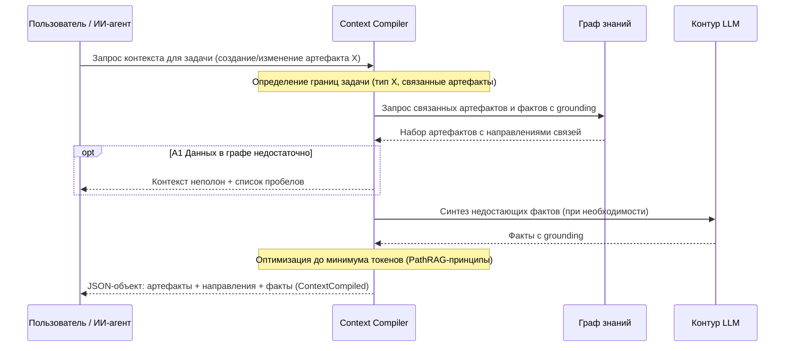

### UC-context.build.generate: Компиляция контекста для генерации артефакта

**Актор:** Разработчик, ИИ-агент автоматизации разработки (vision §3.1)

**Приоритет:** P1

**Ключевая функция:** F3.2 (vision §2.2 — компиляция контекста из связанных артефактов)

**Канал:** GUI / MCP

**Описание:** При создании или изменении артефакта система компилирует JSON-объект — набор связанных артефактов (спеки, код, ADR) с направлениями связей и фактами с grounding — для генерации точно и без лишних затрат. Критерий: полнота при минимуме токенов (REQ-NFR-api.performance.token-minimization, PathRAG-принципы). Событие: `ContextCompiled`. Ядро компиляции — граф связей артефактов (ArtifactGraph) и онтологический слой.

**Диаграмма последовательности:**

*to be — Фаза 1 (MVP, vision §2.5–2.6): компоненты не реализованы в `src/`; диаграмма отражает целевое состояние.*

**Основной поток:**
1. Запрос на компиляцию контекста для задачи (создание/изменение артефакта X).
2. Определение границ задачи: тип X и связанные артефакты (по ArtifactGraph, транзитивно).
3. Сбор набора: спеки, код, ADR, факты с grounding.
4. Синтез недостающих фактов через контур LLM (при необходимости).
5. Оптимизация: минимальный набор при требуемой полноте (PathRAG-принципы).
6. Формирование JSON-объекта: артефакты + направления связей + факты → `ContextCompiled`.

**Альтернативные потоки:**
- A1. Данных в графе недостаточно: пометка «контекст неполон» + список пробелов.
- A2. Превышение окна модели: сокращение до лимита с указанием опущенного.
- A3. Задача вне корпуса: отказ (или минимальный контекст) без подгонки.

**Постусловия:** получен JSON-объект — набор связанных артефактов с направлениями связей и фактами с grounding, минимальный по токенам; событие `ContextCompiled` зафиксировано.

**Источник требований:** vision §2.2 (F3.2), §2.5 (критерий «полнота при минимуме токенов»), §3.2 (компиляция контекста — высокий приоритет); glossary («Context compiler», «Контекст», «PathRAG», «Граф связей артефактов»).
