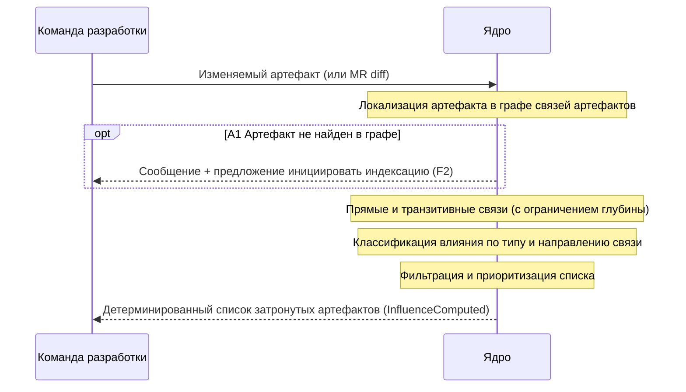

### UC-context.impact.analyze: Анализ влияния изменения артефакта

**Актор:** Разработчик, Архитектор (vision §3.1)

**Приоритет:** P0

**Ключевая функция:** F3.1 (vision §2.2 — вычисление последствий изменения артефакта)

**Канал:** GUI / API

**Описание:** Изменение артефакта (спеки, код, ADR) разворачивается в детерминированный список связанных артефактов, требующих изменений, с типами и направлениями связей — эталонный кейс K4. UC детерминированный: вычисление выполняется по рёбрам графа связей артефактов без LLM. Событие: `InfluenceComputed`.

**Диаграмма последовательности:**

*to be — Фаза 1 (MVP, vision §2.5–2.6): компоненты не реализованы в `src/`; диаграмма отражает целевое состояние.*

**Основной поток:**
1. Команда разработки указывает изменяемый артефакт (или MR diff → набор артефактов).
2. Ядро локализует артефакт в графе связей артефактов (Artifact Graph).
3. Вычисляются прямые и транзитивные связи с ограничением глубины.
4. Влияние классифицируется по типу связи (спека → код → ADR → тесты) и направлению.
5. Список фильтруется и приоритизируется.
6. Возвращается детерминированный список связанных артефактов, требующих изменений → `InfluenceComputed`.

**Альтернативные потоки:**
- A1. Артефакт не найден в графе: сообщение с предложением инициировать индексацию (F2).
- A2. Циклы зависимостей: детекция и дедупликация без зацикливания.
- A3. Неполный граф (связи артефакта неполные): результат помечается «связи неполны».

**Постусловия:** получен детерминированный список связанных артефактов с типами и направлениями связей; событие `InfluenceComputed` зафиксировано.

**Источник требований:** vision §2.2 (F3.1), §2.5 (MVP), §3.2 (трассируемость — высокий приоритет); эталонный кейс K4 (RULES.md — контрактные тесты до реализации); glossary («Анализ влияния», «Граф связей артефактов», «Трассируемость»).
