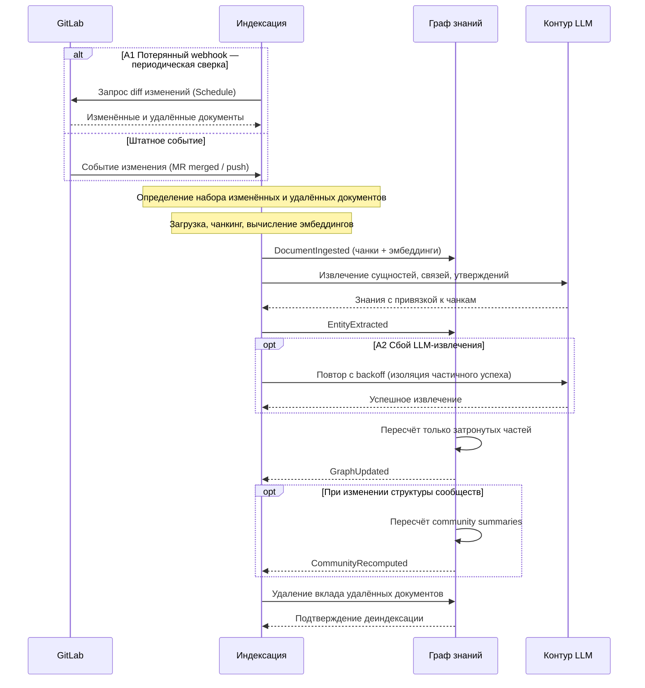

### UC-knowledge.sync.gitlab-index: Автоиндексация изменений GitLab

**Актор:** GitLab (внешняя система-источник, триггер событий); бенефициар — Разработчик, Аналитик (vision §3.1)

**Приоритет:** P0

**Ключевая функция:** F2.1 (vision §2.2 — автоиндексация изменений GitLab)

**Канал:** Webhook / Schedule

**Описание:** Изменения спек и кода в GitLab (MR merged, push) автоматически попадают в базу знаний: затронутые документы переиндексируются, граф знаний обновляется инкрементально, и новые ответы (F1) и анализ влияния (F3) опираются на актуальную версию источника. Каскад: `DocumentIngested → EntityExtracted → GraphUpdated → CommunityRecomputed`.

**Диаграмма последовательности:**

*to be — Фаза 1 (MVP, vision §2.5–2.6): компоненты не реализованы в `src/`; диаграмма отражает целевое состояние.*

**Основной поток:**
1. GitLab публикует событие изменения (MR merged / push), либо система запускает периодическую diff-сверку.
2. Индексация определяет набор изменённых и удалённых документов (diff по GitLab API).
3. Для каждого изменённого документа выполняются загрузка, чанкинг и вычисление эмбеддингов → `DocumentIngested`.
4. Контур LLM извлекает сущности, связи и утверждения с привязкой к чанкам → `EntityExtracted`.
5. Граф знаний обновляется инкрементально: пересчитываются только затронутые части → `GraphUpdated`.
6. При изменении структуры сообществ пересчитываются их суммаризации → `CommunityRecomputed`.
7. Удалённые документы деиндексируются: чанки и их вклад в граф удаляются.

**Альтернативные потоки:**
- A1. Потерянный/недоставленный webhook: выполняется периодическая diff-сверка; повторная обработка идемпотентна.
- A2. Сбой LLM-извлечения: повтор с backoff; частичный успех изолируется (успешные документы фиксируются, сбойные — в очередь на повтор).
- A3. Непарсящийся документ (битые ссылки, неподдерживаемый формат): пропуск с WARN, документ не попадает в граф.

**Постусловия:** граф знаний и векторный индекс отражают актуальную версию корпуса; каскад `DocumentIngested → GraphUpdated` завершён; новые ответы (F1) и анализ влияния (F3) опираются на актуальную версию источников.

**Источник требований:** vision §2.2 (F2.1), §2.5 (MVP), §2.6 (Фаза 1), §2.7 п.11 (инкрементальность — в MVP); ADR-DES.API.hybrid-graphrag-composition (LightRAG, инкрементальное обновление); glossary («Документ», «Чанк», «Граф знаний», «Инкрементальное обновление», «Взаимная индексация», «Суммаризация сообществ»).
