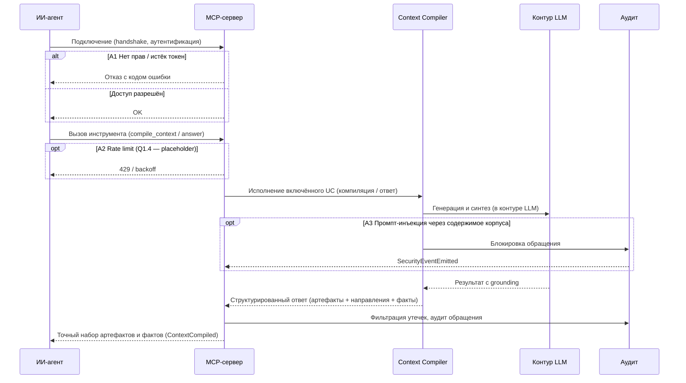

### UC-mcp.compile.context: Доставка контекста ИИ-агенту через MCP

**Актор:** ИИ-агент автоматизации разработки (программный пользователь, vision §3.1)

**Приоритет:** P0

**Ключевая функция:** F4 (vision §2.2 — доставка ответов и контекста через MCP)

**Канал:** MCP

**Описание:** ИИ-агент получает через MCP точный набор артефактов и фактов под задачу вместо сырого текста — эталонный кейс K17. UC-канал (граница F4, vision §2.2): ядро — включённые UC `UC-context.build.generate` (компиляция контекста) и `UC-answers.grounding.cited-answer` (ответ с grounding). События: `ContextCompiled` / `QueryAnswered`, аудит — `SecurityEventEmitted`.

**Диаграмма последовательности:**

*to be — Фаза 1 (MVP, vision §2.5–2.6): компоненты не реализованы в `src/`; диаграмма отражает целевое состояние.*

**Основной поток:**
1. Агент подключается к MCP-серверу (handshake, аутентификация).
2. Агент вызывает инструмент (`compile_context` / `answer`) с параметрами задачи.
3. MCP-сервер исполняет включённый UC — компиляцию контекста (`UC-context.build.generate`) или ответ с grounding (`UC-answers.grounding.cited-answer`).
4. Результат сериализуется в структурированный ответ: точный набор артефактов, направления связей, факты с grounding.
5. Выполняются фильтрация утечек и аудит обращения (`SecurityEventEmitted`).
6. Ответ возвращается агенту → `ContextCompiled` / `QueryAnswered`.

**Альтернативные потоки:**
- A1. Нет прав / истёк токен: отказ с кодом ошибки.
- A2. Rate limit (Q1.4 — placeholder-лимиты): `429` / backoff.
- A3. Промпт-инъекция через содержимое корпуса («игнорируй предыдущие инструкции»): детекция, блокировка, `SecurityEventEmitted`.
- A4. Таймаут LLM: частичный результат с пометкой о неполноте.

**Постусловия:** агент получил точный структурированный набор артефактов и фактов; обращение зафиксировано в аудите.

**Источник требований:** vision §2.2 (F4, граница MCP), §2.5 (MVP); эталонный кейс K17 (RULES.md — контрактные тесты до реализации); glossary («MCP», «Context compiler», «Контур LLM», «Фильтрация утечек», «Аудит обращений»). Включает: `UC-context.build.generate`, `UC-answers.grounding.cited-answer`.

**Целевые примечания:** NFR-SEC-1 — безопасный контур LLM (фильтрация утечек, аудит обращений); NFR-PROC-1 — принцип «агент готовит — человек подтверждает и отвечает»; оба — сквозные требования, не гарантии основного потока.
