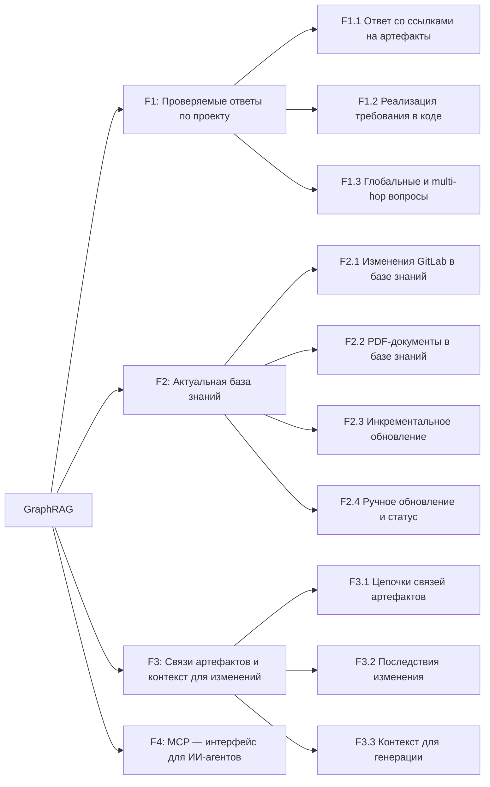
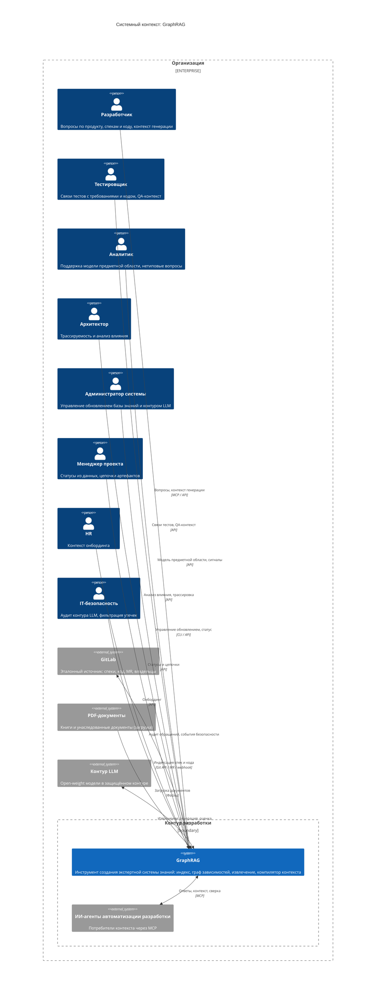

# Документ о концепции и границах проекта: GraphRAG

**GraphRAG** — универсальный инструмент создания экспертной системы знаний на базе GraphRAG: слой проверяемого контекста (evidence-based context layer) и компилятор контекста для ИИ-агентов автоматизации разработки. Инструмент индексирует корпус (markdown-спеки и код из GitLab, PDF-документы) в граф знаний, отвечает на вопросы по спецификациям и коду со ссылками на артефакты, хранит граф зависимостей артефактов и собирает необходимый и достаточный контекст для генерации артефактов — вместо сырого текста и ручных переспросов.

*Не поиск по документам — слой проверяемого контекста с подтверждаемыми ссылками.*

### Название продукта

**GraphRAG** — имя продукта: универсальный инструмент для создания экспертной системы знаний на базе GraphRAG с онтологическим слоем как механизмом (машинно-читаемая модель предметной области) и основой для сквозной трассируемости артефактов разработки. Роль продукта — слой проверяемого контекста: каждый ответ и артефакт подтверждён источниками и происхождением. Продукт работает в двух режимах: (1) ответы на вопросы команды по спецификациям и коду со ссылками на артефакты; (2) контекстный режим для ИИ-агентов автоматизации разработки — точный набор артефактов и фактов под задачу, собираемый вместо сырого текста.

---

## 1. Бизнес-требования

### 1.1. Исходные данные и постановка бизнес-проблемы

Продукты разрабатываются множеством команд: разработчики, тестировщики, аналитики, архитекторы. Знания о продуктах, терминах, системах и бизнес-контексте распределены по головам специалистов, разрозненным документам, чатам и коду. Каждый новый вопрос переспрашивается заново, ответы приходят с задержкой, артефакты — спецификации, требования, термины, код — дрейфуют и расходятся друг с другом, а контекст для генерации артефактов собирается вручную.

Корневые причины проблем: артефакты требований теряют актуальность и отрываются от разработки; знания фрагментарно живут в головах специалистов и передаются через личные вопросы; результат этапа принимается «на веру» без сверки с источником и без полного контекста. Инструмент — часть решения этих причин.

Ключевые проблемы, которые решает продукт:

| ID | Проблема | Последствие |
|---|---|---|
| **P1** | **Знания о продукте, спецификациях и коде живут в головах специалистов.** Ответы на вопросы о продукте, терминах и бизнес-контексте извлекаются из памяти людей через личные переспросы. | Медленные ответы, повторяющиеся вопросы, вхождение новичка в работу растягивается до 3 месяцев, знания уходят вместе с сотрудниками. |
| **P2** | **Артефакты расходятся и термины нестабильны.** Спецификации устаревают, к ним не возвращаются, терминология разъезжается. | Команда работает по устаревшим требованиям, ломается коммуникация, переделки и техдолг. |
| **P3** | **Поставка и сгенерированные артефакты расходятся с требованиями.** Результат этапа (в том числе сгенерированный код, документация, ADR) передаётся дальше «на веру» без полного контекста и без сверки с источником. | «Закрыто ≠ работает», поставка не соответствует утверждённым требованиям, проверка переносится на пользователей. |
| **P4** | **Анализ влияния изменений — вручную.** При изменении артефакта никто детерминированно не знает, что ещё затронуто, включая реализацию в коде. | Поверхностная постановка задач, пропущенные зависимости, регрессии. |
| **P5** | **Неконтролируемое использование внешних LLM.** Сотрудники используют личные аккаунты в обход регламентов; промпты содержат код, спеки и данные. | Утечки, юридические риски, штрафы. |
| **P6** | **Регламенты безопасности держатся на памяти людей.** Весь объём регламентов физически не помещается в голову. | Нарушения неизбежны; вручную не масштабируется. |

**Итоговая бизнес-проблема:**

> **Когда знания о продукте и коде фрагментарно живут в головах специалистов, артефакты расходятся и принимаются «на веру», реализация не связана с требованиями, а контекст для генерации собирается вручную — команды медленно отвечают на вопросы, работают по устаревшим требованиям, поставляют расхождения, а утечки данных через неконтролируемые LLM становятся вопросом времени.**

### 1.2. Возможности бизнеса

Внедрение GraphRAG позволит:

- **Для разработчика:** Получить проверяемый ответ по продукту, термину, спецификации или коду за минуты — со ссылками на артефакты, без ожидания аналитика. Найти код, реализующий функциональное требование или бизнес-правило. Работать по актуальным требованиям, видеть список затронутых изменением артефактов. Получать сфокусированный контекст для генерации кода.
- **Для тестировщика:** Видеть связи тестов с требованиями и источниками, получать контекст для тест-дизайна по требованиям и коду.
- **Для аналитика (в команде):** Отвечать на нетиповые вопросы, а не повторять типовые справки; бизнес-знания собраны в системе, а не изучаются заново у внешних людей.
- **Для аналитиков вне команды:** Знания зафиксированы в системе, а не в головах; уход аналитика не оставляет дыру.
- **Для архитектора:** Трассировка от цели до результата, детерминированный анализ влияния изменений; согласованность артефактов и отсутствие техдолга как метрика.
- **Для администратора системы:** База знаний всегда актуальна; обновление индекса управляемо и предсказуемо.
- **Для менеджера проекта:** Точные статусы из данных, видимость цепочек «требование → задача → код → релиз».
- **Для HR:** Быстрое вхождение новичков через систему знаний вместо «спроси старшего».
- **Для IT-безопасности:** Контролируемый контур LLM с фильтрацией утечек и аудитом; легальный доступ вместо теневых аккаунтов.
- **Для руководства бизнеса / технического директора:** Управляемая зависимость от LLM (локальный контур), рост качества поставки через проверяемый контекст.
- **Для ИИ-агентов автоматизации разработки (программные пользователи):** Точный набор артефактов и фактов под задачу через стандартный MCP-интерфейс — компилятор контекста вместо сырого текста.

### 1.3. Бизнес-цели — SMART

| ID | Бизнес-цель | SMART-декомпозиция | Какие проблемы решает |
|---|---|---|---|
| **G1** | Снизить время ожидания ответа по продукту, спецификации и коду | **S**: Вопросы команды о продукте, терминах, спецификациях и коде закрываются системой знаний со ссылками на артефакты, без ожидания аналитика. **M**: Время ожидания ответа по продукту (медиана и 90-й перцентиль) снижается от исходного замера. **A**: Граф знаний + извлечение контекста + локальный контур LLM. **R**: P1. **T**: срок фиксируется после замера исходного уровня. | P1 |
| **G2** | Обеспечить актуальность содержания ответов | **S**: Изменения спек и кода в GitLab и загрузки PDF автоматически попадают в базу знаний; ответы опираются на актуальные версии источников. **M**: Доля ответов, опирающихся на актуальные версии источников, достигает целевого уровня; время от изменения источника до обновления индекса снижается от исходного замера. **A**: Инкрементальное обновление графа по MR и загрузкам PDF (F2). **R**: P2. **T**: срок фиксируется после замера исходного уровня. | P2 |
| **G3** | Стабилизировать терминологию и согласованность артефактов | **S**: Термины зафиксированы в модели предметной области; ответы используют единые определения. **M**: Число противоречий и терминологических конфликтов снижается до целевого уровня. **A**: Модель предметной области + контур сигналов владельцу. **R**: P2. **T**: срок фиксируется после замера исходного уровня. | P2 |
| **G4** | Обеспечить трассируемость поставки и генерации | **S**: Связи артефактов фиксируются в графе знаний; изменение артефакта детерминированно разворачивается в список затронутых; сгенерированный артефакт сверяется с источником до передачи дальше. **M**: Доля изменений с вычисленным влиянием по графу и доля поставок, соответствующих требованиям, достигают целевых значений. **A**: Граф зависимостей артефактов + анализ влияния + сверка «результат ↔ источник». **R**: P3, P4. **T**: срок фиксируется после замера исходного уровня. | P3, P4 |
| **G5** | Ускорить вхождение новых сотрудников | **S**: Новичок получает ответы по продукту из системы знаний; путь вхождения строится на спецификациях, коде и модели предметной области. **M**: Время до первого принятого MR снижается от исходного замера (ориентир — 3 месяца). **A**: Система знаний + модель предметной области + путь вхождения новичка. **R**: P1. **T**: срок фиксируется после замера исходного уровня. | P1 |
| **G6** | Обеспечить контролируемый контур LLM | **S**: Все обращения к LLM проходят через корпоративный контур с фильтрацией утечек и аудитом; локальные GPU — основной вариант исполнения. **M**: Доля обращений к LLM через корпоративный канал достигает целевого уровня; обращений вне контура — ноль. **A**: Контур LLM + фильтрация утечек и аудит. **R**: P5, P6. **T**: непрерывно. | P5, P6 |
| **G7** | Снизить рутину повторных ответов и переспросов | **S**: Типовые вопросы закрываются системой знаний; аналитик отвечает на нетиповые вопросы и пополняет знания по своей области. **M**: Доля вопросов, закрытых системой знаний без участия аналитика, достигает целевого уровня. **A**: Система знаний + контур сигналов владельцу. **R**: P1. **T**: срок фиксируется после замера исходного уровня. | P1 |

### 1.4. Критерии успеха

Целевые значения уточняются после замера исходного уровня в первые недели внедрения на эталонном наборе запросов и корпусе, утверждённых владельцем продукта: цель «с потолка» — это обещание, а не цель.

| Цель | Критерий успеха | Способ проверки |
|---|---|---|
| G1 — Время ответа | Вопросы команды закрываются системой знаний за минуты со ссылками на артефакты | Время ожидания ответа по продукту, медиана и 90-й перцентиль — значение фиксируется после замера исходного уровня |
| G2 — Актуальность | Изменения источников (GitLab, PDF) автоматически попадают в базу знаний; ответы опираются на актуальные версии | Время от MR/загрузки до обновления индекса; доля ответов на актуальных версиях источников — значение фиксируется после замера исходного уровня |
| G3 — Термины | Ответы используют единые определения; противоречия выявляются системой | Число противоречий и терминологических конфликтов — значение фиксируется после замера исходного уровня |
| G4 — Трассируемость | Изменение артефакта даёт детерминированный список затронутых | Доля изменений с вычисленным влиянием по графу; доля поставок, не соответствующих требованиям — значение фиксируется после замера исходного уровня |
| G5 — Онбординг | Новичок закрывает вопросы по продукту через систему знаний | Время до первого принятого MR — значение фиксируется после замера исходного уровня |
| G6 — Безопасность | Обращения к LLM — только через корпоративный контур | Доля обращений через корпоративный канал; 0 обращений вне контура — значение фиксируется после замера исходного уровня |
| G7 — Рутина | Типовые вопросы не требуют участия аналитика | Доля вопросов, закрытых системой знаний — значение фиксируется после замера исходного уровня |
| G1+G4 — Качество ответов | Ответы точные и подтверждаются источниками | Точность ответов RAG — не ниже 70% на утверждённом benchmark-наборе |

### 1.5. Положение о концепции

> **Для** разработчиков, тестировщиков, аналитиков, архитекторов, администраторов систем и ИИ-агентов автоматизации разработки,
> **которые** сегодня сталкиваются с тем, что знания о продукте и коде фрагментарно живут в головах, артефакты расходятся и принимаются «на веру», а контекст для генерации собирается вручную,
> **GraphRAG**
> **является** универсальным инструментом создания экспертной системы знаний на базе GraphRAG — слоем проверяемого контекста,
> **который** (1) индексирует корпус (спеки и код из GitLab, PDF) в граф знаний и отвечает на вопросы со ссылками на артефакты, (2) автоматически актуализирует базу знаний по изменениям в GitLab и загрузкам PDF, (3) хранит граф зависимостей артефактов и выдаёт необходимый и достаточный контекст для генерации кода, документации и ADR, и (4) работает как компилятор контекста — отдаёт ИИ-агентам точный набор артефактов под задачу через MCP, а не сырой текст,
> **в отличие от** обычного поиска по документам и чат-ботов, которые возвращают сырой текст без происхождения и не понимают связи артефактов,
> **наш продукт** — слой проверяемого контекста: каждое утверждение подтверждено источником и трассируется до артефактов проекта; система работает на локальных GPU с open-weight моделями в защищённом контуре, без передачи корпоративных данных внешним провайдерам.

---

## 2. Рамки и ограничения проекта

### 2.1. Основные функции (по приоритету полезности)

| Приоритет | Функция | Для чего нужна | Какую пользу приносит |
|---|---|---|---|
| **1** | **F1. Проверяемые ответы по проекту** | Вопросы команды по спецификациям, коду и продукту закрываются проверяемыми ответами со ссылками на артефакты; находятся реализации требований и бизнес-правил; строятся ответы на сложные вопросы по нескольким артефактам. | Быстрые и проверяемые ответы без ожидания аналитика; понимание кода и связей «требование → реализация». |
| **2** | **F2. Актуальная база знаний** | Изменения в GitLab (спеки и код) и загрузки PDF автоматически попадают в базу знаний; обновление инкрементальное, управляемое. | Знания всегда соответствуют текущему состоянию проекта; обновление быстрое и дешёвое, без полной перестройки. |
| **3** | **F3. Связи артефактов и контекст для изменений** | Граф зависимостей артефактов (включая код) хранит связи «требование → задача → код → релиз»; изменение артефакта разворачивается в список затронутых; для генерации собирается необходимый и достаточный контекст. | Ничего не пропускается при изменениях; генерация артефактов идёт по полному, но сфокусированному контексту — экономия токенов. |
| **4** | **F4. MCP — интерфейс для ИИ-агентов** | ИИ-агенты автоматизации разработки получают ответы и контекст через стандартный MCP-интерфейс. | Агенты встраиваются в инструменты разработки и получают готовый контекст вместо сырого текста. |

### 2.2. Декомпозиция функций на 2 уровня

#### Уровень 1 — Ключевые функции

| ID | Функция | Соответствие бизнес-цели | Описание |
|---|---|---|---|
| **F1** | Проверяемые ответы по проекту | G1, G3 | Ответы со ссылками на артефакты, поиск реализации требований в коде, глобальные и multi-hop вопросы |
| **F2** | Актуальная база знаний | G2 | Индексация изменений GitLab (спеки и код) и PDF, инкрементальное обновление, управление обновлением |
| **F3** | Связи артефактов и контекст для изменений | G4 | Граф зависимостей артефактов, анализ влияния изменений, выборка контекста для генерации |
| **F4** | MCP — интерфейс для ИИ-агентов | G1, G4 | Стандартный доступ ИИ-агентов к ответам и контексту |

#### Уровень 2 — Пользовательские функции (US/UC)

> **Принцип.** Каждая функция уровня 2 — результат, ценный для пользователя (роли из раздела 3.1), а не технический механизм. Механизмы и алгоритмы (LightRAG, PathRAG, PPR, RAPTOR, StructRAG) вынесены в разделы 2.4 и 2.5 и фиксируются в ADR. Каждая функция сформулирована как пользовательская история (US) и может быть детализирована в вариант использования (UC). Подфункции не пересекаются между функциями: каждая относится ровно к одной функции и отвечает на один пользовательский вопрос.

##### F1. Проверяемые ответы по проекту

| Код | Функция (ценность для пользователя) | Роль | Формулировка US |
|---|---|---|---|
| F1.1 | Ответ, которому можно доверять | Разработчик, Аналитик | Как разработчик, я хочу получать ответ на вопрос по продукту, спецификации или коду со ссылками на конкретные артефакты, чтобы проверять его самому и не ждать аналитика |
| F1.2 | Понимание реализации без поиска по коду | Разработчик, Архитектор | Как разработчик, я хочу находить код, реализующий функциональное требование или бизнес-правило, чтобы быстро понимать и изменять реализацию |
| F1.3 | Целостная картина вместо «лоскутов» | Аналитик, Архитектор | Как аналитик, я хочу получать ответы, требующие связывания фактов из разных артефактов (темы, тренды, цепочки), чтобы видеть продукт целиком |

##### F2. Актуальная база знаний

| Код | Функция (ценность для пользователя) | Роль | Формулировка US |
|---|---|---|---|
| F2.1 | Актуальность без усилий | Разработчик, Аналитик | Как разработчик, я хочу, чтобы изменения спек и кода в GitLab автоматически попадали в базу знаний, чтобы ответы не устаревали |
| F2.2 | Доступ к знаниям из книг и легаси | Аналитик | Как аналитик, я хочу загружать PDF-книги и унаследованные документы, чтобы их знания были доступны в системе |
| F2.3 | Обновление быстрое и дешёвое | Администратор системы | Как администратор, я хочу, чтобы обновление знаний пересчитывало только затронутое, чтобы поддерживать актуальность без полной перестройки |
| F2.4 | Контроль над актуальностью | Администратор системы | Как администратор, я хочу запускать обновление вручную и видеть его статус, чтобы управлять актуальностью базы знаний |

##### F3. Связи артефактов и контекст для изменений

| Код | Функция (ценность для пользователя) | Роль | Формулировка US |
|---|---|---|---|
| F3.1 | Понимание, как устроена поставка | Архитектор, Менеджер проекта | Как архитектор, я хочу видеть цепочку «требование → задача → код → релиз», чтобы понимать, что от чего зависит |
| F3.2 | Ничего не пропустить при изменении | Разработчик, Архитектор | Как разработчик, я хочу при изменении артефакта сразу видеть, что ещё затронуто, чтобы учитывать все последствия |
| F3.3 | Точечный контекст для генерации | Разработчик, ИИ-агент | Как разработчик, я хочу при создании или изменении артефакта получать только необходимый контекст (нужные спеки, код, ADR), чтобы генерировать точно и без лишних затрат |

##### F4. MCP — интерфейс для ИИ-агентов

| Код | Функция (ценность для пользователя) | Роль | Формулировка US |
|---|---|---|---|
| F4 | Стандартная интеграция агентов | ИИ-агент | Как ИИ-агент, я хочу получать ответы и контекст через MCP, чтобы встраиваться в инструменты автоматизации разработки |

> **Граница F4.** MCP — интерфейс доступа к функциям F1 и F3 для ИИ-агентов. Обновление базы знаний (F2) — детерминированная задача и не исполняется через MCP: изменения приходят по webhook/CI GitLab и загрузке PDF. F4 не дублирует содержимое F1 и F3 — он описывает канал доступа.

### 2.3. Диаграмма дерева функций (Mermaid)

> Дерево декомпозиции строгое: каждая подфункция относится ровно к одной функции уровня 1. F4 (MCP) — независимая функция-интерфейс: её связь с F1 и F3 (канал доступа) описана в §2.2 и не является ребром декомпозиции.

### 2.4. Основные события предметной области

| Событие | Триггер | Источник | Получатель | Действие системы |
|---|---|---|---|---|
| `DocumentIngested` | Новый/изменённый документ в GitLab (MR) или загрузка PDF | Репозиторий GitLab / загрузка PDF | Индексация | Разбиение на чанки, подготовка к извлечению |
| `EntityExtracted` | Обработка чанка | Контур извлечения (LLM) | Граф знаний | Извлечение сущностей, связей, утверждений с привязкой к чанку |
| `GraphUpdated` | Инкрементальное обновление / периодическая перестройка | Индексация | Граф знаний | Пересчёт затронутых частей графа, детекция сообществ |
| `CommunityRecomputed` | Изменение графа | Индексация | Суммаризации сообществ | Пересчёт суммаризаций затронутых сообществ |
| `QueryReceived` | Запрос пользователя к экспертной системе (UI/чат) или ИИ-агента через MCP | Пользователь / ИИ-агент | Механизм запросов | Приём и нормализация запроса, маршрутизация к обработке |
| `QueryAnswered` | Запрос пользователя или агента | Механизм запросов | Пользователь / агент | Извлечение релевантного контекста, генерация ответа со ссылками на артефакты |
| `InfluenceComputed` | Изменение артефакта | Граф зависимостей артефактов | Разработчик, Архитектор | Детерминированный анализ влияния: список затронутых |
| `ConflictDetected` | Сверка «результат ↔ источник» / анализ корпуса | Сверка | Владелец артефакта | Обнаружение противоречия, создание сигнала на изменение источника |
| `ContextCompiled` | Запрос агента автоматизации разработки | Компилятор контекста | ИИ-агент | Сбор точного набора артефактов под задачу, передача через MCP |
| `SecurityEventEmitted` | Фильтрация утечек / аудит обращений | Контур LLM | IT-безопасность | Фиксация события безопасности, оповещение при нарушении |

### 2.5. Объем первоначально запланированной версии (MVP)

**Назначение MVP.** MVP подтверждает базовый контур инструмента: корпус (спеки и код из GitLab, PDF) индексируется в граф знаний, команда получает проверяемые ответы со ссылками на артефакты, изменения в GitLab и загрузки PDF автоматически актуализируют базу знаний, а ИИ-агенты получают точный контекст через MCP. Технологические и алгоритмические решения фиксируются в ADR; vision описывает только продуктовые возможности и границы.

**F1. Проверяемые ответы по проекту (MVP):**
- Ответы на вопросы по спецификациям и коду со ссылками на конкретные артефакты (привязка к источнику, происхождение).
- Поиск реализации функциональных требований и бизнес-правил в коде (гранулярность — до функций и методов; модуль и класс — объекты индексации).
- Глобальные и multi-hop вопросы — базовая версия через двухуровневое извлечение; полный контур (community summaries) — Фаза 2.

**F2. Актуальная база знаний (MVP):**
- Индексация изменений GitLab: спеки и код, по MR (webhook/CI).
- Индексация PDF: книги и унаследованные документы (отдельный контур: нарратив — RAPTOR, таблицы/формы — StructRAG).
- Инкрементальное обновление затронутых частей графа + периодическая полная перестройка.
- Ручной запуск обновления и просмотр статуса (CLI/API).

**F3. Связи артефактов и контекст для изменений (MVP):**
- Граф зависимостей артефактов: требование → задача → код → MR → релиз; код индексируется до уровня функций/методов (модуль и класс — узлы графа).
- Детерминированный анализ влияния изменений (прямое и транзитивное замыкание).
- Выборка необходимого и достаточного контекста для генерации артефактов (код, документация, ADR): сфокусированный набор связанных спек, кода и решений; критерий — полнота при минимуме токенов.

**F4. MCP — интерфейс для ИИ-агентов (MVP):**
- MCP-режим: точный набор артефактов и фактов под задачу агента (ответы F1, контекст F3).
- Обновление базы знаний (F2) вне MCP — детерминированная задача.

**Сквозные требования (входят в MVP, не являются функциями):**
- Безопасный контур LLM: локальные GPU, open-weight модели; данные не покидают периметр; фильтрация утечек и аудит обращений.
- Минимизация токенов и числа LLM-вызовов как сквозное требование (локальные GPU, ограниченный контекст).
- Точность ответов: порог продолжения внедрения — точность RAG не ниже 70% на утверждённом benchmark-наборе (LLM-as-judge).
- Принцип «агент готовит — человек подтверждает и отвечает»: ответы и артефакты, сгенерированные LLM, подтверждаются человеком.
- Модель предметной области (машинно-читаемая онтология) — механизм внутри F1 и F3; исходная модель поставляется из репозитория модели, автоматическое построение из корпуса (ontology learning) — Фаза 3.
- Принципы внедрения: метрики пользы, внедрение малыми шагами.

**Что НЕ входит в MVP:**
- Полноценный контур глобальных вопросов (community summaries) и продвинутые графовые методы — Фаза 2/3.
- Обновление графа в реальном времени — Фаза 3.
- Автоматическое построение модели предметной области из корпуса (ontology learning) — Фаза 3.
- Fine-tuning моделей — вне рамок проекта.
- Накопление знаний из внешних сигналов (петля обучения) — вне рамок проекта.
- Интеграция с Confluence — исключена как источник (кладбище устаревших страниц).
- Масштабирование на крупный корпус с гарантированным SLO — Фаза 2/3.

### 2.6. Объем последующих версий (Roadmap)

Детальная дорожная карта ведётся отдельно. Ниже — продуктовая сводка фаз и границ.

**Фаза 0 — фиксация scope и критериев перехода:**
- Зафиксировать точный scope MVP по F1–F4 и стартовый набор кейсов использования.
- Назначить владельцев и сроки целевых метрик и фаз.
- Выбрать вариант контура LLM и зафиксировать правила обработки данных.
- Согласовать модель предметной области с командами.

**Фаза 1 — MVP / интеграционный минимум:**
- Проверяемые ответы по спекам и коду; индексация GitLab (спеки + код) и PDF; инкрементальное обновление.
- Граф зависимостей артефактов, анализ влияния, выборка контекста для генерации.
- MCP-интерфейс для ИИ-агентов; локальный контур LLM с фильтрацией утечек и аудитом.

**Фаза 1.5 — beta и стабилизация:**
- Замер метрик пользы: время ожидания ответа, точность RAG (порог 70%), число противоречий.
- Стабилизация извлечения и разрешения сущностей; снижение галлюцинаций при извлечении (строгие промпты, контроль человеком).
- Доведение качества ответов на реальных запросах команд; готовность к релизу.

**Фаза 2 — расширение контура и качества:**
- Полный контур глобальных вопросов (community summaries) и multi-hop сценариев.
- Расширение выборки контекста: QA-контекст для тестировщиков, сверка поставки со спецификациями в полном объёме.
- Масштабирование корпуса; оптимизация извлечения и маршрутизации запросов.

**Фаза 3 — экспертная система:**
- Агентное извлечение и продвинутые графовые методы для сложных запросов.
- Обновление графа в реальном времени для динамических сценариев.
- Автоматическое построение и поддержание модели предметной области из корпуса.
- Путь вхождения новичка на системе знаний в полном объёме.
- Масштабирование на крупный корпус с гарантированными SLO.

**Фаза 4 — полная интеграция в автоматизацию разработки:**
- Сквозная трассируемость от требования до результата как стандарт процесса.
- Интеграция с автоматической декомпозицией задач и постановкой задач с полным контекстом.

### 2.7. Ограничения и исключения

| № | Исключение / Ограничение | Причина |
|---|---|---|
| 1 | **GraphRAG не является источником правды.** Единый источник правды — репозиторий спецификаций и кода (MR, владельцы артефактов). Система знаний — индекс и контекст, а не хранилище исходных артефактов. | Система знаний работает поверх единого источника правды. |
| 2 | **GraphRAG не чат-бот и не поисковая строка.** Продукт — evidence-based context layer: ответы подтверждены источниками и происхождением, а не «сырым» текстом. | Отличие продукта от обычного поиска и LLM-чатов; ценность — проверяемый контекст, а не генерация текста. |
| 3 | **Confluence исключён как источник знаний** (кладбище устаревших страниц). | Эталонный источник — markdown-спеки и код в едином репозитории GitLab. |
| 4 | **Механизмы получения информации из внешних источников, кроме GitLab и PDF, не входят в рамки проекта.** Телеметрия, поддержка клиентов, трекеры задач и прочие внешние системы не являются источниками знаний ни в одной фазе. | Рамки инструмента — корпус из GitLab (спеки и код) и PDF; петля обучения с внешними сигналами — вне продукта. |
| 5 | **Накопление знаний из внешних сигналов и петля обучения — вне рамок проекта** (ИИ-разбор инцидентов и дообучение по внешним данным). | Анализ внешних сигналов и дообучение — отдельные системы; продукт обеспечивает актуальность корпуса и контекст. |
| 6 | **Обучение и дообучение моделей (fine-tuning) — вне рамок проекта.** | Продукт использует извлечение и генерацию; дообучение моделей — отдельная компетенция и контур. |
| 7 | **LLM исполняется только в контролируемом контуре** (локальные GPU — основной вариант; внешние провайдеры — только через корпоративный шлюз с фильтрацией и аудитом). | Эксперименты с ИИ — только в контролируемом контуре; защита от утечек. |
| 8 | **Система не заменяет управленческие решения и принципы внедрения.** Продукт — основа системы знаний, трассируемости и контекста, а не замена метрик и принципов. | Метрики без привязки к премиям, внедрение малыми шагами. |
| 9 | **Масштаб корпуса ограничен возможностями локального контура** (GPU, контекст open-weight моделей). | Компенсируется минимизацией контекста и моделью предметной области; рост — Фаза 2/3. |
| 10 | **Внешние LLM-провайдеры и облачные API GraphRAG-сервисов — вне контура продукта** (кроме корпоративного шлюза с аудитом). | Данные разработки (код, спеки, ПДн) не покидают периметр. |
| 11 | **Динамика «изменение кода → обновление базы знаний» в реальном времени — вне MVP** (базовая автоиндексация по MR — в MVP). | Инкрементальное обновление — в MVP; обновление в реальном времени — Фаза 3. |

### 2.8. Предположения и зависимости (Assumptions and Dependencies)

**Внешние зависимости.** GraphRAG — внутренний контур разработки и зависит от внешних систем (контракты — в §2.4, §2.5 и §3.3):

| Зависимость | Роль для продукта | Канал |
|---|---|---|
| Репозиторий GitLab (спеки и код) | Authoritative-источник корпуса, триггеры индексации | Git API / webhook / MR |
| PDF-документы | Книги и унаследованные документы как источник знаний | Загрузка файлов |
| Модель предметной области | Исходная модель (онтология) для резолвинга и контекста | Модель/репозиторий |
| Локальный GPU-контур LLM | Исполнение open-weight моделей: извлечение, генерация, оценка | Local |
| Автоматизация разработки (агенты, конвейеры) | Потребители компилятора контекста (MCP) | MCP |
| Инфраструктура мониторинга и аудита | Фиксация событий безопасности контура LLM | Логи/панели |

**Ключевые допущения.** Условия, принятые как истинные на этапе концепции; при изменении любого из них требуется пересмотр границ проекта:

| № | Допущение | Влияние при нарушении |
|---|---|---|
| A1 | GitLab (спеки и код) — эталонный источник; Confluence исключён | Система индексирует неактуальный корпус |
| A2 | Качества локальных open-weight моделей достаточно для извлечения и ответов | Падение точности ответов ниже порога 70% |
| A3 | Принцип «агент готовит — человек подтверждает и отвечает» соблюдается | Артефакты, сгенерированные LLM, принимаются без сверки — рост расхождений |
| A4 | Модель предметной области поставляется как входные данные (репозиторий модели), а не строится автоматически в MVP | Термины и связи разъезжаются, контекст растёт |
| A5 | Локальный GPU-контур доступен и покрывает нагрузку (число LLM-вызовов минимизировано) | Невозможность исполнения извлечения/ответов в периметре; теневые LLM |
| A6 | MCP-режим — целевой интерфейс для ИИ-агентов | Агенты получают сырой текст, контекст не компактен |
| A7 | Инкрементальное обновление + периодическая перестройка достаточны для актуальности | Ответы устаревают между перестройками |
| A8 | Изменения корпуса приходят через MR и загрузки PDF (единый процесс) | Система пропускает изменения, сделанные вне процесса |

---

## 3. Бизнес-контекст

### 3.1. Профили заинтересованных лиц

| Профиль | Ценность | Отношение | Ключевые функции | Основные ограничения |
|---|---|---|---|---|
| **Разработчик** | Проверяемые ответы по продукту, спекам и коду за минуты; реализация требований видна в коде; контекст для генерации кода. | Прямой пользователь | F1, F3 | Не должен ждать ответа аналитика; нужен быстрый доступ через IDE/MCP. |
| **Тестировщик** | Связи тестов с требованиями и кодом; контекст для тест-дизайна по данным. | Прямой пользователь | F1, F3 | Нужен контекст, а не сырой текст. |
| **Аналитик (в команде)** | Бизнес-знания собраны в системе; ответы на нетиповые вопросы; контур сигналов вместо охоты за расхождениями. | Прямой пользователь | F1, F2, F3 | Не отвечает на повторяющиеся вопросы вручную. |
| **Аналитик вне команды** | Знания зафиксированы в системе; не «служба ответов». | Владелец знаний | F1, F2 | Пополняет систему по своей области. |
| **Архитектор** | Трассировка от цели до результата; анализ влияния; согласованность артефактов как метрика. | Прямой пользователь | F1, F3 | Следит, чтобы автоматизация не закрепляла кривой дизайн. |
| **Администратор системы** | База знаний всегда актуальна; обновление управляемо: запуск, статус, точечная переиндексация. | Прямой пользователь (админ) | F2 | Управляет контуром LLM и индексацией; отвечает за доступность. |
| **Менеджер проекта** | Статусы из данных; видимость цепочек «требование → задача → код → релиз». | Косвенный пользователь | F3 | Ревизия автоматической постановки задач; точность статусов. |
| **HR / найм** | Быстрое вхождение новичков через систему знаний и модель предметной области. | Косвенный пользователь | F1 | Путь новичка на системе знаний вместо «спроси старшего». |
| **IT-безопасность** | Контролируемый контур LLM; фильтрация утечек; аудит обращений. | Согласующий | Сквозное требование | Данные не покидают периметр; блокирующие проверки. |
| **Руководство бизнеса / технический директор** | Управляемая зависимость от LLM (локальный контур); качество поставки через проверяемый контекст. | Инвестор | F1–F4 | Решения по метрикам пользы, а не по обещаниям. |
| **ИИ-агенты автоматизации разработки** | Точный контекст под задачу через MCP; ответы и выборки для генерации. | Программный пользователь | F4, F3 | Не обрабатывают сырой текст; работают через MCP. |

### 3.2. Приоритеты проекта

| Измерение | Ранг | Пояснение |
|---|---|---|
| **Точность ответов с привязкой к источнику** | **Ведущий фактор** | Ответы без ссылок на артефакты — галлюцинации; доверие к системе знаний падает. Порог продолжения внедрения — точность RAG не ниже 70%. [G1, F1] |
| **Минимизация контекста и LLM-вызовов** | **Критический фактор** | Локальные GPU и open-weight модели с ограниченным контекстом; конкретные методы минимизации фиксируются в ADR. [F3] |
| **Инкрементальное обновление** | **Критический фактор** | Корпус меняется через MR и загрузки PDF; полная перестройка на каждое изменение недопустима по стоимости. [G2, F2] |
| **Безопасность контура LLM** | **Критический фактор** | Данные разработки (код, спеки, ПДн) не покидают периметр; фильтрация утечек и аудит — обязательны. [G6] |
| **Трассируемость и анализ влияния** | **Высокий приоритет** | Детерминированный анализ влияния — основа постановки задач и сверки «результат ↔ источник». [G4, F3] |
| **Выборка контекста для генерации** | **Высокий приоритет** | Необходимый и достаточный контекст — основа генерации кода, документации и ADR; экономия токенов. [F3] |
| **Функции** | Ограничение (MVP) | MVP: базовые функции всех 4 функций (F1–F4). Фаза 2: полный контур глобальных вопросов, расширение выборки контекста. Фаза 3: агентное извлечение, обновление в реальном времени, автоматическое построение модели предметной области. |

### 3.3. Диаграмма контекста системы (Context Diagram)

