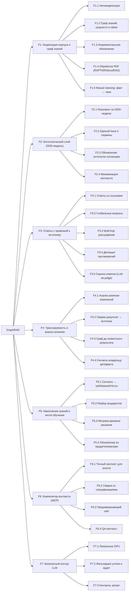
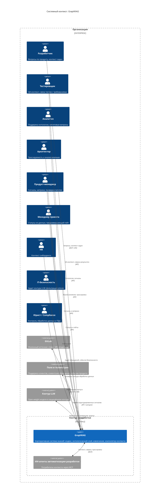

# Документ о концепции и границах проекта: GraphRAG

**GraphRAG** — корпоративная система знаний на базе GraphRAG с онтологическим слоем: слой проверяемого контекста и компилятор контекста для ИИ-агентов автоматизации разработки. Система индексирует корпоративный корпус (markdown-спеки, PDF-книги) в граф знаний с онтологическим слоем (машинно-читаемая DDD-модель), отвечает на вопросы команды проверяемыми ответами со ссылками на источники и собирает точный контекст для ИИ-агентов — вместо сырого текста и ручных переспросов.

*Не поиск по документам — системная корпоративная память с подтверждаемым контекстом.*

### Название продукта

**GraphRAG** — имя продукта: корпоративная система знаний, реализующая систему знаний с онтологическим слоем (машинно-читаемая DDD-модель) и являющаяся основой для сквозной трассируемости результатов разработки и накопления знаний из обратной связи. Роль продукта — слой проверяемого контекста (evidence-based context layer): каждый ответ и артефакт подтверждён источниками и происхождением. Продукт работает в двух режимах: (1) ответы на вопросы команды со ссылками на источники; (2) контекстный режим для ИИ-агентов автоматизации разработки — точный набор артефактов и фактов под задачу, собираемый вместо сырого текста.

---

## 1. Бизнес-требования

### 1.1. Исходные данные и постановка бизнес-проблемы

Разработка продуктов ведётся множеством команд: разработчики, тестировщики, аналитики, архитекторы, продуктовые менеджеры. Знания о продуктах, терминах, системах и бизнес-контексте распределены по головам специалистов, разрозненным документам и чатам. Каждый новый вопрос переспрашивается заново, ответы приходят с задержкой, а артефакты — спецификации, требования, термины — дрейфуют и расходятся друг с другом.

Корневые причины проблем: артефакты требований теряют актуальность и отрываются от разработки; знания фрагментарно живут в головах специалистов и передаются через личные вопросы; этапы потока соединяются «рукопожатием» — результат каждого этапа принимается на веру без сверки с источником. Система знаний — часть решения этих причин.

Ключевые проблемы, которые решает продукт:

| ID | Проблема | Последствие |
|---|---|---|
| **P1** | **Знания о продукте живут в головах аналитиков и специалистов.** Ответы на вопросы о продукте, терминах и бизнес-контексте извлекаются из памяти людей через личные переспросы. | Медленные ответы, повторяющиеся вопросы, вхождение новичка в работу растягивается до 3 месяцев, знания уходят вместе с сотрудниками. |
| **P2** | **Артефакты расходятся и термины нестабильны.** Спецификации устаревают, к ним не возвращаются, терминология разъезжается. | Команда работает по устаревшим требованиям, ломается коммуникация, переделки и техдолг. |
| **P3** | **Поставка расходится с требованиями.** Результат этапа передаётся дальше и принимается «на веру»; сверка «результат ↔ источник» — вручную и задним числом. | «Закрыто ≠ работает», поставка не соответствует утверждённым требованиям, проверка переносится на клиентов. |
| **P4** | **Анализ влияния изменений — вручную.** При изменении артефакта никто детерминированно не знает, что ещё затронуто. | Поверхностная постановка задач, пропущенные зависимости, регрессии. |
| **P5** | **Исправление бага у клиента занимает до месяца.** Сигнал идёт по цепочке техническая поддержка → продакты → задача → спринт → релиз; контекст сигнала теряется на каждом шаге. | Клиенты теряют деньги, репутационный ущерб, нервотрёпка с планированием. |
| **P6** | **Нет статистики по времени решения проблем клиентов.** Сбор данных не автоматизирован, метрика не используется. | Проблема остаётся невидимой, продакты не видят тренд. |
| **P7** | **Неконтролируемое использование внешних LLM.** Сотрудники используют личные аккаунты в обход регламентов; промпты содержат код, спеки и клиентские данные. | Утечки, юридические риски, штрафы. |
| **P8** | **Регламенты безопасности держатся на памяти людей.** Весь объём регламентов физически не помещается в голову. | Нарушения неизбежны; вручную не масштабируется. |
| **P9** | **Проверка гипотез и решений дорогая.** Идеи проверяются на клиентах без критериев, функции придумываются «виртуально». | Ресурсы на функции, которые клиенту не нужны; продуктовая зрелость низкая. |

**Итоговая бизнес-проблема:**

> **Когда знания о продукте фрагментарно живут в головах специалистов, артефакты расходятся и принимаются «на веру», а сотрудники в обход регламентов используют внешние LLM — команда медленно отвечает на вопросы, работает по устаревшим требованиям, поставляет расхождения и не видит времени решения проблем клиентов; баг у клиента фиксится до месяца, а утечки кода и данных становятся вопросом времени.**

### 1.2. Возможности бизнеса

Внедрение GraphRAG позволит:

- **Для разработчика:** Получить проверяемый ответ по продукту, термину или бизнес-контексту за минуты — со ссылками на источники, без ожидания аналитика. Работать по актуальным требованиям, видеть список затронутых изменением артефактов. Увереннее вносить изменения.
- **Для тестировщика:** Видеть связи тестов с требованиями и источниками, сверять «результат ↔ источник», получать контекст для тест-дизайна по клиентским сигналам.
- **Для аналитика (в команде):** Отвечать на нетиповые вопросы, а не повторять типовые справки; бизнес-знания собраны в проекте, а не изучаются заново у внешних людей.
- **Для аналитиков вне команды:** Знания зафиксированы в системе, а не в головах; уход аналитика не оставляет дыру.
- **Для архитектора:** Трассировка от цели до клиентского результата, детерминированный анализ влияния изменений; согласованность артефактов и отсутствие техдолга как метрика.
- **Для продукт-менеджера:** Структурированные клиентские сигналы, статистика по времени решения проблем клиентов, быстрая проверка гипотез.
- **Для менеджера проекта:** Точные статусы из данных, автоматическая постановка задач с полным контекстом.
- **Для HR:** Быстрое вхождение новичков через систему знаний и онтологию вместо «спроси старшего».
- **Для IT-безопасности и юриста:** Контролируемый контур LLM с фильтрацией утечек и аудитом; легальный доступ вместо теневых аккаунтов.
- **Для руководства бизнеса:** Быстрее решения проблем клиентов, рост качества поставки → снижение оттока → рост LTV.
- **Для ИИ-агентов автоматизации разработки (программные пользователи):** Точный набор артефактов и фактов под задачу — компилятор контекста; сверка поставки со спецификациями; проверка полноты перед закрытием задачи; QA-контекст.

### 1.3. Бизнес-цели — SMART

| ID | Бизнес-цель | SMART-декомпозиция | Какие проблемы решает |
|---|---|---|---|
| **G1** | Снизить время ожидания ответа по продукту | **S**: Вопросы команды о продукте, терминах и бизнес-контексте закрываются системой знаний со ссылками на источники, без ожидания аналитика. **M**: Время ожидания ответа по продукту (медиана и 90-й перцентиль) снижается от исходного замера. **A**: Онтологический слой + двухуровневое извлечение + локальный контур LLM. **R**: P1. **T**: срок фиксируется после замера исходного уровня. | P1 |
| **G2** | Стабилизировать терминологию и согласованность артефактов | **S**: Термины зафиксированы в онтологическом слое (DDD-модель); ответы используют единые определения. **M**: Число противоречий и терминологических конфликтов снижается до целевого уровня. **A**: Онтологический слой + контур сигналов владельцу. **R**: P2. **T**: срок фиксируется после замера исходного уровня. | P2 |
| **G3** | Обеспечить трассируемость поставки до клиентского результата | **S**: Связи артефактов фиксируются в графе знаний; изменение артефакта детерминированно разворачивается в список затронутых; результат этапа сверяется с источником до передачи дальше. **M**: Доля изменений с вычисленным влиянием по графу и доля поставок, соответствующих требованиям, достигают целевых значений. **A**: Граф связей артефактов + анализ влияния + сверка «результат ↔ источник». **R**: P3, P4. **T**: срок фиксируется после замера исходного уровня. | P3, P4 |
| **G4** | Ускорить решение проблем клиентов | **S**: Сигнал с полей приходит структурированным и с полным контекстом; разбор инцидента опирается на накопленные знания и трассировку. **M**: Время от сигнала клиента до фикса в релизе снижается; доля проблем с зафиксированным временем решения растёт. **A**: Накопление знаний + структурированные сигналы + трассировка. **R**: P5, P6. **T**: срок фиксируется после замера исходного уровня. | P5, P6 |
| **G5** | Ускорить вхождение новых сотрудников | **S**: Новичок получает ответы по продукту из системы знаний; путь вхождения строится на спецификациях и онтологии. **M**: Время до первого принятого MR снижается от исходного замера (ориентир — 3 месяца). **A**: Система знаний + онтологический слой + путь вхождения новичка. **R**: P1. **T**: срок фиксируется после замера исходного уровня. | P1 |
| **G6** | Обеспечить контролируемый контур LLM | **S**: Все обращения к LLM проходят через корпоративный контур с фильтрацией утечек и аудитом; локальные GPU — основной вариант исполнения. **M**: Доля обращений к LLM через корпоративный канал достигает целевого уровня; обращений вне контура — ноль. **A**: Контур LLM + фильтрация утечек и аудит. **R**: P7, P8. **T**: непрерывно. | P7, P8 |
| **G7** | Снизить рутину повторных ответов и переспросов | **S**: Типовые вопросы закрываются системой знаний; аналитик отвечает на нетиповые вопросы и пополняет знания по своей области. **M**: Доля вопросов, закрытых системой знаний без участия аналитика, достигает целевого уровня. **A**: Система знаний + контур сигналов владельцу. **R**: P1, P9. **T**: срок фиксируется после замера исходного уровня. | P1, P9 |

### 1.4. Критерии успеха

Целевые значения уточняются после замера исходного уровня в первые недели внедрения на эталонном наборе запросов и корпусе, утверждённых владельцем продукта: цель «с потолка» — это обещание, а не цель.

| Цель | Критерий успеха | Способ проверки |
|---|---|---|
| G1 — Время ответа | Вопросы команды закрываются системой знаний за минуты со ссылками на источники | Время ожидания ответа по продукту, медиана и 90-й перцентиль — значение фиксируется после замера исходного уровня |
| G2 — Термины | Ответы используют единые определения; противоречия выявляются системой | Число противоречий и терминологических конфликтов — значение фиксируется после замера исходного уровня |
| G3 — Трассируемость | Изменение артефакта даёт детерминированный список затронутых | Доля изменений с вычисленным влиянием по графу; доля поставок, не соответствующих требованиям — значение фиксируется после замера исходного уровня |
| G4 — Скорость фикса | Сигнал с полей приходит структурированным и с полным контекстом | Время от сигнала до фикса в релизе; доля проблем с зафиксированным временем решения — значение фиксируется после замера исходного уровня |
| G5 — Онбординг | Новичок закрывает вопросы по продукту через систему знаний | Время до первого принятого MR — значение фиксируется после замера исходного уровня |
| G6 — Безопасность | Обращения к LLM — только через корпоративный контур | Доля обращений через корпоративный канал; 0 обращений вне контура — значение фиксируется после замера исходного уровня |
| G7 — Рутина | Типовые вопросы не требуют участия аналитика | Доля вопросов, закрытых системой знаний — значение фиксируется после замера исходного уровня |
| G1+G3 — Качество ответов | Ответы точные и подтверждаются источниками | Точность ответов RAG — не ниже 70% на утверждённом benchmark-наборе |

### 1.5. Положение о концепции

> **Для** разработчиков, тестировщиков, аналитиков, архитекторов, продуктовых менеджеров и ИИ-агентов автоматизации разработки,
> **которые** сегодня сталкиваются с тем, что знания о продукте фрагментарно живут в головах, артефакты расходятся и принимаются «на веру», а ответы на вопросы приходят с задержкой,
> **GraphRAG**
> **является** корпоративной системой знаний на базе GraphRAG с онтологическим слоем — машинно-читаемой DDD-моделью,
> **который** (1) индексирует корпоративный корпус в граф знаний с инкрементальным обновлением, (2) резолвит запросы по структурированной DDD-модели и подаёт в контекст только релевантные фрагменты — снижая требования к размеру контекста локальных LLM, (3) отвечает проверяемыми ответами со ссылками на источники (привязка к источнику, происхождение), (4) фиксирует связи артефактов и детерминированно вычисляет анализ влияния изменений, (5) накапливает знания по сигналам с полей и телеметрии, превращая их в требования, тесты и знания, и (6) работает как компилятор контекста — отдаёт ИИ-агентам точный набор артефактов под задачу, а не сырой текст,
> **в отличие от** обычного поиска по документам и чат-ботов, которые возвращают сырой текст без происхождения и не понимают предметную модель,
> **наш продукт** — слой проверяемого контекста: каждое утверждение подтверждено источником и трассируется до клиентского результата; система работает на локальных GPU с open-weight моделями в защищённом контуре, без передачи корпоративных данных внешним провайдерам, и управляет существующим корпусом спецификаций без замены инструментов и процессов.

---

## 2. Рамки и ограничения проекта

### 2.1. Основные функции (по приоритету полезности)

| Приоритет | Функция | Для чего нужна | Какую пользу приносит |
|---|---|---|---|
| **1** | **F1. Индексация корпуса и граф знаний** | Из корпуса (markdown-спеки, PDF-книги) извлекаются сущности, связи и утверждения; строится граф знаний с инкрементальным обновлением. | Система знает, что есть в корпусе и как сущности связаны; новые документы попадают в индекс без полной перестройки. |
| **2** | **F2. Онтологический слой (DDD-модель)** | Запросы резолвятся по машинно-читаемой модели предметной области (контексты, единый язык, агрегаты, события); в контекст подаются только релевантные фрагменты. | Согласованные термины; минимизация контекста и числа LLM-вызовов — критично для локальных GPU. |
| **3** | **F3. Ответы с привязкой к источнику** | Вопросы команды закрываются проверяемыми ответами со ссылками на источники: локальные/глобальные/двухуровневые запросы, многошаговое рассуждение, обнаружение противоречий. | Быстрые и проверяемые ответы; аналитик отвечает на нетиповые вопросы. |
| **4** | **F4. Трассируемость и анализ влияния** | Связи артефактов фиксируются в графе; изменение артефакта детерминированно разворачивается в список затронутых; сверка «результат ↔ источник». | Поставка соответствует требованиям; задачи приходят с полным контекстом и списком влияния. |
| **5** | **F5. Накопление знаний и петля обучения** | Сигналы с полей (поддержка клиентов, телеметрия, клиентские обращения) превращаются в требования, тесты и знания; разбор инцидентов по накопленным сигналам. | Инциденты разбираются быстрее; решения по продукту — по данным; петля обучения. |
| **6** | **F6. Компилятор контекста (MCP)** | Для ИИ-агентов собирается точный набор артефактов под задачу: компилятор контекста, сверка со спецификациями, предзавершающий гейт, QA-контекст. | Агенты получают компактный проверяемый контекст вместо сырого текста; трассировка решений агента. |
| **7** | **F7. Безопасный контур LLM** | Локальные GPU с open-weight моделями, фильтрация утечек, аудит обращений, контроль лицензий; минимизация токенов. | Данные не покидают периметр; легальный доступ вместо теневых LLM; управляемые затраты. |

### 2.2. Декомпозиция функций на 2 уровня

#### Уровень 1 — Ключевые бизнес-функции

| ID | Функция | Соответствие бизнес-цели | Описание |
|---|---|---|---|
| **F1** | Индексация корпуса и граф знаний | G1, G5 | Извлечение сущностей/связей/утверждений, построение графа, детекция сообществ, инкрементальное обновление, периодическая перестройка |
| **F2** | Онтологический слой (DDD-модель) | G2 | Машинно-читаемая модель предметной области, резолвинг запросов по модели, единый язык, сокращение контекста |
| **F3** | Ответы с привязкой к источнику | G1, G2 | Ответы со ссылками на источники, локальные/глобальные/двухуровневые запросы, многошаговое рассуждение, обнаружение противоречий |
| **F4** | Трассируемость и анализ влияния | G3 | Граф связей артефактов, детерминированный анализ влияния, сверка «результат ↔ источник», сигналы владельцу |
| **F5** | Накопление знаний и петля обучения | G4 | Сбор сигналов с полей, разбор инцидентов по накопленным сигналам, обновление знаний и онтологии |
| **F6** | Компилятор контекста (MCP) | G1, G3 | Точные наборы артефактов для агентов, сверка со спецификациями, предзавершающий гейт, QA-контекст |
| **F7** | Безопасный контур LLM | G6 | Локальные GPU, фильтрация утечек, аудит обращений, контроль лицензий, минимизация токенов |

#### Уровень 2 — Пользовательские функции (US/UC)

> **Принцип.** Каждая функция уровня 2 — результат, ценный для пользователя (роли из раздела 3.1), а не технический механизм. Механизмы и алгоритмы (LightRAG, PathRAG, PPR, KAG) вынесены в разделы 2.4 и 2.5. Каждая функция сформулирована как пользовательская история (US) и может быть детализирована в вариант использования (UC). Подфункции не пересекаются между функциями: каждая относится ровно к одной функции.

##### F1. Индексация корпуса и граф знаний

| Код | Функция (ценность для пользователя) | Роль | Формулировка US |
|---|---|---|---|
| F1.1 | Документы корпуса автоматически попадают в систему знаний | Аналитик, Разработчик | Как аналитик, я хочу, чтобы новые и изменённые документы автоматически попадали в систему знаний, чтобы ответы всегда опирались на актуальные источники |
| F1.2 | Знания организованы в граф: сущности, связи, утверждения | Аналитик | Как аналитик, я хочу видеть карту знаний предметной области — сущности и связи, чтобы понимать, как устроен продукт |
| F1.3 | Обновление знаний инкрементальное, без полной перестройки | Администратор системы | Как администратор, я хочу, чтобы добавление документов пересчитывало только затронутые части графа, чтобы обновление было быстрым и дешёвым |
| F1.4 | PDF-книги и унаследованные документы обрабатываются отдельным контуром | Аналитик | Как аналитик, я хочу, чтобы PDF-книги (нарратив — RAPTOR, таблицы/формы — StructRAG) индексировались корректно, чтобы знания из унаследованных источников были доступны |
| F1.5 | Каждый факт привязан к породившим его чанкам (mutual indexing) | Разработчик, Аналитик | Как пользователь, я хочу проследить факт до исходного текста документа, чтобы проверять ответы |

##### F2. Онтологический слой (DDD-модель)

| Код | Функция (ценность для пользователя) | Роль | Формулировка US |
|---|---|---|---|
| F2.1 | Запросы резолвятся по машинно-читаемой DDD-модели | Разработчик | Как разработчик, я хочу, чтобы запрос сначала резолвился по структурированной модели предметной области, чтобы в контекст попадали только релевантные фрагменты |
| F2.2 | Термины и связи задаются онтологией (единый язык) | Аналитик | Как аналитик, я хочу, чтобы термины предметной области были зафиксированы в онтологии и использовались единообразно, чтобы не было разночтений |
| F2.3 | Онтология обновляется сигналами потока и кураторами | Куратор онтологии | Как куратор онтологии, я хочу получать сигналы о расхождениях терминов и обновлять модель, чтобы онтология не застывала |
| F2.4 | Контекст LLM минимизирован онтологическим слоем | Администратор системы | Как администратор, я хочу, чтобы размер контекста и число LLM-вызовов были минимальны, чтобы локальные GPU справлялись с нагрузкой |

##### F3. Ответы с привязкой к источнику

| Код | Функция (ценность для пользователя) | Роль | Формулировка US |
|---|---|---|---|
| F3.1 | Ответ на вопрос приходит со ссылками на источники | Разработчик, Аналитик | Как разработчик, я хочу получать ответ на вопрос по продукту со ссылками на источники, чтобы проверять его без ожидания аналитика |
| F3.2 | Система отвечает на глобальные вопросы (темы, тренды, связи) | Аналитик | Как аналитик, я хочу задавать глобальные вопросы по всему корпусу (темы, тренды, противоречия), чтобы строить целостную картину |
| F3.3 | Система отвечает на многошаговые вопросы (multi-hop) | Аналитик, Архитектор | Как архитектор, я хочу получать ответы, требующие прохождения по цепочке связанных фактов, чтобы понимать влияние решений |
| F3.4 | Противоречия в корпусе обнаруживаются автоматически | Аналитик | Как аналитик, я хочу, чтобы система находила противоречия между документами и терминами, чтобы артефакты не расходились |
| F3.5 | Ответы оцениваются автоматически (LLM-as-judge) | Администратор системы | Как администратор, я хочу регулярно измерять точность ответов, чтобы поддерживать качество системы знаний |

##### F4. Трассируемость и анализ влияния

| Код | Функция (ценность для пользователя) | Роль | Формулировка US |
|---|---|---|---|
| F4.1 | Изменение артефакта даёт список затронутых | Архитектор, Разработчик | Как разработчик, я хочу при изменении артефакта получать детерминированный список затронутых артефактов, чтобы ничего не пропускать |
| F4.2 | Результат этапа сверяется с источником до передачи дальше | Аналитик | Как аналитик, я хочу сверять результат этапа с вышележащим источником автоматически, чтобы расхождение обнаруживалось до релиза |
| F4.3 | Связи артефактов видны до клиентского результата | Менеджер проекта | Как менеджер проекта, я хочу видеть граф от цели до клиентского результата, чтобы качество и статусы были видны из данных |
| F4.4 | Сигнал о расхождении доставляется владельцу артефакта | Владелец артефакта | Как владелец артефакта, я хочу получать сигналы о расхождениях «спецификация ↔ реальность», чтобы подтверждать изменения, а не узнавать о них задним числом |

##### F5. Накопление знаний и петля обучения

| Код | Функция (ценность для пользователя) | Роль | Формулировка US |
|---|---|---|---|
| F5.1 | Сигналы с полей превращаются в требования, тесты и знания | Продукт-менеджер | Как продукт-менеджер, я хочу, чтобы клиентские сигналы накапливались и превращались в требования и тесты, чтобы решения принимались по данным |
| F5.2 | Разбор инцидента опирается на накопленные сигналы | Служба поддержки | Как служба поддержки, я хочу разбирать инцидент по накопленным сигналам с полным контекстом, чтобы ускорить восстановление |
| F5.3 | Время решения проблем клиентов измеряется автоматически | Продукт-менеджер | Как продукт-менеджер, я хочу видеть долгосрочную статистику по времени решения проблем, чтобы проблема была видимой |
| F5.4 | Знания обновляются по фактам из прода и телеметрии | Аналитик | Как аналитик, я хочу, чтобы система знаний пополнялась фактами из прода и телеметрии, чтобы она отражала реальность |

##### F6. Context compiler (MCP)

| Код | Функция (ценность для пользователя) | Роль | Формулировка US |
|---|---|---|---|
| F6.1 | Агент получает точный набор артефактов под задачу | ИИ-агент | Как ИИ-агент, я хочу получать компактный набор артефактов и фактов под задачу через MCP, чтобы не обрабатывать сырой текст |
| F6.2 | Поставка агента сверяется со спецификациями | ИИ-агент | Как ИИ-агент, я хочу сверять поставку со спецификациями до передачи дальше, чтобы расхождения обнаруживались до релиза |
| F6.3 | Предзавершающий гейт проверяет полноту перед закрытием задачи | Менеджер проекта | Как менеджер проекта, я хочу, чтобы перед закрытием задачи автоматически проверялась полнота контекста и критериев, чтобы «закрыто» означало «готово» |
| F6.4 | QA-контекст собирается для тестировщиков | Тестировщик | Как тестировщик, я хочу получать собранный QA-контекст (требования, сценарии, сигналы), чтобы строить тест-дизайн по данным |

##### F7. Безопасный контур LLM

| Код | Функция (ценность для пользователя) | Роль | Формулировка US |
|---|---|---|---|
| F7.1 | LLM работает на локальных GPU в защищённом контуре | IT-безопасность | Как ИБ-специалист, я хочу, чтобы LLM исполнялась на локальных GPU без передачи данных наружу, чтобы исключить утечки |
| F7.2 | Исходящие обращения фильтруются и аудируются | IT-безопасность, Юрист | Как ИБ-специалист, я хочу фильтровать и аудировать обращения к LLM, чтобы код, спеки и ПДн не покидали периметр |
| F7.3 | Затраты на токены и LLM-вызовы контролируются | Администратор системы | Как администратор, я хочу контролировать число LLM-вызовов и затраты, чтобы локальный контур был экономически устойчив |

### 2.3. Диаграмма дерева функций (Mermaid)

### 2.4. Основные события предметной области

| Событие | Триггер | Источник | Получатель | Действие системы |
|---|---|---|---|---|
| `DocumentIngested` | Новый/изменённый документ в репозитории или загрузка PDF | Репозиторий спецификаций | Индексация | Разбиение на чанки, подготовка к извлечению |
| `EntityExtracted` | Обработка чанка | Контур извлечения (LLM) | Граф знаний | Извлечение сущностей, связей, утверждений с привязкой к чанку |
| `GraphUpdated` | Инкрементальное обновление / периодическая перестройка | Индексация | Граф знаний | Пересчёт затронутых частей графа, детекция сообществ |
| `CommunityRecomputed` | Изменение графа | Индексация | Суммаризации сообществ | Пересчёт суммаризаций затронутых сообществ |
| `OntologyUpdated` | Сигнал куратора / расхождение терминов | Куратор онтологии | Онтологический слой | Применение обновлённой DDD-модели, пересчёт резолвинга |
| `QueryAnswered` | Запрос пользователя или агента | Механизм запросов | Пользователь / агент | Извлечение релевантного контекста, генерация ответа со ссылками |
| `InfluenceComputed` | Изменение артефакта | Граф связей артефактов | Владелец артефакта | Детерминированный анализ влияния: список затронутых |
| `ConflictDetected` | Сверка «результат ↔ источник» / анализ корпуса | Сверка | Владелец артефакта | Обнаружение противоречия, создание сигнала на изменение источника |
| `SignalReceived` | Обращение клиента, телеметрия | Поле (поддержка клиентов, телеметрия) | Накопление знаний | Структурирование сигнала, привязка к сценарию/функции |
| `KnowledgeRefreshed` | Накопленные сигналы / факты с полей | Петля обучения | Система знаний | Обновление графа, суммаризаций и онтологии по сигналам |
| `ContextCompiled` | Запрос агента автоматизации разработки | Компилятор контекста | ИИ-агент | Сбор точного набора артефактов под задачу, передача через MCP |
| `ReviewCompleted` | Поставка агента / MR | Сверка со спецификациями | ИИ-агент | Сверка поставки со спецификациями, результат сверки |
| `SecurityEventEmitted` | Фильтрация утечек / аудит обращений | Контур LLM | IT-безопасность | Фиксация события безопасности, оповещение при нарушении |

### 2.5. Объем первоначально запланированной версии (MVP)

**Назначение MVP.** MVP подтверждает базовый контур системы знаний: корпоративный корпус индексируется в граф знаний с онтологическим слоем, команда получает проверяемые ответы со ссылками на источники, ИИ-агенты получают точный контекст, а знания обновляются инкрементально. Технологические и алгоритмические решения фиксируются в ADR; vision описывает только продуктовые возможности и границы.

**F1. Индексация корпуса и граф знаний (MVP):**
- Индексация markdown-спек как эталонного источника (изменения — через MR).
- Извлечение сущностей, связей и утверждений, построение графа знаний.
- Инкрементальное обновление затронутых частей графа + периодическая полная перестройка.
- Базовый механизм взаимной индексации: каждый факт привязан к породившим чанкам.
- Обработка PDF: отдельный контур для нарративных и табличных источников.

**F2. Онтологический слой (MVP):**
- Машинно-читаемая DDD-модель на основе существующей модели предметной области: ограниченные контексты, единый язык, агрегаты, доменные события.
- Резолвинг запросов по модели; подача в контекст только релевантных фрагментов.
- Базовый контур сигналов куратору при расхождении терминов.

**F3. Ответы с привязкой к источнику (MVP):**
- Ответы со ссылками на источники (привязка к источнику, происхождение).
- Двухуровневое извлечение как ядро: низкий + высокий уровень.
- Компактный маршрутный контур для локальных GPU и контекстного режима — без map-reduce.
- Ассоциативные запросы — без LLM на этапе извлечения.
- Обнаружение противоречий — базовый механизм.

**F4. Трассируемость и анализ влияния (MVP):**
- Граф связей артефактов: требование → задача → код → MR → релиз.
- Детерминированный анализ влияния изменений (прямое и транзитивное замыкание).
- Сверка «результат ↔ источник» — базовый сценарий.

**F5. Накопление знаний (MVP):**
- Приём структурированных сигналов с полей, привязка к сценарию/функции.
- Базовое обновление знаний по сигналам; полный контур — Фаза 2.

**F6. Компилятор контекста (MVP):**
- MCP-режим: точный набор артефактов для агента под задачу.
- Сверка со спецификациями — базовая проверка поставки.
- Предзавершающий гейт и QA-контекст — Фаза 2.

**F7. Безопасный контур LLM (MVP):**
- Локальные GPU, open-weight модели; данные не покидают периметр.
- Фильтрация утечек и аудит обращений.
- Минимизация токенов и LLM-вызовов как сквозное требование.

**Сквозные механизмы (входят в MVP):**
- Технологический стек и компромиссы фиксируются в ADR; в vision остаются только продуктовые свойства.
- Принцип «агент готовит — человек подтверждает и отвечает»: ответы и артефакты, сгенерированные LLM, подтверждаются человеком.
- Принципы внедрения: метрики пользы без привязки к премиям, внедрение малыми шагами.

**Что НЕ входит в MVP:**
- Полноценное агентное извлечение и продвинутые графовые методы — Фаза 3.
- Fine-tuning моделей — вне рамок проекта.
- Обновление графа в реальном времени — Фаза 3.
- Автоматический анализ инцидентов (ИИ-разбор и дообучение) — вне рамок проекта.
- Интеграция с Confluence — исключена как источник (кладбище устаревших страниц).
- Масштабирование на крупный корпус с гарантированным SLO — Фаза 2/3.
- Автоматическое построение онтологии из корпуса (ontology learning) — Фаза 3; в MVP онтология ведётся кураторами по существующей модели предметной области.

### 2.6. Объем последующих версий (Roadmap)

Детальная дорожная карта ведётся отдельно. Ниже — продуктовая сводка фаз и границ.

**Фаза 0 — фиксация scope и критериев перехода:**
- Зафиксировать точный scope MVP по F1–F7 и стартовый набор кейсов использования.
- Назначить владельцев и сроки целевых метрик и фаз.
- Выбрать вариант контура LLM и зафиксировать правила обработки данных.
- Согласовать состав онтологического слоя с командами.

**Фаза 1 — MVP / интеграционный минимум:**
- Индексация корпуса, граф знаний, инкрементальное обновление, взаимная индексация.
- Онтологический слой: DDD-модель, резолвинг, минимизация контекста.
- Ответы с привязкой к источнику, компактное извлечение, обнаружение противоречий.
- Анализ влияния, сверка «результат ↔ источник», сборка контекста для агентов.
- Локальный контур LLM с фильтрацией утечек и аудитом.

**Фаза 1.5 — beta и стабилизация:**
- Замер метрик пользы: время ожидания ответа, точность RAG (порог 70%), число противоречий.
- Стабилизация извлечения и разрешения сущностей; снижение галлюцинаций при извлечении (строгие промпты, контроль человеком).
- Доведение качества ответов на реальных запросах команд; готовность к релизу.

**Фаза 2 — расширение контура и качества:**
- Предзавершающий гейт, QA-контекст, сверка со спецификациями в полном объёме.
- Масштабирование корпуса; оптимизация извлечения и маршрутизации запросов.
- Полный контур накопления знаний: сигналы с полей, разбор инцидентов по накопленным сигналам.
- Метрика времени решения проблем клиентов — автоматический сбор.

**Фаза 3 — экспертная система:**
- Агентное извлечение и продвинутые графовые методы для сложных запросов.
- Обновление графа в реальном времени для динамических сценариев.
- Автоматическое построение и поддержание онтологии с кураторами.
- Путь вхождения новичка на системе знаний в полном объёме.
- Масштабирование на крупный корпус с гарантированными SLO.

**Фаза 4 — полная интеграция в автоматизацию разработки:**
- Сквозная трассируемость до клиентского результата как стандарт процесса.
- Петля обучения в полном объёме: телеметрия, клиентские обращения → требования, тесты, знания.
- Интеграция с автоматической декомпозицией задач и постановкой задач с полным контекстом.

### 2.7. Ограничения и исключения

| № | Исключение / Ограничение | Причина |
|---|---|---|
| 1 | **GraphRAG не является источником правды.** Единый источник правды — репозиторий спецификаций (MR, владельцы артефактов). Система знаний — индекс и контекст, а не хранилище исходных артефактов. | Система знаний работает поверх единого источника правды. |
| 2 | **GraphRAG не чат-бот и не поисковая строка.** Продукт — evidence-based context layer: ответы подтверждены источниками и происхождением, а не «сырым» текстом. | Отличие продукта от обычного поиска и LLM-чатов; ценность — проверяемый контекст, а не генерация текста. |
| 3 | **Confluence исключён как источник знаний** (кладбище устаревших страниц). | Эталонный источник — markdown-спеки в едином репозитории; Confluence не поддерживается. |
| 4 | **Автоматический анализ инцидентов (ИИ-разбор и дообучение) — вне рамок проекта.** | Анализ инцидента и дообучение — отдельная система; продукт обеспечивает контекст и накопление знаний, а не разбор. |
| 5 | **Обучение и дообучение моделей (fine-tuning) — вне рамок проекта.** | Продукт использует извлечение и генерацию; дообучение моделей — отдельная компетенция и контур. |
| 6 | **LLM исполняется только в контролируемом контуре** (локальные GPU — основной вариант; внешние провайдеры — только через корпоративный шлюз с фильтрацией и аудитом). | Эксперименты с ИИ — только в контролируемом контуре; защита от утечек. |
| 7 | **Система не заменяет управленческие решения и принципы внедрения.** Продукт — основа системы знаний, трассируемости и накопления знаний, а не замена метрик и принципов. | Метрики без привязки к премиям, внедрение малыми шагами. |
| 8 | **Масштаб корпуса ограничен возможностями локального контура** (GPU, контекст open-weight моделей). | Компенсируется онтологическим слоем и минимизацией контекста; рост — Фаза 2/3. |
| 9 | **Внешние LLM-провайдеры и облачные API GraphRAG-сервисов — вне контура продукта** (кроме корпоративного шлюза с аудитом). | Данные разработки (код, спеки, ПДн) не покидают периметр. |
| 10 | **Динамика «изменение кода → обновление спеки» в реальном времени — вне MVP** (базовая автоиндексация по MR — в MVP). | Инкрементальное обновление — в MVP; обновление в реальном времени — Фаза 3. |

### 2.8. Предположения и зависимости (Assumptions and Dependencies)

**Внешние зависимости.** GraphRAG — внутренний контур разработки и зависит от внешних систем (контракты — в §2.4, §2.5 и §3.3):

| Зависимость | Роль для продукта | Канал |
|---|---|---|
| Репозиторий спецификаций (GitLab) | Authoritative-источник корпуса, триггеры индексации | Git API / webhook / MR |
| Модель предметной области | Исходная DDD-модель для онтологического слоя | Модель/репозиторий |
| Локальный GPU-контур LLM | Исполнение open-weight моделей: извлечение, генерация, оценка | Local |
| Автоматизация разработки (агенты, конвейеры) | Потребители компилятора контекста (MCP), источники задач и поставок | MCP |
| Поле и телеметрия (поддержка клиентов, сигналы) | Источник сигналов для накопления знаний | API/импорт |
| Инфраструктура мониторинга и аудита | Фиксация событий безопасности контура LLM | Логи/панели |

**Ключевые допущения.** Условия, принятые как истинные на этапе концепции; при изменении любого из них требуется пересмотр границ проекта:

| № | Допущение | Влияние при нарушении |
|---|---|---|
| A1 | GitLab markdown — эталонный источник; Confluence исключён | Система индексирует неактуальный корпус |
| A2 | Качества локальных open-weight моделей достаточно для извлечения и ответов (с онтологическим слоем) | Падение точности ответов ниже порога 70% |
| A3 | Принцип «агент готовит — человек подтверждает и отвечает» соблюдается | Артефакты, сгенерированные LLM, принимаются без сверки — рост расхождений |
| A4 | Онтология обновляется сигналами потока и кураторами, а не строится автоматически в MVP | Термины и связи разъезжаются, контекст растёт |
| A5 | Локальный GPU-контур доступен и покрывает нагрузку (число LLM-вызовов минимизировано) | Невозможность исполнения извлечения/ответов в периметре; теневые LLM |
| A6 | MCP-режим — целевой интерфейс для ИИ-агентов | Агенты получают сырой текст, контекст не компактен |
| A7 | Инкрементальное обновление + периодическая перестройка достаточны для актуальности | Ответы устаревают между перестройками |
| A8 | Изменения корпуса приходят через MR (единый процесс) | Система пропускает изменения, сделанные вне процесса |

---

## 3. Бизнес-контекст

### 3.1. Профили заинтересованных лиц

| Профиль | Ценность | Отношение | Ключевые функции | Основные ограничения |
|---|---|---|---|---|
| **Разработчик** | Проверяемые ответы по продукту за минуты; работа по актуальным требованиям; список затронутых изменением артефактов. | Прямой пользователь | F1, F3, F4 | Не должен ждать ответа аналитика; нужен быстрый доступ через IDE/MCP. |
| **Тестировщик** | Связи тестов с требованиями; сверка «результат ↔ источник»; QA-контекст по данным. | Прямой пользователь | F3, F4, F6 | Нужен контекст, а не сырой текст; тест-дизайн по сигналам. |
| **Аналитик (в команде)** | Бизнес-знания собраны в проекте; ответы на нетиповые вопросы; контур сигналов вместо охоты за расхождениями. | Прямой пользователь, куратор онтологии | F1, F2, F3, F5 | Поддерживает онтологический слой; не отвечает на повторяющиеся вопросы вручную. |
| **Аналитик вне команды** | Знания зафиксированы в системе; не «служба ответов». | Владелец знаний | F2, F3, F5 | Пополняет систему по своей области; роль Confluence размывается. |
| **Архитектор** | Трассировка до клиентского результата; анализ влияния; согласованность артефактов как метрика. | Прямой пользователь | F3, F4 | Следит, чтобы автоматизация не закрепляла кривой дизайн. |
| **Продукт-менеджер** | Структурированные сигналы; статистика времени решения проблем; быстрая проверка гипотез. | Прямой пользователь | F5, F6 | Решения по данным, а не только по опыту; критерии успеха до разработки. |
| **Менеджер проекта** | Статусы из данных; постановка задач с полным контекстом; предзавершающий гейт. | Косвенный пользователь | F4, F6 | Ревизия автоматической постановки задач; точность статусов. |
| **Куратор онтологии** | Поддерживает DDD-модель в актуальном состоянии; обучает модель. | Прямой пользователь (админ) | F2, F5 | Не является «службой ответов»; работает с сигналами. |
| **IT-безопасность** | Контролируемый контур LLM; фильтрация утечек; аудит обращений. | Согласующий | F7 | Данные не покидают периметр; блокирующие проверки. |
| **Юрист / Compliance** | Юридически чистая обработка персональных данных; ясность по контуру LLM. | Согласующий | F7 | Регуляторные риски внешних провайдеров. |
| **HR / найм** | Быстрое вхождение новичков через систему знаний и онтологию. | Косвенный пользователь | F1, F3 | Путь новичка на системе знаний вместо «спроси старшего». |
| **Руководство бизнеса / технический директор** | Связь автоматизации с бизнес-выгодами; управляемая зависимость от LLM (локальный контур). | Инвестор | F1–F7 | Решения по метрикам пользы, а не по обещаниям. |
| **ИИ-агенты автоматизации разработки** | Точный контекст под задачу; сверка со спецификациями; трассировка. | Программный пользователь | F6 | Не обрабатывают сырой текст; работают через MCP. |

### 3.2. Приоритеты проекта

| Измерение | Ранг | Пояснение |
|---|---|---|
| **Точность ответов с привязкой к источнику** | **Ведущий фактор** | Ответы без ссылок на источники — галлюцинации; доверие к системе знаний падает. Порог продолжения внедрения — точность RAG не ниже 70%. [G1, F3] |
| **Минимизация контекста и LLM-вызовов** | **Критический фактор** | Локальные GPU и open-weight модели с ограниченным контекстом; конкретные методы минимизации фиксируются в ADR. [F2, F7] |
| **Инкрементальное обновление** | **Критический фактор** | Корпус меняется через MR; полная перестройка на каждый MR недопустима по стоимости. [F1] |
| **Соответствие принципам внедрения** | **Ведущий фактор** | Продукт — основа системы знаний, трассируемости и накопления знаний; метрики пользы, внедрение малыми шагами, метрики без привязки к премиям. |
| **Безопасность контура LLM** | **Критический фактор** | Данные разработки (код, спеки, ПДн) не покидают периметр; фильтрация утечек и аудит — обязательны. [G6, F7] |
| **Трассируемость и анализ влияния** | **Высокий приоритет** | Детерминированный анализ влияния — основа постановки задач и сверки «результат ↔ источник». [G3, F4] |
| **Скорость решения проблем клиентов** | **Высокий приоритет** | Полный контекст сигнала сокращает цепочку поддержка → продакты → фикс. [G4, F5] |
| **Функции** | Ограничение (MVP) | MVP: базовые функции всех 7 функций (F1–F7). Фаза 2: предзавершающий гейт, полный контур накопления знаний. Фаза 3: агентное извлечение, обновление в реальном времени, автоматическое построение онтологии. |

### 3.3. Диаграмма контекста системы (Context Diagram)

